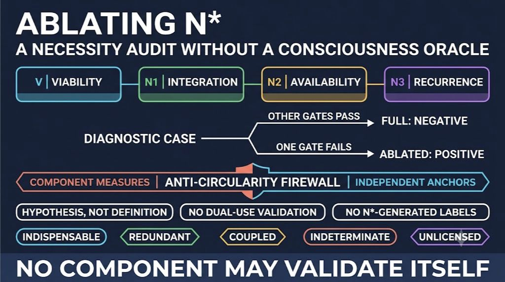
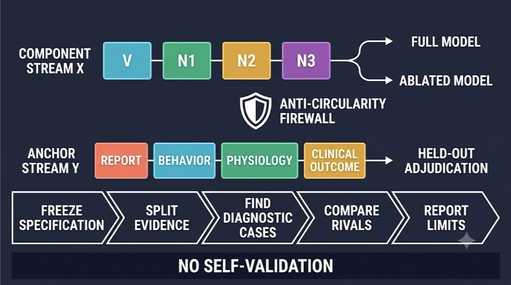

\begin{center}
\textbf{A visual preview:}
\end{center}

{width=100%}

\newpage

## Abstract

The $N^*$ model proposes that, under an independently assessed viability condition $V$, minimal phenomenal presence $C_0$ requires the conjunction of integration or synergy ($N_1$), counterfactual system-wide availability ($N_2$), and recurrent stability ($N_3$). A conjunctive theory is stronger than a list of correlates: every conjunct must make a nonredundant contribution, and no omitted conjunct may be rescued by definition. This paper develops a component-wise necessity audit for $V\land N^*$ without assuming an infallible consciousness label. The central result is a diagnostic-set theorem. A full conjunctive model and its leave-one-conjunct-out rival disagree only on cases in which the omitted condition fails while every retained condition passes. Data in which all components rise and fall together cannot establish the necessity of any particular component. The framework separates three operations often called "ablation": deleting a condition from the theory, causally perturbing its proposed realization, and removing a measurement family. It then installs an anti-circularity firewall. $C_0=N^*$ is treated as a hypothesis rather than a definition; candidate systems, thresholds, interventions, anchor evidence, and model-comparison rules are frozen before adjudication; no measure may both construct a conjunct and validate its necessity; development and test evidence are separated; and results are evaluated against a held-out, convergent anchor vector rather than labels generated by $N^*$ itself. The audit returns one of five component statuses: indispensable, redundant, causally coupled, indeterminate, or unlicensed. Synthetic Boolean-profile tests establish construct separability but not consciousness. Empirical near-miss cases, selective interventions, and held-out transport tests bear on necessity only when system identity, operating regime, and the remaining conjuncts are preserved. The framework yields preregistration requirements, component-specific research programs, falsification conditions, and a minimum audit record. Its main conclusion is methodological: where no valid diagnostic cases or independent anchors exist, necessity is underidentified, not confirmed.

**Keywords:** consciousness; phenomenal presence; $N^*$ model; ablation; necessity; causal intervention; falsification; preregistration; partial identification; circularity; adversarial testing

## 1. Introduction: A Conjunction Must Earn Every Conjunct

The $N^*$ model advances a deliberately demanding hypothesis about minimal phenomenal presence. For a boundary-qualified candidate system $S$, content or content-bearing state $c$, operating regime $\mathcal R$, and interval $\Delta$, it proposes:

$$
C_0(S,c;\mathcal R,\Delta)
\Longleftrightarrow
V(S;\mathcal R,\Delta)\land N_1(S,c)\land N_2(S,c)\land N_3(S,c).
$$

**Annotation.** $C_0$ denotes minimal phenomenal presence: that there is something it is like for the candidate system to undergo the target state. $V$ is an independently assessed viability or regime-licensing condition. $N_1$ is integration or synergy, $N_2$ is counterfactual causal availability across functionally diverse recipients, and $N_3$ is recurrent stability. The displayed biconditional is the model's empirical conjecture. It is not a stipulative definition of consciousness and cannot be used as its own evidence.

Writing the right side more compactly,

$$
N^*=N_1\land N_2\land N_3,
\qquad
M_*=V\land N^*.
$$

The conjunction is attractive because each term blocks a familiar false positive. Integration excludes merely aggregated activity. Availability excludes causally isolated local states. Recurrence excludes evanescent feedforward transients. Viability excludes applications in which the candidate no longer occupies the regime for which those measures are interpretable. Yet this explanatory neatness creates a strict burden. If any conjunct is empirically redundant, inseparable from another, or needed only because of a chosen measurement scheme, the advertised minimality of $N^*$ fails.

An ablation study appears to offer a direct test: remove one component and ask whether the theory performs worse. In consciousness science, however, that instruction is dangerously ambiguous. Removing a symbol from a decision rule is not the same as disabling a mechanism in a brain or network. Disabling a mechanism is not the same as deleting its estimator. And none of these operations provides an observed ground-truth label for experience. A careless ablation can therefore become circular: define consciousness by $N^*$, generate labels from $N^*$, remove $N_k$, and celebrate the resulting disagreement as proof that $N_k$ was necessary.

This paper develops a stricter alternative. Its central thesis is:

> A conjunct earns its place in $V\land N^*$ only when full and ablated models make different preregistered predictions on valid diagnostic cases, and the full model better organizes independent held-out anchor evidence while system identity, regime, and the remaining conjuncts are preserved. When these conditions cannot be met, necessity is underidentified rather than confirmed.

The objective is not to manufacture certainty where consciousness is not directly observable. It is to turn the necessity claim into a disciplined comparative hypothesis. The resulting audit can weaken, refine, or support a component without pretending to derive phenomenality from a functional score.

### 1.1 Contributions

The paper makes eight linked contributions.

1. It proves that component necessity is testable only on diagnostic cases where the omitted conjunct fails and all retained conjuncts pass.
2. It separates criterion, mechanism, and measurement ablations, each with a different inferential target.
3. It specifies an anti-circularity firewall that prohibits $N^*$-generated labels and dual-use validation measures.
4. It replaces a fictitious consciousness oracle with a held-out vector of independently constructed anchors and explicitly limits what those anchors can establish.
5. It distinguishes indispensable, redundant, causally coupled, indeterminate, and unlicensed component results.
6. It gives viability $V$ a special gate audit so that it cannot become a post hoc rescue clause.
7. It organizes a staged empirical program spanning synthetic systems, empirical near misses, selective interventions, and transport tests.
8. It supplies preregistration, validity, sensitivity, and reporting templates for component-wise tests.

### 1.2 Relation to the companion papers

The core paper states the $C_0=N^*$ hypothesis and its falsifiers (Stilwell, 2026a). The indeterminacy paper requires scientifically valid nondiscrimination to be distinguished from failed interpretability (Stilwell, 2026b). The boundary paper requires system individuation before consciousness measurement (Stilwell, 2026c). The availability paper defines $N_2$ without equating it with report, executive use, or observed spread (Stilwell, 2026d). The phenomenal-character paper separates the presence gate from the geometry of what an experience is like (Stilwell, 2026e).

The present paper audits the architecture inherited from those papers. It asks neither which system boundary is best nor what a positive state feels like. It asks whether each proposed requirement makes an independently testable difference to the presence hypothesis.

## 2. Why Ordinary Ablation Logic Is Not Enough

### 2.1 Prediction loss is not automatically necessity

In machine learning, an ablation often removes a feature or module and measures a decline in task performance. The decline shows that the element contributes to that implementation under that training and test distribution. It does not by itself show that the element is metaphysically necessary for consciousness, biologically necessary across realizations, or even uniquely responsible for the lost behavior.

The distinction matters because $N^*$ is a theory of phenomenal presence, not merely an engineering architecture. A recurrent pathway can be important for accuracy because it denoises inputs. A broadcast hub can be important because a benchmark requires verbal output. A synergy measure can predict state because it covaries with arousal. These are legitimate functional findings, but none alone establishes a consciousness condition.

### 2.2 Conjunctive models hide redundancy

Suppose every observed positive case has $(N_1,N_2,N_3)=(1,1,1)$ and every observed negative case has $(0,0,0)$. The conjunction predicts perfectly. So do each individual conjunct, each pair, and many unrelated variables that track the same state transition. Perfect classification therefore supplies no component-wise necessity evidence when the predictors never dissociate.

This is an identifiability problem rather than a mere shortage of sample size. More observations from the same diagonal of the Boolean cube cannot identify which coordinate matters. The study needs off-diagonal cases: natural or induced states in which one condition changes while the others remain within their licensed ranges.

### 2.3 Lesions confound removal with reorganization

Biological ablation rarely subtracts one function cleanly. Lesions alter excitability, compensation, arousal, metabolic support, network topology, and the operating regime. A perturbation intended to reduce recurrence may also reduce integration and availability. If the candidate system fragments, the target of attribution has changed. If viability fails, the original measures may cease to be interpretable.

Thus, "the subject stopped responding after the intervention" is not a component test. It may reflect motor failure, report loss, task noncompliance, a new system boundary, or global regime collapse. Selectivity must be demonstrated rather than inferred from the intervention's name or anatomical target.

### 2.4 Consciousness provides no simple dependent variable

Theories of consciousness face an unusual testing problem: experience is not observed in the same manner as a stimulus, reaction time, or network edge. Reports and behavior can be evidence, but they are theory-laden, incomplete, and unavailable in many target populations. No-report measures can reduce report confounds, but often inherit validation from report-capable conditions. Adversarial collaborations improve discipline by preregistering divergent predictions, yet their outcomes still depend on how experience is inferred (Kleiner & Hoel, 2021; Melloni et al., 2023; Cogitate Consortium et al., 2025).

This paper does not solve that general epistemic problem. It instead prevents one particularly damaging response: defining the target with the very conjuncts under audit.

### 2.5 Three meanings of necessity

The word "necessary" can mark three different claims. **Logical necessity** is internal to the written conjunction: if $M_*$ is assumed, each included term is required by its syntax. **Incremental empirical necessity** means that retaining $X_k$ improves preregistered predictions over $M_{-k}$ on evidence that did not construct $X_k$. **Causal necessity** means that a licensed intervention on the realization of $X_k$, with the other conditions held within equivalence bounds, changes independent anchors in the predicted manner. Only the latter two claims are empirical, and causal necessity is the stronger of them.

Relative to anchor battery $\mathcal Y$, target domain $\mathcal T$, and the leave-one-out rival class, define empirical minimality as

$$
\operatorname{Min}_{\mathcal Y,\mathcal T}(M_*)
\Longleftrightarrow
\bigwedge_{k=0}^{3}
\left[
\Gamma_k\geq\gamma_k^{\min}
\ \land\
\operatorname{LB}_{\beta}(\Delta_k)>\delta_k^{\min}
\right].
$$

**Annotation.** $\gamma_k^{\min}$ is the minimum acceptable diagnostic coverage, and $\delta_k^{\min}$ is the minimum predictive improvement required to retain component $k$. The definition is indexed to declared anchors, domain, and rival class. It does not establish metaphysical minimality against every possible theory. If even one component lacks coverage or incremental value, the complete conjunction has not earned empirical minimality under this audit.

## 3. The Diagnostic-Set Theorem

### 3.1 Full and ablated models

Let the component vector be

$$
X(x)=(X_0,X_1,X_2,X_3)=(V,N_1,N_2,N_3)
$$

for a fully specified case $x=(S,c,g,\mathcal R,\Delta)$. Define the full criterion

$$
M_*(x)=\bigwedge_{j=0}^{3}X_j(x),
$$

and the criterion ablated at component $k$,

$$
M_{-k}(x)=\bigwedge_{\substack{j=0\\j\neq k}}^{3}X_j(x).
$$

**Annotation.** $M_*$ and $M_{-k}$ are rival classification rules applied to the same candidate, content, grain, regime, and interval. Criterion ablation deletes one requirement from the rule; it does not change the physical system. For $k=1,2,3$, the audit concerns a conjunct of $N^*$. For $k=0$, it concerns the separate viability gate.

Define the diagnostic set for component $k$:

$$
\mathcal D_k=
\left\{x:X_k(x)=0\ \land\ \bigwedge_{j\neq k}X_j(x)=1\right\}.
$$

**Annotation.** $\mathcal D_k$ contains the cases on which the full and ablated rules disagree: the candidate fails exactly the omitted condition while satisfying all retained conditions. The zero and ones denote thresholded scientific results under a frozen specification, not direct absence or presence of experience.

### 3.2 The theorem

For a monotone conjunction,

$$
M_*(x)\neq M_{-k}(x)
\Longleftrightarrow
x\in\mathcal D_k.
$$

**Proof.** Because $M_*$ contains every term in $M_{-k}$, $M_*(x)=1$ implies $M_{-k}(x)=1$. The two models can therefore disagree only when $M_*(x)=0$ and $M_{-k}(x)=1$. The latter requires every retained component to equal one; given those values, the full conjunction equals zero exactly when $X_k=0$. Those are precisely the membership conditions for $\mathcal D_k$. Conversely, every $x\in\mathcal D_k$ makes $M_*(x)=0$ and $M_{-k}(x)=1$. $\square$

This simple result has a severe consequence:

> No observation outside $\mathcal D_k$ can discriminate the full conjunction from its $k$-ablated rival on that case.

A large sample does not compensate for an empty diagnostic set. If a study contains no valid $N_2$-negative, $V,N_1,N_3$-positive cases, it has not tested whether $N_2$ is necessary. It may still test whether the complete bundle predicts a state distinction, but the component claim remains underidentified.

### 3.3 Approximate diagnostic regions

Empirical components are estimated with uncertainty rather than observed as Boolean facts. Let $L_j(x)$ and $U_j(x)$ be lower and upper confidence or credible bounds for component score $s_j(x)$, with preregistered threshold $\tau_j$. A conservative diagnostic region is

$$
\widetilde{\mathcal D}_k=
\left\{x:
U_k(x)<\tau_k
\ \land\
\bigwedge_{j\neq k}L_j(x)>\tau_j
\right\}.
$$

**Annotation.** A case enters $\widetilde{\mathcal D}_k$ only when the omitted component is credibly below its gate and every retained component is credibly above its gate. If an interval crosses a threshold, the case is not forced into the diagnostic set. It remains boundary-indeterminate for that audit.

For continuous sensitivity analyses, define the diagnostic margin

$$
m_k(x)=
\min\left\{
\tau_k-U_k(x),
\min_{j\neq k}\bigl(L_j(x)-\tau_j\bigr)
\right\}.
$$

**Annotation.** Positive $m_k$ means the case is conservatively diagnostic; larger values indicate greater separation from every relevant threshold. Negative values identify which gate prevents diagnostic use. The margin is a study-design quantity, not a degree of consciousness.

### 3.4 Coverage is a first-class result

Let $w(x)$ be a preregistered target-population weight. Diagnostic coverage for component $k$ is

$$
\Gamma_k=
\frac{\sum_x w(x)\mathbf 1[x\in\widetilde{\mathcal D}_k]}
{\sum_x w(x)}.
$$

**Annotation.** $\Gamma_k$ reports how much of the target distribution actually distinguishes $M_*$ from $M_{-k}$. A low value limits the scope of any necessity claim. It must be reported alongside effect size; otherwise a strong result from a rare or engineered corner can be mistaken for broad necessity.

## 4. The Anti-Circularity Firewall

The core danger is not merely statistical overfitting. It is inferential self-validation. If $N^*$ supplies both the candidate prediction and the target label, the full model wins by construction. The firewall below prevents that loop.

{width=100%}

*Figure 1. The anti-circularity architecture. Component measures generate the rival model predictions, while an independently assembled anchor stream is reserved for held-out adjudication. Freezing the specification, splitting the evidence, requiring diagnostic cases, comparing nested rivals, and reporting inferential limits prevent the model from validating itself.*

### 4.1 Hypothesis, never definition

The first rule is semantic and procedural:

$$
H_*:\quad C_0\Longleftrightarrow V\land N^*
$$

is stored as a hypothesis under test. The audit database may contain measured component scores, model predictions, and anchor observations, but it may not contain a "ground-truth consciousness" field computed from $V\land N^*$.

**Annotation.** The displayed biconditional expresses what the program risks. It does not license replacing an unavailable $C_0$ observation with the right-hand side. Doing so would convert empirical equivalence into a definition and make component necessity unfalsifiable.

### 4.2 Two evidence streams

For each case, separate

$$
X=(V,N_1,N_2,N_3)
\qquad\text{from}\qquad
Y=(Y_1,\ldots,Y_q),
$$

where $X$ contains the model-component estimates and $Y$ is an independently constructed anchor vector.

**Annotation.** Anchor variables may include calibrated first-person judgments in report-capable humans, forced-choice discrimination, metacognitive structure, temporally specific behavior, physiological or perturbational signatures validated outside the critical contrast, and theory-neutral clinical outcomes. No single element is treated as an oracle. The vector preserves disagreement among anchors rather than collapsing it into a convenient label.

Independence here is methodological, not necessarily probabilistic. It requires that a measure used to define, threshold, train, or select $X_k$ cannot also serve as adjudication evidence for the necessity of $X_k$ in the same fold. Shared raw sensors may be used only when preregistered feature families, time windows, and nuisance controls prevent target leakage and a sensitivity analysis removes the shared channel.

### 4.3 Development, calibration, and adjudication splits

Let the evidence be partitioned into

$$
\mathcal E=
\mathcal E_{\mathrm{dev}}
\ \dot\cup\
\mathcal E_{\mathrm{cal}}
\ \dot\cup\
\mathcal E_{\mathrm{test}}.
$$

**Annotation.** Development evidence selects estimators and candidate interventions. Calibration evidence freezes thresholds, uncertainty procedures, and any bridge from model outputs to expected anchor patterns. Test evidence adjudicates full versus ablated models once. The dot over the union marks disjoint partitions. Repeated cross-fitting is permitted only when every case is held out from all choices that affect its prediction.

### 4.4 No dual-use validation

For each component $k$, let $\mathcal M_k$ denote the measure family used to estimate it and $\mathcal A_k$ the anchors used to adjudicate its ablation. The strong separation rule is

$$
\mathcal M_k\cap\mathcal A_k=\varnothing.
$$

**Annotation.** This set-level prohibition blocks the clearest circularity: recurrence estimated from late evoked activity cannot be "validated" by the same late activity renamed as a consciousness marker. Where literal disjointness is impossible, the overlap must be declared, the shared channel removed in a leave-channel-out analysis, and the main outcome downgraded if the result does not survive.

### 4.5 Frozen target and specification

Before critical data are viewed, archive

$$
\Theta_A=(S,g,c,\mathcal R,\Delta,
\{s_j,\tau_j,\beta_j\}_{j=0}^{3},
\mathcal I,\mathcal Y,h,\ell,
\mathfrak S,\mathcal P).
$$

**Term-by-term annotation.** $S$ is the candidate boundary; $g$ the grain; $c$ the content family; $\mathcal R$ the operating regime; and $\Delta$ the interval. $s_j,\tau_j,\beta_j$ are each component's estimator, threshold, and uncertainty rule. $\mathcal I$ is the admissible intervention family; $\mathcal Y$ is the anchor battery; $h$ is the frozen translation from a model prediction to expected anchor patterns; $\ell$ is the scoring rule; $\mathfrak S$ is the reasonable specification neighborhood for sensitivity analyses; and $\mathcal P$ is the partition and stopping plan. Every change after test access defines a new analysis.

### 4.6 Held-out comparison without an oracle

Let $h_m(x)$ be the preregistered expected anchor distribution under model $m\in\{*, -k\}$, estimated without the test case. Define held-out anchor risk

$$
R_k(m)=
\mathbb E_{x\in\widetilde{\mathcal D}_k\cap\mathcal E_{\mathrm{test}}}
\left[\ell\bigl(h_m(x),Y(x)\bigr)\right].
$$

**Annotation.** $h_m$ does not convert $Y$ into a consciousness label. It states how each rival model predicts the distribution or direction of independent anchor outcomes in diagnostic cases. $\ell$ is a proper multivariate scoring rule or a preregistered set of directional tests. Evaluation is restricted to the region where the models disagree.

The component's incremental adjudicative value is

$$
\Delta_k=R_k(-k)-R_k(*).
$$

**Annotation.** Positive $\Delta_k$ means the full conjunction predicts the held-out anchor pattern better than the ablated rival; negative $\Delta_k$ favors removal of the component. A confidence interval spanning zero is indeterminate. Even a stable positive result supports necessity only relative to the declared anchors, target population, and model class. It does not transform those anchors into an infallible readout of phenomenality.

### 4.7 The firewall in one sentence

No component may generate the labels, select the cases, define the success metric, and then cite that same construction as evidence that the component was necessary.

## 5. Three Ablations, Three Questions

| Ablation type | Operation | Question answered | What it cannot establish alone |
|---|---|---|---|
| Criterion ablation | Remove $X_k$ from the decision rule while leaving the case unchanged. | Does $X_k$ add predictive discrimination beyond the retained conjuncts? | That a physical mechanism realizing $X_k$ is causally necessary. |
| Mechanism ablation | Intervene to reduce the proposed realization of $X_k$ in the candidate system. | Does changing that realization alter independent anchors as predicted? | That $X_k$ changed selectively, or that functional loss is phenomenal loss. |
| Measurement ablation | Remove an estimator, sensor, feature family, or preprocessing route. | Does the scientific result depend on a measurement choice? | That the underlying mechanism is absent or dispensable. |

These operations can support one another but must not be merged. A criterion ablation is a model comparison. A mechanism ablation is a causal intervention. A measurement ablation is a robustness test. Calling all three "leave out $N_2$" hides what was actually removed.

### 5.1 Criterion ablation

Criterion ablation is the cleanest test of formal redundancy. It compares $M_*$ with $M_{-k}$ on the same measured cases. It requires diagnostic coverage and independent anchors, but no physical perturbation. Its limitation is causal: if the components are naturally correlated, the diagnostic set may be empty or unrepresentative.

### 5.2 Mechanism ablation

Let $a_k\in\mathcal I_k$ be an intervention intended to reduce $X_k$. Its selectivity vector is

$$
\delta(a_k)=
\left(
\Delta s_0,\Delta s_1,\Delta s_2,\Delta s_3
\right).
$$

**Annotation.** $\Delta s_j$ is the intervention-induced change in component score $j$ relative to a matched control. A selective $k$-ablation requires the $k$th change to clear a preregistered minimum while every retained component stays within its equivalence band. Selectivity is an empirical result, not an assumption based on stimulation site or code deletion.

Define the selectivity license

$$
L_k(a_k)=
\mathbf 1\!\left[Delta s_k\leq-\eta_k\right]
\prod_{j\neq k}
\mathbf 1\!\left[|\Delta s_j|\leq\epsilon_j\right]
\mathbf 1[V\text{ and boundary remain licensed}].
$$

**Annotation.** $\eta_k$ is the minimum intended reduction, $\epsilon_j$ are equivalence margins for retained components, and the final indicator protects system identity and operating regime. If $L_k=0$, the intervention may still reveal causal coupling, but it is not a licensed selective necessity test.

For a preregistered scalar summary $g$ of the multivariate anchor vector, the licensed causal contrast is

$$
\psi_k=
\mathbb E\!\left[
g\!\left(Y^{a_k}\right)-g\!\left(Y^{a_0}\right)
\ \middle|\
L_k(a_k)=1,
x\in\widetilde{\mathcal D}_k
\right],
$$

where $a_0$ is the matched control intervention.

**Annotation.** $Y^{a_k}$ and $Y^{a_0}$ denote potential anchor outcomes under the target and control interventions. $\psi_k$ estimates an anchor change only among licensed diagnostic cases. Its sign and minimum magnitude are preregistered. It is not an average treatment effect on consciousness, because $g(Y)$ remains an evidential summary rather than an observed phenomenal variable.

### 5.3 Measurement ablation

Let $\widehat X_k^{(-r)}$ be the component estimate after removing measurement route $r$. Measurement robustness can be summarized by

$$
\Omega_k=
\Pr_{r\in\mathcal R_k}
\left[
\operatorname{status}\bigl(\widehat X_k^{(-r)}\bigr)
=
\operatorname{status}(\widehat X_k)
\right].
$$

**Annotation.** $\mathcal R_k$ is the preregistered family of plausible sensor, estimator, feature, and preprocessing removals. $\Omega_k$ reports how often the component classification survives. It does not estimate how often consciousness survives physical deletion of the component.

## 6. Component Audit Outcomes

| Status | Formal or evidential condition | Licensed interpretation |
|---|---|---|
| Indispensable | Diagnostic coverage is adequate; the selective-ablation license passes when causal necessity is claimed; and the lower bound for $\Delta_k$ exceeds the preregistered margin across the reasonable specification neighborhood. | The component makes a nonredundant contribution for the declared target and anchors. |
| Redundant | Valid diagnostic cases exist; the upper bound for $\Delta_k$ is below the smallest effect of interest; and $M_{-k}$ transports at least as well without compensatory retuning. | Removing the component causes no meaningful loss within the tested model class and domain. |
| Causally coupled | Attempts to vary $X_k$ reliably move one or more retained components outside equivalence bands, despite valid interventions and measurements. | Separate necessity is not identified; the theory may require a composite mechanism or revised factorization. |
| Indeterminate | Intervals straddle thresholds, diagnostic coverage is weak, anchors conflict, or full and ablated models are empirically tied. | Evidence bears on the component but does not settle its status. |
| Unlicensed | Boundary, viability, measurement, intervention, anchor-independence, or transport requirements fail. | No interpretable component-necessity result is available. |

The category "causally coupled" is especially important. If recurrence cannot be changed without changing integration, it does not follow that recurrence is redundant. It follows that the present system and intervention family do not identify their separate causal roles. The proper theoretical response may be to replace two conjuncts with a composite construct, improve interventions, or narrow the claim.

### 6.1 Decision rule across specifications

Let $\mathfrak S$ be the preregistered set of reasonable boundaries, grains, thresholds, anchor subsets, and estimators. Define

$$
\Pi_k^{+}=
\frac{1}{|\mathfrak S|}
\sum_{\theta\in\mathfrak S}
\mathbf 1\left[\operatorname{LB}_{\beta}(\Delta_{k,\theta})>\delta_k^{\min}\right].
$$

**Annotation.** $\Pi_k^{+}$ is the fraction of reasonable specifications in which the lower uncertainty bound exceeds the minimum meaningful improvement $\delta_k^{\min}$. It is a stability summary, not a posterior probability that the component is metaphysically necessary. The paper should report the full distribution of $\Delta_{k,\theta}$ and identify which specification choices change the conclusion.

## 7. A Staged Empirical Program

### 7.1 Phase A: Synthetic construct-separation tests

The first task is to determine whether the operational measures can, in principle, distinguish the constructs. Synthetic dynamical systems can be designed to occupy every realizable Boolean profile of $(V,N_1,N_2,N_3)$, including the single-failure cells $\mathcal D_k$. Examples include modular recurrent networks, reservoir systems, agent architectures, and coupled dynamical models with controlled topology and update rules.

The synthetic phase asks:

- Does the $N_1$ estimator detect synergy without mistaking shared input for integration?
- Does the $N_2$ estimator detect counterfactual reach without equating it with observed diffusion or report?
- Does the $N_3$ estimator distinguish recurrent stabilization from slow feedforward reverberation?
- Does $V$ track regime validity without simply restating the other scores?
- Can each estimator vary while the others remain within equivalence bands?

Success validates construct separability and the measurement pipeline. It does not show that any synthetic system is conscious. Engineering benchmarks are therefore reported as functional construct tests, never as positive $C_0$ labels (Butlin et al., 2023; Phua, 2025).

### 7.2 Phase B: An empirical near-miss atlas

Natural and clinical cases can populate regions that laboratory manipulations rarely reach. Candidate families include masking and attentional blink paradigms, anesthesia transitions, dreaming and dreamless reports, focal and generalized seizures, blindsight, split-brain conditions, locked-in syndrome, disorders of consciousness, and transient network disconnections.

Each case enters the atlas only with a complete specification and uncertainty record. The atlas is not a collection of anecdotes. Its purpose is to locate credible single-failure or near-single-failure profiles and to expose cells that remain empty. Cases with uncertain boundaries, invalid transport, or failed viability are retained as unlicensed records rather than silently discarded.

### 7.3 Phase C: Selective causal perturbation

The strongest mechanism evidence comes from interventions that move one component across its gate while preserving the candidate system, regime, content, and other component scores. Depending on substrate, interventions may include temporally targeted stimulation, closed-loop disruption, pathway-specific modulation, pharmacological perturbation, virtual lesioning, routing constraints, or controlled architectural edits.

The critical comparison is not simply before versus after. It is a matched contrast among:

1. the intended $k$-ablation;
2. a sham or energy-matched control;
3. a perturbation that changes a neighboring component by a comparable amount;
4. a report or motor-path control where relevant;
5. a recovery or rescue condition that restores $X_k$ without globally improving every score.

Rescue is particularly informative. If restoring the proposed recurrence pathway restores the anchor pattern while integration, availability, arousal, and motor output remain matched, a generic impairment explanation becomes less plausible.

### 7.4 Phase D: Held-out transport

A component that appears indispensable in one paradigm may merely encode its task structure. The audit should therefore hold out subjects, stimulus families, recording modalities, intervention routes, and, where justified, substrates. Thresholds and bridge rules are transported without favorable retuning.

Transport failure does not automatically refute the component. It may reveal that the operationalization was population-specific. But a claim of substrate-general necessity cannot survive repeated transport failure by redefining the estimator separately for every target.

### 7.5 Phase E: Adversarial adjudication

The final protocol should be preregistered by teams with opposing expectations. One team specifies the strongest plausible full-model predictions; another specifies the strongest ablated alternatives and nuisance models; an independent team implements the critical analysis. Outcomes should be declared in advance as support, challenge, indeterminacy, or license failure rather than reconstructed after the results are known (Melloni et al., 2023).

## 8. Component-Specific Necessity Programs

### 8.1 Auditing $N_1$: integration or synergy

The $N_1$ claim is that mere coactivation or broadcast is insufficient without irreducible joint influence. A useful ablation must reduce cross-component synergy while preserving local information, aggregate activity, counterfactual recipient reach, recurrent persistence, and viability.

Promising designs include controlled decoupling of modules that preserves marginal response distributions; phase or timing perturbations that destroy joint coding without suppressing each module; and synthetic networks in which shared-input correlation can be separated from causal integration. Required controls include common-drive models, volume conduction or sensor mixing, SNR matching, and boundary sensitivity.

The strongest diagnostic case would retain robust $N_2$ and $N_3$ while $N_1$ alone falls below threshold. If independent anchors remain positive and the ablated theory predicts them better, $N_1$ is weakened. If the full theory predicts their loss and survives held-out tests, $N_1$ gains support. If availability or recurrence inevitably collapses with integration, separate necessity remains coupled.

### 8.2 Auditing $N_2$: counterfactual system-wide availability

$N_2$ bears a distinctive burden because widespread observed activation can reflect diffusion, common input, or task-driven executive access. The relevant ablation should interrupt the causal capacity of a content to modulate multiple functionally diverse recipients within bounded latency while preserving integration at the source and recurrent stabilization of the content-bearing state.

Candidate interventions include route-specific disconnection, transient recipient shielding, perturb-and-read recipient assays, and architectures in which recipient classes can be disconnected without removing the source representation. Report, working memory, decision, and motor systems should be treated as optional recipient classes unless independently required by the target specification. Posterior or subcortical routes can satisfy the test if they reach a preregistered diversity of causal roles.

An $N_2$ audit fails if it defines availability by successful report and then uses report loss as its anchor. That would quietly identify phenomenal presence with access consciousness. It also fails if the "ablation" merely prevents observed spread while leaving counterfactual influence intact.

### 8.3 Auditing $N_3$: recurrent stability

$N_3$ claims that a content must be stabilized by recurrent causal organization rather than exist as a momentary feedforward transient. A selective test should disrupt recurrent return paths or their effective gain while preserving initial content fidelity, integration, causal reach, and the relevant operating regime.

Temporal specificity is essential. A late perturbation can abolish report or memory after the proposed phenomenal interval. An early perturbation can prevent stimulus encoding. The preregistered interval must therefore distinguish content formation, recurrent stabilization, downstream use, and retrospective report. Feedforward systems with engineered long time constants are valuable adversarial cases: if they reproduce every anchor assigned to recurrence, the theory must explain why causal loop structure rather than temporal persistence earns the requirement.

### 8.4 Auditing $V$: the viability gate

$V$ is not simply a fourth phenomenal mechanism. It licenses application of the model by requiring that the candidate retain the organization, energy support, state-space access, and regime stability needed for $N_1,N_2,N_3$ to be interpretable. That special role creates a danger: any counterexample can be dismissed by declaring the system nonviable.

The viability audit therefore follows stricter rules:

1. $V$ indicators and thresholds are specified independently of the $N^*$ result.
2. $V$ cannot be revised after observing an unwanted presence prediction.
3. Each failed indicator must identify a concrete interpretability consequence.
4. Cases near the $V$ boundary are analyzed with graded uncertainty and recovery tests.
5. A model that requires a different bespoke $V$ definition for every counterexample loses transport credibility.

A criterion ablation of $V$ asks whether $N^*$ alone organizes independent anchors in regimes that the gate excludes. A mechanism ablation of viability is usually not ethically or conceptually clean, because reducing metabolic or organizational support typically changes every $N_k$. The appropriate result will often be unlicensed or coupled rather than a simple necessity verdict.

## 9. Applications and Boundary Cases

### 9.1 No-report human paradigms

No-report paradigms are useful only if "no report" does not mean "no independent anchor." Anchors may be established in separate calibration blocks and then transported to passive test blocks under declared assumptions. Eye movements, pupil responses, optokinetic nystagmus, autonomic changes, and content-specific behavior can contribute, but none should be both an $N_k$ estimator and the decisive anchor for that same component.

### 9.2 Disorders of consciousness

Clinical populations provide high-value dissociations and severe validity risks. Motor impairment breaks overt report; structural injury changes boundaries; medication and arousal alter viability; and etiology affects transport. A patient should not be excluded because the profile contradicts $N^*$. Instead, the audit must record whether the case is diagnostic, indeterminate, or unlicensed and why.

### 9.3 Sleep, dreaming, and anesthesia

Transitions among waking, dreaming, non-rapid-eye-movement sleep, and anesthesia can decorrelate responsiveness, report, complexity, recurrence, and content. Retrospective dream report is temporally displaced and vulnerable to memory failure. The audit should distinguish online state markers, awakening reports, and post-awakening reconstruction. Anesthesia agents should not be pooled if they perturb different mechanisms.

### 9.4 Split and nested systems

In split-brain, modular, or nested candidates, an intervention can change the bearer itself. The boundary paper's autonomy test must therefore be rerun after perturbation. If one candidate becomes two, comparing pre- and post-ablation scores as though they belong to one persistent subject is invalid. The result may inform system individuation while remaining unlicensed for component necessity.

### 9.5 Nonhuman animals and infants

The absence of mature report makes anchor construction harder but not arbitrary. Cross-species anchors should use homologous causal roles, behavior with known sensory dependencies, learning and generalization profiles, and within-subject perturbational predictions. Adult-human thresholds cannot be imported solely because the same sensor is available.

### 9.6 Artificial systems

Artificial architectures allow unusually precise criterion, mechanism, and measurement ablations. They are ideal for testing whether the $N_k$ constructs are mathematically independent and whether proposed measures behave as intended. They do not supply consciousness ground truth. A benchmark decline after deleting recurrence supports an engineering role for recurrence; phenomenal interpretation requires the same independent-anchor and transport safeguards as any other substrate.

## 10. Predictions, Challenges, and Falsifiers

### 10.1 Diagnostic enrichment

If every conjunct is genuinely necessary, studies enriched for $\mathcal D_k$ should favor the full model over the corresponding ablated model. Studies that sample only ordinary wakefulness versus deep unresponsiveness should show high bundle-level discrimination but weak component identification.

### 10.2 Selective rescue

Restoring the ablated component should restore the predicted anchor pattern even when generic performance, energy input, and report pathways are held fixed. A nonspecific intervention that improves all components cannot identify which conjunct mattered.

### 10.3 Cross-component asymmetry

Different component ablations should produce different anchor profiles rather than one generic impairment signature. If every perturbation yields the same pattern because all $N_k$ estimators track one latent arousal variable, the advertised factorization is challenged.

### 10.4 Measurement-route invariance

Necessity conclusions should survive removal of any single measurement family. A component that is indispensable only under one sensor, one preprocessing pipeline, or one thresholding method is not yet a substrate-general requirement.

### 10.5 Direct challenges to minimality

The minimality claim is challenged by any licensed, replicated class of cases satisfying one of the following:

$$
Y\text{ favors presence-like anchors}
\ \land\
V=1
\ \land\
N_k=0
\ \land\
\bigwedge_{j\neq k}N_j=1,
$$

or

$$
\operatorname{UB}_{\beta}(\Delta_k)<\delta_k^{\min}
\quad\text{with adequate }\Gamma_k.
$$

**Annotation.** The first pattern is a licensed near-miss in which independent anchors favor the ablated model. The second is a stable equivalence result showing that the full model gains less than the minimum meaningful amount despite adequate diagnostic coverage. Neither expression calls $Y$ consciousness itself. Both challenge the claim that $N_k$ earns a nonredundant place relative to the declared evidence.

The factorization is challenged, though not necessarily the bundle, when every valid intervention on $N_k$ also changes $N_j$ for some $j\neq k$ and no synthetic or natural system realizes the purported separation. In that case the theory should consider a composite mechanism rather than indefinitely advertising independent conjuncts.

### 10.6 What would not falsify a conjunct

The following are not component falsifiers:

- a null result from a study with no diagnostic cases;
- performance loss after a nonselective lesion;
- report loss when report circuitry was directly perturbed;
- disagreement among anchors without a preregistered adjudication rule;
- failure of an estimator outside its validated population;
- a threshold crossing that disappears across reasonable specifications;
- a synthetic network's benchmark success or failure interpreted as consciousness evidence.

## 11. Relation to Neighboring Methodologies

### 11.1 Hard criteria and falsification

Calls for hard criteria emphasize that consciousness theories must state necessary and sufficient conditions, risky predictions, and possible failures (Doerig et al., 2021). The present framework operationalizes that demand at the level of individual conjuncts. It also accepts the warning that consciousness inference and theory prediction cannot be treated as independent by default (Kleiner & Hoel, 2021). The anti-circularity firewall is a response to that dependence, not a claim to eliminate it.

### 11.2 Adversarial collaboration

Recent adversarial projects preregister divergent predictions and challenge prominent theories with theory-impartial experiments (Melloni et al., 2023; Cogitate Consortium et al., 2025). Their main comparison is usually between theories. The present proposal moves the adversarial logic inside one theory: the full conjunction competes against all principled leave-one-out rivals, and empty diagnostic cells are reported rather than obscured.

### 11.3 Contrastive databases and researcher degrees of freedom

Large reviews show that methodological choices can predict which theory an experiment supports and that many interpretations are formulated after results are known (Yaron et al., 2022). Component audits are especially vulnerable because boundaries, thresholds, and ablation definitions can be adjusted until a desired conjunct appears indispensable. The specification-neighborhood analysis and archived preregistration directly target this flexibility.

### 11.4 Virtual lesions and AI ablations

Virtual lesions and network ablations can isolate computations more cleanly than biological lesions, and recent work has explored theory-inspired markers and ablations in artificial systems (Butlin et al., 2023; Phua, 2025). Such studies are valuable for construct validation, causal architecture, and measure stress-testing. Their limitation is also clarifying: engineering observability does not supply phenomenal ground truth. The present method uses synthetic systems in Phase A while reserving the consciousness claim for independently anchored, transport-licensed adjudication.

## 12. Objections and Replies

### Objection 1: Without direct consciousness labels, the audit proves nothing

It cannot prove metaphysical necessity from observation alone. It can establish comparative empirical facts: whether the conjuncts dissociate, whether full and ablated theories make different predictions, whether one predicts independent held-out anchors better, and whether that advantage survives selective intervention and transport. These are precisely the facts a scientific necessity claim should risk. Calling the residual uncertainty explicit is stronger than hiding it inside theory-generated labels.

### Objection 2: Reports are the only credible anchors, so access consciousness returns

Reports are valuable calibration evidence but need not constitute the target. The anchor vector can include convergent behavioral, physiological, temporal, and perturbational relations, and critical tests can occur in no-report conditions after independent calibration. The framework forbids $N_2$ from being defined by report and then validated by report loss. If all available anchors irreducibly require executive access, the phenomenal claim remains limited rather than silently broadened.

### Objection 3: A conjunction entails that every conjunct is necessary; no audit is needed

Necessity follows from the syntax only after the conjunction is accepted as the correct model. The empirical question is whether the world requires that syntax. A redundant conjunct can be necessary in a written formula while adding nothing to its predictive success. The audit tests the theory's minimality, not elementary logic.

### Objection 4: Selective ablation is biologically impossible

Sometimes it may be. The correct result is then causal coupling or indeterminacy. Synthetic construct tests, natural near misses, temporal perturbations, and rescue designs can still narrow the possibilities. Impossibility of selective variation does not confirm each factor separately.

### Objection 5: Independent anchors smuggle in another theory of consciousness

All empirical consciousness research relies on bridge assumptions. The relevant improvement is to make them plural, explicit, held out, and weaker than the target theory. An anchor battery should not contain the conjunction under audit or be selected for agreement with it. Sensitivity to anchor subsets reveals when the conclusion depends on a contested bridge.

### Objection 6: If the components are constitutively linked, demanding dissociation is misguided

Constitutive linkage is a substantive alternative to independent conjuncts. If the theory claims that one dynamical organization has several inseparable descriptions, it should model a composite construct and stop presenting each term as separately evidenced. The coupled outcome helps distinguish that architecture from an empirically minimal conjunction.

### Objection 7: Viability must be flexible because different systems fail differently

System-specific indicators may be necessary, but their interpretive role and transport logic must be specified before the critical result. Flexibility becomes circular when $V$ changes only to exclude counterexamples. A hierarchical viability model with declared substrate-specific indicators is preferable to post hoc exception handling.

### Objection 8: The diagnostic-set requirement makes studies impractically narrow

It narrows the component claim, not the science. Bundle-level discrimination can use broad samples. Component necessity requires cases that distinguish component models. Combining enriched sampling with population weights allows strong local tests without pretending that engineered near misses are common.

### Objection 9: A negative $\Delta_k$ could reflect poor operationalization, not a false conjunct

Correct. That is why measure validity, route ablations, and synthetic construct tests precede adjudication. A failed operationalization yields an unlicensed result. But a theory cannot preserve necessity indefinitely by declaring every unfavorable valid operationalization inadequate. It must state in advance what would count as a fair test.

### Objection 10: This is model selection, not a theory of consciousness

The paper is a methodology for testing a theory of consciousness. Its contribution is to make the theory's minimality claim empirically vulnerable. A research program that cannot discriminate its full model from simpler nested rivals has not yet shown why every conjunct belongs.

## 13. Limitations and Open Problems

First, anchor independence is graded rather than absolute. Reports, behavior, physiology, and neural measures share causal histories. The firewall can prevent direct leakage and expose dependence, but it cannot create a view from nowhere.

Second, the diagnostic theorem is exact for thresholded monotone conjunctions. Continuous, probabilistic, compensatory, or temporally ordered versions of $N^*$ require generalized interaction and model-comparison analyses. The Boolean audit remains useful because it tests the published gate structure, but future work should examine graded alternatives.

Third, engineered diagnostic cases may be off-manifold. A state with $N_1=N_3=1$ and $N_2=0$ might be dynamically possible yet biologically unstable. Such a case can test conceptual independence without establishing population relevance. Diagnostic coverage and transport must therefore accompany model comparison.

Fourth, mechanism selectivity may fail because the constructs are realized by overlapping causal organization. The coupled outcome does not identify whether the overlap is metaphysically necessary, evolutionarily contingent, or technologically removable.

Fifth, a strong anchor advantage remains evidence relative to bridge assumptions. It is not direct acquaintance with another system's experience. The framework improves falsifiability and evidential hygiene; it does not dissolve the epistemic gap.

Sixth, equivalence margins and specification neighborhoods involve judgment. Their preregistration, empirical calibration, and adversarial selection reduce discretion but do not eliminate it.

Seventh, the paper does not compare $N^*$ exhaustively against every nonconjunctive theory. A component can be indispensable relative to leave-one-out rivals while a different architecture predicts the same anchors better. Broader theory comparison remains necessary.

Finally, an audit can reveal that all three $N_k$ variables track a common latent process. Whether to interpret that process as the true mechanism, a measurement confound, or a deeper dynamical unity requires additional theory and intervention.

## 14. Conclusion

The statement $C_0=N^*$ carries two empirical burdens. The bundle must distinguish phenomenal presence, and every term in the bundle must earn its place. Ordinary state contrasts can support the first while leaving the second untouched. Full and leave-one-out conjunctions disagree only on single-failure diagnostic cases. Without those cases, component necessity is not observed.

The appropriate ablation program therefore begins with identifiability, not deletion. It distinguishes criterion, mechanism, and measurement ablations; freezes the candidate and specification; tests selectivity; and compares rival predictions against independent held-out anchors. Above all, it refuses the circular shortcut of generating consciousness labels from $N^*$ and then using those labels to confirm $N^*$.

The resulting outcomes are deliberately plural. A conjunct may be indispensable, redundant, causally coupled, indeterminate, or unlicensed. Each result teaches something different. Indispensability supports minimality within a domain. Redundancy motivates simplification. Coupling challenges the factorization. Indeterminacy identifies the missing evidence. License failure identifies a broken test. None should be translated into another for rhetorical convenience.

The paper's strongest conclusion is therefore also its most cautious: a scientific theory earns necessity not by placing a condition inside a definition, but by surviving fair comparison with the theory that omits it.

\newpage

## References

Block, N. (1995). On a confusion about a function of consciousness. *Behavioral and Brain Sciences, 18*(2), 227-247. https://doi.org/10.1017/S0140525X00038188

Butlin, P., Long, R., Elmoznino, E., Bengio, Y., Birch, J., Constant, A., Deane, G., Fleming, S. M., Frith, C., Ji, X., Kanai, R., Klein, C., Lindsay, G., Michel, M., Mudrik, L., Peters, M. A. K., Schwitzgebel, E., Simon, J., & VanRullen, R. (2023). Consciousness in artificial intelligence: Insights from the science of consciousness. arXiv. https://doi.org/10.48550/arXiv.2308.08708

Cogitate Consortium, Ferrante, O., Gorska-Klimowska, U., Henin, S., Hirschhorn, R., Khalaf, A., Lepauvre, A., Liu, L., Richter, D., Singer, M., Szczotka, J., Tang, Z., Uithol, S., Vidal, Y., Wang, R., Wyart, V., Melloni, L., Lamme, V. A. F., Tononi, G., & Dehaene, S. (2025). Adversarial testing of global neuronal workspace and integrated information theories of consciousness. *Nature, 642*, 133-142. https://doi.org/10.1038/s41586-025-08888-1

Doerig, A., Schurger, A., & Herzog, M. H. (2021). Hard criteria for empirical theories of consciousness. *Cognitive Neuroscience, 12*(2), 41-62. https://doi.org/10.1080/17588928.2020.1772214

Kleiner, J., & Hoel, E. (2021). Falsification and consciousness. *Neuroscience of Consciousness, 2021*(1), niab001. https://doi.org/10.1093/nc/niab001

Melloni, L., Mudrik, L., Pitts, M., Bendtz, K., Ferrante, O., Gorska-Klimowska, U., Hirschhorn, R., Khalaf, A., Liu, L., Lyu, B., Singer, M., Szczotka, J., Tang, Z., Uithol, S., Vidal, Y., Wang, R., & Cogitate Consortium. (2023). An adversarial collaboration protocol for testing contrasting predictions of global neuronal workspace and integrated information theory. *PLOS ONE, 18*(2), e0268577. https://doi.org/10.1371/journal.pone.0268577

Pearl, J. (2009). *Causality: Models, reasoning, and inference* (2nd ed.). Cambridge University Press.

Phua, J. (2025). Can we test consciousness theories on AI? Ablations, markers, and robustness. arXiv. https://doi.org/10.48550/arXiv.2512.19155

Stilwell, P. (2026a). *A dynamical necessity model of minimal phenomenal consciousness*. https://philstilwell.github.io/C0/

Stilwell, P. (2026b). *Indeterminacy as a scientific result: A four-outcome framework for consciousness attribution*.

Stilwell, P. (2026c). *Where is the conscious subject? A dynamical criterion for system boundaries*.

Stilwell, P. (2026d). *Consciousness without report: What system-wide availability actually requires*.

Stilwell, P. (2026e). *From phenomenal presence to phenomenal character: A dynamical-geometry extension of the $N^*$ model*.

Yaron, I., Melloni, L., Pitts, M., & Mudrik, L. (2022). The ConTraSt database for analysing and comparing empirical studies of consciousness theories. *Nature Human Behaviour, 6*, 593-604. https://doi.org/10.1038/s41562-021-01284-5

Central paper and related publications: [https://philstilwell.github.io/C0/](https://philstilwell.github.io/C0/)

\newpage

## Appendix A: Glossary and notation

| Term or symbol | Definition | Guardrail |
|---|---|---|
| $C_0$ | Minimal phenomenal presence | Never derive its test label from $N^*$ in the critical audit. |
| $V$ | Independently assessed viability or regime license | Freeze before outcomes; do not use as a rescue clause. |
| $N_1$ | Integration or synergy | Shared input and aggregate complexity are insufficient. |
| $N_2$ | Counterfactual causal availability | Report and observed spread are neither necessary nor sufficient. |
| $N_3$ | Recurrent stability | Duration alone does not establish recurrent causal organization. |
| $M_*$ | Full criterion $V\land N_1\land N_2\land N_3$ | Treat as a risky model, not a definition. |
| $M_{-k}$ | Criterion with component $k$ removed | Apply to the same case and frozen specification. |
| $\mathcal D_k$ | Exact single-failure diagnostic set | Only this set distinguishes full and ablated conjunctions. |
| $\widetilde{\mathcal D}_k$ | Conservative diagnostic region with uncertainty | Threshold-straddling cases remain indeterminate. |
| $m_k$ | Diagnostic margin | It measures gate separation, not consciousness degree. |
| $\Gamma_k$ | Target-weighted diagnostic coverage | Report with every necessity estimate. |
| $X$ | Model-component evidence stream | Keep separate from adjudication anchors. |
| $Y$ | Independent multivariate anchor stream | An anchor vector is not a consciousness oracle. |
| $\Theta_A$ | Frozen ablation specification | Every post-test change creates a new analysis. |
| $h_m$ | Expected anchor distribution under model $m$ | Estimate without the held-out test case. |
| $R_k(m)$ | Held-out anchor risk on diagnostic cases | Use a proper score or preregistered directional tests. |
| $\Delta_k$ | Ablated risk minus full-model risk | Positive values favor retaining component $k$. |
| $\delta(a_k)$ | Intervention selectivity vector | Measure every component, not only the target. |
| $L_k(a_k)$ | Selectivity and license indicator | Failure means coupled or unlicensed, not refuted. |
| $\Omega_k$ | Measurement-route robustness | Does not estimate physical necessity. |
| $\mathfrak S$ | Reasonable specification neighborhood | Declare before test access. |
| $\Pi_k^+$ | Fraction of specifications supporting incremental value | Not a posterior probability of metaphysical necessity. |

## Appendix B: Anti-circularity protocol

| Stage | Required action | Circularity blocked | Failure output |
|---|---|---|---|
| 1. State the risk | Archive $H_*:C_0\leftrightarrow V\land N^*$. | Quiet conversion of the hypothesis into a definition. | Unlicensed theory test. |
| 2. Freeze the target | Archive bearer, grain, regime, content, and interval. | Selecting the subject or timescale from favorable results. | Boundary- or target-unlicensed. |
| 3. Split evidence | Separate component measures $X$ from anchor evidence $Y$. | Relabeling an $N_k$ measure as external validation. | Anchor-dependent or unlicensed. |
| 4. Partition data | Lock development, calibration, and final-test sets. | Training on the cases used for adjudication. | Exploratory only. |
| 5. Freeze estimators | Lock measures, thresholds, uncertainty, and exclusions. | Moving gates until diagnostic cases disappear. | New analysis required. |
| 6. Freeze anchors | Lock anchor variables, directions, reliability rules, and conflicts. | Selecting only anchors that agree with $N^*$. | Anchor-indeterminate. |
| 7. Ban dual use | Enforce $\mathcal M_k\cap\mathcal A_k=\varnothing$ or leave-channel-out survival. | A component validating itself through the same signal. | Downgraded or unlicensed. |
| 8. Locate diagnostics | Estimate $\widetilde{\mathcal D}_k$, $m_k$, and $\Gamma_k$. | Treating nondiscriminating cases as necessity evidence. | Underidentified if coverage fails. |
| 9. Validate intervention | Test the full selectivity vector and regime preservation. | Naming a lesion "selective" without measuring collateral effects. | Coupled or unlicensed. |
| 10. Score rivals | Compare $M_*$ and $M_{-k}$ on held-out anchors only. | Full-model advantage by construction. | Indispensable, redundant, or indeterminate. |
| 11. Stress-test | Evaluate all declared boundaries, thresholds, anchors, and routes. | Reporting only the favorable analysis path. | Fragile or indeterminate. |
| 12. Limit the claim | State domain, anchor dependence, and prohibited inferences. | Turning comparative support into proof of consciousness. | Overclaim corrected before publication. |

### Appendix B.1 Compact algorithm

1. Freeze $\Theta_A$ and archive the full and ablated predictions.
2. Verify that the candidate boundary and operating regime are unchanged across conditions.
3. Estimate every component with uncertainty before opening the adjudication anchors.
4. Construct $\widetilde{\mathcal D}_k$ and report $\Gamma_k$.
5. If $\Gamma_k$ is inadequate, return indeterminate for criterion necessity.
6. For mechanism claims, verify $L_k(a_k)=1$; otherwise return coupled or unlicensed.
7. Reveal the held-out anchor vector and compute $R_k(*)$, $R_k(-k)$, and $\Delta_k$.
8. Repeat across the frozen specification neighborhood $\mathfrak S$.
9. Remove each measurement route and report $\Omega_k$.
10. Test transport without favorable retuning.
11. Assign one component status and preserve all failed gates.
12. Report support as conditional on the declared anchors and domain.

## Appendix C: Preregistration template

| Field | Required entry |
|---|---|
| Target claim | Bundle sufficiency, component necessity, causal mechanism, or measurement robustness. |
| Candidate | Boundary, grain, interfaces, operating regime, content family, and interval. |
| Full model | Exact $V,N_1,N_2,N_3$ estimators, gates, logical rule, and uncertainty procedure. |
| Ablated rivals | Every $M_{-k}$ to be tested and any nonconjunctive alternatives. |
| Diagnostic design | Recruitment or engineering plan for $\widetilde{\mathcal D}_k$ and minimum $\Gamma_k$. |
| Intervention | Target, route, dose, timing, sham, rescue, equivalence bands, and stopping rules. |
| Selectivity | $\eta_k$, every $\epsilon_j$, viability checks, and boundary-preservation test. |
| Anchor battery | Variables, directions, reliabilities, conflicts, missingness, and why each is independent of $\mathcal M_k$. |
| Data partitions | Development, calibration, validation, and final-test split or cross-fitting plan. |
| Translation rule | Frozen $h_m$ from rival predictions to expected anchor distributions. |
| Scoring | Loss $\ell$, uncertainty level, multiplicity correction, minimum effect $\delta_k^{\min}$, and nulls. |
| Specification neighborhood | Boundaries, grains, thresholds, estimators, anchor subsets, and exclusion rules to vary. |
| Measurement ablations | Sensors, features, preprocessing routes, and leave-channel-out sequence. |
| Transport | Held-out populations, paradigms, substrates, intervention routes, and no-retuning rule. |
| Outcomes | Rules for indispensable, redundant, coupled, indeterminate, and unlicensed. |
| Reporting | Diagnostic coverage, all component profiles, all anchor results, sensitivity, failures, and prohibited inferences. |

\newpage

## Appendix D: Validity and independence ledger

| Audit question | Pass evidence | Failure consequence |
|---|---|---|
| Is the same candidate tested? | Boundary and role profile remain within equivalence bounds. | Mechanism result unlicensed. |
| Is the regime preserved? | $V$ indicators pass independently before and after intervention. | Result unlicensed for $N_k$. |
| Are retained conjuncts preserved? | Every retained $s_j$ remains within its preregistered equivalence band. | Causally coupled. |
| Is the target conjunct changed? | $s_k$ clears the intended-change threshold with uncertainty. | Manipulation failure. |
| Is diagnostic coverage adequate? | $\Gamma_k$ exceeds the minimum for the declared population. | Necessity underidentified. |
| Are anchors independent? | No dual-use feature family; leave-channel-out result survives. | Circular or anchor-dependent. |
| Are anchors convergent? | Preregistered reliability and conflict rules pass. | Anchor-indeterminate. |
| Is model translation held out? | $h_m$ was frozen without final-test cases. | Exploratory only. |
| Is the score discriminating? | Full and ablated models predict different anchor patterns in $\widetilde{\mathcal D}_k$. | No component adjudication. |
| Is the result specification-stable? | Direction and materiality survive $\mathfrak S$. | Fragile or indeterminate. |
| Is measurement-route dependence acceptable? | $\Omega_k$ clears the robustness threshold. | Estimator-specific claim only. |
| Is transport licensed? | Held-out performance survives without favorable retuning. | Source-domain claim only. |

## Appendix E: Synthetic worked example

Assume a frozen test set contains systems designed to realize the single-failure profile for $N_2$. The example is illustrative and contains no empirical consciousness labels.

### Appendix E.1 Diagnostic cases

| Case | $V$ | $N_1$ | $N_2$ | $N_3$ | Diagnostic status |
|---|---:|---:|---:|---:|---|
| $x_1$ | 1 | 1 | 0 | 1 | In $\widetilde{\mathcal D}_2$; models disagree. |
| $x_2$ | 1 | 1 | 1 | 1 | Outside; both models positive. |
| $x_3$ | 1 | 0 | 0 | 1 | Outside; both models negative. |
| $x_4$ | 1 | 1 | ? | 1 | Threshold-indeterminate. |
| $x_5$ | 0 | 1 | 0 | 1 | Viability-unlicensed for the $N_2$ audit. |

Only $x_1$ adjudicates the criterion ablation. $x_2$ supports bundle consistency but cannot show whether $N_2$ earns its place. $x_3$ contains two failed conjuncts. $x_4$ does not clear the diagnostic margin. $x_5$ falls outside the licensed regime.

### Appendix E.2 Held-out anchor scoring

Suppose there are 80 weighted diagnostic cases after validity checks. The preregistered proper-score risks are

$$
R_2(*)=0.31,
\qquad
R_2(-2)=0.44,
\qquad
\Delta_2=0.13.
$$

**Annotation.** Lower risk is better, so the full model improves anchor prediction by $0.13$. If the 95% lower bound is $0.08$ and $\delta_2^{\min}=0.05$, the incremental-value gate passes. This does not show that the anchor vector is identical to consciousness or that $N_2$ is necessary in every substrate.

Assume further that $\Gamma_2=0.27$, the selectivity license passes in 72 of the 80 weighted cases, and $\Pi_2^+=0.88$ across the specification neighborhood. The appropriate result is provisional indispensability for the declared domain, accompanied by the 10% selectivity failures and the 12% of specifications that did not clear the gate.

### Appendix E.3 Alternative result

If the same test produced $\Delta_2=0.01$ with a confidence interval of $[-0.02,0.04]$ and equivalence bound $0.05$, then adequate coverage would support redundancy relative to the tested anchors and rivals. If $\Gamma_2=0.01$, the identical risk estimate would instead be indeterminate because the study scarcely sampled cases on which the models differ.

\newpage

## Appendix F: Component-specific confound matrix

| Component | Apparent ablation | Principal confound | Required control |
|---|---|---|---|
| $V$ | Lower arousal, metabolism, or organizational stability | Every $N_k$ and the candidate boundary may change. | Independent regime criteria, recovery tests, and no post hoc gate revision. |
| $N_1$ | Reduced connectivity or complexity | Lower SNR, common drive, sensor mixing, or fewer active units. | Matched marginals, causal synergy, unit-count and energy controls. |
| $N_2$ | Reduced spread or report | Diffusion is not availability; motor or executive routes may be selectively blocked. | Perturb-and-read causal reach across diverse nonreport recipients. |
| $N_3$ | Reduced late activity | Encoding, memory, report, or general persistence may be affected. | Time-resolved recurrent-path intervention and feedforward-duration controls. |
| Any $N_k$ | Benchmark or behavior declines | Generic impairment rather than phenomenal change. | Component-matched control ablations, anchor specificity, and rescue. |
| Any $N_k$ | Measure crosses threshold | Researcher-selected boundary, grain, or preprocessing. | Frozen specification neighborhood and route ablations. |

## Appendix G: Prohibited inferences

- "$N^*$ defines consciousness, so every conjunct is necessary by definition."
- "The full model disagrees with its ablation, so the omitted component is empirically necessary."
- "All components track wakefulness, so each component has independent support."
- "A lesion reduced performance, so it removed consciousness."
- "The intervention targeted recurrence, so only recurrence changed."
- "Report disappeared, so counterfactual availability disappeared."
- "No diagnostic case was found, so the conjunct survived testing."
- "A diagnostic case was engineered in AI, so the AI supplies consciousness ground truth."
- "The anchor vector agrees with $N^*$, so the anchors are an oracle."
- "A measure used to construct $N_k$ also predicts $N_k$, so it independently validates necessity."
- "The point estimate favors the full model, so uncertainty and diagnostic coverage can be omitted."
- "Two conjuncts cannot be dissociated, so both are separately necessary."
- "The viability gate failed after an adverse result, so the counterexample is excluded."
- "One population supports indispensability, so the result transports to every substrate."
- "A measurement ablation changed classification, so the physical mechanism is dispensable."

\newpage

## Appendix H: Minimum component-audit record

Every published ablation result should preserve:

1. the exact full model and every ablated rival;
2. the frozen candidate boundary, grain, regime, content family, and interval;
3. all $V,N_1,N_2,N_3$ estimators, thresholds, uncertainty rules, and raw component profiles;
4. the development, calibration, validation, and final-test partitions;
5. the independent anchor battery, its provenance, reliability, conflicts, and missingness;
6. a feature-level map showing that no $N_k$ measure was reused to adjudicate its own ablation;
7. exact and approximate diagnostic-set membership, margins, exclusions, and $\Gamma_k$;
8. intervention routes, doses, timing, matched controls, rescue conditions, and stopping rules;
9. the full selectivity vector, equivalence tests, viability result, and post-intervention boundary audit;
10. full and ablated predictions, translation rule, scoring rule, null models, and uncertainty intervals;
11. $R_k(*)$, $R_k(-k)$, $\Delta_k$, effect-size threshold, and multiplicity correction;
12. results across every declared specification in $\mathfrak S$;
13. every measurement ablation and the resulting $\Omega_k$;
14. held-out subject, paradigm, population, and substrate transport results;
15. all manipulation failures, coupled cases, indeterminate cases, and license failures;
16. the final status for each component and the exact domain to which it applies;
17. a statement that the anchor result does not constitute direct observation of another system's experience;
18. all departures from preregistration, clearly labeled exploratory analyses, and unresolved alternatives.
