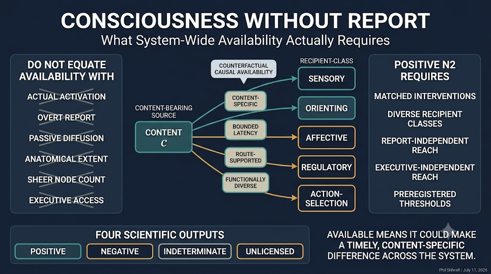

\begin{center}
\textbf{A visual preview:}
\end{center}

{width=100%}

\newpage

## Abstract

Theories of consciousness often require a content to become globally available, yet availability is commonly inferred from overt report, executive use, widespread activation, or information detected at many recording sites. These indicators can dissociate. Report adds planning and motor demands; activity can spread passively; anatomical extent can increase without functional reach; and a content can be causally available to a subsystem that remains quiescent in the current task. This paper develops a report-independent criterion for the broadcast-availability condition $N_2$ in the $N^*$ model of minimal phenomenal presence. A content is system-wide available when content-specific interventions show that it could modulate a preregistered set of functionally distinct recipient classes within bounded latency, across nearby admissible contexts, while preserving the candidate system's operating regime. The criterion measures counterfactual causal availability rather than current activation. Functional diversity is defined from independently estimated causal response repertoires rather than anatomical distance, verbal labels, or node count. Content selectivity, route dependence, matched-energy controls, report-channel ablation, and executive-channel ablation distinguish broadcast from diffusion and availability from access. The framework permits posterior or subcortical availability when the required causal diversity is realized, but does not treat widespread arousal, seizure propagation, a message bus, or passive fan-out as sufficient. It returns positive, negative, indeterminate, or unlicensed component results and specifies what each result licenses. Applications to no-report perception, locked-in states, dreaming, infancy, nonhuman animals, disorders of consciousness, split brains, and artificial architectures show how the criterion changes experimental design. The proposal does not establish that availability is sufficient for consciousness. It clarifies one necessary conjunct so that $N_2$ neither collapses into global neuronal workspace theory nor expands into unconstrained spread.

**Keywords:** consciousness; no-report paradigms; causal availability; broadcast; functional diversity; counterfactual intervention; global workspace; posterior cortex; thalamus; artificial consciousness

## 1. Introduction: Availability Is Not an Output

Consciousness science needs evidence from systems that cannot provide ordinary verbal reports. Patients can be conscious while motor output is severely impaired. Infants and nonhuman animals lack the relevant language. Dreaming and some perceptual paradigms permit experience without a concurrent report. Artificial systems can produce fluent reports even when the causal significance of those reports is unclear. A theory that makes report constitutive will therefore exclude important cases by definition and confound experience with one contingent consequence of experience.

The $N^*$ model avoids that mistake by treating report as evidence rather than as a constituent of minimal phenomenal presence. Its second conjunct, $N_2$, requires broadcast availability: a content must become available across enough of the candidate system, quickly enough, to play a system-level role. That idea is plausible but underdefined. What does "available" mean when no recipient currently uses the content? What makes reach system-wide rather than merely widespread? Which recipients count as different? Can posterior or subcortical systems satisfy the condition without executive access? How should broadcast be distinguished from passive diffusion, volume conduction, common input, seizure spread, or a software message copied to many idle processes?

These are not secondary measurement questions. They determine whether $N_2$ is a substantive causal condition or a label applied after the desired result is known. If availability means reportability, $N_2$ quietly reintroduces access consciousness. If it means any detectable spread, nearly every sufficiently connected system can qualify. If globality means anatomical extent, large homogeneous networks gain an arbitrary advantage. If functional diversity is counted by node labels, analysts can manufacture diversity by reparcellating one process into many pieces.

This paper proposes a sharper criterion:

> A content is system-wide available when admissible, content-specific interventions show that it could causally modulate multiple independently individuated and functionally distinct recipient classes within a preregistered latency bound, without requiring overt report, executive uptake, or current task use.

The modal phrase "could causally modulate" is essential. Availability is a disposition of the organized system, not a census of which modules happened to activate on one trial. But the disposition is not merely logical possibility. It must be demonstrated by interventions close enough to the operating regime, strong enough to estimate a causal effect, weak enough not to create a new global state, and specific enough to preserve the content contrast under test.

### 1.1 The contribution

The paper makes six linked contributions.

1. It replaces actual spread with an intervention-indexed counterfactual criterion.
2. It defines globality over functional recipient classes rather than anatomical extent or raw node count.
3. It supplies controls that separate content broadcast from passive diffusion and common drive.
4. It removes report and executive systems from the required recipient set while allowing them to provide optional evidence.
5. It gives posterior and subcortical broadcast a principled route to qualification without granting automatic sufficiency.
6. It turns $N_2$ into a four-outcome component test with explicit uncertainty, invalidity, and falsification rules.

This is a conceptual and methodological paper. It does not report a new dataset, claim universal numerical thresholds, or infer consciousness from availability alone. The numerical examples are synthetic. The proposed quantities must be operationalized and calibrated for each substrate, grain, horizon, and intervention family.

### 1.2 Relation to the $N^*$ model

For a boundary-qualified candidate system $S$, the core model states

$$
N^*(S,c)=N_1(S,c)\land N_2(S,c)\land N_3(S,c),
$$

where $N_1$ concerns integration or synergy, $N_2$ concerns system-wide availability, and $N_3$ concerns recurrent stability.

**Annotation.** The same system $S$, content $c$, grain, and evaluation window must be used across all three conjuncts. Evidence that a content is integrated in one boundary, available in a larger boundary, and recurrent in a third does not establish $N^*$ for any one system.

The present paper addresses only $N_2$. A positive availability result does not establish $N_1$, $N_3$, viability, or consciousness. A negative $N_2$ result counts against the $N^*$ classification only when the availability test is valid for the candidate and content. An unlicensed or indeterminate result must not be silently converted into absence.

The boundary paper argues that system individuation must precede consciousness measurement. The present proposal inherits that ordering. "System-wide" is indexed to a frozen candidate boundary, not used to discover one retrospectively. The indeterminacy paper supplies the output discipline used here: valid nondiscrimination is indeterminate; failed interpretation is unlicensed (Stilwell, 2026b, 2026c).

## 2. Six Distinctions the Criterion Must Preserve

### 2.1 Actual activation versus causal availability

A recipient can be available to a content without changing its measured state in the current task. The recipient may be idle, inhibited, or not presently queried. Conversely, a recipient can activate because of common input, arousal, or a nonspecific wave without being able to usefully discriminate the content. Actual activation asks what occurred. Causal availability asks what the organized system would permit under an admissible intervention.

This distinction is familiar in other domains. A valve can be open even when no fluid currently passes; a communication channel can be available even when no message is sent. In neural systems, however, the disposition must be demonstrated rather than stipulated. The relevant counterfactual must remain near the observed operating regime and must not add the very routing architecture under test.

### 2.2 Availability versus report

Report is one downstream expression of availability. It additionally requires a reporting code, task comprehension, selection, memory long enough to support the response, decision, and motor execution. Failure at any of these stages can remove report while preserving experience and other forms of causal reach. No-report paradigms were developed partly to separate neural events associated with perception from events associated with introspection and action (Frassle et al., 2014; Tsuchiya et al., 2015).

Report remains valuable evidence when its causal path is understood. It is not the constitutive criterion. A theory should be able to silence a report channel and still ask whether the content remains available elsewhere.

### 2.3 Broadcast versus diffusion

Diffusion is spread generated by local coupling, passive propagation, volume conduction, indiscriminate fan-out, or a common source. Broadcast is content-specific causal access by recipient systems. A seizure can recruit much of the brain while degrading differentiated processing. A global arousal pulse can alter many regions without making one content available. A software bus can copy a token to every subscriber while none of them possesses a content-sensitive transition rule.

Widespread response is therefore at most a candidate signature. Broadcast requires directionality, content selectivity, bounded latency, and recipient-specific modulation that survives matched-energy and common-input controls.

### 2.4 Globality versus anatomical extent

"Global" is often heard as "far across the brain." That interpretation is unsuitable across species, developmental stages, artificial systems, and alternative candidate boundaries. A spatially compact circuit can coordinate distinct sensory, affective, orienting, and regulatory functions. A spatially extensive sheet can remain functionally homogeneous.

Globality should instead be measured relative to the frozen system and its functionally distinct recipient classes. Anatomical distance is relevant to latency and routing cost, but it is not the definition of globality.

### 2.5 Functional diversity versus node count

Counting reached nodes rewards finer parcellation. One visual module divided into 100 parcels should not outrank a five-module system merely because more recording sites cross a threshold. Recipient classes must be individuated from causal response repertoires estimated independently of the target content and final availability result.

Functional diversity also does not require familiar human cognitive labels. "Memory," "decision," and "executive control" can be useful descriptions, but the criterion should work where those capacities are absent or disputed. Distinctness is grounded in differences among causal input-output repertoires, timescales, and state-transition sensitivities.

### 2.6 Posterior or subcortical broadcast versus executive access

Global neuronal workspace accounts often emphasize higher-order cortical systems, especially frontoparietal networks, while recent adversarial and no-report work complicates simple localization claims (Cogitate Consortium et al., 2025; Kapoor et al., 2022). Thalamic stimulation and thalamocortical mapping also show that subcortical structures can causally organize broad cortical dynamics (Lyu et al., 2025; Redinbaugh et al., 2020).

The present criterion does not assign a mandatory prefrontal recipient. Posterior, thalamocortical, or other architectures may qualify if they realize content-specific, timely reach across functionally diverse recipients. Report-independent imaging also motivates attention to interacting cortical and subcortical networks rather than a report pathway alone (Kronemer et al., 2022). These architectures do not qualify merely because they are posterior or subcortical. The same causal tests apply.

| Distinction | Does not establish | Required test |
|---|---|---|
| Actual activation / availability | Coactivation or current uptake does not establish a disposition. | Matched content intervention and recipient response under admissible nearby contexts. |
| Availability / report | Speech, button press, or motor preparation adds auxiliary demands. | Preserve availability after report-channel interruption or omission. |
| Broadcast / diffusion | Widespread energy, common input, or passive propagation is nonspecific. | Content selectivity, directionality, route controls, and recipient-specific effects. |
| Globality / extent | Long distance or large volume can remain homogeneous. | Coverage across frozen functional classes relative to the candidate system. |
| Diversity / count | Reparcellation can multiply nodes without multiplying functions. | Classify recipients from independent causal repertoires and weight classes, not nodes. |
| Nonexecutive / executive | Executive uptake is one optional recipient type. | Recompute the criterion with executive and report classes excluded. |

## 3. Desiderata for a Report-Independent Availability Criterion

### 3.1 Counterfactual but experimentally disciplined

The criterion must evaluate a disposition without licensing remote possible worlds. Recipient readiness may be probed only through preregistered, low-cost context changes that preserve the candidate's identity, viability, and operating regime. A content is not available merely because a new controller, decoder, or long training procedure could make it so.

### 3.2 Content-specific

The intervention must preserve or manipulate the content contrast rather than inject undifferentiated energy. A response to stimulation intensity alone does not demonstrate availability of the content.

### 3.3 Recipient-relative

Different recipient classes can register modulation in different variables. A sensory comparator, orienting circuit, affective regulator, and motor planner need not share one output code. Each class requires a native, preregistered response variable and effect threshold.

### 3.4 Independent of report and executive necessity

Neither a reporting module nor a domain-general controller may be mandatory. They can count as recipients when present, but the positive result must survive their removal from the required coverage calculation.

### 3.5 Resistant to parcellation and boundary flexibility

Recipient classes, thresholds, and weights must be frozen before the critical content test. Results must be stress-tested across reasonable grains and recipient taxonomies.

### 3.6 Able to return indeterminacy and invalidity

Noisy effects, conflicting estimators, incomplete perturbation coverage, and failed system boundaries should remain visible. A permissive default would make $N_2$ unfalsifiable; a negative default would turn missing evidence into absence.

## 4. Formal Framework

### 4.1 Analysis specification

Let a preregistered availability specification be

$$
\Theta_A=(S,g,\Delta,\mathcal R,c,c_0,\mathcal M,\mathcal U,\mathcal I,d,
\boldsymbol\epsilon,\lambda,\alpha,m,\eta,s,r,\beta).
$$

**Term-by-term annotation.** $S$ is the boundary-qualified candidate system; $g$ is its grain; $\Delta$ is the evaluation horizon; $\mathcal R$ is the operating regime; $c$ is the target content and $c_0$ a matched control; $\mathcal M$ is the frozen recipient-class family; $\mathcal U$ is the admissible nearby-context family; $\mathcal I$ is the intervention family; $d$ is the response-distance function; $\boldsymbol\epsilon$ contains class-specific causal-effect thresholds; $\lambda$ is the maximum latency; $\alpha$ is weighted coverage; $m$ is the minimum number of distinct classes; $\eta$ is the diversity threshold; $s$ and $r$ are content-selectivity and routing thresholds; and $\beta$ fixes the uncertainty procedure.

No term may be selected after inspecting the final $N_2$ outcome. If $S$ is unstable or unlicensed, the availability result is also unlicensed because "system-wide" lacks a stable referent.

### 4.2 Independently individuating recipient classes

Let $M_1,\ldots,M_J$ be provisional modules within $S$. For calibration interventions $z\in\mathcal I_{\mathrm{cal}}$ that do not use the target content, define the causal response repertoire of module $M_j$ as

$$
\mathcal Q(M_j)=\left\{P(Y_j^{z}(t:t+\Delta)\mid do(Z=z),\mathcal R):z\in\mathcal I_{\mathrm{cal}}\right\}.
$$

**Annotation.** $Y_j^z$ is a vector of native module variables, not necessarily behavior. The repertoire records how the module responds across a calibration family. Clustering may merge several provisional modules into one recipient class. Two resulting classes are functionally distinct only if a preregistered repertoire distance between their class-level summaries exceeds a threshold $\xi$ with adequate reliability. Clustering and the value of $\xi$ are frozen before testing $c$.

The resulting class family is

$$
\mathcal M_\Theta=\{\mathcal C_1,\ldots,\mathcal C_K\},
\qquad
d_Q(\mathcal C_i,\mathcal C_j)\geq\xi\ \text{for}\ i\neq j.
$$

**Plain-language reading.** Recipient diversity is earned by different causal repertoires, not by different names, coordinates, or parcel IDs. If two groups differ only because the analyst subdivided one homogeneous process, they should remain one class.

### 4.3 Content-specific causal modulation

Let $X_c$ denote the content-bearing state variables for $c$. For recipient class $\mathcal C_k$, admissible context $u\in\mathcal U_k$, and latency $\tau$, define

$$
E_{k,u}(c,\tau)=d_k\!\left(
P(Y_{k,t+\tau}\mid do(X_{c,t}=x_c),do(U=u),\mathcal R),
P(Y_{k,t+\tau}\mid do(X_{c,t}=x_{c_0}),do(U=u),\mathcal R)
\right).
$$

**Annotation.** The two intervention arms differ in content while matching intensity, duration, spatial support, and nonspecific state change. $d_k$ can be a distributional, decoding, state-transition, or causal-response distance validated for that recipient class. The effect concerns the recipient's internal state. It does not require a report, choice, memory trace, or motor action.

The use of $do(\cdot)$ makes the causal claim explicit: the target is a contrast between intervention distributions, not a conditional association in observed data (Pearl, 2009).

The class-level effect and latency are

$$
E_k^*(c)=\max_{u\in\mathcal U_k}\max_{0\leq\tau\leq\Delta}E_{k,u}(c,\tau),
$$

$$
L_k(c)=\min\left\{\tau:\exists u\in\mathcal U_k, E_{k,u}(c,\tau)\geq\epsilon_k\right\}.
$$

**Annotation.** The maximization does not permit arbitrary task construction. $\mathcal U_k$ contains only preregistered nearby contexts whose preparation cost is below a bound $\gamma$, that preserve $\mathcal R$, and that do not install new routing machinery. The latency clock begins at the content intervention, not at a later report cue. If no qualifying effect occurs, $L_k=\infty$.

### 4.4 Why actual activation is neither necessary nor sufficient

Let $A_k(c,t)$ indicate whether class $k$ is observably active on an unperturbed trial. The framework does not define availability as $A_k=1$. Instead,

$$
A_k(c,t)=0\ \nRightarrow\ E_k^*(c)<\epsilon_k,
\qquad
A_k(c,t)=1\ \nRightarrow\ E_k^*(c)\geq\epsilon_k.
$$

**Annotation.** The first non-implication permits a currently idle but causally reachable recipient. The second blocks common input, arousal, and passive spread from counting as broadcast. Both claims are empirical: interventions determine which side applies in a particular system.

### 4.5 Content selectivity and routing evidence

Define a matched null family $\widetilde{\mathcal I}_c$ containing phase-scrambled, label-shuffled, energy-matched, and common-drive controls. Content selectivity is

$$
\operatorname{Sel}_k(c)=E_k^*(c)-\max_{\tilde i\in\widetilde{\mathcal I}_c}E_k^*(\tilde i).
$$

**Annotation.** A large raw response with low selectivity is compatible with diffusion. The selectivity threshold $s$ concerns the additional effect of preserving the target content contrast.

For a preregistered route family $B_k$, let $E_k^{\mathrm{block}}$ be the content effect after matched interruption of the candidate route while preserving local excitability and generic support. Define

$$
\operatorname{Route}_k(c)=1-\frac{E_k^{\mathrm{block}}(c)}{E_k^*(c)+\varepsilon}.
$$

**Annotation.** $\varepsilon$ prevents division by zero and is fixed in advance. A high value indicates that the nominated causal route carries the content-specific effect. A low value can indicate an incorrect route model, redundant unblocked routes, or nonspecific common drive. Redundant architectures require blocking a sufficient route family rather than one arbitrarily chosen edge.

### 4.6 Recipient qualification

Using one-sided uncertainty bounds, recipient class $k$ qualifies when

$$
a_k(c)=\mathbf 1\!\left[
\operatorname{LCB}_{1-\beta}(E_k^*)\geq\epsilon_k,
\operatorname{UCB}_{1-\beta}(L_k)\leq\lambda,
\operatorname{LCB}_{1-\beta}(\operatorname{Sel}_k)\geq s,
\operatorname{LCB}_{1-\beta}(\operatorname{Route}_k)\geq r
\right].
$$

**Annotation.** All four gates must pass. Effect without speed is not timely availability; speed without content selectivity is compatible with a pulse; selectivity without routing evidence can be correlational; routing without a recipient effect does not show availability. If an interval straddles a threshold, the class is unresolved rather than failed.

### 4.7 Coverage and functional diversity

Let preregistered class weights satisfy $w_k>0$ and $\sum_k w_k=1$. Weights cannot be proportional to node count alone. Define weighted coverage and class count:

$$
C_A(c)=\sum_{k=1}^{K}w_k a_k(c),
\qquad
K_A(c)=\sum_{k=1}^{K}a_k(c).
$$

Among qualifying classes, let normalized effect mass be

$$
p_k(c)=\frac{w_kE_k^*(c)a_k(c)}{\sum_jw_jE_j^*(c)a_j(c)},
$$

and define diversity evenness

$$
H_A(c)=-\frac{\sum_{k:a_k=1}p_k(c)\log p_k(c)}{\log K_A(c)}.
$$

**Annotation.** $C_A$ asks how much of the frozen functional-class space is reachable. $K_A$ prevents one heavily weighted class from passing alone. $H_A$ prevents one recipient from dominating nearly all causal effect while tiny effects barely cross thresholds elsewhere. For $K_A<2$, define $H_A=0$. Other diversity indices may be used if preregistered and shown to resist reparcellation.

### 4.8 Report and executive independence

Let $\mathcal M_R$ contain report-output classes and $\mathcal M_E$ contain executive-control classes, each identified before the content test. Define the nonreport and nonexecutive recipient families

$$
\mathcal M^{-R}=\mathcal M\setminus\mathcal M_R,
\qquad
\mathcal M^{-E}=\mathcal M\setminus\mathcal M_E.
$$

The criterion requires the availability gates to pass on both reduced families, using renormalized preregistered weights:

$$
N_2^{-R}(c)=1,
\qquad
N_2^{-E}(c)=1.
$$

**Annotation.** This is not a demand for destructive lesions in every experiment. Report and executive channels can be omitted by task design, transiently interrupted, conditionally modeled, or compared across naturally dissociated states. Generic support must be preserved where interruption would otherwise collapse arousal or viability. Report and executive modules can strengthen evidence, but neither can be the sole reason the criterion passes.

### 4.9 The positive $N_2$ rule

For a valid specification, counterfactual system-wide availability is

$$
N_2(S,c;\Theta_A)=1
$$

only if

$$
C_A(c)\geq\alpha,
\quad
K_A(c)\geq m,
\quad
H_A(c)\geq\eta,
\quad
N_2^{-R}(c)=1,
\quad
N_2^{-E}(c)=1.
$$

**Plain-language reading.** A content must have timely, selective, route-supported causal effects across enough independently distinct recipient classes, with no dependence on report or executive uptake for the positive result.

The rule does not require every class. Some recipients may be irrelevant to the content, unavailable in the current regime, or ethically inaccessible. The thresholds are paradigm-specific and must be calibrated against positive controls, negative controls, and unconscious spread cases.

### 4.10 Four component outcomes

The $N_2$ assessment returns one of four results:

| Status | Formal condition | Interpretation |
|---|---|---|
| Positive | Every required lower or upper bound clears its gate, including reduced-family tests. | Counterfactual system-wide availability is supported for this content and specification. |
| Negative | The test is valid and an upper bound falls below at least one necessary coverage, class-count, diversity, or reduced-family gate. | Evidence supports failure of $N_2$ under this specification. |
| Indeterminate | Valid estimates straddle thresholds, credible surrogates conflict, or perturbation coverage is insufficient to discriminate. | The evidence bears on $N_2$ but does not settle it. |
| Unlicensed | Boundary, content intervention, recipient taxonomy, regime preservation, or transport validity fails. | No interpretable $N_2$ result is available. |

**Annotation.** A negative component result is not automatically a negative consciousness result outside the $N^*$ model. Indeterminate is not halfway positive. Unlicensed is not evidence of absence. The output must carry its target, system, content, grain, horizon, and intervention coverage.

## 5. A Counterfactual Availability Workflow

### 5.1 Stage 1: Freeze the candidate system

Apply a boundary criterion before computing reach. Archive the nodes, interfaces, grain, horizon, and operating regime. A result is exploratory if the boundary changes after availability estimates are inspected.

### 5.2 Stage 2: Specify the content contrast

Define $c$ and a matched control $c_0$. Identify content-bearing variables without using report-related activity as the sole localizer. Use cross-decoding, physical alternation, rivalry, stimulation, or generative model interventions as appropriate.

### 5.3 Stage 3: Build recipient classes independently

Estimate causal response repertoires on calibration data and freeze the class taxonomy. Compare anatomical, functional, and causal clusterings in sensitivity analysis.

### 5.4 Stage 4: Declare nearby admissible contexts

Specify which local readiness probes are allowed, their preparation costs, and how regime preservation will be tested. Exclude contexts that add a new controller, require long retraining, or make report the only measurable output.

### 5.5 Stage 5: Run matched content interventions

Estimate content effects and latency for every recipient class. Match energy, duration, source support, and global state. Include shuffled-content, common-input, and passive-propagation controls.

### 5.6 Stage 6: Test routes

Interrupt nominated routes while preserving generic support and local excitability. In redundant systems, use route-family or mediation analyses that cover plausible alternatives.

### 5.7 Stage 7: Remove report and executive dependence

Recompute coverage and diversity after excluding report and executive classes. Use no-report conditions, motor dissociations, task omission, or model-based channel interruption.

### 5.8 Stage 8: Stress-test and classify

Vary reasonable grains, taxonomies, estimators, latency bounds, and intervention designs. Return positive, negative, indeterminate, or unlicensed. Preserve all failed gates and unresolved classes.

## 6. Worked Applications

### 6.1 No-report binocular rivalry

In binocular rivalry, perceptual content changes while physical input can remain stable. Eye movements or other involuntary markers can help index the dominant content without requiring a trial-by-trial button press. Frassle et al. (2014) found frontal activity associated more strongly with introspection and action than with the perceptual alternation itself, while later work has also found content-related prefrontal activity in no-report macaque paradigms (Kapoor et al., 2022). The correct conclusion is not that frontal cortex is always irrelevant or always constitutive. It is that report and perception must be causally separated.

The proposed test localizes content-bearing states using rivalry and physical-alternation controls, then perturbs those states and measures timely, selective effects across independently defined recipient classes. A posterior-dominant result can pass if it reaches diverse nonreport recipients. Eye movement is evidence for content timing, not a required recipient.

### 6.2 Locked-in and cognitive motor dissociation

Motor output failure should not force $N_2$ negative. Report classes are excluded from the required set. Auditory, semantic, orienting, autonomic, and other recipient classes can be tested with perturbational, electrophysiological, or model-based interventions. A positive result supports availability despite absent overt behavior. A failed command-following task is negative only for that task pathway unless the wider causal test is valid and negative.

### 6.3 Dreaming and disconnected output

Dream experience can occur with greatly reduced interaction and no concurrent report. Retrospective reports are useful but memory-dependent. The availability criterion asks whether dream contents modulate diverse internal recipients during the episode. A system can satisfy this internal criterion while remaining externally disconnected. Globality is relative to the candidate system, not to the environment.

### 6.4 Infants and nonhuman animals

Recipient classes should be built from species- and stage-appropriate causal repertoires. A human executive taxonomy cannot be imposed as the standard. Orienting, multisensory, valuation-like, homeostatic, and action-selection systems may provide distinct recipient classes, but their labels do not substitute for causal individuation. Training demands must remain low enough not to convert absence of learned access into absence of availability.

### 6.5 Posterior-dominant visual availability

A visual content may causally modulate multiple posterior sensory, spatial, object, and visuomotor recipient classes within short latency while prefrontal report systems remain inactive. Such a pattern can satisfy the criterion if the classes are genuinely distinct and route controls pass. Merely decoding the same visual feature at many posterior sites is insufficient because it can reflect redundant representation rather than diverse availability.

### 6.6 Thalamocortical and subcortical organization

Central thalamic stimulation can modulate arousal and cortical dynamics, and human stimulation-recording studies reveal structured thalamocortical causal connections (Lyu et al., 2025; Redinbaugh et al., 2020). These findings motivate subcortical candidates but do not by themselves establish content availability. Arousal is a regime condition. $N_2$ additionally requires content-specific effects from the content-bearing state to diverse recipients through thalamocortical or other routes.

### 6.7 Split brains

After callosal disconnection, a content may be available across diverse classes within one hemisphere but not the other. The correct result can therefore be hemisphere-indexed. A union-level measure based on node count may remain large even when cross-hemispheric causal availability collapses. This case shows why boundary selection and availability measurement must be separate.

### 6.8 Artificial and distributed systems

A shared memory, message bus, or attention cache does not establish broadcast. The workflow must intervene on a content token or latent state and show selective, timely modulation of modules with independently different causal repertoires. Logging services, mirrored replicas, and idle subscribers do not increase functional diversity. A language output module is optional evidence, not a required recipient. If the criterion passes only because one central executive calls every tool, the executive-ablation gate fails.

## 7. Relation to Existing Approaches

### 7.1 Global workspace and global neuronal workspace theories

Workspace theories emphasize broad availability to specialized processors (Baars, 1988; Dehaene & Changeux, 2011; Mashour et al., 2020). The present account inherits the pressure toward cross-system availability but does not identify $N_2$ with a specific workspace architecture, late ignition signature, prefrontal location, or reportability. It can be implemented by a workspace, but a workspace label does not automatically satisfy it.

This difference matters empirically. The 2025 adversarial collaboration found content information and sustained activity distributed across visual, temporal, and inferior frontal regions, with results that did not cleanly vindicate all preregistered predictions of either GNWT or IIT (Cogitate Consortium et al., 2025). A criterion stated in causal and functional terms can survive localization revisions while remaining falsifiable.

### 7.2 Access consciousness

Block's distinction between phenomenal and access consciousness motivates the concern that availability might smuggle access into phenomenal presence (Block, 1995). The present solution is not to remove availability but to weaken its consumer requirements. Recipient modulation can be internal and task-independent. No memory, decision, control, or report class is individually necessary. If empirical work shows that all credible availability effects require those systems, the separation fails and $N_2$ should be revised rather than protected verbally.

### 7.3 No-report paradigms

No-report designs reduce some confounds but do not provide direct access to consciousness. Involuntary indicators can themselves have false positives, and contrasts can change attention or expectation. Report contrasts have also shifted the interpretation of late signals such as P3 and gamma activity toward post-perceptual processing in some paradigms (Pitts et al., 2014). The proposed framework treats no-report markers as content-indexing evidence and adds causal perturbation. It therefore neither treats reports as constitutive nor treats their absence as methodological purity.

### 7.4 Network communication and controllability

Participation coefficients, rich-club structure, communicability, and controllability can identify potential routes through a network (Cai et al., 2021; Guimera & Amaral, 2005; Gu et al., 2015). They are useful proposal generators, not final availability measures. Structural controllability can be mathematically high while required energy is prohibitive; graph reach can be broad while dynamics suppress content-specific effects. Empirical or validated-model interventions must connect topology to recipient modulation.

### 7.5 Effective connectivity and perturbational inference

Intracranial stimulation shows that network organization predicts propagated effects, and recent virtual-perturbation methods estimate directed whole-brain effective connectivity from generative models (Luo et al., 2025; Solomon et al., 2018). These methods fit the counterfactual emphasis but require careful validation. A surrogate model can hallucinate routes, stimulation can inject nonspecific energy, and effective connectivity for resting dynamics need not establish content availability.

## 8. Empirical Program and Falsification

### 8.1 Benchmark contrasts

The criterion should be calibrated against contrasts designed to separate its components:

- conscious report versus matched no-report perception;
- conscious versus unconscious content with matched stimulation energy;
- passive sensory propagation versus content-specific recipient modulation;
- widespread seizure or arousal activity versus differentiated broadcast;
- posterior-only, frontoparietal, and thalamocortical route models;
- intact report versus motor-output interruption;
- one homogeneous fan-out network versus fewer functionally diverse recipients;
- software message duplication versus module-specific state transition.

### 8.2 Discriminating predictions

1. Removing report demands will reduce some frontal and motor signals without necessarily reducing nonreport coverage $C_A$.
2. Raw anatomical reach will predict $N_2$ less well than diversity-weighted causal coverage.
3. Passive spread controls will show broad activation but low content selectivity or route specificity.
4. Some posterior or thalamocortical architectures will pass without prefrontal recipients, while others will fail because their effects are homogeneous or arousal-only.
5. Systems with many redundant nodes will not gain availability merely through finer parcellation.
6. Artificial architectures with a message bus but no content-sensitive subscribers will fail despite total fan-out.

### 8.3 What would count against the criterion

The proposal would be weakened if any of the following patterns proved robust:

- well-supported conscious contents repeatedly lacked all timely causal effects outside a local class;
- unconscious feedforward, seizure, or diffusion cases regularly passed selectivity, routing, diversity, and ablation controls;
- results changed arbitrarily with small reasonable changes in recipient taxonomy;
- report or executive classes were always necessary for a positive result despite preserved no-report consciousness evidence;
- admissible interventions could not be distinguished from interventions that create a new state or content;
- functional repertoire distance failed to predict any meaningful recipient difference.

### 8.4 Reliability and sensitivity

Let $\mathcal N(\Theta_A)$ be a preregistered neighborhood of reasonable specifications. Define availability stability

$$
R_A(c)=\sum_{\Theta'\in\mathcal N(\Theta_A)}w(\Theta')
\mathbf 1[N_2(c;\Theta')=N_2(c;\Theta_A)].
$$

**Annotation.** The neighborhood varies grain, recipient clustering, effect estimator, latency bound, and plausible intervention designs. The weights are fixed before outcome inspection. Positive or negative results with low $R_A$ are fragile; unresolved mappings across grains are reported as incommensurable rather than forced into agreement.

### 8.5 Scope limitations

The framework is demanding. Direct intervention can be unethical or technically impossible; virtual perturbation depends on model validity; content localization can itself be theory-laden; and some recipient variables may be unobservable. The method can therefore return indeterminate or unlicensed often. That is preferable to treating observed spread as causal availability. The criterion also addresses whether a content is available, not why the content has a particular phenomenal character.

## 9. Objections and Replies

### Objection 1: Counterfactual availability is just access consciousness in disguise

Access consciousness usually emphasizes availability for reasoning, rational control, or report. The present recipients need only exhibit content-specific internal modulation. Memory, decision, control, and report are optional classes. If those capacities become mandatory in implementation, the objection succeeds against that implementation.

### Objection 2: If a recipient never activates, calling the content available is unfalsifiable

The disposition is tested through intervention. An idle recipient qualifies only if a preregistered nearby context reveals a timely causal effect without adding new routing machinery. Mere logical possibility does not count.

### Objection 3: The intervention creates the broadcast

That risk is real. Matched-energy controls, small perturbations, regime-preservation tests, and preparation-cost bounds are included for this reason. If the intervention induces a qualitatively new global state, the result is unlicensed.

### Objection 4: Functional diversity is subjective

Every parcellation involves modeling choices. The remedy is independent repertoire estimation, held-out clustering, reliability, and sensitivity across plausible taxonomies. Anatomical labels alone are insufficient.

### Objection 5: A local but richly differentiated circuit could count as global

Yes, relative to a correctly bounded system. Globality is organizational, not geographic. This implication should be rejected only by defending anatomical extent as independently necessary.

### Objection 6: Posterior broadcast simply turns the view into recurrent processing theory

No. Local recurrence can remain isolated and fail coverage or diversity. Posterior architectures qualify only when they causally reach distinct recipients. $N_3$ separately tests recurrent stability.

### Objection 7: Subcortical spread is merely arousal

Often it may be. Arousal-only effects fail content selectivity. Subcortical routes count only when the content contrast, not just global state, modulates diverse recipients.

### Objection 8: The thresholds are arbitrary

Initial thresholds are conventional hypotheses. They become scientifically useful through preregistration, positive and negative controls, uncertainty bounds, and falsification. Brittle results are reported as fragile or indeterminate.

### Objection 9: Report is still the only way to know the content

Reports are powerful calibration evidence in cooperative adults, but physical alternation, rivalry markers, physiological responses, decoding, and causal models provide additional evidence. None is infallible. The framework requires convergent content indexing without making one output constitutive.

### Objection 10: The criterion is too hard to apply

The full standard is appropriate for strong system-wide claims. Partial studies can estimate one gate, but they should say so. A cheap proxy should not inherit the interpretation of a causal criterion without validation.

## 10. Recommendations

1. Replace claims of "global activation" with explicit causal availability claims or more modest descriptive language.
2. Freeze the candidate system before computing reach.
3. Define the target content and matched control independently of report-related activity.
4. Build recipient classes from independent causal repertoires, not node labels or anatomical distance.
5. Use content-preserving perturbations with energy, common-input, and shuffled-content controls.
6. Report effect, latency, selectivity, and route evidence for every recipient class.
7. Weight functional classes rather than raw nodes and report class-count plus diversity-evenness gates.
8. Recompute the result without report and executive classes.
9. Permit posterior and subcortical architectures, but apply identical causal standards.
10. Stress-test grain, taxonomy, thresholds, and intervention design.
11. Return indeterminate or unlicensed when the evidence or interpretation fails.
12. Keep the $N_2$ result separate from the final $N^*$ and consciousness classifications.

## 11. Conclusion

System-wide availability should not be read off a button press, a frontal activation, a colorful whole-brain map, or the number of nodes reached by a signal. Each can be useful evidence; none defines the property. Availability is a causal disposition of a bounded, organized system. It concerns whether a content could make a timely, content-specific difference across a functionally diverse set of recipients under nearby admissible conditions.

The proposed criterion gives that idea empirical structure. It freezes the system and recipient taxonomy, estimates class-specific intervention effects and latency, tests content selectivity and causal routes, aggregates over functional rather than anatomical diversity, and removes report and executive dependence from the positive rule. It permits nonexecutive, posterior, and subcortical implementations without granting any of them automatic success. It also preserves negative, indeterminate, and unlicensed outcomes.

This sharpening makes $N_2$ riskier and therefore more useful. If conscious contents systematically fail the criterion, broadcast availability is too strong. If unconscious diffusion repeatedly passes, it is too weak. If report or executive access proves unavoidable, the model must acknowledge that burden. A component of a consciousness theory should not be protected by ambiguity. It should expose exactly what the world would have to show.

## References

Baars, B. J. (1988). *A cognitive theory of consciousness*. Cambridge University Press.

Block, N. (1995). On a confusion about a function of consciousness. *Behavioral and Brain Sciences, 18*(2), 227-247. https://doi.org/10.1017/S0140525X00038188

Casali, A. G., Gosseries, O., Rosanova, M., Boly, M., Sarasso, S., Casali, K. R., Casarotto, S., Bruno, M.-A., Laureys, S., Tononi, G., & Massimini, M. (2013). A theoretically based index of consciousness independent of sensory processing and behavior. *Science Translational Medicine, 5*(198), 198ra105. https://doi.org/10.1126/scitranslmed.3006294

Cai, W., Ryali, S., Pasumarthy, R., Talasila, V., & Menon, V. (2021). Dynamic causal brain circuits during working memory and their functional controllability. *Nature Communications, 12*, 3314. https://doi.org/10.1038/s41467-021-23509-x

Cogitate Consortium. (2025). Adversarial testing of global neuronal workspace and integrated information theories of consciousness. *Nature, 642*, 133-142. https://doi.org/10.1038/s41586-025-08888-1

Dehaene, S., & Changeux, J.-P. (2011). Experimental and theoretical approaches to conscious processing. *Neuron, 70*(2), 200-227. https://doi.org/10.1016/j.neuron.2011.03.018

Frassle, S., Sommer, J., Jansen, A., Naber, M., & Einhauser, W. (2014). Binocular rivalry: Frontal activity relates to introspection and action but not to perception. *Journal of Neuroscience, 34*(5), 1738-1747. https://doi.org/10.1523/JNEUROSCI.4403-13.2014

Gu, S., Pasqualetti, F., Cieslak, M., Telesford, Q. K., Yu, A. B., Kahn, A. E., Medaglia, J. D., Vettel, J. M., Miller, M. B., Grafton, S. T., & Bassett, D. S. (2015). Controllability of structural brain networks. *Nature Communications, 6*, 8414. https://doi.org/10.1038/ncomms9414

Guimera, R., & Amaral, L. A. N. (2005). Functional cartography of complex metabolic networks. *Nature, 433*, 895-900. https://doi.org/10.1038/nature03288

Lamme, V. A. F. (2006). Towards a true neural stance on consciousness. *Trends in Cognitive Sciences, 10*(11), 494-501. https://doi.org/10.1016/j.tics.2006.09.001

Luo, Z., Peng, K., Liang, Z., Cai, S., Xu, C., Li, D., Hu, Y., Zhou, C., et al. (2025). Mapping effective connectivity by virtually perturbing a surrogate brain. *Nature Methods, 22*, 1376-1385. https://doi.org/10.1038/s41592-025-02654-x

Lyu, D., Stiger, J. R., Lusk, Z., Buch, V., et al. (2025). Mapping human thalamocortical connectivity with electrical stimulation and recording. *Nature Neuroscience, 28*, 1797-1809. https://doi.org/10.1038/s41593-025-02009-x

Mashour, G. A., Roelfsema, P. R., Changeux, J.-P., & Dehaene, S. (2020). Conscious processing and the global neuronal workspace hypothesis. *Neuron, 105*(5), 776-798. https://doi.org/10.1016/j.neuron.2020.01.026

Kronemer, S. I., Aksen, M., Ding, J. Z., Ryu, J. H., Xin, Q., Ding, Z., Prince, J. S., Kwon, H., Khalaf, A., Forman, S., et al. (2022). Human visual consciousness involves large scale cortical and subcortical networks independent of task report and eye movement activity. *Nature Communications, 13*, 7342. https://doi.org/10.1038/s41467-022-35117-4

Pearl, J. (2009). *Causality: Models, reasoning, and inference* (2nd ed.). Cambridge University Press. https://doi.org/10.1017/CBO9780511803161

Pitts, M. A., Padwal, J., Fennelly, D., Martinez, A., & Hillyard, S. A. (2014). Gamma band activity and the P3 reflect post-perceptual processes, not visual awareness. *Frontiers in Psychology, 5*, 1078. https://doi.org/10.3389/fpsyg.2014.01078

Redinbaugh, M. J., Phillips, J. M., Kambi, N. A., Mohanta, S., Andryk, S., Dooley, G. L., Afrasiabi, M., Raz, A., & Saalmann, Y. B. (2020). Thalamus modulates consciousness via layer-specific control of cortex. *Neuron, 106*(1), 66-75.e12. https://doi.org/10.1016/j.neuron.2020.01.005

Solomon, E. A., Kragel, J. E., Gross, R., Lega, B., Sperling, M. R., Worrell, G., Sheth, S. A., Zaghloul, K. A., Jobst, B. C., Stein, J. M., et al. (2018). Medial temporal lobe functional connectivity predicts stimulation-induced theta power. *Nature Communications, 9*, 4437. https://doi.org/10.1038/s41467-018-06876-w

Stilwell, P. (2026a). *C0 as N\*: A minimal network-dynamics model of phenomenal consciousness* [Manuscript].

Stilwell, P. (2026b). *Indeterminacy as a scientific result: A four-outcome framework for consciousness attribution* [Manuscript].

Stilwell, P. (2026c). *Where is the conscious subject? A dynamical criterion for system boundaries* [Manuscript].

Storm, J. F., Klink, P. C., Aru, J., Senn, W., Goebel, R., Pigorini, A., Avanzini, P., Vanduffel, W., Roelfsema, P. R., Massimini, M., Larkum, M. E., & Pennartz, C. M. A. (2024). An integrative, multiscale view on neural theories of consciousness. *Neuron, 112*(10), 1531-1552. https://doi.org/10.1016/j.neuron.2024.02.004

Tsuchiya, N., Wilke, M., Frassle, S., & Lamme, V. A. F. (2015). No-report paradigms: Extracting the true neural correlates of consciousness. *Trends in Cognitive Sciences, 19*(12), 757-770. https://doi.org/10.1016/j.tics.2015.10.002

Kapoor, V., Dwarakanath, A., Safavi, S., Werner, J., Besserve, M., Panagiotaropoulos, T. I., & Logothetis, N. K. (2022). Decoding internally generated transitions of conscious contents in the prefrontal cortex without subjective reports. *Nature Communications, 13*, 1535. https://doi.org/10.1038/s41467-022-28897-2

**Central paper and related publications:** <https://philstilwell.github.io/C0/>

## Appendix A: Glossary and notation

| Term or symbol | Definition | Guardrail |
|---|---|---|
| $S$ | Boundary-qualified candidate system | Must be frozen before availability measurement. |
| $c,c_0$ | Target content and matched control content | Must not differ only in report demand or stimulation energy. |
| $\Theta_A$ | Complete availability specification | No post-result choice of boundary, classes, contexts, or thresholds. |
| $\mathcal M$ | Independently individuated recipient-class family | Classes are based on causal repertoires, not labels or parcel count. |
| $\mathcal U$ | Nearby admissible context family | Cannot install new routing machinery or change the operating regime. |
| $E_{k,u}$ | Content-specific causal effect on recipient class $k$ | Internal modulation is sufficient; behavior is not required. |
| $L_k$ | Earliest qualifying recipient latency | Measured from content intervention, not report cue. |
| $\operatorname{Sel}_k$ | Effect beyond matched null interventions | Blocks energy spread and common drive. |
| $\operatorname{Route}_k$ | Effect lost under matched route interruption | Requires adequate coverage of redundant routes. |
| $a_k$ | Recipient qualification indicator | Effect, latency, selectivity, and route gates all apply. |
| $C_A$ | Weighted functional-class coverage | Weights cannot reward sheer node count. |
| $K_A$ | Number of qualifying recipient classes | Prevents one class from passing alone. |
| $H_A$ | Evenness of effect across qualifying classes | Prevents token threshold crossings around one dominant recipient. |
| $N_2^{-R},N_2^{-E}$ | Nonreport and nonexecutive availability tests | Report and executive uptake are optional evidence, not necessary gates. |
| $R_A$ | Stability across reasonable specifications | Low stability makes a result fragile or indeterminate. |

## Appendix B: Counterfactual availability protocol

| Stage | Required action | Failure output | Guardrail |
|---|---|---|---|
| 1. Freeze system | Archive $S,g,\Delta,\mathcal R$ and interfaces. | Unlicensed | Do not select the system from the broadcast result. |
| 2. Define content | Specify $c,c_0$ and content-bearing variables. | Content-indeterminate | Do not localize only from report activity. |
| 3. Calibrate classes | Estimate independent causal repertoires and freeze $\mathcal M$. | Taxonomy-unlicensed | Do not multiply classes by reparcellation. |
| 4. Lock contexts | Declare $\mathcal U$, preparation cost, and regime tests. | Counterfactual-unlicensed | No new controller, long retraining, or report-only probe. |
| 5. Intervene | Estimate $E_k^*,L_k$ with matched controls. | Effect negative or indeterminate | Match energy, support, duration, and global state. |
| 6. Test specificity | Estimate $\operatorname{Sel}_k$ and common-input controls. | Diffusion-compatible | Widespread activation alone never passes. |
| 7. Test routes | Interrupt route families with support replacement. | Route negative or indeterminate | Preserve local excitability and account for redundancy. |
| 8. Aggregate | Compute $C_A,K_A,H_A$. | Coverage/diversity negative or indeterminate | Weight functional classes, not raw nodes. |
| 9. Remove access | Recompute $N_2^{-R},N_2^{-E}$. | Access-dependent | Neither report nor executive uptake may be the sole pass route. |
| 10. Stress-test | Estimate $R_A$ across reasonable specifications. | Fragile or indeterminate | Report the full sensitivity distribution. |
| 11. Classify | Return positive, negative, indeterminate, or unlicensed. | Structured component result | Do not equate $N_2$ with consciousness. |

### Appendix B.1 Compact algorithm

1. Freeze the boundary-qualified system and analysis specification.
2. Split calibration and critical-test data.
3. Build recipient classes from calibration interventions that exclude the target content.
4. Define matched target and control interventions plus nearby admissible contexts.
5. Estimate class-specific content effects and latency with uncertainty.
6. Estimate selectivity against matched nulls and route dependence under interruption.
7. Mark a class qualifying only when every class-level gate passes.
8. Compute weighted coverage, class count, and diversity evenness.
9. Repeat after excluding report and executive classes.
10. Stress-test reasonable specifications and issue the four-outcome result.

## Appendix C: Preregistration template

| Field | Required entry |
|---|---|
| Consciousness target | Minimal phenomenal presence, content consciousness, access, or another explicit target. |
| Candidate system | Frozen boundary, interfaces, grain, horizon, and boundary-confidence status. |
| Content contrast | Target $c$, control $c_0$, localization method, and equivalence controls. |
| Operating regime | State, task, arousal, viability, stationarity, and exclusion conditions. |
| Recipient taxonomy | Calibration interventions, repertoire variables, clustering method, $\xi$, reliability, and held-out rule. |
| Admissible contexts | Recipient readiness probes, preparation-cost bound $\gamma$, and regime-preservation tests. |
| Content interventions | Source variables, magnitude, duration, support, safety, and matched-energy design. |
| Response metrics | Class-specific $Y_k,d_k,\epsilon_k$ and measurement validity. |
| Temporal parameters | $\Delta,\lambda$, sampling resolution, and latency uncertainty. |
| Specificity controls | Shuffles, phase controls, common input, arousal, volume conduction, and passive spread. |
| Route tests | Candidate routes, blocking method, generic support, redundancy coverage, and threshold $r$. |
| Diversity rules | Weights $w_k$, coverage $\alpha$, class count $m$, evenness $\eta$, and reparcellation checks. |
| Access exclusions | Definitions of $\mathcal M_R,\mathcal M_E$ and reduced-family analysis. |
| Uncertainty | Confidence or credible bounds, $\beta$, multiplicity, missing data, and conflict rules. |
| Sensitivity | Neighborhood $\mathcal N(\Theta_A)$, mappings, weights, and threshold for $R_A$. |
| Reporting | Every class result, failed gate, unresolved test, four-outcome status, and scope limitation. |

## Appendix D: Failure modes and corrective controls

| Failure mode | Why spread metrics are fooled | Corrective control |
|---|---|---|
| Common input | Many recipients respond without receiving the content from one another. | Condition or intervene on the common source; test directed route loss. |
| Arousal pulse | Global gain changes mimic broad availability. | Match arousal and require content selectivity. |
| Volume conduction | One electrical source appears at many sensors. | Source reconstruction, lag structure, and causal perturbation. |
| Passive diffusion | Local coupling spreads energy without recipient-specific state change. | Native recipient variables and shuffled-content controls. |
| Seizure propagation | Massive recruitment coexists with reduced differentiation. | Diversity, selectivity, and regime-validity gates. |
| Reparcellation | One function becomes many counted nodes. | Repertoire-based classes and cross-grain stability. |
| Decoder leakage | Shared preprocessing makes content decodable everywhere. | Held-out pipelines, nuisance regression, and independent acquisition. |
| Executive bottleneck | One controller touches every module and creates apparent globality. | Executive-excluded recomputation and route interruption. |
| Report preparation | Memory, decision, and motor signals inflate reach. | No-report condition and report-channel exclusion. |
| Message duplication | A token is copied to idle or identical subscribers. | Require content-sensitive module-specific transitions. |

## Appendix E: Case-analysis matrix

| Case | Candidate recipient classes | Report-independent intervention | Interpretive risk |
|---|---|---|---|
| Binocular rivalry | Posterior sensory, spatial, orienting, affective, frontal | Rivalry transition or matched local perturbation indexed by involuntary markers | Treating eye movement or frontal activity as constitutive. |
| Locked-in state | Auditory, semantic, orienting, autonomic, imagery-related | TMS-EEG, auditory perturbation, or validated model intervention | Converting motor silence into $N_2$ failure. |
| Dreaming | Internal sensory, affective, spatial, mnemonic, regulatory | Episode-timed perturbation or state-space intervention | Requiring retrospective memory for current availability. |
| Infant | Multisensory, orienting, valuation-like, regulatory, action selection | Low-demand sensory perturbation and physiological recording | Importing adult executive taxonomies. |
| Nonhuman animal | Species-specific sensory, orienting, homeostatic, action systems | Ecologically valid stimulus and circuit intervention | Treating training failure as unavailable content. |
| Thalamocortical | Cortical and subcortical classes across layers and systems | Content-specific thalamic/cortical stimulation and recording | Confusing arousal modulation with content broadcast. |
| Split brain | Hemisphere-specific diverse classes | Lateralized content perturbation with cross-cueing controls | Counting union-level nodes after causal disconnection. |
| Distributed AI | Model, memory, tools, evaluators, planners, sensors | Latent/token intervention and module-state readback | Counting logs, replicas, or executive calls as recipients. |

## Appendix F: Synthetic worked examples

The following values are illustrative one-sided confidence bounds, not empirical estimates.

### Appendix F.1 Recipient-level decision table

Assume $\epsilon_k=.20$, $\lambda=180$ ms, $s=.10$, and $r=.45$.

| Recipient class | Effect LCB | Latency UCB | Selectivity | Result |
|---|---:|---:|---:|---|
| Posterior object system | .44 | 92 ms | .31 | Qualifies; route LCB .67. |
| Spatial-orienting system | .29 | 138 ms | .18 | Qualifies; route LCB .53. |
| Affective valuation system | .25 | 170 ms | .16 | Qualifies; route LCB .49. |
| Motor report system | .51 | 210 ms | .33 | Fails latency; optional report evidence only. |
| Executive control system | .37 | 155 ms | .21 | Qualifies but is excluded in $N_2^{-E}$. |
| Autonomic regulator | [.14,.24] | 175 ms | .12 | Effect-indeterminate because the interval straddles $\epsilon_k$. |

If the three nonreport, nonexecutive classes carry weights totaling $.72\geq\alpha=.65$, $K_A=3\geq m=3$, and $H_A=.88\geq\eta=.70$, the content can receive a positive $N_2$ result despite the report class failing latency. The unresolved autonomic class remains reported but is not needed for the pass.

### Appendix F.2 Node count versus functional diversity

| Architecture | Reached nodes | Functional classes | Diversity score | Availability result |
|---|---:|---:|---:|---|
| Homogeneous fan-out | 120 | 1 | 0 | Negative: class-count and diversity gates fail. |
| Redundant sensory sheet | 80 | 2 | .41 | Negative: diversity below $\eta$. |
| Compact heterogeneous loop | 18 | 5 | .86 | Positive if effect, latency, selectivity, and route gates pass. |
| Executive star | 45 | 6 | .79 | Negative if reduced-family coverage collapses after executive exclusion. |
| Distributed causal network | 32 | 6 | .83 | Positive if reduced-family tests remain above threshold. |

This example shows why anatomical or computational extent is not the target. The compact network can be more system-wide in the functional sense than the homogeneous fan-out.

### Appendix F.3 Actual activation versus availability

Suppose an unperturbed no-report trial activates only two of five recipient classes. Content intervention reveals timely selective effects in four classes, including two that were quiescent. The observed activation fraction is $.40$, while causal coverage is $.78$. The criterion follows the latter if contexts were admissible and regime-preserving. Conversely, if all five classes activate under a global luminance transient but matched content interventions produce selective effects in only one class, observed spread is $1.0$ while causal availability fails.

### Appendix F.4 Threshold uncertainty

Suppose $C_A\in[.61,.69]$ with $\alpha=.65$, $K_A=4$, $H_A=.81$, and both reduced-family tests otherwise pass. The result is indeterminate, not positive by the point estimate and not negative by the lower bound. More targeted perturbations should reduce uncertainty in the classes carrying the largest weight.

## Appendix G: Formal decision rules at a glance

| Gate | Pass rule | Fail rule | Otherwise |
|---|---|---|---|
| Test validity | Boundary, content, taxonomy, intervention, and regime checks all pass. | Any required interpretation condition fails. | Unlicensed. |
| Recipient effect | $\operatorname{LCB}(E_k^*)\geq\epsilon_k$. | $\operatorname{UCB}(E_k^*)<\epsilon_k$. | Recipient effect indeterminate. |
| Latency | $\operatorname{UCB}(L_k)\leq\lambda$. | $\operatorname{LCB}(L_k)>\lambda$. | Latency indeterminate. |
| Selectivity | $\operatorname{LCB}(\operatorname{Sel}_k)\geq s$. | $\operatorname{UCB}(\operatorname{Sel}_k)<s$. | Diffusion conflict or indeterminate. |
| Route | $\operatorname{LCB}(\operatorname{Route}_k)\geq r$. | $\operatorname{UCB}(\operatorname{Route}_k)<r$ with adequate route coverage. | Route indeterminate. |
| Coverage | $\operatorname{LCB}(C_A)\geq\alpha$. | $\operatorname{UCB}(C_A)<\alpha$. | Coverage indeterminate. |
| Class count | At least $m$ classes pass all gates. | Fewer than $m$ could pass even at upper bounds. | Class-count indeterminate. |
| Diversity | $\operatorname{LCB}(H_A)\geq\eta$. | $\operatorname{UCB}(H_A)<\eta$. | Diversity indeterminate. |
| Report independence | Reduced-family gates pass on $\mathcal M^{-R}$. | Their upper bounds fail. | Report-dependence indeterminate. |
| Executive independence | Reduced-family gates pass on $\mathcal M^{-E}$. | Their upper bounds fail. | Executive-dependence indeterminate. |
| Stability | $R_A\geq\rho_A$ across valid mappings. | $R_A<\rho_A$ with adequate coverage. | Fragile, indeterminate, or incommensurable. |

## Appendix H: Prohibited inferences

- "The content was decoded in many regions, therefore it was globally available."
- "The subject did not report, therefore $N_2$ failed."
- "Prefrontal cortex was inactive, therefore broadcast was absent."
- "The thalamus changed arousal, therefore it broadcast the content."
- "A signal reached many nodes, therefore it reached many functions."
- "The system has a message bus, therefore every message is globally available."
- "One executive accessed the content, therefore the rest of the system could."
- "The intervention produced a global state, therefore the pre-intervention content was available."
- "An $N_2$ test was unlicensed, therefore the content was unavailable."
- "$N_2$ was positive, therefore the system was conscious."

## Appendix I: Minimum availability audit record

Every published $N_2$ result should preserve:

1. the frozen candidate boundary, grain, horizon, and regime;
2. the target and control contents plus localization evidence;
3. the calibration data and recipient-class construction;
4. native response variables and effect metrics for every class;
5. admissible contexts and preparation-cost justification;
6. intervention magnitude, support, timing, and regime diagnostics;
7. matched-energy, shuffled-content, common-input, and arousal controls;
8. class-specific effect, latency, selectivity, and route intervals;
9. class weights, coverage, count, and diversity calculations;
10. report- and executive-excluded results;
11. rejected and unresolved classes with reasons;
12. sensitivity across grains, taxonomies, estimators, and thresholds;
13. the four-outcome component result and scope limitation;
14. the separate later $N^*$ or consciousness classification, if any.
