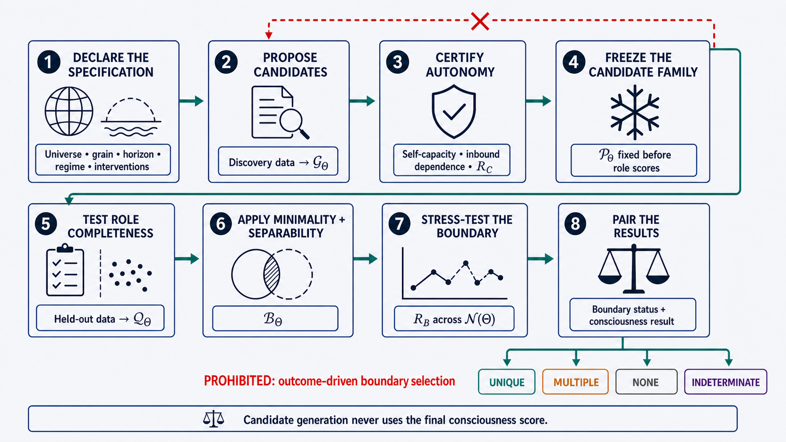

\begin{center}
\textbf{A visual preview:}
\end{center}

{width=100%}

\newpage

## Abstract

Theories of consciousness commonly measure integration, availability, recurrence, complexity, or causal power in a candidate system. Yet these quantities are not defined until investigators decide which variables belong to the system, at what spatial and temporal grain, and across which interval. Different boundaries can reverse the result. A hemisphere, thalamocortical network, brain, brain-body loop, human dyad, organoid-computer assembly, or distributed artificial architecture may each appear integrated or fragmented depending on which nodes are admitted. This paper argues that system individuation must therefore precede consciousness measurement and cannot be selected retrospectively to improve a preferred score. It proposes a boundary-first criterion: at a preregistered grain and horizon, generate candidate systems using consciousness-independent evidence of dynamical autonomy; then identify the inclusion-minimal candidate or candidates that jointly realize the target roles of integration, availability, recurrence, and viability. Strict causal closure is treated as a limiting case. Open biological and artificial systems instead qualify through sufficient autonomy: their endogenous dynamics must make a substantial difference to their own future organization, external dependence must remain below a declared tolerance, and apparent closure must survive perturbation, replacement, and boundary-sensitivity tests. The formalization separates candidate reliability from cross-specification boundary stability and uses confidence-bound decision rules rather than forced point-estimate classifications. The procedure distinguishes constitutive components from inputs, outputs, and enabling supports; returns multiple candidate bearers only when pairwise separability is supported; and returns boundary indeterminacy when thresholds, mappings, or reasonable specifications remain unresolved. Applications to split brains, cortical-subcortical organization, brain-body loops, coupled agents, organoid-computer systems, and distributed artificial intelligence show how the criterion changes empirical practice. The proposal does not infer consciousness from autonomy. It supplies the prior individuation step required before a theory-specific consciousness test can be interpreted.

**Keywords:** consciousness; system individuation; system boundaries; dynamical autonomy; causal closure; integration; recurrence; global availability; split brain; embodied consciousness; organoid intelligence; artificial consciousness

## 1. Introduction: Measurement Requires a Measured System

Consciousness science often begins with a system already in hand. Investigators measure integration in "the brain," broadcast across "the workspace," recurrence within "the visual system," or complexity in "the network." The definite article hides a methodological decision. Which neurons, regions, modules, devices, bodily processes, or agents compose the relevant system? At what spatial and temporal grain should they be represented? Is the candidate the cortex, the thalamocortical system, the whole brain, the brain-body loop, one hemisphere, two coupled organisms, an organoid plus its electrode array, or an artificial model plus the memory, scheduler, and tools that make its activity persistent?

These questions cannot be postponed. Measures of system-level organization are functions of a boundary. If $S$ is the selected set of variables, a consciousness-relevant measure has the form

$$
M_i = M_i(S; g, \Delta, \mathcal{I}),
$$

where $g$ is the grain of description, $\Delta$ is the evaluation horizon, and $\mathcal{I}$ is the family of observations or interventions used to estimate causal organization. Alter $S$, and the value of $M_i$ may alter even when the underlying physical process does not.

**Term-by-term annotation.** $M_i$ denotes any system-level indicator; the subscript $i$ allows different indicators to use the same declared boundary; $S$ is the selected variable set; $g$ fixes how variables are grouped and updated; $\Delta$ fixes how far their trajectories are evaluated; and $\mathcal{I}$ fixes the evidence allowed to identify causal organization.

**Plain-language reading.** There is no boundary-free integration score, broadcast score, or recurrence score. Every such result answers a question about a selected set of parts, represented in a selected way, over a selected interval.

**Why this matters.** If a system boundary is expanded until global availability appears, contracted until integration rises, or redrawn until recurrent loops close, the resulting consciousness classification partly reflects the analyst's choice. A method that selects the boundary after inspecting the desired measure can manufacture apparent support for almost any sufficiently flexible theory.

The problem is general. Integrated information approaches explicitly require a candidate set and an exclusion rule. Global-workspace approaches require a distinction between the workspace and the processors to which information is made available. Recurrent-processing approaches require a decision about which loops belong to the relevant system. Embodied and enactive approaches dispute whether the boundary stops at the skull. Artificial systems make the problem especially visible because the model, context window, external memory, orchestration layer, tools, users, and hardware can be partitioned in many ways. Multiscale neuroscience makes the same point within biology: nodes may be cells, populations, regions, networks, or whole-organism variables, and causal organization need not peak at the finest scale (Marshall et al., 2018; Storm et al., 2024).

This paper proposes a boundary-first method. Its core thesis is:

> **Dynamical Subject Criterion:** At a preregistered grain and time horizon, the boundary of a candidate conscious system is the inclusion-minimal causally admissible network that is sufficiently autonomous and jointly realizes the theory's required roles of integration, availability, recurrence, and viability.

The criterion is deliberately conditional. It does not claim that dynamical autonomy is consciousness. It identifies the candidate system to which a network-dynamical consciousness theory may be applied. The target remains phenomenal consciousness; the boundary criterion addresses what could be its bearer.

### 1.1 The contribution

The proposal makes six commitments.

1. **Boundary selection precedes consciousness measurement.** Candidate systems must be generated from causal-dynamical data that are not selected to maximize a consciousness score.
2. **Closure is graded in open systems.** Strict independence from an environment is a useful limiting ideal, not a plausible requirement for organisms or deployed artificial systems.
3. **Minimality is set-theoretic, not merely numerical.** The relevant candidate is inclusion-minimal: no proper admissible subsystem realizes the complete role bundle at the same grain and horizon.
4. **Constitution is separated from support.** A component belongs to the candidate because it participates in maintaining the relevant organization, not merely because the system eventually fails without it.
5. **Multiplicity and indeterminacy are legitimate outputs.** The method may identify multiple disjoint candidates, a hierarchy across scales, no qualifying candidate, or an unstable boundary.
6. **Boundary choices are preregistered and stress-tested.** Investigators must report how classifications change across reasonable partitions instead of presenting one convenient graph as inevitable.

### 1.2 Relation to the $N^*$ model

The $N^*$ model proposes that minimal phenomenal presence, $C_0$, obtains when an independently viable system realizes integration or synergy ($N_1$), broadcast availability ($N_2$), and recurrent stability ($N_3$) (Stilwell, 2026):

$$
V \land (N_1 \land N_2 \land N_3) \Longleftrightarrow C_0.
$$

**Annotation.** $V$ denotes independently operationalized viability; $N_1$, $N_2$, and $N_3$ denote integration, availability, and recurrence; $C_0$ denotes minimal phenomenal presence; $\land$ requires all conditions jointly; and $\Longleftrightarrow$ states the core model's biconditional hypothesis rather than a definition established by this paper.

That hypothesis is incomplete unless "the system" can be identified without first assuming where consciousness is. The present paper fills that lacuna. It does not add dynamical autonomy as a fourth phenomenal conjunct. Instead, autonomy constrains the domain over which $V$, $N_1$, $N_2$, and $N_3$ may be evaluated. In shorthand:

$$
\text{individuate } S \quad \text{before} \quad \text{testing } N^*(S).
$$

**Annotation.** The ordering arrow is methodological, not temporal in the physical system: candidate generation and freezing must occur before the theory-specific score is inspected, even if both analyses concern the same recorded episode.

This ordering also extends beyond $N^*$. Any theory whose evidence depends on integration, broadcasting, recurrence, complexity, causal power, self-modeling, or organismic regulation needs a principled answer to the boundary question.

## 2. The Boundary Problem

### 2.1 A node list is already a hypothesis

A causal graph $G=(\Omega,E)$ begins with a universe of modeled variables $\Omega$. Even this universe is not neutral. A recording array samples some neural populations and not others. A connectome represents regions at a selected parcellation. An AI diagram includes software services while omitting power supplies, users, and hardware. A dyadic experiment may record both participants but not the shared artifact through which they coordinate.

The scientific problem is therefore not to discover a metaphysical line from nowhere. It is to compare explicit candidate partitions within a declared observational universe and to state what omitted variables could change the result. A boundary method can be objective without pretending to be description-free.

Let $S \subseteq \Omega$ be a candidate system and $\bar S = \Omega \setminus S$ its modeled environment. The state of the candidate at time $t$ is $X_t^S$; the state of the modeled environment is $X_t^{\bar S}$. The same physical process may be represented by many choices of $S$.

### 2.2 Boundary relativity of consciousness measures

Suppose two densely recurrent modules are weakly coupled. Measured separately, each may have high internal integration and recurrent stability but limited availability. Measured together, cross-module availability may rise while normalized integration falls. Adding a controller can create apparent global broadcast. Adding a large passive memory can dilute network averages. Aggregating microvariables can increase some measures of causal effectiveness, while disaggregation can reveal distinct local complexes (Hoel et al., 2013; Marshall et al., 2018).

The dependence can be written as

$$
N^*(S) = N_1(S) \land N_2(S) \land N_3(S),
$$

not simply $N^*$. The omitted argument is scientifically consequential.

**Annotation.** $N^*(S)$ is true only when all three role conditions are satisfied for the same declared candidate $S$ under a common specification. It is not licensed to combine integration measured on one boundary with availability or recurrence measured on another.

**Boundary-reversal condition.** For two admissible candidates $S_1$ and $S_2$, a boundary reversal occurs when

$$
N^*(S_1) \neq N^*(S_2)
$$

under the same underlying data and otherwise fixed analysis policy.

**Annotation.** $S_1$ and $S_2$ are rival candidate boundaries. The inequality may concern a Boolean classification or, before thresholding, a difference in the underlying role profile. Holding the data and policy fixed isolates boundary choice as the source of reversal.

**Plain-language reading.** The consciousness prediction changes because the analyst changed what counts as the system, not because the world changed.

**What the condition does not show.** A reversal does not prove that either boundary is wrong. It shows that the boundary is part of the evidential claim and must be justified independently.

### 2.3 Three different boundary questions

At least three questions are often conflated.

- **Physical boundary:** Which material structures are spatially contiguous or enclosed?
- **Causal boundary:** Which variables form a relatively autonomous dynamical unit under interventions?
- **Subject boundary:** Which unit, if any, is the bearer of one stream or field of consciousness?

The first does not settle the second: spatially separated components can be tightly coupled, while adjacent components can be causally segregated. The second does not entail the third: hurricanes, cells, and control systems may display forms of autonomy without being conscious. The present proposal uses causal boundaries to generate candidates for the subject boundary, then permits a consciousness theory to classify them.

### 2.4 Why retrospective selection is circular

The invalid procedure is

$$
S^{\mathrm{post}} = \arg\max_{S \subseteq \Omega} M_C(S),
$$

where $M_C$ is the measure offered as evidence for consciousness.

**Term-by-term annotation.** $S^{\mathrm{post}}$ is the boundary selected after inspecting the outcome; $\arg\max$ searches for the candidate with the largest consciousness-linked score; and the search domain includes every considered subset of $\Omega$. The defect is not optimization itself but using the target evidence to define its own bearer.

**Plain-language reading.** Search over boundaries and call the boundary with the best consciousness score the conscious system.

**Why this is circular.** The same quantity supplies both the evidence that a system is conscious and the rule determining which system exists for purposes of the test. A positive result becomes likely by construction. A local maximum or an exclusion postulate can be principled within a theory, but it remains theory-dependent and should not be mistaken for an independent individuation result.

The boundary-first alternative is

$$
\mathcal{P} = \mathsf{Partition}(D_{\mathrm{discovery}}),
\qquad
M_C(S) = \mathsf{Measure}(S,D_{\mathrm{test}}), \quad S \in \mathcal{P},
$$

where the candidate family $\mathcal{P}$ is generated from separate data or interventions using a consciousness-independent autonomy rule.

**Term-by-term annotation.** $D_{\mathrm{discovery}}$ is used only to propose and certify boundaries; $D_{\mathrm{test}}$ is held out for theory evaluation; $\mathsf{Partition}$ stands for the preregistered candidate-generation procedure; and $\mathsf{Measure}$ computes the consciousness-linked indicator only on frozen members of $\mathcal{P}$.

**Why data separation matters.** If the same noise fluctuations generate a candidate and certify its consciousness score, formal ordering alone will not prevent overfitting. Discovery and test data should therefore be split whenever feasible.

## 3. Desiderata for a Boundary Criterion

A useful criterion should meet the following requirements.

### 3.1 Causal rather than merely correlational

Correlated components need not form a system. Two agents watching the same screen, two brain regions driven by a common input, or two servers reading the same database can synchronize without constituting one autonomous unit. Candidate generation should therefore use perturbational evidence, directed effective connectivity, or a causal model whose assumptions are explicit.

### 3.2 Compatible with openness

Organisms exchange matter, energy, and signals with their environments. Artificial systems depend on power, networks, and operators. Autonomy cannot mean isolation. It should mean that endogenous organization makes a substantial and robust contribution to the system's own unfolding relative to externally imposed control. This is close to information-theoretic and dynamical treatments of autonomy, and to biological accounts that distinguish operational closure from thermodynamic openness (Bertschinger et al., 2008; Moreno & Mossio, 2015; Krakauer et al., 2020).

### 3.3 Indexed to grain and horizon

A cortex may be relatively autonomous over hundreds of milliseconds but dependent on bodily regulation over minutes. A language-model process may be bounded during one inference but depend on persistent external memory across a day. Boundaries should therefore be reported as $S_{g,\Delta}$, not as timeless objects.

### 3.4 Sensitive to constitution, not remote dependence

Every biological subject depends on oxygen, temperature, and a long causal history. If every necessary background condition were included, the subject would expand toward the planet. The criterion must distinguish a component that participates in the target organization from a condition that merely enables it.

### 3.5 Able to return more than one answer

Split systems, nested control hierarchies, and distributed architectures may not yield one unique boundary. A method that forces unity by definition cannot discover multiple subjects. A method that proliferates subjects at every scale is equally unhelpful. The output space must include one candidate, several candidates, no candidate, and indeterminate boundary.

### 3.6 Resistant to analyst flexibility

The variable universe, grain, horizon, intervention set, distance metric, thresholds, candidate-generation procedure, and tie rules should be fixed before the critical consciousness result is examined. Sensitivity analyses should be mandatory, not optional decoration.

## 4. Formal Framework

### 4.1 Analysis specification

Define an analysis specification

$$
\Theta = \langle
\Omega,g,\Delta,\mathcal{R},\mathcal{I},d,
\alpha,\sigma,\boldsymbol{\tau},
\rho_C,\rho_B,\kappa,\eta_F,\beta
\rangle,
$$

where:

- $\Omega$ is the declared universe of measured variables;
- $g$ is the spatial, functional, and temporal grain;
- $\Delta$ is the causal evaluation horizon;
- $\mathcal{R}$ is the operating regime, such as waking rest, task performance, or a deployed runtime;
- $\mathcal{I}$ is the admissible intervention family;
- $d$ is a preregistered, normalized distance between interventional trajectory distributions;
- $\alpha$ is the minimum autonomy threshold;
- $\sigma$ is the minimum endogenous causal-capacity threshold;
- $\boldsymbol{\tau}=(\tau_1,\tau_2,\tau_3,\tau_V)$ contains the role thresholds;
- $\rho_C$ is the required reliability of a candidate across resamples and admissible estimator variants;
- $\rho_B$ is the required stability of the selected boundary across reasonable analysis specifications;
- $\kappa$ is the minimum pairwise separability required for a multiple-candidate result;
- $\eta_F$ is the largest role-profile loss treated as successful generic replacement; and
- $\beta$ is the tolerated one-sided error rate for threshold decisions.

**Plain-language reading.** $\Theta$ records every choice that could otherwise be adjusted after the result: what was measured, how it was grouped, how long its dynamics were followed, which perturbations counted, how uncertainty was handled, and where the cutoffs were placed. The two robustness thresholds are intentionally distinct: $\rho_C$ asks whether a proposed candidate is reliably autonomous, whereas $\rho_B$ asks whether the final selected boundary survives reasonable changes to the analysis.

**Why $\mathcal{R}$ is included.** Boundaries may change across regimes. Sleep, anesthesia, callosal disconnection, task coupling, or loss of network services can alter the causal unit. The method should detect such changes rather than forcing one anatomical boundary across all states.

### 4.2 Intervention design, estimands, and finite-sample decisions

The expectations below are taken over two preregistered intervention-design distributions. Let $\mu_{\mathrm{self}}(x,x',e)$ sample matched pairs of internal candidate states under an admissible external context, and let $\mu_{\mathrm{in}}(x,e,e')$ sample matched external contexts while holding the candidate's own state fixed. The symbols $e$ and $e'$ need not denote omnipotent clamps on every variable outside $S$. They may denote experimentally attainable context settings, policies, natural perturbations, or model interventions within $\mathcal{I}$.

For compactness, write $P_S^{\Delta}(\cdot\mid x,e)$ for the trajectory distribution $P(X^S_{t:t+\Delta}\mid do(X_t^S=x),do(X_t^{\bar S}=e))$. The dot denotes the possible future trajectories being distributed over; $x$ names the candidate intervention; and $e$ names the admissible external context.

For comparability, $d$ should be oriented so that larger values indicate greater trajectory change and calibrated to a common range, preferably $[0,1]$. The two intervention designs should use matched budgets and scientifically comparable perturbation magnitudes. Otherwise the autonomy ratio can be changed merely by sampling stronger internal than external interventions.

Let $\operatorname{LCB}_{1-\beta}(Z)$ and $\operatorname{UCB}_{1-\beta}(Z)$ denote one-sided lower and upper confidence bounds for an estimated quantity $Z$. A candidate passes the autonomy gate only when

$$
\operatorname{LCB}_{1-\beta}\!\left(A_{\Theta}(S)\right)\geq\alpha
\quad\text{and}\quad
\operatorname{LCB}_{1-\beta}\!\left(J_{\mathrm{self}}(S)\right)\geq\sigma.
$$

It fails when an upper bound lies below either threshold. All other cases are **autonomy-indeterminate** rather than positive or negative.

**Annotation.** A lower confidence bound is used for passing because the method should not nominate a system on the strength of a noisy point estimate. An upper bound is used for failing because the evidence should exclude the threshold before rejection is treated as secure. Intervals may be obtained by a preregistered bootstrap, randomization procedure, Bayesian credible rule with declared priors, or an estimator-specific asymptotic method.

**Identification assumptions.** Any empirical use must state the support or positivity of the sampled interventions, the consistency of the intervention mapping, the adequacy of the causal model, measurement reliability, and the degree to which the operating regime remains stable over $\Delta$. If those assumptions are not defensible, the result is unlicensed or indeterminate even if the numerical threshold is crossed (Pearl, 2009; Hernán & Robins, 2020).

### 4.3 Endogenous causal capacity

For candidate $S$, compare the future trajectory $X^S_{t:t+\Delta}$ under interventions on its own initial or control states. Define

$$
J_{\mathrm{self}}(S) =
\mathbb{E}_{(x,x',e)\sim\mu_{\mathrm{self}}}
\left[
d\!\left(
P_S^{\Delta}(\cdot\mid x,e),
P_S^{\Delta}(\cdot\mid x',e)
\right)
\right].
$$

**Term-by-term annotation.** $x$ and $x'$ are matched interventions on the candidate's own initial or control state; $e$ is the admissible external context shared by the comparison; each $P_S^{\Delta}$ is a distribution over the candidate's trajectory through $t+\Delta$; $d$ measures how distinguishable those two trajectory distributions are; and $\mu_{\mathrm{self}}$ specifies how the comparisons are weighted.

**Plain-language reading.** Hold the modeled environment fixed within an admissible range, change the candidate's own state, and ask how much its subsequent trajectory changes. A candidate must make a nontrivial difference to its own future.

**Why this term is required.** A disconnected or inert set can appear independent of its environment simply because nothing affects it. Requiring $J_{\mathrm{self}}(S) \geq \sigma$ blocks autonomy by deadness.

**Empirical implementation.** The interventions may be direct perturbations, natural experiments, stimulation, lesions, service ablations, controlled input changes, or model-based interventions. The distance $d$ may compare transition kernels, forecast distributions, state-space trajectories, or role-relevant dynamical features. No single estimator is mandated across substrates.

### 4.4 External dependence

Define inbound external dependence as

$$
J_{\mathrm{in}}(S) =
\mathbb{E}_{(x,e,e')\sim\mu_{\mathrm{in}}}
\left[
d\!\left(
P_S^{\Delta}(\cdot\mid x,e),
P_S^{\Delta}(\cdot\mid x,e')
\right)
\right].
$$

**Term-by-term annotation.** $x$ is the fixed candidate state; $e$ and $e'$ are matched admissible external contexts; the two trajectory distributions differ only in the sampled external condition; $d$ uses the same calibrated scale as in $J_{\mathrm{self}}$; and $\mu_{\mathrm{in}}$ determines which external contrasts matter in the declared regime.

**Plain-language reading.** Hold the candidate's own initial state fixed, vary relevant external states, and ask how strongly the candidate's future organization is imposed from outside.

This term should be estimated over the declared operating regime, not over physically impossible interventions. A nervous system may respond strongly to a visual stimulus without ceasing to be autonomous. The relevant question is whether its *organizational trajectory* is externally driven, not whether its contents are sensitive to input.

### 4.5 Sufficient dynamical autonomy

Define the autonomy ratio

$$
A_{\Theta}(S) =
\frac{J_{\mathrm{self}}(S)}
{J_{\mathrm{self}}(S)+J_{\mathrm{in}}(S)+\varepsilon},
$$

where $\varepsilon>0$ prevents division by zero. At the population-estimand level, the target conditions for causal admissibility are

$$
A_{\Theta}(S) \geq \alpha
\quad \text{and} \quad
J_{\mathrm{self}}(S) \geq \sigma.
$$

The empirical pass decision uses the confidence-bound rule in Section 4.2 rather than substituting point estimates into these inequalities.

**Plain-language reading.** The system's own organization must explain enough of what it does next, and this self-determination must be substantial rather than a ratio created by two negligible effects.

**Term-by-term annotation.** The numerator is the candidate's endogenous causal capacity. The denominator adds that capacity to measured inbound dependence. The small constant $\varepsilon$ is fixed in advance relative to the calibrated scale of $d$; it is a numerical stabilizer, not a tunable penalty. The separate $J_{\mathrm{self}}\geq\sigma$ gate prevents a near-inert candidate from obtaining a high ratio merely because both causal terms are tiny.

**Strict closure as a limiting case.** If $J_{\mathrm{in}}(S)=0$ over $\mathcal{I}$, then $S$ is interventionally closed at the chosen grain and horizon. Most real candidates will not satisfy this ideal. The threshold $\alpha$ represents sufficient autonomy, not metaphysical separation.

**What the ratio does not mean.** $A_{\Theta}$ is not a consciousness score. High autonomy can occur in nonconscious systems. It only determines whether $S$ is eligible to be tested as a candidate bearer.

**Why outbound influence is not in the denominator.** An autonomous system can act strongly on its environment. Penalizing outbound causal effect would make effective agents appear less autonomous precisely because their actions matter. The ratio therefore contrasts endogenous determination with inbound imposition. Outbound influence is measured separately when identifying interfaces and testing whether two candidates are dynamically separable.

**Comparability across candidate sizes.** Both causal terms can grow with node count, intervention count, or state-space dimension. The distance $d$, intervention sampling, and aggregation rule must therefore be normalized or calibrated so that a larger candidate does not win merely by containing more variables. Acceptable checks include per-variable normalization, matched intervention budgets, null systems with the same dimension, and held-out forecast performance. If rankings reverse across defensible normalizations, the boundary is not robust.

### 4.6 Candidate generation independent of consciousness measures

Let a preregistered proposal algorithm generate a finite discovery-data candidate family

$$
\mathcal{G}_{\Theta}
=
\mathsf{Propose}(D_{\mathrm{discovery}};\Theta).
$$

Proposal is deliberately permissive: it may use causal community detection, Markov-blanket proposals, spectral partitions of effective connectivity, intervention-based clustering, or hierarchical coarse-graining. Proposal does not certify systemhood.

Let $\mathcal{U}_C(\Theta)$ be a preregistered set of discovery-data resamples and admissible nuisance-model variants that preserve the scientific target. Define candidate reliability as

$$
R_C(S)
=
\frac{1}{|\mathcal{U}_C(\Theta)|}
\sum_{u\in\mathcal{U}_C(\Theta)}
\mathbf{1}\!\left[
\widehat{A}_{\Theta,u}(S)\geq\alpha
\quad\land\quad
\widehat{J}_{\mathrm{self},u}(S)\geq\sigma
\right].
$$

The causally admissible family is then

$$
\mathcal{P}_{\Theta} =
\left\{
S \in \mathcal{G}_{\Theta} :
\operatorname{PassAut}_{\Theta}(S)
\quad\land\quad
R_C(S)\geq\rho_C
\right\}.
$$

$\mathcal{P}_{\Theta}$ is the family of causally admissible candidates. It must be generated without using $C_0$ labels or the final $N^*$ score.

**Term-by-term annotation.** $\mathcal{G}_{\Theta}$ is the finite set actually searched, not the power set of $\Omega$; $u$ indexes only declared resamples and nuisance variants; hats denote estimates within variant $u$; $\mathbf{1}[\cdot]$ contributes one when a candidate crosses both target thresholds in that variant and zero otherwise; $R_C$ is therefore a selection-reliability proportion; and $\operatorname{PassAut}_{\Theta}$ separately abbreviates the confidence-bound decision on the primary estimate in Section 4.2.

**Why the distinction matters.** The earlier single word "robust" concealed two questions. $R_C$ concerns reliability of one proposed candidate under estimation noise. The later $R_B$ concerns stability of the selected boundary when scientifically reasonable grains, horizons, estimators, or thresholds change. A candidate can be reliably estimated yet lose boundary status under another defensible specification.

### 4.7 Role completeness

For each $S \in \mathcal{P}_{\Theta}$, define a role vector

$$
\mathbf{F}_{\Theta}(S)
=
\langle
F_I(S),F_A(S),F_R(S),F_V(S)
\rangle,
$$

where $F_I$ estimates integration or synergy, $F_A$ estimates availability across the candidate, $F_R$ estimates recurrent stability, and $F_V$ estimates viability. Each component must be oriented so that larger values favor the target role and must have a declared scale, estimator, and uncertainty procedure. The theory-specific eligible family is

$$
\mathcal{Q}_{\Theta} =
\left\{
S \in \mathcal{P}_{\Theta} :
\begin{array}{ll}
\operatorname{LCB}_{1-\beta}(F_I(S))\geq\tau_1,
& \operatorname{LCB}_{1-\beta}(F_A(S))\geq\tau_2,\\
\operatorname{LCB}_{1-\beta}(F_R(S))\geq\tau_3,
& \operatorname{LCB}_{1-\beta}(F_V(S))\geq\tau_V
\end{array}
\right\}.
$$

**Plain-language reading.** Autonomy nominates the contestants. The consciousness theory then asks which nominated systems realize all of its required functional or dynamical roles.

**Term-by-term annotation.** $F_I$, $F_A$, $F_R$, and $F_V$ are separately validated role estimands, not four names for one score. $\boldsymbol{\tau}$ contains their preregistered thresholds. A lower confidence bound must clear every threshold for inclusion in $\mathcal{Q}_{\Theta}$. If an upper bound falls below any threshold, the candidate is role-incomplete. If neither decision is licensed, the candidate is role-indeterminate and is not silently treated as a failure.

**Why this is not circular.** $\mathbf{F}$ does not generate $\mathcal{P}_{\Theta}$, and the boundary is not tuned to maximize $\mathbf{F}$. The role test can eliminate a causally coherent candidate, but it cannot invent a convenient boundary after the fact.

**Why viability is included.** A system can show transient integration, broadcast, and recurrence while lacking the capacity to sustain or reconstitute the organization under test. In an organism, viability may concern regulated persistence; in an artificial system, it may concern maintenance of the relevant control organization across the declared runtime rather than biological survival. Viability must be independently operationalized for the substrate and horizon. It cannot be defined as "whatever is needed for consciousness."

### 4.8 Inclusion-minimal boundaries and separability

Define the selected boundary family as

$$
\mathcal{B}_{\Theta}
=
\operatorname{Min}_{\subseteq}(\mathcal{Q}_{\Theta})
=
\left\{
S\in\mathcal{Q}_{\Theta}:
\nexists S'\in\mathcal{Q}_{\Theta}\text{ with }S'\subset S
\right\}.
$$

**Plain-language reading.** Retain every qualifying system that contains no smaller qualifying system at the same grain and horizon.

**Term-by-term annotation.** $\operatorname{Min}_{\subseteq}$ orders candidates by proper set inclusion, not by score or node count. The quantifier $\nexists S'$ means that no already qualifying proper subsystem may remain inside a selected candidate. Minimality is applied only after causal admissibility and every role gate have been evaluated.

**Why inclusion-minimality is preferable to fewest nodes.** Cardinality depends heavily on parcellation. Inclusion-minimality asks whether a proper subsystem suffices within the same representation. It does not compare the number of neurons with the number of software services or reward an arbitrarily coarse node.

**Substantive consequence.** If a hemisphere qualifies and the whole brain qualifies at the same specification, the whole brain is not selected merely because it has a higher score. Under this conservative rule, evidence for a genuinely irreducible larger bearer must be represented by a preregistered grain, role definition, or intervention contrast under which the smaller system no longer suffices. It may not be rescued after inspection by an informal exception to minimality.

**Nested candidates across specifications.** Minimality does not compare node sets defined at incompatible grains or horizons. A cross-scale report should preserve the indexed family

$$
\mathcal{H}
=
\left\{
(\Theta',S):
\Theta'\in\mathcal{N}(\Theta),\ S\in\mathcal{B}_{\Theta'}
\right\},
$$

with an explicit mapping between representations. This permits a hierarchy without pretending that a cortical macrostate and a set of microvariables are directly ordered by ordinary subset inclusion.

When several disjoint or partially coupled members remain in $\mathcal{B}_{\Theta}$, test pairwise separability. Let $L_{i\rightarrow j}\in[0,1]$ be the normalized loss in $S_j$'s role profile after the specific coupling from $S_i$ is interrupted while generic background support is restored. Define

$$
\operatorname{Sep}_{\Theta}(S_i,S_j)
=
1-\max\{L_{i\rightarrow j},L_{j\rightarrow i}\}.
$$

**Annotation.** A value near one means that each candidate preserves its organization when the other's specific contribution is removed; a value near zero means that at least one collapses. A multiple-candidate result requires $\operatorname{Sep}_{\Theta}(S_i,S_j)\geq\kappa$ for every reported pair. Failure to reach $\kappa$ does not prove one larger subject; it returns unresolved overlap or boundary indeterminacy.

### 4.9 Constituent, interface, or enabling support

A variable $z \notin S$ should not be added merely because removing it eventually harms $S$. Define the role-loss under perturbation

$$
K_z^{\mathrm{remove}}(S) =
d_F\!\left(
\mathbf{F}_{\Theta}(S),
\mathbf{F}_{\Theta}(S\mid do(z=z_0))
\right),
$$

where $z_0$ is an intervention that removes or clamps the contribution of $z$, and $d_F\in[0,1]$ compares role profiles on a common orientation.

Then apply a replacement test. Let $r_z$ restore the generic support supplied by $z$ without restoring its specific causal dynamics, and define

$$
K_z^{\mathrm{generic}}(S)
=
d_F\!\left(
\mathbf{F}_{\Theta}(S),
\mathbf{F}_{\Theta}(S\mid do(z\leftarrow r_z))
\right).
$$

**Term-by-term annotation.** $K_z^{\mathrm{remove}}$ asks whether $z$ matters at all. $K_z^{\mathrm{generic}}$ asks whether the specific dynamics of $z$ matter after nonspecific support is restored. The first quantity establishes relevance; the second distinguishes a constitutive pattern from a replaceable background condition.

If $\operatorname{LCB}_{1-\beta}(K_z^{\mathrm{generic}})>\eta_F$, generic replacement demonstrably fails and $z$ is evidence for a constitutive component. If $\operatorname{UCB}_{1-\beta}(K_z^{\mathrm{generic}})\leq\eta_F$, the role profile recovers within tolerance and $z$ is more plausibly an enabling support. Intermediate cases are constitutive-status indeterminate. If $z$ transmits bounded inputs or outputs while the internal organization remains autonomous and role-complete under channel perturbation, it is an interface component or environmental channel.

**Example.** Removing circulation will eventually destroy neural viability, but externally maintaining oxygenation can preserve the fast neural organization. This supports classifying much of circulation as enabling at a subsecond phenomenal horizon. By contrast, replacing a recurrent thalamic loop with a constant drive may fail to restore integration and availability, supporting its inclusion as constitutive.

**Limit.** Constitutive and enabling roles can change with $\Delta$. A bodily process that is replaceable over 300 ms may become an indispensable participant in an affective or regulatory episode over tens of seconds.

### 4.10 Boundary outputs

The method returns one of five boundary statuses.

| Status | Formal condition | Interpretation |
|---|---|---|
| Unique candidate | $\mathcal{B}_{\Theta}=\{S\}$ and $R_B(S)\geq\rho_B$ | One stable inclusion-minimal candidate bearer qualifies at the declared specification. |
| Multiple candidates | $\lvert\mathcal{B}_{\Theta}\rvert>1$, each member stable, and every pair has $\operatorname{Sep}_{\Theta}\geq\kappa$ | The data support more than one separable candidate bearer. |
| Nested across scales | Members of $\mathcal{H}$ recur at mapped but noninterchangeable grains or horizons | Report the indexed hierarchy; do not collapse levels without an exclusion argument. |
| No qualifying candidate | $\mathcal{Q}_{\Theta}=\varnothing$ after decisive autonomy and role tests | The method identifies no qualifying bearer; this is not evidence of phenomenal absence. |
| Boundary-indeterminate | Threshold intervals straddle, $R_B<\rho_B$, mappings fail, or remaining candidates are not separable | The consciousness test lacks a sufficiently resolved target system. |

Boundary indeterminacy should normally make the consciousness assessment **unlicensed**, not negative. It is not evidence that no subject exists. It is evidence that the present method has not identified the bearer to which its measures apply.

## 5. A Non-Circular Boundary-First Workflow

{width=100%}

**Figure 1. Boundary-first workflow and prohibited feedback.** Discovery data propose and certify a candidate family before any held-out role score is examined. Minimality, separability, and cross-specification stability then determine the boundary status. The dashed red path marks the prohibited use of a final consciousness result to redraw the candidate boundary.

### 5.1 Stage 1: Declare the observational universe

List measured and intentionally omitted variables. State why the universe includes cortex, subcortex, bodily channels, hardware services, other agents, or environmental artifacts. Record known blind spots. The universe should be broad enough that the leading competing boundaries can be represented.

### 5.2 Stage 2: Lock grain, horizon, and regime

Choose the node definition, update interval, evaluation horizon, and operating regime before examining the theory-specific result. If several choices are scientifically live, preregister a grid rather than choosing one later.

### 5.3 Stage 3: Generate causal candidates

Use discovery data and consciousness-independent causal criteria to estimate $J_{\mathrm{self}}$, $J_{\mathrm{in}}$, and candidate reliability $R_C$. Generate $\mathcal{G}_{\Theta}$, then certify the subset $\mathcal{P}_{\Theta}$. Statistical Markov blankets can be useful candidate generators because they identify conditional-independence structures, including nested partitions in neural systems (Friston et al., 2021; Hipólito et al., 2021). They are not sufficient by themselves: blankets can be model-relative, ubiquitous, or present in systems that lack the active causal organization required here.

### 5.4 Stage 4: Freeze candidates

Record each candidate's nodes and interfaces. Hash or archive the boundary file. Do not add or remove nodes after theory-specific scores are visible except in a separately labeled exploratory analysis.

### 5.5 Stage 5: Measure role completeness on held-out data

Estimate integration, availability, recurrence, and viability for every frozen candidate. Apply preregistered surrogate-conflict rules. A candidate with conflicting measures remains unresolved; it does not get a new boundary chosen to remove the conflict.

### 5.6 Stage 6: Apply inclusion-minimality and separation tests

Compute $\mathcal{B}_{\Theta}$. When several candidates remain, test whether they are dynamically separable. Intervene on one and measure whether the other preserves its endogenous organization and role profile after generic background support is restored. Pairwise $\operatorname{Sep}_{\Theta}\geq\kappa$ supports multiple candidate bearers. Systematic collapse motivates a preregistered larger joint candidate or an unresolved-overlap result; it does not permit an improvised boundary.

### 5.7 Stage 7: Stress-test the boundary

Repeat the analysis over the preregistered neighborhood of reasonable grains, horizons, estimators, and thresholds. Let $\mathcal{N}(\Theta)$ denote that neighborhood, let $w(\Theta')\geq0$ be preregistered weights summing to one, and let $m_{\Theta'\rightarrow\Theta}$ map comparable candidates into the reference representation. One simple stability score is

$$
R_B(S)=
\sum_{\Theta'\in\mathcal{N}(\Theta)}
w(\Theta')
\max_{S'\in\mathcal{B}_{\Theta'}}
\operatorname{Jaccard}\!\left(S,m_{\Theta'\rightarrow\Theta}(S')\right).
$$

**Term-by-term annotation.** $\mathcal{N}(\Theta)$ is the declared sensitivity neighborhood; $w(\Theta')$ prevents convenient post hoc weighting; $m_{\Theta'\rightarrow\Theta}$ is required whenever node definitions differ; the maximum finds the closest selected candidate under each specification; and Jaccard overlap measures shared membership after mapping. If $\mathcal{B}_{\Theta'}=\varnothing$, the corresponding maximum is defined as zero. If no defensible mapping exists, the comparison is reported as incommensurable rather than assigned an invented overlap.

**Plain-language reading.** Compare the selected node set with the closest selected set under each reasonable analysis. A boundary is robust when it remains largely the same rather than changing completely under small defensible choices. Final stability requires $R_B(S)\geq\rho_B$.

**Caution.** Jaccard overlap is only illustrative. Weighted, hierarchical, or cross-grain candidates require a mapping appropriate to the representation. The robustness criterion must not silently privilege one parcellation.

### 5.8 Stage 8: Only then issue a consciousness result

The final report must pair the consciousness classification with its boundary status and evidential limits:

$$
\langle
\Theta,
\text{boundary status},
\mathcal{B}_{\Theta},
\text{consciousness result},
\text{sensitivity profile},
\text{coverage limitations}
\rangle.
$$

**Annotation.** The tuple reports the specification that generated the claim, the selected candidate family rather than an unindexed singular system, the later theory-specific result, how both changed under sensitivity analysis, and which interventions or variables were not covered.

A bare statement that "the system is conscious" is incomplete when reasonable boundaries support different answers.

## 6. Worked Applications

### 6.1 Nested conscious candidates

Biological and artificial systems are hierarchically organized. A cortical column sits within a region, a region within a network, and a network within a brain-body system. A model instance sits within an agent loop, which sits within a multi-agent service.

The proposal does not assume that every autonomous layer is a subject. Candidate generation may produce nested sets, but role completeness and inclusion-minimality filter them. At a fixed $\Theta$, if $S_1 \subset S_2$ and both qualify, the conservative rule selects $S_1$. A claim that $S_2$ realizes a distinct irreducible whole must be encoded before outcome inspection in a grain, role definition, or intervention contrast under which $S_1$ no longer suffices. At different preregistered grains or horizons, both may remain in the mapped hierarchy $\mathcal{H}$.

This is a methodological exclusion rule, not a proof that nested consciousness is metaphysically impossible. Evidence of two behaviorally or perturbationally dissociable role-complete dynamics at different scales would pressure the rule. The correct response would be an explicit multiscale theory of subjecthood, not silent selection of the preferred level.

### 6.2 Split brains

Callosal disconnection is a boundary intervention. Classical interpretations infer two conscious streams; more recent work emphasizes evidence for a single conscious agent with divided perceptual access, and the empirical picture remains contested (Pinto et al., 2017; de Haan et al., 2020).

The present method does not decide the issue from anatomy alone. Before surgery, the candidate family may contain a whole-brain thalamocortical system. After disconnection, investigators should test left, right, and residual whole-system candidates under matched tasks and resting regimes. The key questions are:

- Does each hemisphere retain substantial $J_{\mathrm{self}}$ and reduced dependence on the other?
- Do subcortical and brainstem loops preserve a larger joint candidate?
- Can perturbing one hemisphere leave the other's integration, availability, recurrence, and viability intact?
- Does cross-cueing restore joint organization, showing that apparent separation was task-specific rather than constitutive?

If two lateralized systems become inclusion-minimal and perturbationally separable, the method returns multiple candidates. If both depend on a shared recurrent subcortical organization, a larger candidate may remain. If answers change across tasks or horizons, the result is boundary-indeterminate or layered rather than a forced count of subjects.

### 6.3 Cortical-subcortical organization

A cortex-only boundary can inflate apparent self-sufficiency by treating thalamic or brainstem activity as background input. A whole-brain boundary can conceal functionally segregated cortical dynamics by averaging them with common arousal systems. The criterion therefore begins with causal contributions, not anatomical prestige.

Subcortical nodes belong to the candidate when their specific dynamics, not merely tonic support, are required for the integrated, available, recurrent profile and generic replacement fails. A constant arousal signal that can replace a brainstem contribution at the relevant horizon supports an enabling interpretation. A thalamic loop whose patterned perturbation reorganizes cortical availability and recurrence supports a constitutive interpretation. This operationalizes the core paper's insistence that the system is not cortex by stipulation.

### 6.4 Brain-body loops

Internal state is realized by distributed communication loops across brain, body, and time (Chen et al., 2021). Interoceptive and autonomic dynamics can shape arousal, affect, action-readiness, and perceptual processing. Yet causal relevance alone does not place every organ inside the momentary subject boundary.

The replacement and horizon tests do the work. Over a 300 ms perceptual episode, external maintenance of oxygenation and glucose may preserve the neural role profile despite temporary exclusion of peripheral dynamics. Those processes are enabling at that horizon. For an affective episode unfolding over tens of seconds, patterned cardiac, visceral, endocrine, and vagal loops may resist generic replacement and contribute directly to recurrent availability. A larger brain-body candidate can then become appropriate.

This result is neither skull-bound by assumption nor automatically extended. The boundary is content-, regime-, and horizon-sensitive. Claims about "the embodied subject" should specify which bodily variables enter the causal organization and what perturbation would show that they are constitutive.

### 6.5 Coupled agents

Two agents can coordinate tightly without becoming one subject. Shared stimulus, imitation, conversational turn-taking, and mutual prediction can produce high correlation. The dyad qualifies as a higher-level candidate only if joint dynamics show endogenous causal capacity and sufficient autonomy that are not reducible to two complete agents exchanging inputs.

The decisive comparison is among $S_A$, $S_B$, and $S_{AB}$. If each individual remains role-complete and dynamically separable when the interaction channel is perturbed, the method returns two candidates plus coupling. If neither individual realizes the role bundle alone, while the dyad sustains irreducible recurrent availability and survives component-level perturbations through joint compensation, $S_{AB}$ becomes a serious higher-level candidate. If both individual and dyadic descriptions qualify at different horizons, the hierarchy must be reported.

The proposal thus sets a high bar for group subjects without ruling them out by definition. Communication bandwidth is not enough; a shared database or language does not itself create one point of view.

### 6.6 Organoid-computer systems

Closed-loop neural cultures coupled to simulated environments can adapt their activity under structured feedback (Kagan et al., 2022). Organoid-intelligence programs propose richer biological computing interfaces (Smirnova et al., 2023). These systems make boundary ambiguity unavoidable. Is the candidate the living tissue, tissue plus electrode array, tissue plus digital controller, or the full closed loop including a simulated environment?

The answer depends on causal role. If the computer merely supplies replaceable stimulation and records output, it is an interface. If it implements indispensable memory, arbitration, recurrence, or viability control such that generic replacement does not restore the joint role profile, it may be constitutive of a hybrid candidate. If the culture's endogenous trajectory is largely imposed by the controller, the assembly may fail sufficient autonomy even while performing a task.

No outcome licenses a consciousness attribution by itself. The procedure first identifies what system could be tested. It also blocks a common inflation: labeling the entire experimental apparatus conscious because closing the loop improves learning.

### 6.7 Distributed artificial intelligence

An artificial "agent" may consist of a stateless model call, prompt template, context window, retrieval service, persistent memory, scheduler, tool processes, evaluators, and human interventions distributed across machines. Product names and user interfaces are not causal boundaries.

Candidate generation should follow the running architecture. A base model invoked once may have high internal transformation but little recurrent continuity or viability across calls. An orchestrated agent loop may add recurrence, global availability, and persistent state, yet remain externally driven if a human or scheduler supplies each transition. A multi-agent system may contain several autonomous loops, one larger workspace-like loop, or neither.

The method requires service ablations, state resets, message delays, memory substitution, controller perturbations, and tests across runtime horizons. Components enter the candidate only when their specific causal dynamics are required for the joint organization. Mere API connectivity, shared storage, or common ownership does not establish one system. This prevents the boundary from expanding opportunistically from a model to an entire data center whenever a broader diagram improves the preferred consciousness score.

Proposals to evaluate artificial systems through indicators drawn from global-workspace, recurrent-processing, higher-order, predictive-processing, and attention-schema theories make boundary discipline urgent (Butlin et al., 2023). Workspace-inspired artificial architectures also illustrate why a latent workspace or message bus cannot be evaluated apart from the modules, persistence mechanisms, and control loops to which it is causally related (VanRullen & Kanai, 2021).

## 7. Relation to Existing Approaches

### 7.1 Integrated information and causal emergence

Integrated information theory directly addresses causal borders through exclusion and maximal irreducibility. Its insistence that consciousness has a definite grain and border makes the boundary problem explicit (Albantakis et al., 2023). Work on causal emergence also shows that macrovariables can possess stronger effective causal organization than microvariables (Hoel et al., 2013; Marshall et al., 2018).

The present proposal accepts the need for causal, multiscale comparison but separates individuation from the final consciousness measure. Causal analyses of biological models already illustrate how candidate autonomy can be tested independently of phenomenal attribution (Marshall et al., 2017). A local maximum of integrated information is a theory-internal subject criterion. The autonomy-first family $\mathcal{P}_{\Theta}$ supplies an external methodological check: would the same candidate be nominated without using the quantity that is supposed to establish consciousness? Disagreement between the two is scientifically informative.

### 7.2 Markov blankets and active inference

Markov blankets formalize conditional-independence boundaries between internal and external states mediated by blanket states. Hierarchical and neural applications show how nested partitions can emerge across scales (Friston et al., 2021; Hipólito et al., 2021). This is valuable for candidate generation.

However, a statistical blanket is neither sufficient for agency nor evidence of consciousness. Results can depend on model class, steady-state assumptions, variable choice, and the distinction between statistical and causal separation. The current criterion therefore treats blankets as proposals to test through interventions, endogenous capacity, role completeness, and robustness.

### 7.3 Biological autonomy and individuality

Autonomy theory emphasizes self-maintaining organization, operational closure, and closure of constraints (Moreno & Mossio, 2015; Montévil & Mossio, 2015). Information-theoretic approaches quantify degrees to which a process predicts or causes its own future relative to its environment (Bertschinger et al., 2008; Seth, 2010; Krakauer et al., 2020).

The present criterion borrows this individuation pressure but narrows its use. A conscious candidate need not be a biological individual, reproduce, or manufacture all of its own constraints. Conversely, a biologically autonomous cell need not be conscious. Sufficient dynamical autonomy is an eligibility condition tailored to causal bearers of a consciousness test, not a general theory of life.

### 7.4 Global workspace and recurrent-processing approaches

Workspace theories describe a distributed architecture in which selected contents become broadly available to specialized processors (Mashour et al., 2020). Recurrent-processing theories emphasize feedback within and between sensory systems (Lamme, 2006). Both require a domain: availability to which processors, and recurrence inside which network?

The boundary-first method prevents "global" from meaning whatever set makes broadcast broad. Candidate processors must belong to a causally admissible system before reach is calculated. Likewise, a recurrent loop is not system-level merely because it is closed; it must participate in the inclusion-minimal role-complete candidate.

### 7.5 Embodied and extended approaches

Embodied and enactive approaches emphasize brain-body-world coupling, while extended-mind arguments show how external resources can enter cognitive routines (Clark & Chalmers, 1998; Thompson & Varela, 2001). The criterion agrees that the skull is not an a priori causal boundary. It adds a burden of proof: reciprocal relevance, specific constitutive contribution, and irreducibility under replacement must be demonstrated at the target horizon.

This is stricter than counting any reliable scaffold as part of the conscious subject. A notebook, prosthesis, or partner may extend a cognitive task without joining the minimal system that realizes phenomenal presence.

## 8. Empirical Program and Falsification

### 8.1 Benchmark systems

The method should first be tested where perturbations and boundaries are comparatively tractable:

- simulated recurrent networks with known transition kernels;
- modular robots whose controllers and sensors can be disconnected or replaced;
- cultured neural networks coupled to controllable interfaces;
- animal preparations with reversible commissural or thalamic perturbations;
- artificial agent architectures with inspectable memory, routing, and scheduling;
- human paradigms using transient disconnection, state changes, or well-characterized lesions.

Success means recovering known causal units, correctly refusing inert or externally driven pseudo-units, and producing stable candidates under held-out perturbations. Consciousness claims should come later.

### 8.2 Discriminating predictions

The proposal predicts:

1. Consciousness-relevant scores will show substantial boundary variance in split, hybrid, and distributed systems.
2. Candidate boundaries generated by causal autonomy will outperform anatomical or product-label boundaries in held-out prediction of internal trajectories.
3. Generic support replacement will preserve role profiles for enabling components but not for constitutive components.
4. Callosal or controller disconnection will increase the number of inclusion-minimal candidates only when the resulting parts retain endogenous capacity and role completeness.
5. Boundaries selected by maximizing a consciousness measure on the test data will show poorer out-of-sample stability than autonomy-first boundaries.
6. Systems whose classification is highly boundary-sensitive will also show higher rates of indeterminate or unlicensed consciousness results under disciplined reporting.

### 8.3 What would count against the criterion

The proposal would be weakened if:

- autonomy-first candidates systematically fail to recover empirically coherent causal units;
- $J_{\mathrm{self}}$ and $J_{\mathrm{in}}$ cannot be estimated with acceptable robustness even in benchmark systems;
- known constitutive components are repeatedly classified as replaceable supports, or known supports as constituents;
- inclusion-minimality discards larger systems that show irreducible, independently validated subject-level organization at the same grain and horizon;
- candidate identity remains radically unstable under all reasonable grains and intervention models;
- retrospective consciousness-score maxima predict held-out perturbational behavior better without overfitting.

The last possibility is especially important. The non-circularity argument does not guarantee that the proposed autonomy measure is empirically useful. The criterion must earn its place by improving prediction, intervention planning, and cross-study comparability.

### 8.4 Boundary uncertainty as data

Group mapped candidates into declared equivalence classes $[S_j]$. Define the inclusion frequency

$$
p_j
=
\sum_{\Theta'\in\mathcal{N}(\Theta)}
w(\Theta')
\mathbf{1}\!\left[
\exists S'\in\mathcal{B}_{\Theta'}:
m_{\Theta'\rightarrow\Theta}(S')\in[S_j]
\right].
$$

**Term-by-term annotation.** $[S_j]$ collects candidates judged equivalent after a declared mapping; $w(\Theta')$ is the same preregistered sensitivity weight used in $R_B$; the indicator equals one when that candidate class appears under specification $\Theta'$; and $p_j$ is therefore a selection frequency. Because one specification may select multiple candidates, the $p_j$ values need not sum to one and must not be mislabeled as posterior probabilities.

If an exclusive distribution is desired, define complete mapped boundary outcomes $H_k$ and report

$$
q_k
=
\sum_{\Theta'\in\mathcal{N}(\Theta)}
w(\Theta')
\mathbf{1}\!\left[
m_{\Theta'\rightarrow\Theta}(\mathcal{B}_{\Theta'})=H_k
\right],
\qquad
\sum_k q_k=1.
$$

**Plain-language reading.** $p_j$ asks how often a particular candidate appears; $q_k$ asks how often an entire one-, multiple-, or no-candidate outcome appears. A study should report both when multiplicity is possible. High dispersion identifies a boundary-sensitive system, weak intervention coverage, or an underpowered individuation procedure and directs research toward discriminating perturbations.

This extends the four-outcome framework for consciousness attribution. Boundary instability is not a miscellaneous caveat. If no stable candidate is available, the test is unlicensed for a system-level verdict. If several stable and separable candidates remain, later theory-specific results may legitimately concern multiple candidate bearers rather than one forced system.

### 8.5 Evaluation criteria for the research program

The framework should be compared with anatomical, product-label, random-partition, and consciousness-score-maximizing baselines. At minimum, benchmark reports should include:

1. **Candidate recall:** whether the proposal stage includes known causal units before certification.
2. **False nomination rate:** how often inert, purely feedforward, or externally scripted pseudo-units pass.
3. **Decision calibration:** whether nominal confidence bounds and indeterminate rates match repeated-sample performance.
4. **Held-out prediction:** whether selected candidates improve forecasts of internal trajectories and intervention responses.
5. **Boundary reproducibility:** whether independent analysts using the preregistered protocol recover equivalent candidate classes.
6. **Intervention efficiency:** how much boundary uncertainty is reduced per perturbation, subject, or experimental cost.

No single metric is sufficient. A method that predicts well by selecting enormous systems, or that is highly reproducible because it always returns no candidate, has not solved the individuation problem.

### 8.6 Scope limitations

The criterion remains conditional on the declared universe, candidate generator, causal model, and available interventions. It can miss a true bearer that is absent from $\Omega$ or $\mathcal{G}_{\Theta}$. It may return indeterminacy when ethical or technical constraints prevent decisive perturbation. Its role vector remains theory-relative, and its conservative minimality rule may underdescribe genuinely nested subjecthood until a defensible cross-scale mapping is supplied. Nonstationary systems may also change boundary during the evaluation horizon, requiring state-space or time-indexed extensions rather than one static set $S$. These are limits on the strength and scope of the result, not permissions to replace the method with an unreported intuitive boundary.

## 9. Objections and Replies

### Objection 1: Autonomy is just another word for consciousness

It is not. The autonomy terms concern counterfactual dependence among modeled variables and can be estimated in systems presumed nonconscious. A thermostat, cell, vortex model, or robot controller may be autonomous in a relevant sense. Autonomy nominates a bearer; role completeness and a consciousness theory do the later classificatory work.

### Objection 2: The criterion smuggles $N^*$ into the boundary

Role completeness is theory-relative, but candidate generation is not. $\mathcal{P}_{\Theta}$ is frozen before $\mathbf{F}$ is measured. This permits independent criticism: the autonomy criterion may nominate a system that fails $N^*$, and $N^*$ may appear only in a boundary that autonomy rejects. The disagreement is visible rather than resolved by construction.

### Objection 3: No real system is dynamically closed

Agreed. Strict closure is a limiting case. The operative criterion is sufficient autonomy within a declared intervention family, regime, and horizon. The thresholds must be justified by predictive and perturbational performance, not by verbal intuition.

### Objection 4: The smallest system will always be a trivial loop

Not if the gates are enforced. An inert loop fails endogenous capacity. A self-sustaining but isolated loop can fail integration, availability, or viability. A local recurrent pocket that qualifies only after the outside is treated as fixed input may fail robustness and replacement tests. Minimality is applied last, among complete causally admissible candidates.

### Objection 5: The whole body is necessary, so the criterion makes the whole body conscious

Remote necessity is insufficient. Components are tested for specific participation at the target horizon and under generic support replacement. Many bodily systems enable fast neural dynamics without constituting their moment-to-moment organization. Other bodily loops may be constitutive for particular affective or regulatory episodes. The method allows evidence to distinguish these cases.

### Objection 6: Boundary choice is inevitably theory-laden

Yes, but theory-ladenness is not the same as circularity. Every causal model depends on variables, interventions, and timescales. The remedy is explicit specification, competing candidate generators, held-out tests, and sensitivity reporting. The impossible standard of a view from nowhere should not excuse unreported flexibility.

### Objection 7: Multiple candidates imply absurd subject proliferation

Only inclusion-minimal, role-complete, robust candidates survive. Multiple candidates are expected in some disconnection cases and possible in engineered systems. If the procedure proliferates candidates in ordinary integrated humans, that is an empirical failure or a demand for stronger separation criteria, not a reason to define multiplicity away.

### Objection 8: A boundary can change through time, but a subject persists

The criterion concerns the causal bearer of an episode at a grain and horizon. Persistence of personal identity is a different target involving memory, continuity, embodiment, and social criteria. Time-varying subject boundaries may be possible; the method should not force episode individuation to solve diachronic identity.

### Objection 9: The intervention burden is unrealistic

Complete intervention maps are rarely available. The framework permits graded evidence from natural perturbations, lesions, stimulation, ablations, model comparison, and forecast tests. When causal coverage is poor, confidence in the boundary should fall. Practical difficulty is a reason for an indeterminate result, not for pretending that a convenient boundary is known.

### Objection 10: A maximally integrated whole is more intuitive than an inclusion-minimal one

Intuition does not decide whether a larger whole adds a subject or merely surrounds one. Inclusion-minimality protects against padding the system with causally useful but nonconstitutive parts. At a fixed specification, a qualifying proper subsystem excludes its qualifying superset. A larger candidate can remain only under a preregistered specification where the smaller one no longer realizes the target organization, or as a mapped candidate at a distinct scale. The resulting dispute is testable through perturbation and decomposition rather than an after-the-fact exception.

## 10. Recommendations

Studies using system-level consciousness measures should:

1. State the candidate boundary in the title, abstract, or primary methods rather than burying it in preprocessing.
2. Report the observational universe and plausible omitted constituents.
3. Preregister grain, horizon, regime, causal estimator, candidate generator, and thresholds.
4. Generate boundaries without optimizing the final consciousness measure.
5. Separate discovery data for individuation from test data for theory evaluation.
6. Compare at least the leading nested and expanded alternatives.
7. Use perturbation and replacement to distinguish constituents from interfaces and supports.
8. Apply inclusion-minimality only after autonomy and role-completeness gates.
9. Use confidence-bound decision rules and preserve autonomy-, role-, and constitution-indeterminate cases.
10. Distinguish candidate reliability $R_C$ from cross-specification boundary stability $R_B$.
11. Report multiple candidates, cross-grain mappings, and boundary indeterminacy when warranted.
12. Treat an unstable boundary as an unlicensed system-level consciousness assessment.

## 11. Conclusion

Consciousness science cannot measure a subject before identifying the system that might be one. Integration, availability, recurrence, complexity, and causal power are boundary-relative quantities. If investigators select the boundary after seeing those quantities, the result risks becoming a property of the analysis rather than a discovery about the world.

The proposed solution is a disciplined ordering. First declare the modeled universe, grain, horizon, regime, interventions, uncertainty rule, and tolerances. Next generate candidate proposals and certify causally admissible candidates using sufficient dynamical autonomy, endogenous capacity, and candidate reliability. Freeze those candidates. Only then test which jointly realize integration, availability, recurrence, and viability. Select the inclusion-minimal qualifying candidate or candidates, test separability, and report instability rather than forcing uniqueness.

The criterion does not solve the metaphysics of subjecthood, nor does it infer consciousness from closure. Its contribution is methodological: it gives functionalist and information-dynamical theories a non-circular way to specify what their measures are measures *of*. Split brains, brain-body loops, hybrid organoids, coupled agents, and distributed artificial systems make the need visible, but the lesson applies to ordinary neuroscience as well. System individuation is not a technical footnote after consciousness measurement. It is the first result on which every system-level consciousness result depends.

## References

Albantakis, L., Barbosa, L., Findlay, G., Grasso, M., Haun, A. M., Marshall, W., Mayner, W. G. P., Zaeemzadeh, A., Boly, M., Juel, B. E., Sasai, S., Fujii, K., David, I., Hendren, J., Lang, J. P., & Tononi, G. (2023). Integrated information theory (IIT) 4.0: Formulating the properties of phenomenal existence in physical terms. *PLOS Computational Biology, 19*(10), e1011465. https://doi.org/10.1371/journal.pcbi.1011465

Bertschinger, N., Olbrich, E., Ay, N., & Jost, J. (2008). Autonomy: An information theoretic perspective. *Biosystems, 91*(2), 331-345. https://doi.org/10.1016/j.biosystems.2007.05.018

Butlin, P., Long, R., Elmoznino, E., Bengio, Y., Birch, J., Constant, A., Deane, G., Fleming, S. M., Frith, C., Ji, X., Kanai, R., Klein, C., Lindsay, G., Michel, M., Mudrik, L., Peters, M. A. K., Schwitzgebel, E., Simon, J., & VanRullen, R. (2023). Consciousness in artificial intelligence: Insights from the science of consciousness. arXiv. https://doi.org/10.48550/arXiv.2308.08708

Chen, W. G., Schloesser, D., Arensdorf, A. M., Simmons, J. M., Cui, C., Valentino, R., Gnadt, J. W., Nielsen, L., Hillaire-Clarke, C. S., Spruance, V., Horowitz, T. S., Vallejo, Y. F., & Langevin, H. M. (2021). The emerging science of interoception: Sensing, integrating, interpreting, and regulating signals within the self. *Trends in Neurosciences, 44*(1), 3-16. https://doi.org/10.1016/j.tins.2020.10.007

Clark, A., & Chalmers, D. (1998). The extended mind. *Analysis, 58*(1), 7-19. https://doi.org/10.1093/analys/58.1.7

de Haan, E. H. F., Corballis, P. M., Hillyard, S. A., Marzi, C. A., Seth, A., Lamme, V. A. F., Volz, L., Fabri, M., Schechter, E., Bayne, T., Corballis, M., & Pinto, Y. (2020). Split-brain: What we know now and why this is important for understanding consciousness. *Neuropsychology Review, 30*, 224-233. https://doi.org/10.1007/s11065-020-09439-3

Friston, K. J., Fagerholm, E. D., Zarghami, T. S., Parr, T., Hipólito, I., Magrou, L., & Razi, A. (2021). Parcels and particles: Markov blankets in the brain. *Network Neuroscience, 5*(1), 211-251. https://doi.org/10.1162/netn_a_00175

Hipólito, I., Ramstead, M. J. D., Convertino, L., Bhat, A., Friston, K., & Parr, T. (2021). Markov blankets in the brain. *Neuroscience & Biobehavioral Reviews, 125*, 88-97. https://doi.org/10.1016/j.neubiorev.2021.02.003

Hernán, M. A., & Robins, J. M. (2020). *Causal inference: What if*. Chapman & Hall/CRC. https://www.hsph.harvard.edu/miguel-hernan/wp-content/uploads/sites/1268/2024/04/hernanrobins_WhatIf_26apr24.pdf

Hoel, E. P., Albantakis, L., & Tononi, G. (2013). Quantifying causal emergence shows that macro can beat micro. *Proceedings of the National Academy of Sciences, 110*(49), 19790-19795. https://doi.org/10.1073/pnas.1314922110

Kagan, B. J., Kitchen, A. C., Tran, N. T., Habibollahi, F., Khajehnejad, M., Parker, B. J., Bhat, A., Rollo, B., Razi, A., & Friston, K. J. (2022). In vitro neurons learn and exhibit sentience when embodied in a simulated game-world. *Neuron, 110*(23), 3952-3969.e8. https://doi.org/10.1016/j.neuron.2022.09.001

Krakauer, D., Bertschinger, N., Olbrich, E., Flack, J. C., & Ay, N. (2020). The information theory of individuality. *Theory in Biosciences, 139*, 209-223. https://doi.org/10.1007/s12064-020-00313-7

Lamme, V. A. F. (2006). Towards a true neural stance on consciousness. *Trends in Cognitive Sciences, 10*(11), 494-501. https://doi.org/10.1016/j.tics.2006.09.001

Marshall, W., Kim, H., Walker, S. I., Tononi, G., & Albantakis, L. (2017). How causal analysis can reveal autonomy in models of biological systems. *Philosophical Transactions of the Royal Society A, 375*(2109), 20160358. https://doi.org/10.1098/rsta.2016.0358

Marshall, W., Albantakis, L., & Tononi, G. (2018). Black-boxing and cause-effect power. *PLOS Computational Biology, 14*(4), e1006114. https://doi.org/10.1371/journal.pcbi.1006114

Mashour, G. A., Roelfsema, P. R., Changeux, J.-P., & Dehaene, S. (2020). Conscious processing and the global neuronal workspace hypothesis. *Neuron, 105*(5), 776-798. https://doi.org/10.1016/j.neuron.2020.01.026

Montévil, M., & Mossio, M. (2015). Biological organisation as closure of constraints. *Journal of Theoretical Biology, 372*, 179-191. https://doi.org/10.1016/j.jtbi.2015.02.029

Moreno, A., & Mossio, M. (2015). *Biological autonomy: A philosophical and theoretical enquiry*. Springer. https://doi.org/10.1007/978-94-017-9837-2

Pearl, J. (2009). *Causality: Models, reasoning, and inference* (2nd ed.). Cambridge University Press. https://doi.org/10.1017/CBO9780511803161

Pinto, Y., Neville, D. A., Otten, M., Corballis, P. M., Lamme, V. A. F., de Haan, E. H. F., Foschi, N., & Fabri, M. (2017). Split brain: Divided perception but undivided consciousness. *Brain, 140*(5), 1231-1237. https://doi.org/10.1093/brain/aww358

Seth, A. K. (2010). Measuring autonomy and emergence via Granger causality. *Artificial Life, 16*(2), 179-196. https://doi.org/10.1162/artl.2010.16.2.16205

Smirnova, L., Caffo, B. S., Gracias, D. H., Huang, Q., Morales Pantoja, I. E., Tang, B., Zack, D. J., Berlinicke, C. A., Boyd, J. L., Harris, T. D., Johnson, E. C., Kagan, B. J., Kahn, J., Muotri, A. R., Paulhamus, B. L., Schwamborn, J. C., Plotkin, J., Szalay, A. S., Vogelstein, J. T., & Hartung, T. (2023). Organoid intelligence (OI): The new frontier in biocomputing and intelligence-in-a-dish. *Frontiers in Science, 1*, 1017235. https://doi.org/10.3389/fsci.2023.1017235

Stilwell, P. (2026). *C0 as N\*: A minimal network-dynamics model of phenomenal consciousness* (Version 2.0) [Manuscript].

Storm, J. F., Klink, P. C., Aru, J., Senn, W., Goebel, R., Pigorini, A., Avanzini, P., Vanduffel, W., Roelfsema, P. R., Massimini, M., Larkum, M. E., & Pennartz, C. M. A. (2024). An integrative, multiscale view on neural theories of consciousness. *Neuron, 112*(10), 1531-1552. https://doi.org/10.1016/j.neuron.2024.02.004

Thompson, E., & Varela, F. J. (2001). Radical embodiment: Neural dynamics and consciousness. *Trends in Cognitive Sciences, 5*(10), 418-425. https://doi.org/10.1016/S1364-6613(00)01750-2

VanRullen, R., & Kanai, R. (2021). Deep learning and the global workspace theory. *Trends in Neurosciences, 44*(9), 692-704. https://doi.org/10.1016/j.tins.2021.04.005

## Appendix A: Glossary and notation

| Term or symbol | Role in the framework | Interpretive guardrail |
|---|---|---|
| $\Omega$ | Declared universe of modeled variables | Not the universe of all physically relevant things. Omissions must be reported. |
| $S,\bar S$ | Candidate system and its modeled environment | A partition to be tested, not an assumed subject-environment divide. |
| $g$ | Spatial, functional, and temporal grain | Boundaries at different grains are not directly interchangeable. |
| $\Delta$ | Causal evaluation horizon | A boundary is horizon-indexed, not timeless. |
| $\mathcal{R}$ | Operating regime | State changes can alter causal boundaries. |
| $\mathcal{I}$ | Admissible intervention family | Results are only as general as the perturbations considered. |
| $\mu_{\mathrm{self}},\mu_{\mathrm{in}}$ | Preregistered internal and external intervention-design distributions | Intervention strength and sampling weights cannot be chosen after seeing autonomy scores. |
| $J_{\mathrm{self}}$ | Endogenous causal capacity | Blocks inert independence from counting as autonomy. |
| $J_{\mathrm{in}}$ | External dependence | Measures external imposition on organizational trajectories, not mere input sensitivity. |
| $A_{\Theta}$ | Sufficient-autonomy ratio | Eligibility for systemhood, not degree of consciousness. |
| $\mathcal{G}_{\Theta}$ | Finite family proposed on discovery data | Proposal is permissive and does not certify systemhood. |
| $\mathcal{P}_{\Theta}$ | Causally admissible candidate family | Generated before theory-specific consciousness measurement. |
| $R_C$ | Candidate reliability across resamples and nuisance variants | Estimation reliability is not the same as boundary stability. |
| $\mathbf{F}_{\Theta}$ | Integration, availability, recurrence, and viability profile | Theory-relative role test, not a direct phenomenal measurement. |
| $\mathcal{Q}_{\Theta}$ | Role-complete admissible systems | Candidates that pass both individuation and theory gates. |
| $\mathcal{B}_{\Theta}$ | Inclusion-minimal selected boundaries | May contain one, several, or no members. |
| $\mathcal{H}$ | Mapped cross-specification boundary hierarchy | Does not license direct subset comparisons across incompatible grains. |
| $\operatorname{Sep}_{\Theta}$ | Pairwise preservation under reciprocal channel interruption | Low separability returns unresolved overlap, not automatic unity. |
| $K_z^{\mathrm{remove}},K_z^{\mathrm{generic}}$ | Role loss after removal and generic replacement of $z$ | Remote necessity alone does not establish constitution. |
| $R_B$ | Cross-specification boundary stability | Requires declared weights, mappings, and an empty-set convention. |
| $\operatorname{LCB},\operatorname{UCB}$ | One-sided uncertainty bounds used for decisions | Noisy point estimates do not license threshold crossing. |

## Appendix B: Boundary-selection protocol

| Stage | Required action | Failure output | Guardrail |
|---|---|---|---|
| 1. Specify target | State the consciousness target and theory-specific roles. | Unlicensed target | Do not use intelligence, report, or task success as an unstated substitute. |
| 2. Declare universe | List included variables, known omissions, and interfaces. | Coverage limitation | Include leading rival boundaries, not only the favored anatomy or architecture. |
| 3. Lock specification | Preregister $g,\Delta,\mathcal{R},\mathcal{I},d,\alpha,\sigma,\boldsymbol{\tau}$; then $\rho_C,\rho_B,\kappa,\eta_F,\beta$. | Unlicensed analysis | No post-result threshold or uncertainty tuning. |
| 4. Propose candidates | Generate $\mathcal{G}_{\Theta}$ on discovery data. | Proposal coverage failure | Do not use the final consciousness score. |
| 5. Freeze boundaries | Archive candidate node lists and mappings. | Exploratory-only status | Later changes must be labeled exploratory. |
| 6. Test autonomy | Estimate $J_{\mathrm{self}},J_{\mathrm{in}},A_{\Theta}$ and $R_C$ with uncertainty. | Candidate rejected or autonomy-indeterminate | Independence without endogenous capacity does not pass. |
| 7. Test roles | Estimate integration, availability, recurrence, and viability on held-out data. | Role-incomplete or indeterminate | Preserve surrogate disagreement. |
| 8. Apply minimality | Remove qualifying strict supersets at the same specification. | One, several, or no minima | Do not substitute highest score for inclusion-minimality. |
| 9. Test separability | Interrupt reciprocal channels while preserving generic support. | Unresolved overlap | Require pairwise $\operatorname{Sep}_{\Theta}\geq\kappa$ for multiplicity. |
| 10. Perturb and replace | Distinguish constituents, interfaces, and supports. | Constitutive-status indeterminate | Compare removal with generic support replacement. |
| 11. Stress-test | Estimate $R_B$, $p_j$, and $q_k$ across the declared neighborhood. | Boundary-indeterminate | Report weights, mappings, empty outcomes, and the full sensitivity distribution. |
| 12. Classify | Pair boundary status with theory-specific consciousness result. | Unlicensed if no stable bearer | Never issue an unindexed system-level verdict. |

### Appendix B.1 Compact algorithm

1. Split data into $D_{\mathrm{discovery}}$ and $D_{\mathrm{test}}$.
2. Generate proposal family $\mathcal{G}_{\Theta}$ from $D_{\mathrm{discovery}}$ using only causal-autonomy features.
3. Estimate $J_{\mathrm{self}}$, $J_{\mathrm{in}}$, $A_{\Theta}$, uncertainty bounds, and $R_C$ for every proposal.
4. Freeze $\mathcal{P}_{\Theta}$ from candidates whose lower bounds clear $\sigma$ and $\alpha$ and whose $R_C\geq\rho_C$; preserve straddling cases as autonomy-indeterminate.
5. On $D_{\mathrm{test}}$, estimate $\mathbf{F}_{\Theta}$ and uncertainty for every frozen candidate.
6. Form $\mathcal{Q}_{\Theta}$ from candidates whose lower bounds pass every role threshold without unresolved surrogate conflict.
7. Return $\mathcal{B}_{\Theta}=\operatorname{Min}_{\subseteq}(\mathcal{Q}_{\Theta})$.
8. If multiple members remain, require pairwise $\operatorname{Sep}_{\Theta}\geq\kappa$; otherwise return unresolved overlap.
9. Stress-test the result across $\mathcal{N}(\Theta)$ and require $R_B\geq\rho_B$ for a stable boundary.
10. Pair the boundary status and candidate family with the theory-specific consciousness output, sensitivity profile, and coverage limitations.

## Appendix C: Preregistration template

| Field | Required entry |
|---|---|
| Consciousness target | Phenomenal presence, content consciousness, sentience, access, self-consciousness, or another explicit target. |
| Theory and role bundle | The exact conditions to be tested after individuation. |
| Observational universe $\Omega$ | Nodes, bodily variables, devices, services, agents, and known omissions. |
| Grain $g$ | Parcellation, coarse-graining, update interval, and cross-scale mapping. |
| Horizon $\Delta$ | Primary and sensitivity horizons with scientific justification. |
| Operating regime $\mathcal{R}$ | State, task, deployment condition, and stationarity assumptions. |
| Intervention family $\mathcal{I}$ | Direct perturbations, natural experiments, ablations, clamps, resets, or model interventions. |
| Intervention designs | Sampling rules $\mu_{\mathrm{self}}$ and $\mu_{\mathrm{in}}$, matched budgets, support assumptions, and context restrictions. |
| Causal estimator | Model class, assumptions, regularization, uncertainty procedure, and validation. |
| Candidate generator | Community, blanket, clustering, or search method and stopping rule. |
| Autonomy parameters | Definitions and values for $d,\alpha,\sigma$, including calibration data. |
| Role thresholds | Values for $\boldsymbol{\tau}$ and surrogate-conflict policies. |
| Uncertainty rule | Confidence or credible procedure, one-sided error rate $\beta$, multiplicity handling, and indeterminate policy. |
| Candidate reliability | Resamples and nuisance variants $\mathcal{U}_C(\Theta)$ and threshold $\rho_C$. |
| Boundary stability | Neighborhood $\mathcal{N}(\Theta)$, weights, cross-grain mappings, empty-set rule, and threshold $\rho_B$. |
| Replacement tests | Generic supports, specific dynamics, role distance $d_F$, and tolerance $\eta_F$. |
| Multiplicity rule | Separation intervention, threshold $\kappa$, and treatment of disjoint, overlapping, and nested candidates. |
| Data separation | Discovery/test split, held-out conditions, and exploratory exceptions. |
| Reporting commitment | Boundary family, rejected candidates, sensitivity distribution, and paired consciousness output. |

## Appendix D: Case-analysis matrix

| Case | Competing boundaries | Decisive perturbation | Likely error if boundary is assumed |
|---|---|---|---|
| Nested neural networks | Local loop; cortical network; thalamocortical system | Perturb each level while preserving generic input and viability | Proliferating subjects at every recurrent scale or forcing one whole-brain subject. |
| Split brain | Left hemisphere; right hemisphere; residual whole system | Lateral perturbation plus subcortical and cross-cueing controls | Counting anatomy rather than autonomous role-complete dynamics. |
| Cortex-subcortex | Cortex only; cortex-thalamus; whole brain | Patterned thalamic/brainstem intervention versus tonic replacement | Treating constitutive loops as background or tonic support as a subject component. |
| Brain-body | Brain; brain-interoceptive loop; whole organism | Temporary support replacement across multiple horizons | Expanding to the whole body from remote necessity or excluding constitutive affective loops. |
| Coupled agents | Each agent; dyad; group-plus-artifact | Channel interruption and independent-role preservation | Mistaking synchrony, communication, or common input for one subject. |
| Organoid-computer | Tissue; tissue-electrode loop; full controller assembly | Controller, memory, and feedback substitution | Calling the apparatus conscious because it closes a task loop. |
| Distributed AI | Model; agent loop; multi-agent service; human-system ensemble | State reset, scheduler ablation, service delay, and human removal | Using product labels or API diagrams as causal boundaries. |

## Appendix E: Falsification and misuse guardrails

### Appendix E.1 Ways the boundary method can fail

- The autonomy ratio may be insensitive to known causal partitions.
- The candidate generator may omit the true causal unit.
- The intervention family may be too weak to distinguish common input from constitution.
- The replacement test may restore less than the disputed component's generic support.
- Minimality may reward an overly coarse node that hides internal decomposition.
- Robustness may be artificial if all sensitivity analyses share the same misspecified model.
- Data splitting may be ineffective when candidate and role estimators share preprocessing leakage.

### Appendix E.2 Prohibited inferences

| Misuse | Why invalid | Required correction |
|---|---|---|
| "The system is autonomous, therefore conscious." | Autonomy is only an individuation condition. | Apply a separate consciousness theory and preserve negative or indeterminate outcomes. |
| "The highest consciousness score identifies the system." | The evidence also selects its own target. | Generate and freeze candidates independently. |
| "The whole organism is necessary, therefore the whole organism is the subject." | Remote dependence confuses support with constitution. | Use horizon-indexed replacement tests. |
| "A Markov blanket proves a subject boundary." | Statistical separation is model-relative and common in nonconscious systems. | Test causal capacity, role completeness, and robustness. |
| "Two synchronized agents form one mind." | Common input and communication can produce synchronization. | Demonstrate irreducible joint self-determination and loss of individual completeness. |
| "One unstable analysis selected a boundary, so the test can proceed." | A system-level measure lacks a stable referent. | Return boundary-indeterminate or unlicensed. |
| "No qualifying candidate means no consciousness." | Failure of individuation or role tests is not evidence of phenomenal absence by default. | Distinguish no candidate, negative evidence, and unlicensed inference. |

## Appendix F: Minimum boundary audit record

Every published system-level consciousness result should preserve:

1. the exact node list or variable schema for $\Omega$;
2. the selected boundary or boundary family;
3. the grain, horizon, regime, and intervention set;
4. discovery and test data identifiers;
5. causal-model assumptions and diagnostics;
6. $J_{\mathrm{self}},J_{\mathrm{in}},A_{\Theta}$ with uncertainty and $R_C$;
7. role measures, intervals, and surrogate-conflict outcomes for every frozen candidate;
8. rejected and indeterminate candidates with decision reasons;
9. removal, generic-replacement, and pairwise separation results;
10. $R_B$, $p_j$, and complete-outcome frequencies $q_k$ across $\mathcal{N}(\Theta)$;
11. cross-grain mappings, incommensurable comparisons, and coverage limitations;
12. the final paired boundary and consciousness statuses;
13. exploratory boundary changes, clearly separated from confirmatory results.

## Appendix G: Synthetic worked examples

The values below are illustrative and do not represent empirical estimates. Their purpose is to show the order of operations and the kinds of conclusions the method permits.

### Appendix G.1 A disconnection case

Let the modeled universe contain two recurrent modules and a shared coordinating hub. Candidate generation considers a left system $S_L$, a right system $S_R$, and their union $S_W$. The autonomy threshold is $\alpha=.70$, the capacity threshold is $\sigma=.40$, and every normalized role score must exceed $.65$. For compactness, treat the displayed values as hypothetical one-sided lower confidence bounds and assume $R_C=.90\geq\rho_C=.80$ for every listed candidate.

| Regime and candidate | $J_{\mathrm{self}}$ | $A_{\Theta}$ | Role profile $(F_I,F_A,F_R,F_V)$ | Boundary result |
|---|---:|---:|---|---|
| Coupled: $S_L$ | .46 | .54 | (.74, .43, .77, .85) | Rejected by autonomy and availability. |
| Coupled: $S_R$ | .44 | .52 | (.72, .41, .75, .84) | Rejected by autonomy and availability. |
| Coupled: $S_W$ | .78 | .83 | (.81, .79, .82, .88) | Unique inclusion-minimal candidate. |
| Disconnected: $S_L$ | .69 | .78 | (.76, .72, .79, .84) | Qualifying candidate. |
| Disconnected: $S_R$ | .67 | .76 | (.74, .70, .77, .83) | Qualifying candidate. |
| Disconnected: $S_W$ | .71 | .59 | (.58, .49, .61, .85) | Rejected by autonomy and role completeness. |

Before disconnection, only the union is eligible and role-complete. After disconnection, the two modules separately qualify and the union does not. If reciprocal channel interruption yields $\operatorname{Sep}_{\Theta}(S_L,S_R)=.92\geq\kappa=.80$ and both candidates satisfy $R_B\geq\rho_B$, the final boundary status changes from unique to multiple. The method therefore changes from one candidate to two without using reports or consciousness labels to draw either boundary. A real split-brain study would additionally require subcortical alternatives, cross-cueing controls, and sensitivity across tasks and horizons.

### Appendix G.2 A hybrid organoid-controller case

Consider tissue $O$, a digital controller $C$, and a display environment $E$. Candidate generation compares $S_O=\{O\}$ and $S_{OC}=\{O,C\}$. Suppose the controller stores prior states and transforms tissue output into temporally structured stimulation.

| Candidate or test | Autonomy/role result | Interpretation |
|---|---|---|
| Tissue $S_O$ | $A_{\Theta}=.63$; availability and recurrence below threshold | The tissue alone is not role-complete under this regime. |
| Hybrid $S_{OC}$ | $A_{\Theta}=.76$; all four role scores above threshold | The hybrid is a candidate, pending robustness and minimality. |
| Replace $C$ with constant stimulation | Recurrence and availability remain below threshold | Generic input does not restore the controller's specific dynamics. |
| Replace $C$ with a matched recurrent controller | Role profile recovers within tolerance | The relevant controller role, rather than one physical device, is constitutive. |
| Add display $E$ to the boundary | No increase in held-out autonomy or role completeness | The display remains an environmental interface. |

The example shows why physical attachment, causal relevance, and constitution are different. The display affects the loop but need not belong to the candidate. The controller can belong when its specific recurrent organization is indispensable. None of these boundary results establishes that the hybrid is conscious; it identifies the system to which a later consciousness test would apply.

\newpage

### Appendix G.3 A threshold-uncertainty case

Suppose the same thresholds apply, but finite-sample intervals straddle different gates. The intervals below are hypothetical one-sided decision intervals reported as $[\operatorname{LCB},\operatorname{UCB}]$.

| Candidate | $A_{\Theta}$ interval | $J_{\mathrm{self}}$ interval | Limiting role interval | Decision |
|---|---|---|---|---|
| $S_X$ | [.67, .75] | [.46, .58] | All role lower bounds $>.65$ | Autonomy-indeterminate: $A_{\Theta}$ straddles $\alpha$. |
| $S_Y$ | [.73, .81] | [.44, .56] | $F_A\in[.61,.69]$ | Role-indeterminate: availability straddles $\tau_2$. |
| $S_Z$ | [.52, .62] | [.41, .50] | All role lower bounds $>.65$ | Autonomy rejected: the upper bound is below $\alpha$. |

No candidate receives a positive boundary result. This is not the decisive no-qualifying-candidate outcome, because $S_X$ and $S_Y$ remain unresolved rather than securely below threshold. The correct report is boundary-indeterminate and the later system-level consciousness inference is unlicensed. The example illustrates why point estimates and forced binary thresholding would overstate the evidence.

## Appendix H: Formal decision rules at a glance

| Gate | Pass rule | Fail rule | Otherwise |
|---|---|---|---|
| Autonomy | Lower bounds for $A_{\Theta}$ and $J_{\mathrm{self}}$ clear $\alpha$ and $\sigma$. | An upper bound falls below either threshold. | Autonomy-indeterminate. |
| Candidate reliability | $R_C\geq\rho_C$. | $R_C<\rho_C$ with adequate resampling coverage. | Reliability-indeterminate or unlicensed coverage. |
| Role completeness | Every role lower bound clears its element of $\boldsymbol{\tau}$. | A role upper bound falls below its threshold. | Role-indeterminate. |
| Generic replacement | Upper bound for $K_z^{\mathrm{generic}}\leq\eta_F$. | Lower bound for $K_z^{\mathrm{generic}}>\eta_F$. | Constitutive-status indeterminate. |
| Multiplicity | Every pair has $\operatorname{Sep}_{\Theta}\geq\kappa$. | Not applicable: low separability does not prove unity. | Unresolved overlap. |
| Boundary stability | $R_B\geq\rho_B$ with valid mappings. | $R_B<\rho_B$ under adequate coverage. | Boundary-indeterminate or incommensurable. |

These rules are deliberately asymmetric. Positive and negative claims require uncertainty bounds to clear a threshold in opposite directions. Everything between them remains scientifically informative indeterminacy rather than being silently reassigned to the nearest binary class.
