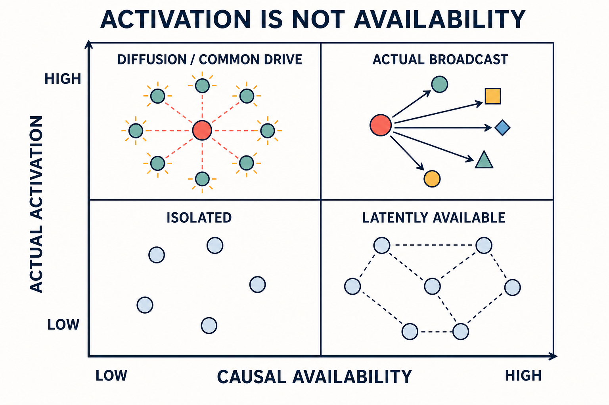
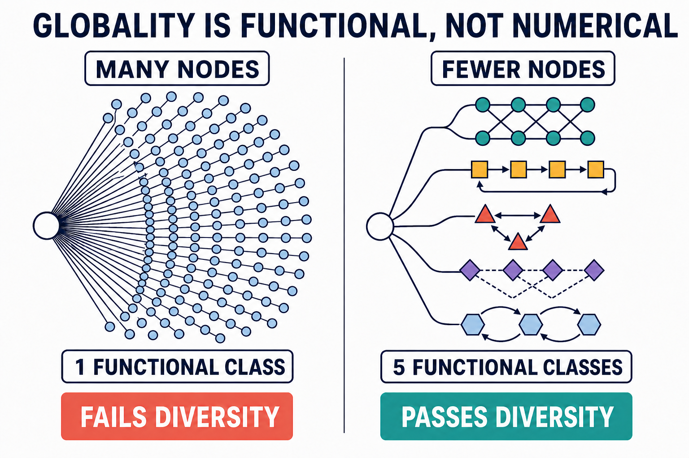
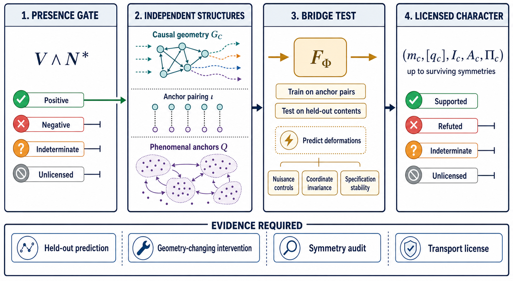

\newpage

# Contents

| Part or session | Focus | PDF page |
|---|---|---:|
| [Preface](#preface) | Purpose, instructor stance, notation, and use of the resource pack | 3 |
| [Part I. Course Architecture](#part-i) | Theory in one page, theory placement, outcomes, collaboration framework, format, and sequence | 5 |
| [Part II. Lecture Notes and Teaching Materials](#part-ii) | Fourteen complete graduate-seminar sessions | 17 |
| [Session 1](#session-1) | The explanandum and the theory landscape | 17 |
| [Session 2](#session-2) | The core biconditional and network-dynamics model | 22 |
| [Session 3](#session-3) | Where is the conscious subject? | 29 |
| [Session 4](#session-4) | Viability and integration: realization and unity | 36 |
| [Session 5](#session-5) | Consciousness without report: system-wide availability | 41 |
| [Session 6](#session-6) | Recurrent stability and temporal presence | 48 |
| [Session 7](#session-7) | What does the evidence license? | 53 |
| [Session 8](#session-8) | Does every conjunct earn its place? | 59 |
| [Session 9](#session-9) | From phenomenal presence to phenomenal character | 66 |
| [Session 10](#session-10) | Reading consciousness from the schematic | 72 |
| [Session 11](#session-11) | Biological and clinical applications | 77 |
| [Session 12](#session-12) | Nonhuman animals, organoids, and artificial systems | 82 |
| [Session 13](#session-13) | Differentiation, validation, and the strongest objections | 87 |
| [Session 14](#session-14) | Capstone adversarial research design | 93 |
| [Part III. Instructor Argument Bank](#part-iii) | Nine core arguments, collaborative argument clinics, validation program, and objection matrix | 98 |
| [Part IV. Reproducible Course Materials](#part-iv) | Instructor-ready assessment and collaboration resources | 104 |
| [Appendix A](#appendix-a) | Corpus-to-course concept coverage audit | 104 |
| [Appendix B](#appendix-b) | Problem sets, answer guides, rubrics, and collaborative assessment | 108 |
| [Appendix C](#appendix-c) | Capstone preregistration, staged peer review, and rubric | 114 |
| [Appendix D](#appendix-d) | Nine reusable instructor worksheets | 121 |
| [Appendix E](#appendix-e) | Six progressive-disclosure collaborative case packets | 130 |
| [Appendix F](#appendix-f) | Glossary and notation guardrails | 134 |
| [Appendix G](#appendix-g) | Primary corpus and selected contextual readings | 140 |
| [Appendix H](#appendix-h) | Session-ready synthetic materials, instructor keys, scaling, and accessible delivery alternatives | 143 |

\newpage

# Preface {#preface}

This manual is designed to help an instructor teach a new theory without either oversimplifying it or treating its central claims as already established. The Cø / N* research program proposes a precise candidate account of minimal phenomenal presence and then surrounds that core claim with methodological disciplines: generate and freeze candidate systems before inspecting consciousness outcomes, then determine the final theory-relative boundary on held-out role evidence; distinguish causal availability from report; separate scientific indeterminacy from invalid inference; audit every conjunct against simpler rivals; extend presence to phenomenal character only through an independently tested bridge; and explain what it would mean for the model to become structurally intelligible.

The intended audience is graduate students in philosophy of mind, consciousness science, cognitive neuroscience, complex systems, artificial intelligence, or philosophy of science. The register assumes intellectual maturity but not prior allegiance to a particular consciousness theory. Mathematical expressions are used to make commitments visible. Every formal claim should be translated into plain language, linked to a scientific purpose, and paired with a failure condition.

The manual supports a 14-session seminar. A nine-session core can use Sessions 1, 2, 3, 5, 7, 8, 9, 10, and 13 only if the viability and integration insert from Session 4 is moved into Session 2 and the recurrence insert from Session 6 is moved into Session 5. A four-session workshop requires the condensed schedule in Part I; merely assigning Sessions 3-6 or 9-14 as one meeting would not be a supported implementation. Each full session contains:

- learning objectives;
- instructor preparation;
- a timed teaching plan;
- lecture notes written for oral delivery;
- a board or display plan;
- a slide sequence;
- a fully specified collaborative exercise;
- a structured discussion protocol;
- common misconceptions and corrective responses;
- a short assessment or exit ticket; and
- assigned and optional readings.

The manual treats the seven papers as one research constellation rather than seven competing statements. The core paper supplies the central hypothesis. The companion papers specify the bearer, one difficult component, the evidence policy, the component audit, the character extension, and the model's explanatory form.

The expanded lecture notes are an instructor resource bank, not a script that must be read in full during one meeting. The timed plan identifies the material to emphasize in a 110-minute seminar. Worked examples can be assigned before class, moved to a discussion section, or used as replacement material when students need a slower formal explanation. Protect the collaborative block: it is where students demonstrate that they can apply the distinctions rather than merely recognize them.

Appendix H supplies the synthetic cards, profiles, matrices, result variants, and instructor keys required by the session exercises. It is deliberately separated from the conceptual exposition so that an instructor can release student-facing evidence progressively without exposing the key. Every synthetic value is pedagogical rather than an empirical estimate.

## Instructor stance

Teach the theory in the conditional and adversarial mood. Students should be able to state what the model claims, why each element is included, what would count for and against it, and where its present evidence is incomplete. A successful course does not produce automatic agreement with the theory. It produces readers capable of evaluating it fairly and designing studies that could genuinely change its status.

Use four recurring questions:

1. What is the explanandum?
2. What is the candidate bearer?
3. What evidence would license the inference?
4. What observation would force revision?

## Notation policy

The papers use both Cø and $C_0$ for minimal phenomenal presence. This manual uses **Cø** in prose and $C_0$ in formulas. The three components are written $N_1$, $N_2$, and $N_3$. The bundle is $N^*=N_1\land N_2\land N_3$. Viability is $V$. A positive classification is never treated as a direct observation of another subject's phenomenology; it is a licensed scientific attribution under a declared model and validity envelope.

The source corpus reuses a few letters in local contexts. This manual reserves $\mathsf V_G$ and $\mathsf E_G$ for graph vertices and edges so that $\mathcal V$ can denote a validity envelope and $E$ assessment evidence. Report $R$ and attention or task access $A$ belong to the core-model context; a removed component set $A$ belongs only to grouped ablation. The symbols $D,C,F,E$ denote decomposable semantics, compositional readout, fault localization, and evidential independence only inside the schematic-legibility criterion. Likewise, observational universe $\Omega$ differs from route robustness $\Omega_k$; preparation burden $\Gamma$ differs from diagnostic coverage $\Gamma_k$; and temporal character $\Pi_c$ differs from positive-specification support $\Pi_k^+$. State the prose label whenever a symbol changes namespace. Appendix F supplies the full crosswalk.

\newpage

# Part I. Course Architecture {#part-i}

## 1. The theory in one page

The target is **minimal phenomenal presence**: the fact that there is something it is like for a candidate system to undergo a state. The target does not require verbal report, explicit attention, intelligence, self-reflection, autobiographical memory, or metacognitive ownership.

The source corpus states the core profile conjecture as:

$$
H_{C_0}:\qquad
V(S;\mathcal R,\Delta)\land
\bigl(N_1(S,c)\land N_2(S,c)\land N_3(S,c)\bigr)
\Longleftrightarrow C_0(S,c;\mathcal R,\Delta).
$$

In plain language: for a candidate system $S$, content $c$, operating regime $\mathcal R$, and evaluation interval $\Delta$, the source identifies minimal phenomenal presence with joint viability, integration or synergy, report-independent system-wide availability, and recurrent stability. The displayed formula suppresses the boundary-selection step, which matters whenever a role-complete candidate contains a smaller role-complete candidate.

The components divide explanatory labor:

| Element | Role | Question answered | Characteristic false positive blocked |
|---|---|---|---|
| Test-referent qualification $S\in\mathcal P_\Theta$ | Bearer for component and biconditional tests | What stable causally admissible system is being tested? | A score calculated over a convenient or shifting node set |
| $V$ | Realized operation | Can the candidate sustain the relevant dynamics in this regime? | An inert diagram, failed preparation, or out-of-domain application |
| $N_1$ | Unity | Is the content irreducibly joint rather than an aggregate of independent events? | Coactivation, common drive, or a heap of local signals |
| $N_2$ | System-level availability | Can the content causally modulate functionally diverse recipients without report being required? | Passive diffusion, output behavior, or mere widespread activation |
| $N_3$ | Temporal presence | Is the content maintained through bounded recurrent dynamics? | An evanescent feedforward transient or pathological fixation |
| $C_0$ | Phenomenal presence | Is there something it is like for the candidate in this state? | Confusing presence with access, report, or character |

**Bearer-complete synthesis convention.** Reading the core, boundary, and ablation papers together exposes a necessary refinement. In the next equations, the predicates are underlying theoretical properties, not thresholded observations or database labels. First define the ontic bundle profile on every causally admissible referent $S\in\mathcal P_{\Theta,\mathrm{ont}}$:

$$
H_*^{\mathrm{ont}}(S,c)=V^{\mathrm{ont}}(S)\land N_1^{\mathrm{ont}}(S,c)\land N_2^{\mathrm{ont}}(S,c)\land N_3^{\mathrm{ont}}(S,c).
$$

Then define the ontic positive-bearer set for content $c$:

$$
\mathcal B_{\min,\Theta,\mathrm{ont}}^+(c)=
\operatorname{Min}_{\subseteq}
\{S\in\mathcal P_{\Theta,\mathrm{ont}}:H_*^{\mathrm{ont}}(S,c)=1\},
$$

The bearer-complete ontological hypothesis applies only where the bearer relation is resolved - a unique minimum or a plurality that clears the declared separability criterion:

$$
\operatorname{Resolved}_B(c;\Theta)
\Rightarrow
\left[
C_0(S,c;\Theta)
\Longleftrightarrow
S\in\mathcal B_{\min,\Theta,\mathrm{ont}}^+(c)
\right].
$$

Evidence yields estimates $\widehat H_*$, $\widehat{\mathcal P}_\Theta$, and $\widehat{\mathcal B}_{\min,\Theta}^+$ plus positive, negative, indeterminate, or unlicensed statuses. Candidate reliability, $R_B$ stability, mappings, uncertainty, and separability license those estimates; they do not define the ontic target. If plural minima fail separability, the current program withholds subject attribution rather than deleting, merging, or selecting candidates by fiat. Failure to establish a pass never by itself becomes ontic nonmembership. A negative model prediction requires a licensed decisive component failure or a decisive minimality result on a resolved bearer domain. An indeterminate or unlicensed component or boundary leaves attribution unresolved.

A licensed decisive failure of $V$ or one $N_i$ on a stable $\widehat{\mathcal P}_\Theta$ referent supports a negative bundle profile and blocks estimated positive-bearer membership; it does not retroactively erase the referent. Conversely, an estimated all-pass profile is not yet a positive subject attribution if a qualifying proper subsystem removes $S$ under inclusion-minimality. The larger system may contain a positive bearer without itself being that bearer. Requiring positive-bearer membership before permitting a negative or single-failure audit would be circular, while attributing $C_0$ to every all-pass member of $\mathcal P_\Theta$ would violate minimality. This bearer-complete formulation is therefore a synthesis convention and a needed amendment where the source papers otherwise pull in different directions. Later equations suppress the "ont" tag for readability; an unhatted $\mathcal B_{\min,\Theta}^+$ denotes the resolved minimal ontic bearer relation, while a hatted symbol denotes its evidence-relative estimate.

Because $\mathcal B_{\min,\Theta}^+(c)$ is content-indexed, it first selects a bearer for a content or episode; it does not silently settle co-consciousness or diachronic subject identity. $C_0(S,c_i)$ and $C_0(S,c_j)$ support one subject across contents only when the same mapped minimal bearer persists or a preregistered joint-content rule passes. A study whose target is an episode-wide bearer should instead declare a content family $\mathcal C$ and an aggregation rule before defining $\mathcal B^+(\mathcal C,\Delta)$. This guardrail prevents simultaneous contents from fragmenting or merging subjects merely because they were analyzed one at a time.

The bearer-complete biconditional is intentionally risky. Its sufficiency direction is challenged when a candidate survives every positive-bearer rule while strong independent evidence counts against phenomenal presence:

$$
\operatorname{Resolved}_B(c;\Theta)
\land S\in\mathcal B_{\min,\Theta}^+(c)
\land\neg C_0(S,c;\Theta).
$$

Its necessity direction is challenged by a well-supported case of $C_0(S,c)$ in which $S$ does not enter the positive-bearer set when $\Theta$, the $\mathcal P_\Theta$ candidate lattice, grain, regime, and time window are frozen and the bearer output is recomputed. A licensed component failure is one route to that nonmembership:

$$
C_0(S,c;\Theta)
\land\operatorname{Resolved}_B(c;\Theta)
\land S\notin\mathcal B_{\min,\Theta}^+(c).
$$

The research program adds six disciplines around this hypothesis:

1. **Boundary first:** use consciousness-independent discovery evidence to propose and freeze a stable causally admissible test-referent family; evaluate every referent's bundle profile on held-out evidence; then apply inclusion-minimality, separability, and stability to the all-pass set before any positive subject attribution. Candidate identity is upstream; positive-bearer status remains explicitly theory-relative.
2. **Availability without report:** define $N_2$ through content-specific causal reach across functionally distinct recipients, not through speech, button presses, diffusion, or node count.
3. **Four evidential outcomes:** distinguish positive, negative, indeterminate, and unlicensed results.
4. **Component audit:** require every conjunct to outperform a leave-one-out rival on cases where the models actually disagree, using independent held-out anchors.
5. **Character extension:** after a positive presence gate, test a bridge from content-specific causal-trajectory geometry to independently anchored phenomenal relations.
6. **Schematic legibility:** make the theory's role structure compositional, counterfactual, fault-localizing, and teachable without confusing intelligibility with proof.

## 2. Placement in the consciousness-theory landscape

The most accurate one-line classification is:

> Cø / N* is a physicalist, information-dynamical, functional network theory of minimal phenomenal presence, cross-listed with neurobiological workspace and recurrent-processing approaches.

In the Closer To Truth taxonomy supplied with the project, its primary home is **Materialism / Computational & Functionalism**, with a strong secondary placement under **Information** and cross-references to **Materialism / Neurobiological** and **Materialism / First-Order**. Its integration requirement creates a weak adjacency to dynamical and electromagnetic approaches, but the model does not identify consciousness with synchrony or a field.

| Theory family | What Cø / N* accepts | What it rejects or tests | Relation to the model |
|---|---|---|---|
| Integrated Information Theory (IIT) | Unity, irreducible joint structure, and the need to specify a causal complex | The present program does not treat integration as sufficient or use a theory-specific consciousness quantity as its independent candidate-generation rule | $N_1$ inherits the integration pressure but is only one conjunct; exact contrasts depend on the IIT version and measure |
| Global Workspace / Global Neuronal Workspace (GWT/GNWT) | Broad availability to diverse processors | The model tests rather than assumes whether availability requires report-capable or executive recipients, a fixed anatomical locus, or one observed ignition signature | $N_2$ isolates availability as a report- and executive-independent causal role; overlap and divergence are version-specific |
| Recurrent Processing Theory (RPT) | Feedback and temporal stabilization | Versions that treat local recurrence by itself as sufficient | $N_3$ makes recurrence necessary but joins it to unity and availability |
| Predictive Processing / Free Energy | Hierarchical inference, precision, and self-organizing dynamics as possible implementations | Inference or error minimization as identical to consciousness | A potential implementation language for all three components |
| Higher-Order and Metacognitive theories | Self-representation can enrich consciousness and support report | A higher-order representation as necessary for minimal $C_0$ | Placed at enriched consciousness $C_1$, not the minimal gate |
| Attention Schema and self-model theories | Internal models can shape control, availability, and self-attribution | A self-model as an unstated minimal conjunct | Optional contributor to $N_2$ or $C_1$ unless evidence requires more |
| Quality-space theories | Phenomenal character has relational similarity structure | Treating structured representation as sufficient for presence | Supplies the target structure for the character extension |
| Representational geometry and neural manifolds | Population relations, trajectories, topology, and transitions can be compared | Renaming any latent geometry as qualia | Supplies methods for estimating $G_c$, subject to causal and phenomenal validation |
| Embodied, affective, enactive, and evolutionary views | Organismic regulation, interoception, action, value, and learning can matter | Assuming in advance that all embodiment is either constitutive or irrelevant | These factors may enter $V$, the system boundary, content dynamics, or a future conjunct |
| C-test and theory-derived indicator approaches | Nonreporting systems require validated, multi-source tests | One marker, one behavior, or one theory-conditional indicator as a universal verdict | The full program is a candidate C-test architecture |
| Illusionism | Reports and self-ascriptions require a functional explanation | Replacing the phenomenal target with the disposition to claim phenomenality | Cø / N* remains realist about minimal phenomenal presence |
| Panpsychism, fundamentalism, and universalism | Substrate independence is a live possibility | Consciousness from mere existence, complexity, or abstract isomorphism | Requires causal realization, correct grain, effective coupling, and viability |
| Biological autonomy and individuality | Self-maintaining organization can help individuate a causal bearer | Autonomy as sufficient for consciousness | Supplies a theory-independent candidate-generation discipline |
| Markov blanket / active-inference approaches | Conditional-independence structure can nominate candidate boundaries | A statistical blanket as proof of a subject | Useful proposal method followed by intervention and role tests |
| Extended-mind and group-mind approaches | The skull is not an a priori causal boundary | Any reliable coupling, tool, or communication channel as part of one subject | Requires constitutive contribution, autonomy, minimality, and separability |
| Electromagnetic or synchrony theories | Temporally coordinated distributed dynamics may help realize $N_1$ or $N_3$ | A field, frequency band, or synchrony relation as the identity condition | Weak implementation adjacency only |
| Dualism, idealism, quantum, and anomalous theories | No core commitment is borrowed | Nonphysical substances, consciousness as fundamental reality, quantum collapse, or anomalous access | Outside the model's intended taxonomy |

The principal anchors for this teaching placement are Albantakis et al. (2023) for IIT 4.0, Mashour et al. (2020) for GNWT, Lamme (2006) for recurrent processing, Fleming and Shea (2024) for quality-space computation, Friston et al. (2021) for Markov-blanket approaches, Butlin et al. (2023) and Bayne et al. (2024) for theory-derived consciousness indicators, and the landscape reviews by Seth and Bayne (2022), Storm et al. (2024), and Mudrik et al. (2025). The table is a target-and-pressure map, not a substitute for those sources. Before an adversarial comparison, freeze an exact dated version and attach a supporting section or page citation.

The most important teaching point is that Cø / N* is a **mid-level bridge theory**. It is not a metaphysical solution to why experience exists, not a theory of report, not a complete model of self-consciousness, and not initially a full theory of phenomenal character. It proposes a causal-dynamical identity for minimal phenomenal presence and a disciplined research program for testing and extending that identity.

## 3. Course-level learning outcomes

By the end of the course, students should be able to:

1. distinguish phenomenal presence, access, report, self-consciousness, sentience, wakefulness, and phenomenal character;
2. reconstruct the Cø / N* biconditional and explain both directions of empirical risk;
3. explain the distinct roles of boundary qualification, viability, integration, availability, and recurrence;
4. situate the theory among major scientific and philosophical approaches without reducing it to a collage of IIT, GNWT, and RPT;
5. apply the boundary-first, four-outcome, and surrogate-conflict rules to difficult cases;
6. distinguish correlation, criterion ablation, mechanism ablation, and measurement ablation;
7. use the diagnostic-set theorem to determine whether a study can identify component necessity;
8. explain the two-layer architecture for phenomenal presence and phenomenal character;
9. formulate the strongest objections to the theory and identify which are conceptual, empirical, or metaphysical;
10. design an adversarial, preregisterable study whose result could support, revise, or refute part of the program;
11. collaborate in versioned model reconstruction, adversarial criticism, dissent-preserving revision, and auditable synthesis; and
12. separate scientific classification from clinical, ethical, or precautionary action while explaining how values and asymmetric losses affect decisions.

## 4. Suggested course format and assessment

**Recommended meeting:** one 110-minute seminar per week for 14 weeks.

**Prerequisites:** one prior course in philosophy of mind, cognitive neuroscience, philosophy of science, complex systems, or machine learning. No advanced mathematics is required, but students should be willing to interpret formal notation and causal diagrams.

**Assessment scheme:**

| Item | Weight | Purpose |
|---|---:|---|
| Weekly analytic memos | 15% | Translate one formal claim, identify its hidden assumption, and name a falsifier |
| Theory-comparison brief | 15% | Compare Cø / N* with one neighboring theory at the level of target, mechanism, evidence, and prediction |
| Collaborative case portfolio | 15% | Revise four group artifacts with individual addenda, dissent records, and instructor feedback |
| Boundary and classification practicum | 10% | Apply the boundary-first and four-outcome protocols to a new case |
| Adversarial ablation critique | 20% | Determine whether a proposed study genuinely tests a conjunct |
| Capstone preregistration and oral defense | 25% | Design and defend a falsifiable study or conceptual audit |

**Seminar norm:** every positive claim must name its scope; every negative claim must state its negative-license conditions; every comparison must distinguish different explananda; and every proposed test must identify the case on which rival models disagree.

### Assessment deployment specifications

The following is a recommended adoption-ready specification. Instructors may change lengths or due dates, but should preserve the distinction between individual and shared evidence of learning. The problem sets in Appendix B are formative by default and do not add a seventh weighted category.

| Assessment | Submission specification | Schedule and permitted collaboration | Feedback and revision rule |
|---|---|---|---|
| Weekly analytic memos | Ten individual memos of 500-700 words; each reconstructs one claim, identifies an auxiliary assumption, and states a licensed falsifier | One after each of Sessions 1-10; discussion is allowed, but prose and final argument are individual; score the best eight | Use the analytic-writing rubric; return one misconception code and one next-step prompt; one memo may be revised after feedback |
| Theory-comparison brief | Individual 1,500-2,000-word matched-target comparison using the exact Cø / N* claim and one dated, source-cited rival version | Proposal after Session 4; final after Session 6; peer source-checking is allowed | Require a version card, one agreement case, one diagnostic disagreement, and symmetric revision rules; one focused revision is permitted |
| Collaborative case portfolio | Four shared artifacts plus a 250-350-word individual addendum for each; at least one artifact must address character or schematic legibility | Select artifacts from Sessions 3, 5, 7, and one of 9, 10, 12, or 13; revise two after cross-team review | Grade 60% shared scientific product, 25% individual accountability, and 15% documented collaborative process using Appendix B |
| Boundary and classification practicum | Individual 75-minute analysis of a previously unseen synthetic case using Worksheets 1 and 3 | Administer after Session 7; no collaboration during the practicum | Return a row-level disposition showing the first invalid or indeterminate inference; allow a short correction memo for partial recovery |
| Adversarial ablation critique | Individual 2,000-2,500-word critique of a published or supplied study proposal, including diagnostic coverage, independence, selectivity, and a repaired design | Source selected by Session 7; peer red-team review after Session 8; final after Session 10 | Grade the original diagnosis and the quality of the repair; require a response-to-review log |
| Capstone preregistration and defense | Team protocol of 3,500-5,000 words or equivalent registered-report format, plus individual defense and collaboration record | Individual seed after Session 7; provisional teams after Session 8; track selection after Session 9; staged reviews through Session 14 | Use the track rules and rubric in Appendix C; publish question domains, permit preparation time and a short written supplement, and assess individual as well as team mastery |

### Constructive-alignment map

| Course outcome | Principal instruction and practice | Direct assessment evidence | Minimum satisfactory evidence |
|---:|---|---|---|
| 1 | Sessions 1, 7, and 9; target sorting | Memo; Problem Set 1; practicum | Keeps presence, access, report, wakefulness, and character distinct throughout one case |
| 2 | Session 2; component-matrix jigsaw | Memo; Problem Set 1; capstone | States both biconditional directions and a licensed threat to each |
| 3 | Sessions 3-6; boundary and single-failure laboratories | Practicum; case portfolio | Applies boundary, viability, and all three components to the same candidate, content, regime, grain, and interval |
| 4 | Sessions 1 and 13; versioned rival-prediction laboratory | Theory-comparison brief | Compares exact versions at a matched explanandum and identifies a genuine disagreement case |
| 5 | Sessions 3 and 7; boundary hearing and evidence tribunal | Practicum; portfolio | Applies precedence correctly and never turns boundary failure into a negative consciousness result |
| 6 | Session 8; ablation laboratory | Ablation critique | Distinguishes criterion, mechanism, and measurement ablation and limits each conclusion accordingly |
| 7 | Session 8; diagnostic-set analysis | Problem Set 2; ablation critique | Locates the disagreement region, estimates coverage, and identifies prohibited dual use |
| 8 | Session 9; bridge construction and break test | Required portfolio artifact or capstone track | Preserves the presence gate and distinguishes baseline fit from held-out causal deformation |
| 9 | Sessions 10 and 13; identity tribunal and argument clinic | Memo; comparison brief; oral defense | Steelmans the objection, gives the best reply, and records the residual empirical or metaphysical pressure |
| 10 | Session 14; adversarial preregistration studio | Capstone | Freezes target, rivals, licenses, outcomes, and revisions before the decisive result |
| 11 | Every collaborative block; rotating roles and disposition logs | Portfolio and capstone collaboration record | Makes an identifiable contribution, improves a rival, responds to criticism, and preserves material dissent |
| 12 | Sessions 7, 11, and 12; loss-sensitive decision exercises | Practicum, portfolio, or capstone action note | Holds the scientific result fixed while deriving action from explicit stakes, losses, and reversibility |

### Timing, scale, and technical readiness

Each 110-minute plan is a ceiling on elapsed time. Apply this course-wide clock unless a session explicitly replaces it: **minutes 55-60 are a protected break**, and the **five minutes immediately before the exit-ticket block are protected contingency**. The teaching move whose printed span contains either reserve is shortened by that amount; no new content is introduced during a reserve. Omit the Appendix H extension first, then move the final plenary comparison to homework if another five minutes are needed. Never take time from private commitment, group revision, the break, or the exit ticket. The four-session workshop table already places its own break, so its printed clock supersedes this rule. If discussion is unusually productive, preserve the durable artifact and move plenary synthesis to the next session's opening retrieval exercise.

For classes above twenty-four, run duplicate parallel panels and sample one artifact from each panel for plenary comparison. For seminars below eight, assign one case per pair, combine role responsibilities, and use the instructor or a rotating student as the external rival. In Session 14, use parallel panels, a poster defense, or a recorded five-minute presentation with scheduled questioning; one twenty-four-minute plenary defense block is suitable only for a very small seminar.

Before Session 2, use the quantitative on-ramp in Appendix F as a low-stakes diagnostic. Students need qualitative command of conjunctions, causal graphs, intervals, equivalence, held-out testing, and relational invariance. Calculation beyond the supplied formula sheet is an extension unless the course has an explicit quantitative prerequisite. Pair philosophical, empirical, and computational expertise without making one student the permanent translator.

Treat each session's **Required** list as the must-read ceiling, normally 60-75 minutes for a heterogeneous graduate cohort. When a list spans several papers, distribute it by jigsaw exactly as specified rather than requiring every student to read every section. **Recommended** readings are should-read or reference material unless the instructor replaces part of the primary corpus with them. Begin each class by answering the reading question printed in that session. Philosophy students may use the causal and interval primers; empirical students may use the logic and argument-map primers; computational students may use the phenomenology and measurement-validity primers.

**Supported four-meeting workshop:**

| Meeting | 110-minute core sequence | Material moved to prework or reference |
|---|---|---|
| 1. Target and hypothesis | 0-20 target ladder; 20-40 biconditional; 40-45 break; 45-70 $V,N_1,N_2,N_3$ division of labor; 70-95 component matrix; 95-105 sharp-law discussion; 105-110 exit | Full landscape table and extended worked cases |
| 2. Bearer and components | 0-20 boundary sequence; 20-35 $V/N_1$; 35-50 refined $N_2$; 50-55 break; 55-70 $N_3$; 70-98 single-failure jigsaw; 98-105 debrief; 105-110 exit | Detailed clinical and substrate cases |
| 3. Evidence and necessity | 0-25 four outcomes; 25-45 diagnostic-set theorem and firewall; 45-50 break; 50-78 evidence tribunal; 78-98 ablation audit; 98-105 debrief; 105-110 exit | Full assessment bank and grouped-ablation extensions |
| 4. Character, explanation, and differentiation | 0-20 character bridge; 20-35 schematic legibility; 35-40 break; 40-60 exact rival versions; 60-88 prediction laboratory; 88-100 adversarial-design sketch; 100-105 commitments; 105-110 exit | Capstone, biological applications, and transport dossiers |

The workshop is an orientation, not a substitute for the capstone course. Use the corresponding **core** cards in Appendix H and give participants the omitted case packets as follow-up resources.

## 5. Collaborative learning architecture

Collaboration in this course is part of the epistemology, not a break from it. Consciousness research is unusually vulnerable to hidden shifts in target, bearer, measurement, and evidential standard. A well-designed group task makes those shifts visible because students must coordinate distinct forms of expertise and produce one auditable conclusion. Every collaborative exercise should therefore end in a durable artifact: a classification ledger, boundary map, intervention design, argument diagram, comparison grid, or preregistration revision.

### Stable teams and rotating roles

Use teams of four whenever enrollment permits. Keep teams stable for two or three sessions so that students learn one another's reasoning styles, then reshuffle them to prevent fixed intellectual camps. Assign roles before students receive the case. Rotate the roles every week.

| Role | Responsibility during the task | Question the role must answer |
|---|---|---|
| Model reconstructer | States the target, variables, logical form, and scope without advocacy | What exactly is the claim under evaluation? |
| Method and validity auditor | Tracks operationalization, confounds, boundary, uncertainty, and transport | Does the proposed evidence bear on the stated claim? |
| Adversarial rival | Develops the strongest live alternative or counterexample | What else could explain this result, and where do predictions diverge? |
| Synthesis reporter | Maintains the shared record, marks dissent, and presents the revised conclusion | What can the group jointly license, and what remains unresolved? |

For teams of five, add a **process observer** who records target drift, unearned inference, suppressed disagreement, and uneven participation. For teams of three, combine model reconstruction with reporting. No student should occupy the adversarial role for the entire course; criticism and constructive synthesis are both learned practices.

### The collaboration cycle

Most exercises use a six-stage cycle:

1. **Private commitment, 2-4 minutes.** Each student records an initial classification or argument before discussion. This prevents rapid consensus from erasing genuine disagreement.
2. **Model reconstruction, 3-5 minutes.** The team agrees on the exact explanandum, candidate bearer, variables, and rival claims.
3. **Distributed analysis, 8-15 minutes.** Role-holders complete separate portions of the common worksheet.
4. **Adversarial exchange, 5-10 minutes.** The rival challenges the inference; the auditor identifies licensing conditions; the reconstructer may clarify but may not redefine the target to escape criticism.
5. **Revision with dissent, 4-8 minutes.** The group produces one conclusion, one residual uncertainty, and, where necessary, a signed minority note.
6. **Public debrief, 8-15 minutes.** Groups compare not only answers but the assumptions that generated different answers.

Do not grade students for reaching the theory-friendly conclusion. Grade them for accuracy, validity discipline, rival quality, revision under criticism, and the explicit separation of scientific status from practical action.

### Reusable discussion formats

| Format | Best use | Procedure | Required output |
|---|---|---|---|
| Think-pair-specify | Clarifying a formal or conceptual distinction | Private answer, paired comparison, then one jointly specified claim and falsifier | Two-sentence claim plus failure condition |
| Structured academic controversy | Questions with serious arguments on both sides | Pairs defend assigned positions, switch sides, then write a synthesis neither side could have written initially | Agreement, strongest dissent, decisive evidence |
| Jigsaw | Multi-component models | Home-team members become temporary experts on different components, meet expert peers, then teach their home team | Completed component matrix with dependencies |
| Evidence tribunal | Positive, negative, indeterminate, and unlicensed decisions | Advocates argue competing outcomes before a licensing panel | Verdict, cause profile, and next study |
| Fishbowl | Conceptual issues that benefit from listening and revision | Inner circle discusses; outer circle tracks assumptions and inferential moves; circles switch | Assumption ledger and revised positions |
| Gallery walk | Comparing designs or schematics | Teams post a one-page artifact; peers attach one validity challenge and one constructive improvement | Revised artifact with response log |
| Case conference | Clinical, animal, organoid, or AI assessment | Disciplinary roles submit evidence to a chair who must separate science from action | Scientific tuple, action note, dissent record |
| Red-team / blue-team review | Preregistration and falsification | One team proposes; another identifies circularity, hidden flexibility, and an omitted outcome; proponents revise | Before-and-after design plus change log |

### Discussion quality and psychological safety

Require students to criticize a claim at its strongest plausible interpretation. A student may request a **target check** whenever the conversation shifts among phenomenal presence, access, report, character, wakefulness, or moral status. A student may request a **license check** whenever a group moves from a weak or invalid indicator to a strong conclusion. These interventions pause the discussion for sixty seconds while the synthesis reporter restates the inference.

Because the course includes disorders of consciousness, animal welfare, and possible artificial consciousness, remind students that intellectual disagreement need not imply indifference to affected beings. Scientific classification and practical precaution are separated analytically so that both can be discussed more responsibly. Students may analyze a sensitive clinical case through a written role rather than personal disclosure.

### Accessible and flexible participation

Provide every card, envelope, matrix, figure, and role sheet in accessible digital text at the same time as the physical version. Use staged file permissions or numbered LMS releases to preserve progressive disclosure. Never encode status by color alone: pair color with a label, line pattern, symbol, or position. Read equations aloud in plain language, provide editable tables rather than image-only data, caption audiovisual material, and supplement each figure with a description of the inferential relationship it is intended to show.

Movement-based voting and "positions around the room" always have a seated or digital equivalent. A student may make the private commitment through text, speech, or an accessible form; report through a spokesperson, shared document, or brief recording; and supplement a sampled oral defense with a short written response. Publish oral-defense question domains and allow quiet preparation time before answering. Assess the quality of the reasoning, not speed, eye contact, handwriting, mobility, or spontaneous public performance.

Stable-team reshuffling is the default, not an inflexible rule. Preserve a team or role when an accommodation, communication access, anxiety, sensory processing, or accessibility technology makes continuity materially important. In remote delivery, use captioned breakout rooms, one versioned shared worksheet per team, private precommitment forms, and a visible release schedule. The resource pack gives a nonverbal or asynchronous alternative for every session and explicit role combinations for three-, four-, and five-person teams.

### Individual accountability within group work

At the end of each major exercise, collect three items:

1. the team's shared artifact;
2. a sixty-second individual addendum stating one point the student would preserve and one point they would revise; and
3. a role rotation record.

For graded collaborations, a useful allocation is 60% shared artifact, 25% individual addendum, and 15% documented contribution to the team's reasoning. Peer ratings should be diagnostic rather than popularity-based: preparation, epistemic contribution, responsiveness to criticism, and equitable participation.

### Instructor debrief protocol

The instructor should resist announcing the "correct" answer immediately. First compare groups along four axes:

- Did they hold the target fixed?
- Did they evaluate the same candidate system and time window?
- Did they separate measurement failure from theory failure?
- Did they name evidence that would change their conclusion?

Then model a calibrated verdict. Use phrases such as **supported under the declared assumptions**, **negative prediction rather than observed absence**, **indeterminate because the valid interval straddles**, and **unlicensed until the boundary or transport bridge is repaired**. End every debrief by identifying the smallest next observation that would reduce the most important disagreement.

## 6. The 14-session sequence

| Session | Central question | Main paper contribution |
|---|---|---|
| 1. The explanandum and landscape | What exactly is the theory trying to explain? | Core scope and theory placement |
| 2. The core biconditional | How does the source profile formula become a bearer-complete $C_0$ claim? | Core model, boundary refinement, logic, temporal grain, falsifiers |
| 3. Where is the subject? | Which system is the bearer of the proposed state? | Boundary-first criterion |
| 4. Viability and integration | What makes the organization real and unified? | $V$ and $N_1$ |
| 5. Availability without report | What does system-wide availability actually require? | Full $N_2$ operationalization |
| 6. Recurrent stability | Why must a present content persist through feedback? | $N_3$ and temporal presence |
| 7. What does the evidence license? | When are positive, negative, indeterminate, and unlicensed warranted? | Four-outcome framework |
| 8. Does every conjunct earn its place? | How can necessity be audited without a consciousness oracle? | Diagnostic theorem and firewall |
| 9. From presence to character | How can the model explain what an experience is like? | Dynamical-geometry bridge |
| 10. Reading consciousness from the schematic | What would make the identity structurally intelligible? | Schematic legibility |
| 11. Biological and clinical cases | How does the framework classify variable human states? | Sleep, anesthesia, rivalry, brain injury, split systems |
| 12. Animals, organoids, and artificial systems | How far can the model transport? | Substrate discipline and welfare-relevant indeterminacy |
| 13. Differentiation and validation | Why this theory rather than its neighbors or simpler rivals? | Comparative arguments and empirical program |
| 14. Capstone research design | What study would genuinely change our view? | Synthesis and adversarial preregistration |

\newpage

# Part II. Lecture Notes and Teaching Materials {#part-ii}

## Session 1. The Explanandum and the Theory Landscape {#session-1}

### Learning objectives

Students should be able to distinguish at least six consciousness targets, explain why apparent theory conflict can result from target mismatch, and place Cø / N* in the contemporary landscape without treating it as a simple average of other theories.

### Instructor preparation

Assign the abstract and Sections 1-3 and 15 of *Cø as N\*: A Minimal Network-Dynamics Model of Phenomenal Consciousness*. Ask students to bring one sentence stating what they previously thought a theory of consciousness must explain.

### Timed plan

| Time | Teaching move |
|---:|---|
| 0-8 min | Opening poll: What is the target of a consciousness theory? |
| 8-28 min | Lecture: the target ladder and category errors |
| 28-44 min | Theory-family map and matched-target comparison |
| 44-68 min | Collaborative target-sorting and inference-control exercise |
| 68-82 min | Worked examples and the mid-level bargain |
| 82-104 min | Structured academic controversy: Is the target too thin? |
| 104-110 min | Exit ticket and preview of the biconditional |

### Lecture notes

Begin with the claim that consciousness science does not have one uncontested explanandum. The word *consciousness* can refer to wakefulness, phenomenal presence, conscious access, reportability, self-awareness, a particular conscious content, sentience, or the detailed character of an experience. Theories may disagree because they answer different questions.

Introduce a target ladder:

1. **Arousal or wakefulness:** whether the organism occupies a globally responsive state.
2. **Phenomenal presence, $C_0$:** whether there is anything it is like for the candidate at all.
3. **Content presence:** whether a particular content is phenomenally present.
4. **Access and report:** whether a content can guide reasoning, deliberate control, memory, or overt response.
5. **Reflective consciousness, $C_1$:** whether the system represents or owns its own state.
6. **Phenomenal character:** what the admitted experience is like and how its qualities are related.

Stress that the ordering is conceptual rather than a proven biological hierarchy. The purpose is to prevent an explanation at one level from being credited or criticized as an explanation at another. A theory of report can be excellent and still fail as a theory of minimal phenomenal presence. A theory of presence can be valuable and still be incomplete as a theory of pain, color, ownership, or selfhood.

Cø / N* fixes its initial target at level 2: minimal phenomenal presence. This is what allows it to treat report, attention, metacognition, and intelligence as evidence or enrichment rather than as constituents. The move creates a burden: if minimal presence is defined too thinly, critics may say that the theory evades the most interesting features of consciousness. The proper response is not that richer features do not matter. It is that distinct explananda should be modeled in distinct layers and connected explicitly.

**Resolution convention.** In formal applications, $C_0(S,c;\Theta)$ is token- or content-indexed: it concerns phenomenal presence of the specified content-bearing state. A broader claim that $S$ has any phenomenal episode during $\Delta$ requires explicit quantification over a preregistered content or state family. A positive result for one $c$ does not establish continuous or globally rich experience; a negative result for one $c$ does not establish that no other content is present. Thus the theory's general explanandum is minimal phenomenal presence, while an experimental verdict is normally local to a specified token or content-bearing state.

Now situate the main theory families by the pressure they place on an adequate account:

- IIT says unity and intrinsic causal structure matter.
- GNWT says a conscious content must have system-wide availability.
- RPT says feedback and recurrent stabilization matter.
- Higher-order theories say awareness of a state requires representation of that state.
- Predictive approaches say conscious states occur in hierarchical, precision-weighted inference.
- Quality-space and structural approaches say phenomenal character is organized relationally.
- Embodied and affective approaches say regulation, action, bodily state, and value cannot be ignored.
- Illusionism says the scientifically tractable target may be why systems judge themselves to have phenomenality.
- Panpsychist and fundamentalist approaches shift the question from which organization generates consciousness to how a fundamental consciousness property is structured or combined.

Cø / N* does not claim that all of these are equally right. It accepts three mechanistic pressures and turns them into one exposed conjunction. It then assigns other pressures to neighboring layers: metacognition to $C_1$, quality structure to $Q_\Phi$, organismic support provisionally to $V$ and boundary selection, and metaphysical explanation to an open question.

Explain the taxonomy placement. The theory is physicalist because it proposes a causally realized network-dynamical identity. It is functional because the conditions are defined by roles that can in principle have multiple realizations. It is information-dynamical because irreducible joint structure and time-dependent causal organization are central. It is not unrestricted functionalism: a lookup table, behavioral duplicate, or static graph does not pass. Effective coupling, correct temporal grain, operating regime, and substrate-appropriate viability are required.

End with the theory's division of labor. The boundary paper asks *which system*. The core model asks *whether presence*. The availability paper defines one gate. The indeterminacy paper governs *what the evidence licenses*. The ablation paper asks *whether every gate is needed*. The character paper asks *what the present experience is like*. The schematic paper asks *what would make the identity intellectually readable*.

### Worked teaching sequence: the same observation under different targets

Students often understand the target ladder abstractly but collapse it as soon as a vivid case appears. Work through the following examples slowly. For each, write the observation first and prohibit use of the word *conscious* until the bridge premise is explicit.

| Observation | Directly supports | Additional bridge needed for $C_0$ | Rival interpretation to keep live |
|---|---|---|---|
| A behaviorally unresponsive patient follows commands by modulating imagery-related activity | Comprehension, task maintenance, volitional imagery, and covert command following in the tested runs | The capacities are present only if there is phenomenal presence, or the full $V\land N^*$ profile and resolved minimal positive-bearer membership are independently supported | The task could be performed by nonphenomenal control; false positives or sensory misunderstanding must be assessed |
| A stimulus category is decoded from early visual activity without report | Content-specific neural information is present in the measured population | The decoded representation participates in the organization claimed to constitute presence | Unconscious representations can be decodable; the signal may reflect feedforward registration only |
| A fluent AI says that it has a rich inner life and accurately discusses consciousness theory | Linguistic competence, self-description, context use, and perhaps a functional self-model | The running candidate has a qualified boundary, viability, integration, causal availability, recurrence, and a licensed transport bridge | Training-data imitation, policy optimization, or an external orchestration loop may explain the behavior |

The exercise exposes three different mistakes. The first treats a demanding capacity as a direct observation of phenomenality. The second treats readable information as phenomenally present information. The third treats a system's semantic claim as privileged evidence about its causal realization. None of this makes the observations irrelevant. It specifies the inferential work still required.

### The mid-level bargain

Explain the methodological bargain explicitly. A mid-level theory gives up the ambition to derive why anything exists phenomenally from nonphenomenal premises. In exchange, it offers a public constitutive hypothesis precise enough to compare candidates, design interventions, and state failure conditions. It also brackets the detailed character of admitted experiences until a second bridge is tested. This is productive only if the minimal target supports stable measurement and informative prediction. If every putative $C_0$ case can be redescribed only by importing character, ownership, or report into the evidence, the target may be too thin to function independently. That would be a problem for the research strategy, not merely a request for one more module.

### Display plan

Write three columns:

| Target | Typical evidence | Common mistake |
|---|---|---|
| Presence | report, no-report markers, causal dynamics | equating evidence with the target |
| Access / report | task use, memory, decision, output | treating access as presence by definition |
| Character | similarity, discrimination, deformation | assuming presence already explains quality |

Finish with the one-line label: **physicalist + information-dynamical + functional + mid-level bridge theory**.

### Slide sequence

1. One word, many targets
2. The target ladder
3. $C_0\neq R$, $C_0\neq A$, $C_0\neq C_1$
4. IIT: unity pressure
5. GNWT: availability pressure
6. RPT: temporal pressure
7. Other theories as implementation, enrichment, rival target, or metaphysics
8. The Cø / N* taxonomy position
9. Seven papers, seven jobs
10. The course's recurring four questions

### Collaborative exercise: Target sorting and inference control

**Purpose.** Students learn that one observation can be relevant to several consciousness questions without directly answering all of them. The task separates the evidential target from the conclusion a researcher may wish to draw.

**Setup.** Give every team the six core claims on separate cards: "The patient can follow a command in motor imagery"; "The stimulus identity can be decoded from V1"; "The subject says that the pain is unpleasant"; "A recurrent loop persists for 250 ms"; "The model represents its own uncertainty"; and "The system is awake but behaviorally unresponsive." Keep Appendix H Cards 7-8 and one blank mixed-target card as extension material; they do not belong in the core twenty-four-minute block.

**Roles and procedure.** The model reconstructer lays out six columns: wakefulness, $C_0$, content presence, access, $C_1$, and phenomenal character. The validity auditor places each card first under the target to which it bears most directly and lists its auxiliary demands. The adversarial rival moves one card to the strongest alternative interpretation and explains the possible confound. The reporter then records the strongest licensed conclusion and one illicit stronger inference for every card. After twelve minutes, pair teams and ask them to challenge two placements without merely appealing to intuition.

**Deliverable.** Each team submits a six-row core target-evidence-inference grid containing: direct target, possible relevance to $C_0$, auxiliary capacities, alternative explanation, strongest licensed conclusion, and forbidden inference. If the extension is assigned, students append Cards 7-8 and one invented case. The invented case must be difficult because it mixes targets, not because it omits all information.

**Debrief.** Compare the imagery-command and recurrent-loop cards. The first is behaviorally silent but depends on comprehension, task maintenance, and imagery control; the second is mechanistically suggestive but may occur in an isolated nonconscious circuit. Ask which case tempts students to infer too much and why. Conclude that evidence can be strong without being constitutive and mechanistic without being sufficient.

### Collaborative discussion: Is the target too thin?

Use a structured academic controversy. One pair argues that beginning with minimal phenomenal presence improves tractability and prevents report or selfhood from being smuggled into the target. The other argues that a target stripped of character, ownership, and affect is too underspecified to identify scientifically. After six minutes, pairs switch positions and must improve the argument they initially opposed. The four-person team then writes:

1. one respect in which narrowing the target increases falsifiability;
2. one respect in which it risks explanatory deflation;
3. whether a theory of $C_0$ could be complete while leaving phenomenal character unexplained; and
4. one observation that would decide whether the mid-level target is scientifically productive.

The reporter must preserve one unresolved dissent. In the plenary debrief, distinguish **a legitimate partial theory** from **a relabeled proxy with no independent target**.

### Common misconceptions

- **"The model combines three theories, so it has no distinctive claim."** Correct by identifying the distinct conjunction, viability gate, boundary order, conflict policy, and two-directional falsifiers.
- **"Physicalist means neuron-specific."** Clarify constrained multiple realization.
- **"Report-independent means reports are useless."** Reports remain powerful evidence in appropriate calibration cases.
- **"Minimal means simple or low-level."** Minimal names the proposed smallest adequate condition set, not a simple system.

### Exit ticket

In three sentences, state the target of Cø / N*, name one neighboring theory that targets something richer or different, and give one observation that would be relevant evidence without being constitutive.

### Readings

**Required:** Stilwell, *Cø as N\**, Sections 1-3 and 15; the taxonomy placement and comparison table in Part I of this manual. Ask: Which target does the model claim, and which familiar consciousness capacities does it deliberately exclude?

**Recommended:** Block (1995); Seth and Bayne (2022); Storm et al. (2024).

\newpage

## Session 2. The Core Biconditional and Network-Dynamics Model {#session-2}

### Learning objectives

Students should be able to read the source profile formula and bearer-complete formulation in both directions, distinguish structural, functional, and effective connectivity, explain the role of temporal grain, and identify a valid sufficiency or necessity threat.

### Instructor preparation

Assign Sections 4-14 and Appendices A-C of the core paper. Prepare the interactive Phenomenal Presence Lab if available, but do not allow its verdict to substitute for reasoning about the model.

### Timed plan

| Time | Teaching move |
|---:|---|
| 0-12 min | Logic warm-up: necessary, sufficient, conjunction, biconditional |
| 12-32 min | Causal graphs, indexing discipline, and temporal windows |
| 32-50 min | Four gates, truth table, and noncompensatory logic |
| 50-76 min | Component-matrix jigsaw and case adjudication |
| 76-92 min | Collaborative hearing: sharp law or probabilistic model? |
| 92-104 min | Falsifiers, auxiliary hypotheses, and surrogate conflict |
| 104-110 min | Exit ticket |

### Lecture notes

Write the source profile model and the bearer-complete synthesis separately:

$$
N^*:=N_1\land N_2\land N_3
$$

and

$$
H_*^{\mathrm{ont}}(S,c):=V^{\mathrm{ont}}(S)\land N^{*,\mathrm{ont}}(S,c),
$$

$$
\mathcal B_{\min,\Theta,\mathrm{ont}}^+(c)=
\operatorname{Min}_{\subseteq}
\{S\in\mathcal P_{\Theta,\mathrm{ont}}:H_*^{\mathrm{ont}}(S,c)=1\},
\qquad
\operatorname{Resolved}_B(c;\Theta)\Rightarrow
\left[
C_0(S,c;\Theta)\Longleftrightarrow
S\in\mathcal B_{\min,\Theta,\mathrm{ont}}^+(c)
\right].
$$

The first line defines the three-component bundle. The second gives the underlying all-pass profile. The third makes the source's suppressed bearer step explicit. It applies only after a unique minimum or separable plurality resolves the bearer relation; nonseparable plural minima remain boundary-indeterminate. These are hypotheses about consciousness and its bearer, not definitions that can validate themselves. Experiments estimate the terms with hats and apply the four evidential outcomes; a missing estimated pass is not an ontic failure. The theory may stipulate what $N^*$ abbreviates, but it cannot stipulate that every all-pass candidate is a subject and then cite the abbreviation as empirical evidence.

Review the two directions:

$$
\operatorname{Resolved}_B(c;\Theta)\land
S\in\mathcal B_{\min,\Theta,\mathrm{ont}}^+(c)
\Rightarrow C_0(S,c;\Theta)
$$

is the bearer-complete sufficiency claim. A strong counterexample is an inclusion-minimal, stable all-pass bearer whose independently licensed evidence strongly supports absence of phenomenal presence.

$$
C_0(S,c;\Theta)\land\operatorname{Resolved}_B(c;\Theta)
\Rightarrow S\in\mathcal B_{\min,\Theta,\mathrm{ont}}^+(c)
$$

is the bearer-complete necessity claim. A strong counterexample is a case of phenomenal presence for $S,c$ despite licensed nonmembership after the positive-bearer set is recomputed under frozen $\Theta$ and $\mathcal P_\Theta$ referents. A genuine component failure after test-referent, viability, measurement, transport, and auxiliary-demand control is one especially diagnostic route; a nonminimal larger container is not a counterexample merely because it has an all-pass profile.

Move to the graph framework $G=(\mathsf V_G,\mathsf E_G)$. The vertex set $\mathsf V_G$ can contain neurons, populations, regions, subcortical nuclei, bodily control variables, or computational modules. Edges in $\mathsf E_G$ should represent effective causal influence, not merely anatomical connection or statistical correlation. Structural connectivity asks what pathways exist. Functional connectivity asks which variables covary. Effective connectivity asks what makes a directed difference to what. The graph notation is namespaced so $\mathcal V$ remains reserved for the validity envelope and $E$ for assessment evidence.

The theory is dynamical. Every conclusion is indexed to a time window $\Delta$. Integration, availability, and recurrence must hold for the same candidate, content, grain, regime, and interval. Students should reject a study that measures integration over the whole brain at one second, availability over frontoparietal cortex at 300 ms, and recurrence within visual cortex at 100 ms, then combines the results as though one system satisfied $N^*$.

Explain each role in one phrase:

- $N_1$ supplies **unity**.
- $N_2$ supplies **system-level causal presence**.
- $N_3$ supplies **bounded temporal presence**.
- $V$ supplies **actual realizability in the declared regime**.

None is sufficient alone. High integration can remain local or unstable. Broad broadcast can be diffuse, homogeneous, or feedforward. Recurrence can occur in an isolated loop. Viability without the three roles merely shows that the system can operate.

Distinguish the underlying condition $V$ from the status of its assessment. If a fixed candidate is validly shown to lack $V$, and the hypothesis is licensed in that regime, the left-hand side is false and the model predicts no $C_0$. In practice, many apparent viability failures also destroy the boundary, operating regime, or interpretability of the $N_i$ measures. Those assessments are unlicensed rather than licensed negatives. **$V$ failed**, **$V$ is indeterminate**, and **the $V$ test is unlicensed** must never be interchanged.

Introduce thresholding carefully. Measures can be continuous while the hypothesis uses a thresholded decision rule. Every component, coverage, latency, dwell, conflict, and robustness threshold is a paradigm-specific hypothesis, not a universal constant or natural joint in phenomenology. Introduce each symbol only with the gate it controls. Its legitimacy depends on preregistration, calibration, uncertainty bounds, held-out validation, and sensitivity analysis.

Add an operational-lineage note for $N_2$. The core paper's initial hub scaffold is:

$$
\exists H\subseteq\mathsf V_G\quad\text{such that}\quad
\min_{v\in H}\operatorname{PC}(v)\geq\theta,
$$

$$
\frac{|\operatorname{Reach}_\Delta(c;H)|}{|\mathsf V_G|}\geq\alpha
\qquad\text{and}\qquad
\operatorname{latency}_\Delta(c;H)\leq\lambda.
$$

Here $H$ is a candidate hub or backbone set, $\operatorname{PC}$ is participation across declared modules, $\operatorname{Reach}_\Delta$ counts nodes reached by content $c$ within the window, $\alpha$ is the required reach fraction, and $\lambda$ is the latency ceiling. This makes the core commitment visible: broad-enough content reach through a cross-module backbone, quickly enough, without requiring a prefrontal hub.

The availability companion treats node fraction and participation as vulnerable proxies: parcellation can inflate reach, diffusion can mimic broadcast, one recipient type can dominate, and actual activation can be mistaken for counterfactual availability. Its current expanded criterion therefore replaces raw node reach with independently calibrated recipient classes, content-specific interventions, preparation burden, selectivity, route dependence, context robustness, weighted coverage, class count, effect evenness, and report- and executive-excluded recomputation. Teach the expanded rule as the operative specification and the core equations as a historical proxy family, not as additional gates. The symbol $\theta$ belongs only to the original participation-coefficient gate and drops out. The companion deliberately reuses $\alpha$ for **weighted functional-class coverage** rather than raw node-reach fraction, and retains $\lambda$ as a latency ceiling applied at recipient qualification rather than whole-backbone reach. State these local meanings whenever presenting the lineage; $\alpha$ also denotes autonomy in the boundary paper's separate namespace.

The surrogate-conflict rule is a scientific refusal to cherry-pick. If credible preregistered measures of one component disagree beyond tolerance, that component becomes indeterminate. This does not weaken the underlying biconditional. It distinguishes a sharp ontological hypothesis from a limited experiment.

Work through five cases:

1. **Ordinary waking perception:** likely $V+$ and $N^*+$ for the dominant content; $C_0(S,c)$ is predicted only if the candidate also survives minimality and the bearer relation is resolved.
2. **Locked-in syndrome:** motor report fails, but $V$ and $N^*$ may remain; $C_0(S,c)$ is predicted if the causal bundle, inclusion-minimality, stability, and bearer-resolution rules pass.
3. **Deep anesthesia:** viability in the biological sense may persist while the relevant dynamical regime and multiple $N_i$ collapse; $C_0$ not predicted for that window.
4. **Message-bus AI:** widespread copied tokens do not establish $N_1$, content-sensitive $N_2$, $N_3$, or substrate-appropriate $V$; likely unlicensed or negative component results rather than an immediate consciousness verdict.
5. **Conflicting integration metrics:** no positive $N^*$ classification even if one metric is high; return indeterminate.

End by emphasizing the model's exclusions. It does not infer consciousness from high intelligence, linguistic fluency, graph shape, raw complexity, widespread activation, or recurrence alone. Its claim is narrower and therefore more exposed.

### Worked teaching sequence: from logic to experimental verdict

First contrast a noncompensatory conjunction with a weighted score. If a toy system has normalized values $N_1=.98$, $N_2=.95$, and $N_3=.20$, an average score can exceed a permissive threshold. The conjunction does not allow excellence in unity and availability to compensate for failed temporal presence. This is not a mathematical necessity; it is a substantive commitment of the theory.

Use the following compact truth table for a stable causally admissible referent $S\in\mathcal P_\Theta$, assuming the licensed viability result is $V=1$. The table classifies the bundle profile; an all-pass row supports positive $C_0(S,c)$ only if $S$ also survives inclusion-minimality and the positive-boundary rules:

| $N_1$ | $N_2$ | $N_3$ | $N^*$ | Model prediction |
|---:|---:|---:|---:|---|
| 1 | 1 | 1 | 1 | Positive bundle profile; $C_0(S,c)$ predicted only if the bearer relation is resolved and $S\in\mathcal B_{\min,\Theta}^+(c)$ |
| 0 | 1 | 1 | 0 | $C_0$ not predicted; diagnostic for $N_1$ if the case is independently anchored |
| 1 | 0 | 1 | 0 | $C_0$ not predicted; diagnostic for $N_2$ if the failure is licensed |
| 1 | 1 | 0 | 0 | $C_0$ not predicted; diagnostic for $N_3$ if encoding and report confounds are controlled |
| 0 | 0 | 0 | 0 | $C_0$ not predicted, but the case does not identify which conjunct is necessary |
| ? | 1 | 1 | ? | Indeterminate at the component and bundle levels |

Then separate four levels of claim:

1. **Ontological hypothesis:** the source proposes $V\land N^*\Longleftrightarrow C_0$ at profile level; on a resolved bearer domain, the synthesis adds $C_0(S,c)\Longleftrightarrow S\in\mathcal B_{\min,\Theta}^+(c)$.
2. **Component criterion:** for example, $N_2$ requires sufficiently diverse, content-specific causal availability.
3. **Surrogate:** a particular intervention-derived reach score estimates that role in one paradigm.
4. **Experimental verdict:** the score and uncertainty pass, fail, conflict, or cannot be interpreted in this case.

Failure at level 3 does not automatically refute level 1. Repeated inability to construct valid level-3 measures is nevertheless scientifically costly: a theory whose variables cannot constrain observation loses usefulness even if it remains logically possible.

Walk through this illustrative record. Thresholds and values are pedagogical only.

| Gate | Estimate and interval | Validity information | Status |
|---|---|---|---|
| Boundary | stable for 92% of held-out perturbations | discovery and test data separated | Pass |
| $V$ | $.81\ [.74,.86]$, threshold $.65$ | regime and horizon declared | Pass |
| $N_1$ | surrogate A: $.72\ [.66,.78]$; surrogate B: $.49\ [.41,.57]$ | both preregistered and credible; conflict tolerance exceeded | Indeterminate |
| $N_2$ | $.69\ [.63,.75]$, threshold $.60$ | report-excluded family still passes | Pass |
| $N_3$ | $.58\ [.52,.64]$, threshold $.50$ | content fidelity and late-report control pass | Pass |

The bundle is indeterminate despite three positive gates and one high $N_1$ measure. Choosing surrogate A after seeing the result would be cherry-picking. The next study should adjudicate the construct or measurement genealogy, not simply add more cases to the same unresolved aggregate.

Finally, explain auxiliary hypotheses symmetrically. Boundary validity, content fidelity, transport, measurement sensitivity, and intervention selectivity can block a purported counterexample. They cannot become costless rescue clauses. A credible program preregisters them, reports their failure rates, and revises when the same auxiliary repeatedly shields the theory from diagnostic cases.

**Critical reading of the core paper's exclusion events.** The core paper lists PCI or complexity collapse, absent late recurrent markers, failed cross-module decoding, and surrogate conflict alongside a claimed positive profile. Treat the first three as early operational consistency checks, not automatically independent $C_0$ falsifiers. Each bears on the biconditional only after its component interpretation, target, boundary, timing, and validity are established; a failed cross-module decoder, for example, may be an invalid $N_2$ surrogate rather than evidence of phenomenal absence. The fourth item is now a protocol violation under the refined policy: credible conflict beyond tolerance blocks a positive component and bundle result. It cannot simultaneously be counted as a valid $N^*+$ sufficiency counterexample. A genuine sufficiency threat requires a resolved inclusion-minimal positive bearer plus independently licensed negative evidence that is not merely another reading of the same component measures.

### Display plan

Draw a four-gate pipeline terminating in $C_0$, with a separate side arrow labeled **surrogate conflict -> indeterminate**. Under the pipeline write:

> Same $S$, same $c$, same $g$, same $\mathcal R$, same $\Delta$.

### Slide sequence

1. Bundle versus hypothesis
2. Necessary and sufficient directions
3. What would defeat each direction?
4. Causal graph and effective connectivity
5. The time-window requirement
6. $N_1$: unity
7. $N_2$: system-level availability
8. $N_3$: bounded recurrence
9. $V$: independent viability
10. Thresholds and uncertainty
11. Surrogate conflict
12. Five worked profiles

### Collaborative exercise: Component-matrix jigsaw

**Purpose.** Students translate the biconditional into a decision procedure while keeping boundary, measurement quality, and ontological interpretation separate.

**Setup.** Prepare five one-page case profiles: an ordinary all-pass case that also survives inclusion-minimality; a licensed $N_2$ failure with every other gate retained on a stable $\mathcal P_\Theta$ referent; a case with unassessed viability; a case in which two credible $N_1$ surrogates conflict; and a case with no stable or mappable member of $\mathcal P_\Theta$ across reasonable specifications. Assign one profile to each home team and provide a partially completed matrix. Each profile should include uncertainty intervals rather than only binary values.

**Jigsaw phase.** In each home team, assign one student to $\mathcal P_\Theta$ referent qualification, $\mathcal B^+$ adjudication, and $V$; one to $N_1$; one to $N_2$; and one to $N_3$ plus the final logic. Component experts have four minutes with peers from other teams to agree on the minimum information required for their column. They return to teach their home team, not merely announce a value. The boundary expert must report the upstream test-referent license separately from the downstream positive-bearer result.

**Decision phase.** The team completes columns for applicability, validity, estimate and interval, gate status, surrogate conflict, full-model prediction, evidential outcome, and ontological caution. For the component-failure case, the team must write both: "the model predicts no $C_0$ in this specified case" and "the experiment does not directly observe absence of $C_0$." For the referent-unstable case, students must explain why calculating every component cannot repair the upstream license failure. Contrast it with low $R_B$ for final positive-bearer membership: when a stable $\mathcal P_\Theta$ referent exists, component evidence may remain licensed even though the positive subject-boundary output is indeterminate.

**Deliverable.** Submit the completed matrix plus one genuine threat to an assigned direction of the biconditional. The threat must specify candidate, content, regime, interval, and independent anchor pattern. Collect the two directions across the class rather than requiring both from every team.

**Debrief.** Ask teams that reached different outcomes to locate the first row at which they diverged. Do not let them debate consciousness until they agree on the input record. The main lesson is that **not predicted**, **indeterminate**, and **unlicensed** encode different scientific situations and imply different next studies.

### Collaborative discussion: Sharp law or probabilistic model?

Place three positions around the room: retain the biconditional, replace it now with a probabilistic model, or treat the biconditional as an idealized limit of a graded relation. Students choose privately, then form mixed-position groups. Each group must specify the strongest empirical pattern for each position and answer three questions:

1. Is a sharp early-stage claim recklessly strong or productively exposed?
2. Could $N_1$, $N_2$, and $N_3$ be observable dimensions of one deeper process rather than distinct conditions?
3. What pattern of threshold instability, graded anchors, or systematic exceptions would force probabilistic revision?

The group may not conclude "more data are needed" without naming the discriminating data. Collect a one-paragraph joint recommendation and an individual vote after discussion; the change between initial and final votes is evidence of learning, not a grading target.

### Common misconceptions

- **"If one term fails, the system is known to be unconscious."** Only if the full test is licensed and the biconditional is true; the immediate result is the model's negative prediction.
- **"The conjunction is confirmed when all terms correlate with wakefulness."** Correlated movement does not identify component necessity.
- **"Viability just means alive."** Viability is substrate- and horizon-relative capacity to realize the relevant organization.
- **"A threshold makes consciousness metaphysically binary."** The threshold is a decision rule; the underlying measures and consciousness may be graded.

### Exit ticket

Give one sufficiency threat and one necessity threat. For each, name one condition that must be met before the case genuinely bears on the biconditional.

### Readings

**Required:** Stilwell, *Cø as N\**, Sections 4-14 and Appendices A-C. Ask: Which observation threatens sufficiency, which threatens necessity, and which only challenges a surrogate?

**Recommended:** Casali et al. (2013); Doerig et al. (2021); Cogitate Consortium (2025).

\newpage

## Session 3. Where Is the Conscious Subject? {#session-3}

### Learning objectives

Students should be able to explain why every system-level measure is boundary-relative, reconstruct the Dynamical Subject Criterion, distinguish constituents from enabling supports, and assign one of the five boundary statuses.

### Instructor preparation

Assign *Where Is the Conscious Subject?*, Sections 1-5 and 7, plus one worked application from Section 6. Display the existing boundary-first workflow figure.

{width=95%}

### Timed plan

| Time | Teaching move |
|---:|---|
| 0-10 min | Boundary-reversal thought experiment |
| 10-28 min | Why a node list is already a hypothesis |
| 28-45 min | Autonomy, role completeness, minimality, and candidate lattice |
| 45-73 min | Collaborative boundary adjudication hearing |
| 73-89 min | Fishbowl: minimality, multiplicity, and persistence |
| 89-103 min | Split-brain, brain-body, and distributed-AI applications |
| 103-110 min | Boundary-status synthesis and exit ticket |

### Lecture notes

Start with a two-module system. Measured separately, each module may have high integration and recurrence but low reach. Measured together, reach may rise while normalized integration falls. Nothing physical changed; only the modeled boundary did. Therefore a boundary-sensitive indicator should be written $M_i(S,c;g,\mathcal R,\Delta,\mathcal I)$ rather than as a boundary-free score. $M_i$ denotes an estimator or indicator; $N_i$ denotes the component construct it is intended to assess. Component claims remain indexed to content, regime, grain, and horizon even when prose suppresses those arguments.

State the methodological rule:

> Individuate $S$ before testing $N^*(S)$.

Retrospective selection is circular when the consciousness-linked score selects the system that the same score then classifies:

$$
S^{\mathrm{post}}=\arg\max_{S\subseteq\Omega}M_C(S).
$$

The alternative separates three evidential functions: discovery evidence proposes candidates; boundary-adjudication evidence estimates causal admissibility and certifies stable $\mathcal P_\Theta$ referents without using role outcomes; and final held-out role evidence estimates $V,N_1,N_2,N_3$ and constructs $\mathcal B^+$. Candidate generation may use causal community detection, effective connectivity, perturbational clustering, or Markov-blanket proposals. None of those methods by itself proves consciousness. When three fixed sets are infeasible, preregistered cross-fitting must preserve the same functional separation in every fold.

Present the Dynamical Subject Criterion:

> At a preregistered grain and horizon, the candidate conscious system is the inclusion-minimal causally admissible network that is sufficiently autonomous and jointly realizes the required roles of integration, availability, recurrence, and viability.

Break the criterion into three stages.

First, **causal admissibility**. A candidate must have substantial endogenous causal capacity $J_{\mathrm{self}}$ and limited enough inbound imposition $J_{\mathrm{in}}$. The autonomy ratio is:

$$
A_\Theta(S)=\frac{J_{\mathrm{self}}(S)}{J_{\mathrm{self}}(S)+J_{\mathrm{in}}(S)+\varepsilon}.
$$

A high ratio is not enough if both causal effects are trivial, so require $J_{\mathrm{self}}\geq\sigma$. Autonomy admits a possible $\mathcal P_\Theta$ test referent; it neither selects a positive bearer nor supplies a consciousness score.

Define the estimands through matched future-trajectory contrasts. Write $P_S^\Delta(\cdot\mid x,e)$ for the distribution of $S$'s trajectory over $\Delta$ after setting the candidate state to $x$ and the admissible external context to $e$. Then:

$$
J_{\mathrm{self}}(S)=
\mathbb E_{(x,x',e)\sim\mu_{\mathrm{self}}}
\left[d\!\left(P_S^\Delta(\cdot\mid x,e),P_S^\Delta(\cdot\mid x',e)\right)\right],
$$

$$
J_{\mathrm{in}}(S)=
\mathbb E_{(x,e,e')\sim\mu_{\mathrm{in}}}
\left[d\!\left(P_S^\Delta(\cdot\mid x,e),P_S^\Delta(\cdot\mid x,e')\right)\right].
$$

$J_{\mathrm{self}}$ varies matched internal states while holding external context fixed; $J_{\mathrm{in}}$ varies matched external contexts while holding the candidate state fixed. Both compare distributions of future trajectories with the same oriented, calibrated distance $d$.

The ratio has no licensed empirical interpretation without identification assumptions. Every boundary study must state: **intervention support or positivity** (the sampled contrasts cover the declared intervention domain); **consistency** (the intervention label maps to the same operation for relevant units); **causal-model adequacy** (the modeled adjustment and interference structure is defensible); **measurement reliability** (trajectory and intervention variables are estimated well enough for the confidence rule); and **regime stability** (the intervention does not silently move the system outside the declared $\mathcal R$ during $\Delta$). A crossed numerical threshold with a failed assumption is unlicensed or indeterminate, not a boundary pass.

Internal and external perturbations also require comparable budgets. Orient and calibrate the trajectory distance $d$ to a common scale, match scientifically relevant perturbation magnitudes and sampling effort, and normalize for candidate dimension, intervention count, and aggregation. Use dimension-matched null systems, per-variable or otherwise justified normalization, and held-out forecast checks. If candidate rankings reverse across defensible normalizations or because one side received stronger interventions, the boundary result is nonrobust.

Second, **role completeness**. Frozen causally admissible candidates are evaluated for integration, availability, recurrence, and viability using uncertainty-aware thresholds. The same candidate must realize all roles. A role-indeterminate candidate is not silently treated as a failure or redrawn until it passes.

Third, **inclusion-minimality**. Retain every qualifying system with no qualifying proper subsystem at the same specification:

$$
\mathcal B_\Theta=\operatorname{Min}_{\subseteq}(\mathcal Q_\Theta).
$$

This rule is set-theoretic, not a contest for the fewest nodes. It prevents a whole brain, organism, dyad, or data center from winning merely by containing a smaller role-complete candidate. At different grains or horizons, nested candidates can remain in an indexed hierarchy; they should not be forced into direct subset comparison without a mapping.

Keep the two stages visible. $\mathcal P_\Theta$ supplies stable causally admissible referents for every component and biconditional test. $\mathcal Q_\Theta$ and $\mathcal B_\Theta$ report which referents also satisfy every positive role and survive inclusion-minimality. A licensed single-role failure therefore yields "stable referent, failed component, no positive-bearer membership" rather than "the system disappeared." Only failure to establish a stable member of $\mathcal P_\Theta$ makes the bearer itself unlicensed. This distinction is what permits the boundary procedure and the ablation paper's diagnostic single-failure cases to coexist without circularity.

Explain the replacement test. Removal alone confuses constitution with dependence. Oxygen delivery is necessary for continuing brain function, but over a subsecond window its generic support may be externally replaced without changing the fast neural role profile. That supports an enabling interpretation. By contrast, replacing a patterned thalamic loop with constant drive may fail to restore availability and recurrence; that supports a constitutive interpretation.

Use three categories:

- **Constituent:** its specific dynamics are required and generic replacement fails.
- **Interface:** it transmits bounded input or output while the candidate preserves autonomous role completeness.
- **Enabling support:** generic replacement restores the role profile within tolerance.

For pairwise separability, let $L_{i\rightarrow j}\in[0,1]$ be the normalized loss in $S_j$'s role profile after interrupting the specific $S_i\rightarrow S_j$ coupling while restoring generic background support:

$$
\operatorname{Sep}_\Theta(S_i,S_j)
=1-\max\{L_{i\rightarrow j},L_{j\rightarrow i}\}.
$$

A multiple-candidate result requires $\operatorname{Sep}_\Theta(S_i,S_j)\geq\kappa$ for **every** reported pair. A failed pair returns unresolved overlap or boundary indeterminacy; it does not prove that one larger subject exists.

Formalize removal and generic replacement for a variable $z\notin S$ with the role-profile distance $d_F$:

$$
K_z^{\mathrm{remove}}(S)=
d_F\!\left(\mathbf F_\Theta(S),\mathbf F_\Theta(S\mid do(z=z_0))\right),
$$

$$
K_z^{\mathrm{generic}}(S)=
d_F\!\left(\mathbf F_\Theta(S),\mathbf F_\Theta(S\mid do(z\leftarrow r_z))\right).
$$

$K_z^{\mathrm{remove}}$ tests whether $z$ matters; $K_z^{\mathrm{generic}}$ tests whether its **specific** dynamics remain necessary after $r_z$ restores generic support. If $\operatorname{LCB}_{1-\beta}(K_z^{\mathrm{generic}})>\eta_F$, replacement demonstrably fails and supports constitution. If $\operatorname{UCB}_{1-\beta}(K_z^{\mathrm{generic}})\leq\eta_F$, recovery within tolerance supports enabling status. Intermediate intervals are constitutive-status indeterminate. A bounded channel compatible with preserved autonomous role completeness is classified as an interface.

Then explain the possible positive-boundary and mapping outputs:

1. unique stable candidate;
2. multiple stable, pairwise separable candidates;
3. nested candidates across mapped scales;
4. no decisively qualifying candidate; or
5. boundary-indeterminate.

The distinction between "no role-complete positive candidate" and "boundary-indeterminate" matters. In the first, decisive tests find no member of $\mathcal B_\Theta$ within the declared universe and proposal family; the record must still distinguish licensed component failure from absence of any causally admissible referent. In the second, confidence intervals, mappings, candidate reliability, or separability remain unresolved. Neither automatically means global absence of consciousness. Without a stable causally admissible test referent in $\mathcal P_\Theta$, a system-level component or consciousness inference is unlicensed.

Separate two robustness questions. $R_C(S)$ is the reliability with which one proposed candidate clears autonomy and endogenous-capacity requirements across discovery resamples and declared nuisance variants. $R_B(S)$ is the stability of the finally selected boundary across reasonable grains, horizons, estimators, thresholds, and explicit cross-specification mappings. A candidate can have high $R_C$ yet low $R_B$: it can be estimated reliably inside one specification but lose final boundary status under another defensible specification.

When multiplicity is possible, report uncertainty as data. Let $p_j$ be the weighted frequency with which mapped candidate class $[S_j]$ appears across the preregistered specification neighborhood. Because one specification can select several candidates, the $p_j$ values need not sum to one and are not posterior probabilities. Let $q_k$ instead record the weighted frequency of each complete mapped boundary outcome, such as one candidate, two candidates, or none; the exhaustive $q_k$ values do sum to one. $R_B$, $p_j$, and $q_k$ answer stability questions that a single preferred node set conceals.

Apply the method to split brains. Do not count subjects from the corpus callosum alone. Test left, right, and residual whole-system candidates. Ask whether each side retains endogenous capacity and role completeness, whether subcortical loops preserve a joint candidate, and whether perturbing one side leaves the other stable. Multiple positive-bearer candidates are supported only if the inclusion-minimal members have adequate candidate reliability and boundary stability and are pairwise separable under intervention.

Apply it to distributed AI. Product names are not boundaries. A model call, persistent memory, scheduler, tools, evaluators, and human interventions may form different causal units at different runtime horizons. Service ablations, memory substitution, state resets, and controller perturbations determine which components are constitutive, enabling, or environmental. Shared storage and API connectivity do not establish one subject.

### Worked teaching sequence: a candidate lattice

Use an illustrative split system with preregistered thresholds $A_\Theta\geq.70$ and $J_{\mathrm{self}}\geq.10$. The numbers are not proposed biological constants; they make the selection logic visible. For this logic demonstration only, treat the displayed values as exact population estimands. A real analysis applies one-sided confidence bounds: lower bounds must clear pass thresholds and upper bounds must clear fail regions.

| Candidate | $J_{\mathrm{self}}$ | $J_{\mathrm{in}}$ | $A_\Theta$ | Role complete? | Initial result |
|---|---:|---:|---:|---|---|
| Sensor cluster $S_C$ | .05 | .01 | .83 | No | Fails the absolute-capacity floor and role completeness |
| Left system $S_L$ | .32 | .10 | .76 | Yes | Qualifies |
| Right system $S_R$ | .30 | .08 | .79 | Yes | Qualifies |
| Whole system $S_W$ | .64 | .25 | .72 | Yes | Qualifies before minimality |
| System plus apparatus $S_E$ | .66 | .70 | .49 | Yes on raw role scores | Fails autonomy |

This table demonstrates why a ratio alone is inadequate: the tiny sensor cluster has the highest autonomy ratio but negligible endogenous effect and no role completeness. It also shows what inclusion-minimality does. For this toy case, stipulate that $S_L$ and $S_R$ clear the preregistered $R_C$ candidate-reliability and $R_B$ boundary-stability thresholds. Because they are qualifying proper subsets of $S_W$, the whole system is not retained at the same specification. If interrupting specific left-right coupling also leaves each side's role profile within equivalence bounds, the result supports multiple stable, pairwise separable positive-bearer candidates. If reliability, stability, or interruption fails, the multiple-candidate conclusion weakens or becomes indeterminate.

Now reveal that the role scores were computed before the candidates were frozen. Ask students to identify the circularity. The correct sequence is:

1. use discovery data to propose $S_C,S_L,S_R,S_W,$ and $S_E$;
2. freeze candidates, grain, horizon, autonomy rules, mappings, and the three-way data split or cross-fitting plan;
3. use disjoint boundary-adjudication perturbations to test admissibility and freeze the stable $\mathcal P_\Theta$ test referents without inspecting role outcomes;
4. use the final held-out role set to evaluate component failures and, for all-pass candidates, apply role completeness, minimality, stability, and separability to construct $\mathcal B_\Theta$; and
5. issue the target-specific positive, negative, indeterminate, or unlicensed result without redrawing the referent.

Compare six boundary notions. Anatomy supplies a convenient node set. Statistical communities supply covariance structure. Markov blankets nominate conditional-independence partitions. Organismic accounts emphasize self-maintenance. Causal boundaries identify endogenous difference-making units. Subject boundaries add the full admissibility, role, and minimality criteria. Earlier notions can propose candidates, but no proposal method is allowed to validate itself by the final consciousness score.

**Instructor extension, not part of the present episode-boundary criterion.** A diachronic identity theory would require an additional mapping among candidates at $t_1,t_2,$ and later times, potentially involving causal organization, memory or state continuity, embodiment, and social criteria. The current criterion does not settle personal persistence. Rapidly changing membership need not be described as a new subject at every millisecond, but persistence may not be inferred from a stable product label or organism name alone.

Teach the boundary criterion's own failure conditions. Weaken or revise it if autonomy-first discovery repeatedly misses known causal units; if $J_{\mathrm{self}}$ and $J_{\mathrm{in}}$ are not robust even in benchmark systems; if matched replacement systematically misclassifies known constituents and supports; if inclusion-minimality discards an independently validated larger organization at the same mapped scale; if candidate identities remain radically unstable under reasonable frozen choices; or if a retrospective score-maximizing selector predicts held-out outcomes better without evidence of overfit or target leakage. Evaluate the method with candidate recall, false nomination, calibration, held-out role prediction, boundary reproducibility, and intervention efficiency. A boundary rule is an empirical method, not an immunity clause.

### Display plan

Use the following sequence:

$$
\Omega\rightarrow\mathcal G_\Theta\rightarrow\mathcal P_\Theta
\begin{cases}
\rightarrow\text{licensed component and negative tests},\\
\rightarrow\mathcal Q_\Theta\rightarrow\mathcal B_\Theta
\rightarrow\text{positive-bearer inference}.
\end{cases}
$$

Read the sequence aloud: declared universe $\Omega$; proposed candidate family $\mathcal G_\Theta$; stable causally admissible referents $\mathcal P_\Theta$; then one branch for licensed component and negative tests and another through the held-out role-complete family $\mathcal Q_\Theta$ to the inclusion-minimal positive-boundary set $\mathcal B_\Theta$.

Label the forbidden arrow from final consciousness score back to candidate selection.

### Slide sequence

1. Every measure is a function of a boundary
2. Boundary reversal
3. Physical, causal, and subject boundaries
4. The circular $\arg\max$ procedure
5. Discovery / test separation
6. Endogenous capacity and external dependence
7. Autonomy is not consciousness
8. Role completeness
9. Inclusion-minimality
10. Constituent, interface, enabling support
11. Five boundary outputs
12. Split brain and distributed AI

### Collaborative exercise: Boundary adjudication hearing

**Purpose.** Students experience boundary selection as a causal research problem rather than an anatomical or intuitive stipulation.

**Case pool.** Assign one case to each team: a patient on cardiopulmonary support; a brain-computer interface; an organoid coupled to a recurrent digital controller; a tightly coordinated two-agent conversation; or an AI service with a base model, persistent memory, scheduler, tools, and human oversight. Give a common observation window and require teams to state when a different horizon would change the candidates.

**Preparation.** Within each team, the candidate advocate proposes two or three plausible boundaries. The autonomy auditor evaluates endogenous and inbound causal influence, the five identification assumptions, matched intervention budgets, and candidate-size normalization. The constitution specialist designs removal and generic-replacement tests. The reporter applies role completeness, inclusion-minimality, stability, and separability. Every proposal must list omitted variables and interfaces.

**Hearing.** Pair teams and run two reciprocal eight-minute rounds. In each round, one team presents its preferred boundary for three minutes; the other serves as an independent panel for three minutes and asks only causal questions: What is imposed from outside? Do internal and external interventions have support and matched budgets? Does the candidate ranking survive size normalization and a dimension-matched null? Which support can be generically replaced? Does a proper subsystem remain role-complete? What perturbation would distinguish one bearer from two? The presenting team uses the final two minutes to issue unique, multiple, none, or boundary-indeterminate at the fixed horizon and to state what the result does **not** establish about consciousness. **Nested** is available only in the mapped cross-horizon extension, not as a fifth same-specification status.

**Deliverable.** Submit a one-page boundary docket containing the observational universe, candidate family, grain and horizon, autonomy evidence, support / consistency / causal-model / reliability / regime assumptions, intervention-budget and size-comparability checks, replacement test, qualifying subsets, separability result, boundary status, and most informative next perturbation.

**Debrief.** Put the same case at two horizons on the board. Show how a ventilator can be an enabling support over seconds yet indispensable to longer-horizon biological viability, or how persistent memory can be an interface for a single model call but a constituent of an agent-scale process. Boundary indexing is principled when declared prospectively; it is evasive when changed only after seeing the consciousness score.

### Collaborative discussion: Minimality, multiplicity, and persistence

Use a sixteen-minute fishbowl. The first inner circle has five minutes to address whether inclusion-minimality unfairly privileges smaller candidates while the outer circle tracks set-theoretic minimality versus fewest nodes, simultaneous candidates versus one changing candidate, and causal individuality versus phenomenal unity. Switch for a five-minute second round addressing:

1. Can one biological individual contain multiple simultaneous candidate bearers?
2. What evidence would distinguish multiple subjects from a nested hierarchy at different grains?
3. How should temporally changing boundaries relate to persistence of a subject?

Reserve four minutes total, two per circle, to contribute to a consensus-with-dissent statement, then two minutes for report-out. The statement includes one case where minimality clarifies the bearer and one where it leaves the bearer legitimately unresolved.

### Common misconceptions

- **"The most integrated set is automatically the subject."** That is a theory-internal rule, not an independent boundary result.
- **"Everything causally necessary belongs inside."** Remote necessity must be separated from specific constitutive dynamics.
- **"Multiple candidates means absurd subject proliferation."** Multiplicity requires role completeness, minimality, stability, and separability.
- **"No qualifying candidate means unconscious."** It may only show that individuation failed within the tested universe.

### Exit ticket

State one boundary reversal and one intervention that could discriminate the rival boundaries without using a consciousness score to select between them.

### Readings

**Required:** Stilwell, *Where Is the Conscious Subject?*, Sections 1-5 and 7, plus one application from Section 6. Ask: Which part of the boundary sequence is consciousness-independent, and which part remains theory-relative?

**Recommended:** Albantakis et al. (2023) on exclusion; Friston et al. (2021) on Markov blankets; Moreno and Mossio (2015) on autonomy.

\newpage

## Session 4. Viability and Integration: Realization and Unity {#session-4}

### Learning objectives

Students should be able to explain why $V$ and $N_1$ answer different questions, distinguish synergy from activity and correlation, formulate a non-circular viability gate, and design a diagnostic case for integration.

### Instructor preparation

Assign Sections 6 and 10-12 of the core paper and Sections 8.1 and 8.4 of *Ablating N\**. Prepare one example of high correlation caused by common input and one example of a synergistic computation, such as XOR.

### Timed plan

| Time | Teaching move |
|---:|---|
| 0-12 min | XOR demonstration: correlation, redundancy, and synergy |
| 12-30 min | $N_1$ as a unity condition without overclaiming |
| 30-44 min | Estimator families, causal evidence, and confounds |
| 44-56 min | $V$ as a prospectively frozen regime-licensing gate |
| 56-83 min | Collaborative single-failure design sprint and audit |
| 83-99 min | Structured controversy: What kind of unity does $N_1$ buy? |
| 99-110 min | IIT comparison, falsifiers, and exit ticket |

### Lecture notes

$N_1$ addresses the unity problem. A conscious content is not merely a list of local signals. The theory requires that some subset $U$ jointly carry or realize information in a way not reducible to the parts considered independently:

$$
\exists U\subseteq S\quad\text{such that}\quad
\operatorname{Synergy}_\Delta(U)\geq\tau_1.
$$

The formula does not settle which synergy measure is best. It declares the target role and a decision policy. Candidate measures include multivariate synergy, partial-information-decomposition families, O-information-related measures, perturbational complexity, effective-connectivity models, and causal-cut sensitivity. Each captures part of the construct and each has failure modes.

Use three contrasts.

**Activity versus integration.** Two modules can be highly active while causally independent. Activity magnitude does not establish unity.

**Correlation versus integration.** Two modules driven by a common source can covary almost perfectly while making no joint causal contribution beyond that source. Sensor mixing and volume conduction can produce the same illusion.

**Redundancy versus synergy.** Redundant channels each carry the same information; synergistic organization contains information available only from the joint state. The XOR example is useful because neither input alone predicts the output, while the pair does.

Explain why $N_1$ is not simply IIT. IIT 4.0 treats intrinsic information and irreducible cause-effect structure as central to phenomenal existence and structure (Albantakis et al., 2023). Cø / N* extracts a unity pressure without adopting IIT's full axiomatic identity or treating $N_1$ as sufficient. In the present program, high $N_1$ can occur without a positive presence prediction when $N_2$ or $N_3$ fails. The empirical question is whether integration adds indispensable discrimination once the other conditions are preserved.

Now introduce $V$. Viability answers whether the candidate is in an operating regime capable of realizing and sustaining the measured organization. In biological systems, relevant indicators may include arousal-system integrity, metabolic support, perturbational responsiveness, noise bounds, effective coupling, and recovery capacity. In artificial systems, viability may concern persistence of the relevant control organization, energy and hardware support, state retention, scheduler continuity, and robustness across the declared runtime. Biological survival is not the universal definition.

Because effective coupling, recovery, and state retention can share causes with $N_2$ or $N_3$ measures, $V$ needs discriminant validity. Its frozen decision rule must establish operating-regime interpretability independently rather than merely restating the component scores. Shared causes should be modeled; duplicate predictors or outcome-defined viability rules should be removed or merged. Otherwise $V$ becomes a redundant conjunct or a rescue clause rather than an independent realization condition.

$V$ is dangerous because it could explain away any counterexample. The safeguards are:

1. define the functional role of viability independently of consciousness;
2. choose substrate-specific indicators and thresholds before the critical verdict;
3. state the interpretability consequence of each failed indicator;
4. analyze borderline cases with uncertainty and recovery tests;
5. version any revised viability rule and test it prospectively; and
6. penalize a theory that requires a bespoke new definition for every adverse case.

Clarify the relation between test-referent qualification and viability. $\mathcal P_\Theta$ says what causally admissible unit is eligible to be tested. Viability says whether that unit is actually operating in the relevant regime. Neither is itself phenomenal evidence. A stable $\mathcal P_\Theta$ referent can exist in a nonviable preparation; because $V$ is part of $H_*$, such a referent cannot enter $\mathcal B^+$ for that regime. Conversely, a viable organism can contain no role-complete positive bearer at a particular grain.

The key integration audit asks whether a valid case can occupy:

$$
V=1,\quad N_1=0,\quad N_2=1,\quad N_3=1.
$$

Such a case is difficult because interventions that reduce synergy often also disrupt availability or recurrence. The proper outcome may be **causally coupled**, not a forced verdict about necessity. Promising designs preserve local information and aggregate activity while perturbing cross-module timing, effective coupling, or causal coordination. Required controls include common-drive models, SNR matching, source reconstruction, stability of the frozen $\mathcal P_\Theta$ referent and its cross-condition mapping, and direct verification that $N_2$, $N_3$, and $V$ remain within equivalence bands. Final positive-bearer membership is recomputed after the manipulation and may legitimately be lost or shifted; requiring it to remain fixed would make a successful single-failure test impossible by definition.

Use the phrase **unity without overclaiming**. $N_1$ does not prove a subject, because subject individuation comes first. It does not prove presence, because the other gates matter. It does not determine character, because the character bridge is separate. It claims only that irreducibly joint realization is a necessary part of a present content.

### Worked teaching sequence: viability is not integration

Begin with a contrast table.

| Question | $V$ | $N_1$ |
|---|---|---|
| Core concern | Can this candidate actually sustain the relevant regime over the declared horizon? | Is the content realized as an irreducibly joint causal event? |
| Typical evidence | physiological stability, causal responsiveness, state retention, recovery, scheduler continuity | perturbational dependence, causal-cut sensitivity, synergy, nonfactorizable joint influence |
| Common false positive | an inert formal description or failing preparation is treated as a realized system | common input, duplicated information, coactivation, or raw complexity is treated as unity |
| Inferential role | supplies one underlying conjunct when validly assessed; the assessment can separately be indeterminate or unlicensed | supplies one necessary phenomenal-presence gate |
| Failure does not show | that the substrate type can never realize consciousness | that the candidate lacks all complex or useful processing |

Use XOR to illustrate synergy without phenomenological inflation. Let independent fair inputs $X$ and $Y$ determine $Z=X\oplus Y$.

| $X$ | $Y$ | $Z$ |
|---:|---:|---:|
| 0 | 0 | 0 |
| 0 | 1 | 1 |
| 1 | 0 | 1 |
| 1 | 1 | 0 |

Knowing $X$ alone or $Y$ alone does not reduce uncertainty about $Z$, while knowing the pair determines it. The joint state carries predictive structure unavailable in either part. This is a clean example of formal synergy. It is not evidence that a three-bit XOR gate has a unified experience. The candidate boundary, causal realization, viability, availability, recurrence, and phenomenal bridge remain unestablished.

Then contrast XOR with two misleading cases. In **redundant copying**, two modules carry the same signal; joint information is high but adds little beyond either module. Under **common drive**, two modules correlate because a third source controls both; observed dependence need not reflect joint causal integration. Interventions that cut one pathway, perturb one source, or compare the intact system with a partitioned causal model help distinguish these structures.

No single estimator should be equated with $N_1$.

| Estimator family | What it may reveal | Main limitation to teach |
|---|---|---|
| PID-style synergy | information available only from joint sources | decomposition choices vary and observational synergy need not be intrinsic causation |
| O-information or high-order dependence | balance of redundancy and synergy at scale | sign and magnitude can be boundary- and sample-sensitive |
| Perturbational complexity | differentiated, integrated causal response | complexity may combine several components and depends on stimulation and recording routes |
| Causal-cut sensitivity | loss caused by partitioning the system | partitions, interventions, and normalization encode assumptions |
| Effective-connectivity models | directed influence and possible common-drive control | model misspecification and latent causes can create false integration |

The operational strategy is triangulation with prospective conflict rules. Agreement among estimators with different failure modes strengthens construct validity. Credible disagreement returns indeterminate and motivates a construct audit.

For $V$, have students write a multidimensional operating envelope rather than a life/death flag. A biological study might include perfusion, temperature, arousal regime, evoked responsiveness, and recovery within a ten-minute horizon. An artificial study might include power, scheduler continuity, writable state, message integrity, and recovery from bounded perturbation over one hundred processing cycles. The envelope must be frozen before the diagnostic case; otherwise every failure can be reclassified as "nonviable" after the fact.

### Display plan

Draw four panels:

1. high activity, no coupling;
2. high correlation from common input;
3. redundant copies;
4. synergistic joint influence.

Beside them write: **$V$ licenses the regime; $N_1$ tests unity.**

### Slide sequence

1. What unity must exclude
2. $N_1$ in formal and plain language
3. Activity is not integration
4. Correlation is not integration
5. Redundancy is not synergy
6. Candidate estimator families
7. Why $N_1$ is not IIT
8. The role of $V$
9. The viability rescue-clause danger
10. A valid $N_1$ diagnostic case
11. Causal coupling as a result

### Collaborative exercise: Single-failure design sprint

**Purpose.** Students learn why component necessity is identified in disagreement regions, not by showing that all measures decline together in anesthesia or injury.

**Design challenge.** Teams must engineer the profile $V=1,N_1=0,N_2=1,N_3=1$ without using global suppression. The model reconstructer defines which aspect of joint structure is removed. The intervention engineer chooses a manipulation of cross-module timing, effective coupling, or causal coordination. The validity auditor specifies common-input, source-fidelity, SNR, task-demand, and measurement-route controls. The rival advocate states the predictions of the full theory, the $N_1$-ablated model, and one nonconjunctive rival.

**Constraint cards.** Midway through the exercise, give each team one complication: $N_2$ falls slightly; the boundary splits; a second $N_1$ surrogate remains high; recurrence appears slower; or the anchor changes only during report trials. Teams must apply any preregistered contingency; otherwise they classify the current result as coupled, indeterminate, or unlicensed and may version a wider equivalence margin only for a new confirmatory study. They may not repair the current verdict by changing a margin after seeing the complication.

**Deliverable.** Produce a single-failure study canvas with manipulation, intended mechanism, retained-gate checks, equivalence margins, independent anchors, rescue condition, rival predictions, outcome rules, and one reason the study might remain inconclusive. Another team performs a five-minute selectivity audit.

**Debrief.** Compare designs that reduce statistical dependence with designs that change causal synergy. Ask whether local information and aggregate activity were preserved. Stress that an intervention named "integration disruption" earns no special evidential status until its selectivity is demonstrated.

### Collaborative discussion: What kind of unity does N1 integration buy?

Run a structured controversy. One side argues that irreducible joint information is a plausible necessary condition for a unified experience; the other argues that it is a measure of complex coordinated processing that may be neither necessary nor phenomenally specific. Switch sides, then require a synthesis answering:

1. Which unity claim is phenomenological, which is causal, and which is merely statistical?
2. Should $V$ remain an external realization gate or become a fourth member of $N^*$?
3. If licensed interventions repeatedly show $N_1$ and $N_3$ to be inseparable, should the theory combine them, reinterpret them, or retain the factorization for explanatory reasons?

The synthesis must name a result that would support each revision. A bare appeal to intuition about unity is insufficient.

### Common misconceptions

- **"More integration means more consciousness."** The theory states a thresholded necessary role, not a general consciousness quantity.
- **"PCI is $N_1$."** PCI is one candidate surrogate and may reflect multiple constructs.
- **"A viable system is a conscious candidate."** A licensed $V+$ result establishes only one underlying conjunct. A licensed $V-$ result makes the model predict no $C_0$ for the fixed referent; an indeterminate or unlicensed $V$ assessment supports neither conclusion.
- **"Failure to selectively ablate $N_1$ confirms it."** It may show causal coupling or inadequate intervention.

### Exit ticket

Explain why a highly correlated network can fail $N_1$, and state one rule that prevents $V$ from becoming a post hoc escape hatch.

### Readings

**Required:** Stilwell, *Cø as N\**, Sections 6 and 10-12; Stilwell, *Ablating N\**, Sections 8.1 and 8.4. Ask: What evidence distinguishes realized viability from irreducibly joint content?

**Recommended:** Albantakis et al. (2023); Casali et al. (2013); Storm et al. (2024).

\newpage

## Session 5. Consciousness Without Report: System-Wide Availability {#session-5}

### Learning objectives

Students should be able to preserve the six central distinctions in the $N_2$ paper, reconstruct the recipient-qualification logic, distinguish functional diversity from node count, and explain how posterior or subcortical availability can qualify without automatic success.

### Instructor preparation

Assign *Consciousness Without Report*, Sections 1-5, 7-9, and Appendices D and H. Display both existing contrast figures.

{width=86%}

{width=64%}

### Timed plan

| Time | Teaching move |
|---:|---|
| 0-10 min | Four-quadrant activation / availability warm-up |
| 10-29 min | Six distinctions and the report-independent criterion |
| 29-45 min | Worked recipient ledger, diversity, and evidence ladder |
| 45-72 min | Collaborative causal-routing laboratory |
| 72-89 min | Structured discussion: Is availability already access? |
| 89-104 min | Rivalry, locked-in state, subcortical and AI cases; falsifiers |
| 104-110 min | Exit ticket |

### Lecture notes

Begin with the central correction: **availability is a disposition, not an output and not a census of current activation**. A recipient may be idle yet causally poised to respond to a content under a nearby admissible context. Conversely, a recipient may activate because of common input, arousal, diffusion, or volume conduction while lacking content-sensitive access.

Teach the six non-collapse rules:

1. actual activation is not causal availability;
2. availability is not report;
3. broadcast is not diffusion;
4. globality is not anatomical extent;
5. functional diversity is not node count; and
6. posterior or subcortical reach is not the same as executive access.

The proposed criterion is:

> A content is system-wide available when admissible, content-specific interventions show that it could causally modulate multiple independently individuated and functionally distinct recipient classes within a preregistered latency bound, across a nontrivial mass of nearby contexts, without requiring overt report, executive uptake, or current task use.

Break this into the design sequence.

First, freeze the $\mathcal P_\Theta$ test referent, content contrast, grain, time horizon, and operating regime. "Global" is always global relative to that candidate; final $\mathcal B^+$ status is adjudicated after its profile is measured.

Second, build recipient classes independently of the target content. Provisional modules are grouped by their causal response repertoires under calibration interventions. Two parcels count as different recipient classes only if their response repertoires differ reliably. Different anatomical names are not enough.

Third, define admissible nearby contexts. The preparation-burden functional $\Gamma$ limits training time, energy, controller involvement, structural change, and other modifications. A context is inadmissible if it changes the operating regime or installs a new route. This prevents the experiment from creating the availability it claims to discover.

Fourth, perform matched content interventions. For recipient class $k$ in context $u$, estimate a content-specific effect $E_{k,u}$ by changing the target content while matching intensity, duration, source support, and nonspecific global-state change. Source fidelity must show that the intended content contrast was preserved. Injection-site leakage cannot be counted as recipient reach.

Fifth, require five properties to concur for a qualifying recipient:

- effect above the class-specific threshold;
- latency below the maximum;
- content selectivity beyond matched null interventions;
- route dependence under a nominated pathway or route-family interruption; and
- robustness across at least the preregistered mass $\rho_U$ of nearby contexts.

This concurrence matters. A large effect in one context, fast latency in another, and route support in a third do not jointly establish availability.

Sixth, aggregate over functional classes. Let $a_k$ mark whether class $k$ passes all gates. Weighted coverage is $C_A=\sum_kw_ka_k$; class count is $K_A=\sum_ka_k$; diversity evenness $H_A$ prevents one recipient from carrying nearly all the effect while token effects barely cross thresholds elsewhere. Weights cannot be proportional to raw node count alone.

Finally, repeat the analysis after removing report classes and after removing executive classes. A positive result must survive both reduced-family tests:

$$
N_2^{-R}=1,\qquad N_2^{-E}=1.
$$

This does not require destructive lesions. The study can omit report by design, use natural motor dissociations, transiently interrupt channels, or model their contribution while preserving arousal and generic support.

Explain posterior and subcortical possibilities. The theory is anatomically flexible but causally strict. A posterior-dominant visual network can pass if it reaches genuinely distinct sensory, spatial, orienting, affective, or visuomotor classes with timely, content-specific, route-supported effects. A thalamic pulse that merely changes arousal fails content selectivity. Prefrontal activity can count when it plays a qualifying role, but it is not mandatory by fiat.

Use the four component outputs. **Positive** means the specification is valid and every required aggregate, uncertainty, stability, and reduced-family gate passes. Individual classes not needed for coverage, count, and diversity may fail or remain unresolved, but they remain visible in the record. **Negative** is direction-specific: an upper bound must fall below a minimum effect, selectivity, context, coverage, diversity, or reduced-family gate; latency fails only when its **lower** bound exceeds the ceiling; route evidence is negative only when its upper bound falls below the route threshold under adequate redundant-route coverage; and class count is negative only when fewer than $m$ classes could pass even at their upper bounds. **Indeterminate** is required when valid bounds straddle, route-family coverage is inadequate, the possible class count is unresolved, credible surrogates conflict, or discriminating coverage is insufficient. **Unlicensed** means the test referent, content, recipient taxonomy, context, intervention, regime, source fidelity, or transport interpretation failed.

### Worked teaching sequence: six ways availability can collapse

Use paired examples to keep the criterion from collapsing into a familiar proxy.

| Tempting proxy | Counterexample | What $N_2$ additionally requires |
|---|---|---|
| Current activation | Arousal drives many regions without content-specific effects | Matched content interventions and selective downstream change |
| Current activation | An idle controller is not active now but is demonstrably reachable in a nearby low-burden context | Counterfactual receptivity can count if it is not manufactured by retraining |
| Spatial spread | A signal passively diffuses through tissue or a shared memory bus | Route-dependent causal modulation of recipient function |
| Node count | One compact circuit affects four distinct functional classes | Functional diversity rather than anatomical extent |
| Many recipients | One hundred identical loggers store the same copy | Nonredundant recipient families and an evenness or diversity constraint |
| Executive uptake | A report module receives the content and dominates the aggregate | Positive reduced-family results after report and executive removal |

Work through an illustrative recipient ledger with frozen weights. A class qualifies only when effect, latency, selectivity, route, and context tests all pass.

| Recipient class | Weight | Effect and interval | Latency | Selectivity / route / context | Class result |
|---|---:|---|---:|---|---|
| Sensory comparison | .25 | $+.18\ [.14,.22]$ | 85 ms | Yes / yes / yes | Qualifies |
| Value updating | .20 | $+.12\ [.08,.16]$ | 110 ms | Yes / yes / yes | Qualifies |
| Memory indexing | .20 | $+.04\ [.00,.09]$ | 125 ms | Effect threshold $.05$ unresolved / yes / yes | Indeterminate |
| Orienting / visuomotor | .20 | $+.15\ [.10,.20]$ | 95 ms | Yes / yes / yes | Qualifies |
| Report preparation | .15 | $+.20\ [.16,.24]$ | 160 ms | Yes / no / yes | Fails |

The qualifying weight is $.65$ across three distinct classes. Effect evenness uses both class weight and effect magnitude. For qualifying classes, define

$$
p_k=\frac{w_kE_k^*a_k}{\sum_jw_jE_j^*a_j},
\qquad
H_A=-\frac{\sum_{k:a_k=1}p_k\log p_k}{\log K_A},
$$

with $H_A=0$ when fewer than two classes qualify. Treating the listed point estimates as exact for this arithmetic illustration gives normalized effect shares $(.455,.242,.303)$ and $H_A\approx.968$. If the preregistered coverage threshold is $.60$, minimum class count is three, latency ceiling is 180 ms, and minimum evenness is $.80$, the full-family aggregate is positive despite one indeterminate and one failed class. A real analysis must propagate uncertainty or provide a lower confidence bound for $H_A$ rather than treating point estimates as exact. In this toy taxonomy, report removal excludes the $.15$ report class; renormalized qualifying coverage is $.65/.85=.765$, so $N_2^{-R}$ remains positive. Executive removal excludes memory indexing and report preparation; the three qualifying nonexecutive classes exhaust the remaining $.65$ weight, so $N_2^{-E}$ is also positive after the preregistered renormalization. The unresolved and failed classes remain visible. If qualifying weight had been concentrated in executive subclasses, the reduced-family result could fail even when the full aggregate passed.

Finally report availability stability across the preregistered specification neighborhood:

$$
R_A(c)=\sum_{\Theta'\in\mathcal N(\Theta_A)}w(\Theta')
\mathbf 1\!\left[N_2(c;\Theta')=N_2(c;\Theta_A)\right].
$$

$R_A$ asks how often the same $N_2$ outcome survives reasonable changes in grain, recipient clustering, estimator, latency bound, and intervention design, under weights frozen before inspection. A nominal positive or negative with low $R_A$ is fragile; incommensurable mappings are reported rather than forced into agreement.

Freeze a stability threshold $\rho_A$ before adjudication. A stable component result requires $R_A(c)\geq\rho_A$ across valid mappings. If $R_A(c)<\rho_A$ with adequate specification coverage, report a fragile or indeterminate $N_2$ result rather than selecting the favorable specification; if mappings are not commensurable or coverage is inadequate, report that limitation instead of calculating forced agreement.

Use a causal-evidence ladder:

1. decoding or covariance shows that information is present;
2. temporal precedence constrains direction but not common cause;
3. matched content intervention shows selective downstream difference;
4. route interruption tests mediation rather than parallel drive; and
5. rescue strengthens the causal-role interpretation.

Not every experiment must reach the top rung, but the conclusion must match the rung achieved. A large decoding effect cannot be described as proven broadcast.

Finally, differentiate Cø / N* from an exact GNWT version prospectively (Mashour et al., 2020). Look for a case in which content-specific causal reach among diverse posterior, subcortical, affective, orienting, or visuomotor recipients passes while report and executive families do not. Cø / N* can count that as positive $N_2$. A GNWT version requiring a particular workspace ignition or executive-access pattern should not; motor report loss alone does not settle its prediction. If the theories make identical predictions after their terms are operationalized, the disagreement is terminological rather than diagnostic.

State the availability paper's direct challenge patterns. $N_2$ should be revised if robust independently anchored conscious contents remain local-only under licensed tests; if unconscious diffusion, seizure, or feedforward cases pass every content, route, diversity, context, and reduced-family control; if reasonable frozen recipient taxonomies arbitrarily reverse results; if report or executive classes are always required despite credible no-report evidence; if the intervention needed to reveal availability creates a new state or architecture; if positive results depend on rare, high-burden, or outcome-selected contexts; or if repertoire distance repeatedly predicts no meaningful difference in recipient function. These are threats to the criterion or its operationalization, not invitations to rename a failed case after inspection.

### Display plan

On the board, use the pipeline:

$$
\begin{aligned}
\text{content fidelity}
&\rightarrow \text{effect + latency + selectivity + route + context}\\
&\rightarrow \text{coverage + count + diversity}
\rightarrow (-R,-E)
\rightarrow N_2.
\end{aligned}
$$

### Slide sequence

1. Availability is not an output
2. Activation / availability matrix
3. Broadcast / diffusion controls
4. Globality / anatomical extent
5. Recipient classes from causal repertoires
6. Admissible contexts and preparation burden
7. Five gates for one recipient
8. Coverage, class count, and diversity
9. Report and executive exclusion
10. Posterior and subcortical implementations
11. Four $N_2$ outcomes
12. Direct falsifiers

### Collaborative exercise: Causal-routing laboratory

**Purpose.** Students operationalize report-independent availability and learn why node count, coactivation, copying, and potential connectivity are inadequate substitutes.

**Architectures.** Architecture A copies every token to one hundred identical logging processes. Architecture B routes one content to five modules with independently demonstrated sensory comparison, value updating, memory indexing, conflict monitoring, and action-selection repertoires. Architecture C is a compact biological circuit with only twelve measured nodes but four causally distinct recipient families. Assign one architecture, not all three, to each team and provide a partially completed ledger; the class compares architectures during debrief.

**Roles and procedure.** The recipient-taxonomy lead decides which recipients are genuinely functionally distinct. The intervention lead specifies target-content and matched-control perturbations. The route auditor designs mediation, interruption, latency, and alternative-path tests. The report-exclusion lead recalculates the aggregate after removing report and executive classes and checks preparation burden. Teams then draw a routing graph that marks actual effects, idle reachability, common-drive paths, and invalid recipients.

For every qualifying class, require a ledger entry for effect magnitude, content selectivity, latency, route dependence, context robustness, and uncertainty. A current absence of activation may count only if a nearby low-burden intervention demonstrates counterfactual receptivity without constructing a new architecture. A recipient reached only after extensive retraining fails the preparation-burden rule for the original state.

**Deliverable.** Each team submits an $N_2$ recipient ledger for its assigned architecture, diversity score rationale, reduced-family results $N_2^{-R}$ and $N_2^{-E}$, final component status, and the smallest missing test. During a five-minute gallery comparison, teams add one contrast with each other architecture. They must say why a nonqualifying architecture fails $N_2$ without concluding that it is unconscious.

**Debrief.** Put "global" on trial. Contrast spatial extent, number of recipients, functional diversity, and causal influence. Architecture C may be more system-wide in the model's sense than Architecture A. The criterion concerns the range of roles the content can causally modulate inside the candidate system.

### Collaborative discussion: Is availability already access?

Use four corner positions: $N_2$ is covert access consciousness; $N_2$ is a weaker causal prerequisite of access; $N_2$ is part of phenomenal presence but not access; or the distinction is unstable. Mixed groups must formulate the best version of every position and then answer:

1. Is a spatially compact but functionally diverse circuit genuinely system-wide?
2. Does counterfactual availability import the very access capacity the theory claims not to require?
3. How much perturbation or preparation is allowed before the experiment creates a new state rather than revealing the old one?

The joint conclusion must specify at least one empirical case on which report-independent $N_2$ and a standard access criterion diverge.

### Common misconceptions

- **"Decoded everywhere means globally available."** Decodability can reflect common input, leakage, or redundant representation.
- **"No report means no evidence."** It means report is not a required recipient; other causal and content-indexing evidence remains possible.
- **"Prefrontal inactivity disproves broadcast."** The criterion is functional and candidate-relative, not fixed to one region.
- **"A message bus establishes globality."** Subscribers must undergo content-sensitive, class-native state transitions.
- **"One favorable readiness condition is enough."** Context mass and preparation burden are preregistered gates.

### Exit ticket

State one case of activation without availability and one case of availability without current activation. For each, name the intervention that distinguishes it.

### Readings

**Required:** Stilwell, *Consciousness Without Report*, Sections 1-5, 7-9, and Appendices D and H. Ask: Why can one recipient fail while the aggregate remains positive, and what do the reduced-family tests protect?

**Recommended:** Tsuchiya et al. (2015); Mashour et al. (2020); Kronemer et al. (2022); Cogitate Consortium (2025).

\newpage

## Session 6. Recurrent Stability and Temporal Presence {#session-6}

### Learning objectives

Students should be able to distinguish recurrence from persistence and report-related late activity, explain the bounded-dwell condition, design a selective $N_3$ perturbation, and state how temporal presence differs from temporal character.

### Instructor preparation

Assign Section 8 of the core paper, Sections 8.3 and 9.3 of *Ablating N\**, and Sections 4.9 and 6.5 of the phenomenal-character paper. Prepare timelines for feedforward sweep, recurrent stabilization, working-memory maintenance, and motor report.

### Timed plan

| Time | Teaching move |
|---:|---|
| 0-10 min | Timeline sorting: encoding, recurrence, report, memory |
| 10-27 min | $N_3$ as bounded temporal presence |
| 27-43 min | Time-unrolled architectures: recurrence versus persistence |
| 43-70 min | Collaborative temporal-intervention studio |
| 70-87 min | Fishbowl: topology, duration, and substrate generality |
| 87-104 min | Temporal character, RPT comparison, edge cases, and falsifiers |
| 104-110 min | Exit ticket |

### Lecture notes

$N_3$ is the claim that a phenomenally present content is not an instantaneous feedforward spark. It is maintained through recurrent or metastable organization for a bounded interval:

$$
\exists L\subseteq S\quad\text{such that}\quad
t_{\min}\leq\operatorname{dwell}(c;L)\leq t_{\max}.
$$

The lower bound blocks momentary transients. The upper bound blocks the assumption that more persistence is always better. Seizure-like fixation, uncontrolled reverberation, and an inert stored state are not thereby more conscious. The target is metastability: sufficient maintenance for system-level temporal presence with capacity for updating and decay.

Distinguish four phenomena:

1. **Feedforward duration:** a slow cascade can persist without returning causal influence.
2. **Recurrent processing:** later states causally influence earlier or mutually connected processing stages.
3. **Working-memory maintenance:** a content may remain usable after the proposed phenomenal interval and include executive or report demands.
4. **Stimulus trace:** passive persistence in receptors, sensors, or slow variables can outlast the content without recurrent organization.

For the primary operational contrast in this manual, **causal recurrence** means that an earlier content-supporting state makes a difference to a later state through a directed return relation in the time-unrolled causal graph. The return may be an inter-node feedback loop or genuine state-mediated self-feedback, provided intervention on the earlier state changes the later content state beyond continuing input and passive decay. A slow unit whose state merely fades forward is the duration-matched rival. Metastable return without an identifiable loop can be evaluated as an alternative $N_3$ surrogate, but it should not be silently equated with the topology claim; credible disagreement invokes the surrogate-conflict rule.

$N_3$ is content-indexed. A globally recurrent or oscillatory state with no validated content $c$ does not pass $N_3(S,c)$ merely because something recurs. It may be relevant to background state or viability and still leave the content gate unassessed.

An estimator for dwell might use survival time before trajectory autocorrelation drops below a frozen fraction, a metastable hidden-state plateau, recurrent effective connectivity, or causal-loop response under perturbation. None is automatically $N_3$. The measure must track content-relevant feedback rather than generic slow activity.

Explain the relationship to Recurrent Processing Theory. RPT supplies the neighboring pressure that feedback within sensory systems may be central to conscious perception (Lamme, 2006). Cø / N* accepts recurrence as necessary for temporal presence but denies that a stable local loop is sufficient. A recurrent process that is causally isolated or unintegrated fails $N_2$ or $N_1$. No-report contrasts also caution that late activity can reflect post-perceptual processing rather than awareness itself (Pitts et al., 2014).

The selective test for $N_3$ is unusually time-sensitive. An early perturbation may prevent encoding, thereby reducing content fidelity rather than recurrence. A late perturbation may disrupt report or memory after the phenomenal interval. The intervention must target recurrent return paths or effective gain during the preregistered stabilization window while preserving initial content information, integration, causal reach, viability, the frozen $\mathcal P_\Theta$ referent's autonomy and cross-condition mapping, and the operating regime. The post-intervention positive-bearer set is an outcome to recompute, not an identity condition to hold fixed.

Feedforward architectures with long time constants are powerful adversarial cases. If a strictly feedforward system can match every independent anchor assigned to recurrent stabilization, the theory must explain why loop structure rather than temporal persistence is necessary. This is a direct differentiating test between a causal-topology claim and a duration claim.

Use rescue designs. Disrupt a recurrent pathway, verify that $N_3$ crosses its gate while the retained components remain within equivalence bands, then restore the pathway or its causal role without globally improving every measure. Recovery of the predicted anchor pattern is stronger evidence than a nonspecific before-and-after deficit.

Now separate temporal presence from temporal character. $N_3$ asks whether a content lasts through an appropriate recurrent interval. The character extension's path profile $\Pi_c$ asks how the experience unfolds: direction, rate, curvature, dwell, ordering, and hysteresis in quality space. Two experiences can satisfy the same $N_3$ gate while differing as steady versus throbbing pain, ascending versus descending melody, or smooth versus stuttering apparent motion.

Discuss offset and onset evidence. Late signals may reflect report, working memory, task termination, or post-perceptual processing. A valid $N_3$ measure must be tied to the content and temporal role, not merely to lateness. Conversely, absence of a familiar late component does not establish absence of all recurrent stabilization if another causal route supports it.

Direct challenges include well-supported conscious contents under genuine feedback absence, valid $N_3$ ablations that leave all phenomenal anchors unchanged while other conditions remain intact, and recurrence measures that fail to outperform a simpler persistence model on held-out cases.

### Worked teaching sequence: recurrence, persistence, and report

Draw four time-unrolled architectures.

| Architecture | How the state lasts | Diagnostic perturbation | What duration alone misses |
|---|---|---|---|
| Recurrent network | Later states causally feed back into the content-supporting organization | Interrupt the return path during the stabilization interval | Whether persistence depends on a causal loop |
| Feedforward chain with slow units | Each unit drives the next and decays slowly | Cut a purported feedback edge that is not causally used | The same dwell time can occur without recurrence |
| Passive trace | A state remains stored but does not modulate ongoing processing | Probe causal influence while the trace is present | Storage is not recurrent maintenance |
| Executive working memory | Control circuitry refreshes a representation for later task use | Disrupt control after the proposed phenomenal interval | Late maintenance may support report rather than presence |

Give students two systems with identical observable dwell of 240 ms. System R returns toward a content-specific attractor after a small perturbation, and cutting its feedback edge shortens dwell to 70 ms. System F has slow feedforward units; the same nominal edge cut changes nothing, while shortening a unit time constant reduces dwell. Autocorrelation alone treats the systems alike. Perturbational return and pathway dependence distinguish causal recurrence from duration.

Now show how timing changes the inference. Suppose feedforward identity information emerges at 60 ms, proposed recurrent stabilization occupies 110-220 ms, memory maintenance begins near 260 ms, and report preparation begins near 340 ms.

- A perturbation at 40-90 ms risks destroying encoding and is not selective for $N_3$.
- A perturbation at 140-180 ms can test the return pathway if $N_1$, $N_2$, content fidelity, $V$, and the frozen $\mathcal P_\Theta$ referent and mapping remain stable.
- A perturbation at 360 ms primarily tests report or late memory, not the proposed phenomenal interval.
- A rescue that restores the specific return path and the predicted anchor pattern is more informative than nonspecific recovery.

Explain the dwell bounds as operational hypotheses. The lower bound excludes evanescent transients that never stabilize. The upper bound is intended to capture metastable presence that remains updateable, not to declare every unusually persistent state unconscious. If pathological fixation or timeless absorption remains phenomenally present despite exceeding $t_{\max}$, either the upper bound belongs to healthy cognition rather than $C_0$, or the estimator must be revised. That empirical burden should be stated, not hidden.

The substrate-general challenge is direct. A nonrecurrent architecture with internal state, delays, or slow dynamics may reproduce every anchor currently assigned to $N_3$. The theory must then show that loop topology predicts intervention and rescue results that duration-only models cannot, or weaken recurrence from a universal necessity to a common biological mechanism.

### Display plan

Draw a timeline with four colored bands: feedforward encoding, recurrent stabilization, downstream access, and report. Mark two prohibited intervention errors: **too early -> content never formed** and **too late -> report or memory only**.

### Slide sequence

1. Why presence is temporally extended
2. The bounded-dwell formula
3. Lower and upper bounds
4. Recurrence versus slow feedforward duration
5. Recurrence versus working memory
6. Candidate measures and confounds
7. Relation to RPT
8. The selective intervention window
9. Rescue designs
10. Temporal presence versus temporal character
11. Falsifiers

### Collaborative exercise: Temporal intervention studio

**Purpose.** Students distinguish feedforward encoding, recurrent stabilization, persistence, working memory, and report by designing an intervention at the correct temporal grain.

**Timeline packet.** Supply a hypothetical trial with stimulus onset, early feedforward sweep, content-specific feedback, behavioral divergence, memory maintenance, report preparation, and response. Include uncertainty in the timing of each event. Give different teams slightly different causal evidence so the class must negotiate rather than assume one canonical window.

**Roles and procedure.** The temporal modeler proposes $t_{min}$, $t_{max}$, and the stabilization interval. The perturbation specialist selects the pathway, duration, and intensity of an intervention. The retained-component auditor specifies how initial content information, $N_1$, $N_2$, $V$, boundary, and regime remain within equivalence bands. The rival advocate designs both a purely feedforward long-time-constant model and a late report-disruption account.

Each team places and analyzes only its assigned pair of early, target, late, sham, or rescue conditions. It predicts the supplied component-and-report profile for that pair and states which causal comparison the partial evidence can and cannot identify. After all teams commit, the instructor releases the complete synthesis table and the class places all five interventions on the timeline. The target manipulation is unlicensed if it prevents encoding, changes content identity, globally suppresses the system, or overlaps only with post-perceptual report. The late control must disrupt report while sparing the proposed phenomenal interval. The packet does not supply an independent anchor battery, so this exercise licenses intervention-structure analysis rather than a complete anchor-relative necessity claim.

**Deliverable.** Submit an annotated causal timeline, predicted component table, temporal selectivity argument, rescue prediction, and a statement of what result favors recurrence over mere duration. Cross-team reviewers identify one timing ambiguity that could reverse the inference.

**Debrief.** Ask which conclusions depend on a particular phenomenal-onset assumption. Emphasize that "late" is not a functional role. The relevant question is whether feedback causally maintains the content in the interval at issue.

### Collaborative discussion: Topology, duration, and temporal character

In a fishbowl, the inner circle compares recurrence with a strictly feedforward system having long intrinsic time constants. The outer circle records every point at which speakers infer topology from duration or phenomenal timing from report timing. Switch circles, then address:

1. Could recurrence be a common biological implementation without being substrate-general necessity?
2. Does an upper dwell bound belong to consciousness, healthy cognitive flexibility, or only the operational test?
3. How should a recurrently stabilized but apparently contentless state be classified?
4. What distinguishes the $N_3$ presence gate from the temporal path $\Pi_c$ of phenomenal character?

End with one discriminating intervention rather than a verbal definition.

### Common misconceptions

- **"Any late signal is recurrence."** Lateness can reflect many downstream processes.
- **"Persistence proves a loop."** Slow feedforward or passive traces can persist.
- **"More dwell means more presence."** The model requires bounded metastability, not indefinite fixation.
- **"Disrupting recurrence and report together confirms $N_3$."** The intervention is nonselective and may target the wrong interval.

### Exit ticket

Give one experimental difference between recurrent stability and slow feedforward persistence, and one difference between $N_3$ and the temporal path profile $\Pi_c$.

### Readings

**Required:** Stilwell, *Cø as N\**, Section 8; Stilwell, *Ablating N\**, Sections 8.3 and 9.3; Stilwell, *From Phenomenal Presence to Phenomenal Character*, Sections 4.9 and 6.5. Ask: Which intervention distinguishes causal recurrence from slow feedforward persistence without targeting report?

**Recommended:** Lamme (2006); Pitts et al. (2014); Storm et al. (2024).

\newpage

## Session 7. What Does the Evidence License? {#session-7}

### Learning objectives

Students should be able to distinguish positive, negative, indeterminate, and unlicensed outcomes; apply the precedence rule; formulate positive- and negative-license conditions; construct an indeterminacy profile; and separate scientific classification from precautionary action.

### Instructor preparation

Assign *Indeterminacy as a Scientific Result*, Sections 1-4 and 6-9. Prepare four short cases that differ only in applicability, data quality, surrogate agreement, or score region.

### Timed plan

| Time | Teaching move |
|---:|---|
| 0-12 min | Four cases, four outcomes |
| 12-30 min | Assessment tuple, precedence, and license principles |
| 30-45 min | Identical-score examples and test-performance reporting |
| 45-72 min | Collaborative evidence tribunal |
| 72-89 min | Structured hearing: Does indeterminacy protect the theory? |
| 89-104 min | Cause profiles, science-action separation, and synthesis |
| 104-110 min | Exit ticket |

### Lecture notes

Begin with the epistemic distinction that governs the entire program: **the state of the system is not the state of the evidence**. Consciousness may be present or absent even when the available assessment licenses neither conclusion. Indeterminacy is therefore not the assertion that the system is half conscious. It is a status of warranted attribution.

Index every assessment to the tuple:

$$
\mathcal A=\langle S,C,T,E,M,\mathcal V\rangle,
$$

where $S$ is the candidate system, $C$ the target form of consciousness, $T$ the test, $E$ the evidence, $M$ the inferential model, and $\mathcal V$ the validity envelope. The validity envelope records populations, substrates, tasks, boundaries, recording conditions, and auxiliary capacities for which the evidence-target interpretation is supported.

This tuple blocks inferential drift. Evidence of command following does not automatically establish continuous phenomenal richness. A cortical score does not automatically classify a whole brain-body system. A measure calibrated in adult mammalian brains does not automatically retain its meaning in an artificial network.

Present the precedence rule:

$$
D(\mathcal A)=
\begin{cases}
\text{Unlicensed},&a=0\text{ or }q=0,\\
\text{Indeterminate},&a=1,q=1,c=1,\\
\text{Positive},&a=1,q=1,c=0,\operatorname{LB}(L)\geq\tau_+,\\
\text{Negative},&a=1,q=1,c=0,\operatorname{UB}(L)<\tau_-,\\
\text{Indeterminate},&a=1,q=1,c=0\text{ and neither threshold rule passes}.
\end{cases}
$$

$a$ is applicability, $q$ execution and data quality, $c$ unresolved credible-surrogate conflict, and $L$ a validated evidence grade or score with uncertainty bounds. Validity and quality are checked before evidential strength. Conflict is checked before aggregation. Only a licensed, adequately executed, nonconflicted assessment reaches the rule-in and rule-out thresholds. Equality at the positive threshold passes; equality at the negative threshold does not count as a licensed rule-out.

Define the four outcomes precisely.

- **Positive:** the evidence licenses attribution of the specified target under the declared model and validity envelope.
- **Negative:** an applicable, sufficiently sensitive, adequately executed test yields evidence in a validated rule-out region.
- **Indeterminate:** the assessment is valid and informative but does not discriminate enough, either because evidence lies in the gray zone or credible surrogates or models remain unresolved.
- **Unlicensed:** a condition required to interpret the assessment failed. This is a meta-output about the procedure, not negative evidence about the system.

An unlicensed result is local unless the frozen battery makes it contagious. Quarantine the failed measure, then apply the prospective aggregation rule to the remaining independently validated evidence. If that evidence still constitutes a complete battery, it may yield its own outcome. If the failed measure was the sole estimator of a required component, or if removing it invalidates the combination rule, the bundle remains unlicensed. Analysts may not decide this dependence after seeing which quarantine produces the preferred verdict.

Teach the Positive License Principle. An impressive marker supports consciousness only when its target relevance and specificity are validated, the test is applicable, quality is adequate, and credible nonconscious or artifactual explanations are controlled. Complexity, self-report, recurrent activity, or flexible behavior is not a default positive.

Teach the Negative License Principle. Non-detection supports absence only when the indicator would probably have been detectable if the target were present, auxiliary task demands were satisfied or controlled, data quality was adequate, the test applied to this system, and alternative causes of non-detection were excluded. "Not detected" is not "absent" by default.

Now build the cause profile:

$$
P_R(\mathcal A)=\langle e,s,m,b,t\rangle,
$$

where $e$ is evidential scarcity, $s$ surrogate discordance, $m$ model dependence, $b$ boundary or grain sensitivity, and $t$ transport uncertainty. The entries diagnose the inference, not the quantity or dimensions of experience.

**Notation warning.** Symbols in this corpus are locally scoped. Here $m$ means model dependence and $s$ means surrogate discordance; in the availability criterion, $m$ can denote the minimum recipient-class count and $s$ a selectivity threshold. Always write the prose label with the symbol on first use, and never carry a local meaning into another protocol without redefining it.

Make model and boundary dependence visible as output sets. For a frozen assessment $\mathcal A$ and a declared family of live inferential models $\mathfrak M$, write

$$
O_M(\mathcal A)=\{D_m(\mathcal A):m\in\mathfrak M\}.
$$

For a declared, mapped candidate-boundary family $\mathfrak B$, write

$$
O_B(\mathcal A)=\{D(\mathcal A;B):B\in\mathfrak B\}.
$$

An internally determinate model or boundary can still participate in comparative indeterminacy when $|O_M|>1$ or $|O_B|>1$. The sets expose disagreement; they are not posterior probabilities, and analysts may not shrink either family after seeing which member yields the preferred result.

Match each cause to a research response:

| Cause | What it means | Proper next step |
|---|---|---|
| Evidential scarcity | Valid data do not discriminate | Increase power, trials, temporal coverage, or measurement precision |
| Surrogate discordance | Credible measures conflict | Decompose constructs, trace auxiliary demands, repeat or intervene to adjudicate |
| Model indeterminacy | Live inferential models yield different outputs | Design a discriminating prediction or justify model weighting |
| Boundary / grain | Reasonable system definitions reverse the result | Perform independent causal individuation and boundary perturbation |
| Transport | The indicator-target bridge may not carry to the new domain | Establish construct, causal-role, calibration, and boundary / regime preservation |

Explain resolution asymmetry. Indeterminate evidence can be resolved by more informative evidence. Unlicensed assessment first requires repair of its applicability, quality, target, boundary, or transport. More data from the same invalid procedure can produce a highly reproducible nonanswer.

Finally, separate science from action. An indeterminate welfare-relevant case can justify precaution without being relabeled positive. Let $D$ be the scientific status and $\Lambda$ a loss structure; a decision minimizes expected loss given both. High stakes, irreversibility, and asymmetry between false denial and false attribution can justify protective action. The action does not change the scientific output.

Introduce test-performance reporting. Coverage is the proportion receiving positive or negative classifications. $r_I$ and $r_U$ are the indeterminate and unlicensed rates. Selective risk is error among classified cases when an independent reference is defensible. A test that looks accurate only because it refuses or invalidates the hard cases should not be presented as universally decisive.

### Worked teaching sequence: identical score, different license

Place two assessments side by side. Both produce aggregate score $L=.72$ with a positive threshold of $.70$.

| Feature | Assessment A | Assessment B |
|---|---|---|
| Applicability | Validated for the patient's injury class | Validated only in healthy adults |
| Sensory route | Hearing confirmed | Severe hearing loss unresolved |
| Data quality | Artifact checks pass | Muscle contamination overlaps the effect |
| Surrogates | EEG and imaging agree | Credible EEG and imaging measures conflict |
| Boundary | Stable candidate | Result reverses across reasonable candidates |
| Outcome | Positive if all other rule-in conditions pass | Unlicensed because applicability and quality fail; conflict and boundary also prevent a positive |

The equal score does not imply equal evidence. Assessment A may enter the rule-in region. Assessment B cannot be repaired by collecting more contaminated trials through an unavailable channel. It needs a validated route, boundary audit, and conflict resolution.

Clarify rule-in and rule-out asymmetry. A highly specific marker can support a positive when credible nonconscious causes of the effect have been controlled. A negative needs strong sensitivity under the actual conditions, adequate detection opportunity, satisfied auxiliary task demands, and a validated rule-out region. A test can be useful for positive detection while being unsafe for negative exclusion.

Use a small performance report. Out of 100 attempted assessments in the target cohort, a tool classifies 30 positive and 20 negative, returns 25 indeterminate, and finds 25 assessments unlicensed. Its coverage is $(30+20)/100=.50$, $r_I=.25$, and $r_U=.25$. If 5 of the 50 classified cases disagree with a defensible independent reference, selective risk is $.10$. A second tool that classifies only 20 easy cases with no observed errors has lower measured selective risk but only $.20$ coverage. It is not automatically the better general test.

Now distinguish case-level and field-level indeterminacy. One theory may confidently classify a case positive and another negative because they assign different constitutive roles to the same data. Each internal verdict can be determinate while comparative adjudication remains model-indeterminate until a diagnostic prediction or justified model weighting is available.

Finish with a two-action loss sketch. Suppose an indeterminate patient assessment is paired with two choices: provide a low-burden communication trial or withhold it. If the cost of an unnecessary trial is small and the cost of missing covert command following is large, the trial can be justified under indeterminacy. The action follows from evidence plus asymmetric loss; it does not convert $D=I$ into $D=+$.

### Display plan

Draw a decision tree in this order:

**Applicable? -> Quality adequate? -> Credible conflict? -> Rule-in / gray zone / rule-out.**

Beside it write: **Unlicensed is not weak evidence; it is failed interpretability.**

### Slide sequence

1. World state versus evidence state
2. The assessment tuple
3. The validity envelope
4. Four outcomes
5. Precedence before thresholds
6. Positive License Principle
7. Negative License Principle
8. Five-part cause profile
9. Resolution paths
10. Scientific status versus action
11. Coverage and unresolved rates
12. Misuse guardrails

### Collaborative exercise: Evidence tribunal

**Purpose.** Students practice the four-outcome framework as a rule-governed classification system and learn that uncertainty, invalidity, and negative evidence demand different responses.

**Case packet.** Prepare six variants of one severe-injury patient assessment: a valid strong positive; a valid score in the gray zone; credible EEG and imaging surrogates that conflict; poor hearing during a command-following task; a new neural measure with no validation in severe injury; and a licensed strong negative with a fair detection opportunity. With four teams, assign the positive, gray-zone, invalid-route, and licensed-negative variants so all four outcomes appear; use the conflict and transport variants as extensions. With six teams, assign all six. Provide a partially completed decision form. Add evidence on stakes and reversibility, but instruct teams not to use it in the scientific verdict. Under the simplified one-unit trial cost and twenty-unit missed-command loss, action favors the reversible trial only when the decision maker's probability of genuine command following exceeds $.05$; because no probability is supplied, teams must state rather than discover that action premise.

**Tribunal roles.** A positive advocate states the strongest positive license. A negative advocate states the strongest negative license and rule-out region. A validity officer audits applicability, quality, boundary, transport, and auxiliary demands. A chair assigns the outcome and cause profile, records dissent, and recommends the next study. Rotate roles in the next tribunal exercise rather than forcing multiple cases into this block.

For each assigned case, advocates have ninety seconds; the validity officer then rules which evidence is admissible. The chair must choose positive, negative, indeterminate, or unlicensed and complete $\langle e,s,m,b,t\rangle$. "Indeterminate" is not allowed when the assessment is invalid; "unlicensed" is not allowed merely because the result is inconvenient. After the scientific verdict, the group writes a separate practical recommendation using the supplied loss structure.

**Deliverable.** Each team submits one outcome record with decisive rule, cause profile, confidence statement, practical-action note, and smallest informative next study. The instructor combines the records into an assigned-case table during debrief. Every record must say whether simply collecting more of the same data would help. Only when C and E are also completed should students construct the six-variant table and calculate decisive classification coverage, indeterminate rate, and unlicensed rate; none of those classroom fractions is a population estimate.

**Debrief.** Ask groups to defend the difference between a score in the gray zone and a test administered through an unavailable sensory channel. More precision may resolve the first; the second requires a different assessment. Then compare scientific and clinical recommendations to show why precaution does not turn an indeterminate result into a positive one.

### Collaborative discussion: Does indeterminacy protect or expose a theory?

Use a structured hearing. Half the class argues that four outcomes create escape routes from falsification; half argues that collapsing every failure into negative or uncertain produces invalid certainty. Each side must state prospective conditions under which indeterminate and unlicensed rates would themselves count against the research program. Then mixed groups answer:

1. When should disagreement among valid measures be modeled as latent heterogeneity rather than returned as indeterminate?
2. Can a field-level comparison be indeterminate while one theory gives confident case-level verdicts?
3. What maximum unresolved-output rate would make a proposed C-test scientifically unhelpful?

The in-class synthesis must include a **failure budget**: a preregistered rate or pattern of unresolved cases that triggers revision of measures, boundary rules, or the theory. For extension or homework, audit the four-outcome framework itself against six prospective failure patterns:

1. independent reviewers cannot reliably distinguish indeterminate from unlicensed cases even with complete records;
2. four outcomes improve neither calibration, error detection, nor interpretive accuracy over a simpler three-outcome rule;
3. cause profiles do not predict efficient resolution or reduce wasteful repetition;
4. indeterminate systematically absorbs cases that validated evidence can safely classify;
5. applicability, conflict, or transport objections appear only after an adverse result and repeatedly rescue a favored theory; or
6. protocol burden exceeds epistemic benefit even in high-stakes or cross-domain uses.

As the extension, select the strongest two failure patterns and specify an inter-rater study, retrospective reanalysis, prospective preregistration, three-versus-four-outcome comparison of coverage and error, or resolution-time / follow-up-efficiency measure that could test them. Structured abstention is a method to validate, not an exemption from validation.

### Common misconceptions

- **"Indeterminate and unlicensed are synonyms."** One is valid nondiscrimination; the other is failed inferential license.
- **"Negative means no positive marker."** Negative requires a validated rule-out and adequate detection opportunity.
- **"Precaution implies a positive scientific finding."** Action depends on stakes and error costs in addition to evidence.
- **"Probabilities make the four outcomes unnecessary."** A precise probability can still rest on an invalid transport or target assumption.

### Exit ticket

Write one case that is indeterminate and one that is unlicensed. State why collecting more of the same data helps the first but not necessarily the second.

### Readings

**Required:** Stilwell, *Indeterminacy as a Scientific Result*, Sections 1-4 and 6-9. Ask: Which defect makes a result unlicensed rather than indeterminate, and what repair follows?

**Recommended:** Bayne et al. (2024); Chow (1970); Shinkins et al. (2013); Birch (2024).

\newpage

## Session 8. Does Every Conjunct Earn Its Place? {#session-8}

### Learning objectives

Students should be able to prove the diagnostic-set result informally, determine whether a dataset identifies component necessity, distinguish three kinds of ablation, apply the anti-circularity firewall, and assign one of five component-audit statuses.

### Instructor preparation

Assign *Ablating N\**, Sections 1-8 and 10, plus Appendices B and G. Display the existing anti-circularity figure.

{width=95%}

### Timed plan

| Time | Teaching move |
|---:|---|
| 0-15 min | Boolean-cube demonstration: why diagonal data are insufficient |
| 15-31 min | Three kinds of necessity and the diagnostic-set theorem |
| 31-45 min | Anti-circularity firewall and evidence partitions |
| 45-72 min | Collaborative diagnostic-cell design laboratory |
| 72-87 min | Structured discussion: No oracle, no necessity? |
| 87-104 min | Grouped ablations, selection bias, and strong minimality |
| 104-110 min | Exit ticket |

### Lecture notes

The conjunction claims more than bundle-level prediction. Every term is advertised as necessary. Yet if all positive cases have $(V,N_1,N_2,N_3)=(1,1,1)$ and all negative cases have $(0,0,0,0)$, the full conjunction, every single component, and many pairs classify perfectly. More diagonal data cannot identify which component matters.

For case $x$, let $X=(X_0,X_1,X_2,X_3)=(V,N_1,N_2,N_3)$. The full model is:

$$
M_*(x)=\bigwedge_{j=0}^{3}X_j(x).
$$

The model with component $k$ removed is:

$$
M_{-k}(x)=\bigwedge_{j\neq k}X_j(x).
$$

The two models disagree only on:

$$
\mathcal D_k=\left\{x:X_k(x)=0\land\bigwedge_{j\neq k}X_j(x)=1\right\}.
$$

The proof is simple. If the full conjunction is true, the ablated conjunction must be true. Disagreement therefore occurs only when the full model is false and the ablated model true. That requires every retained term to pass and the omitted term to fail. No observation outside this cell can discriminate the two rules on that case.

This theorem is exact for the **profile rules** $M_*$ and $M_{-k}$ on frozen members of $\mathcal P_\Theta$; it is not by itself an exact theorem about final subject bearers. For each rival $m$, propagate its profile through the full frozen candidate lattice:

$$
\mathcal B_m^+(c)=
\operatorname{Min}_{\subseteq}
\{S\in\mathcal P_\Theta:M_m(S,c)=1\},
$$

and then apply the same stability, mapping, and separability licenses. A member of $\mathcal D_k$ somewhere in the lattice is necessary for $\mathcal B_*^+$ and $\mathcal B_{-k}^+$ to differ, but it is not sufficient: that candidate may remain nonminimal under both. Conversely, deleting $k$ can make a smaller candidate pass and thereby remove a larger all-pass candidate from the ablated bearer set, even though the larger candidate is not itself in $\mathcal D_k$. A diagnostic-case audit therefore tests the factorization of $H_*$ unless it also recomputes and compares the rival bearer-output sets. Do not advertise a profile-level component result as a complete subject-boundary result.

Empirical measures are uncertain, so use a conservative diagnostic region. The upper bound of $X_k$ must fall below its threshold, and the lower bounds of every retained component must clear their thresholds. Threshold-straddling cases do not become diagnostic by point estimate. The diagnostic margin records distance from the nearest relevant threshold.

Profile diagnostic coverage $\Gamma_k$ reports how much of the target distribution occupies the profile-level discriminating region. A strong effect in a rare engineered cell does not establish broad necessity. An empty or tiny diagnostic set means profile-level necessity is underidentified, not confirmed. A bearer-complete audit must additionally report **bearer-output disagreement coverage**: the target-distribution mass on which $\mathcal B_*^+(c)$ and $\mathcal B_{-k}^+(c)$ differ after lattice recomputation and licensing. Large $\Gamma_k$ can coexist with little or no bearer-output disagreement when diagnostic candidates are consistently nonminimal.

Now address the missing consciousness oracle. The audit must never define labels from $N^*$ and then use those labels to show that removing $N_k$ worsens performance. Install the firewall:

1. Treat the source profile identity and the resolved-domain bearer-complete $C_0(S,c)\Longleftrightarrow S\in\mathcal B_{\min,\Theta}^+(c)$ as hypotheses, never database definitions.
2. Separate the component stream $X$ from an independently constructed anchor vector $Y$.
3. Split development, calibration, and final adjudication evidence.
4. Prohibit one measure from constructing a component and validating that component's necessity in the same fold.
5. Freeze the candidate lattice, $\mathcal P_\Theta$ referents and cross-condition mappings, grain, content, regime, interval, thresholds, interventions, anchor battery, translation rule, scoring rule, and sensitivity neighborhood; recompute each rival's $\mathcal B_m^+$ rather than freezing the result.
6. Compare full and ablated models only on held-out diagnostic cases.

An anchor vector may contain calibrated reports, discrimination, metacognitive structure, physiological relations, perturbational signatures validated outside the critical contrast, and theory-light clinical outcomes. It is not an oracle and must preserve disagreement. The audit supports a conjunct only relative to the declared anchors, target population, and rival class.

Held-out risk $R_k(m)$ evaluates how each model predicts the anchor pattern in diagnostic cases. Incremental value is:

$$
\Delta_k=R_k(-k)-R_k(*).
$$

The sign of $\Delta_k$ is descriptive, not a verdict. Classify the component as **indispensable** only when $\operatorname{LB}_\beta(\Delta_k)>\delta_k^{\min}$ and the other licenses pass. Classify it as **redundant or empirically equivalent** only when $\operatorname{UB}_\beta(\Delta_k)<\delta_k^{\min}$ under adequate diagnostic coverage, matched model flexibility, transport parity, and no compensatory retuning; a negative interval then strengthens the removal case. Otherwise the comparison is indeterminate or belongs to another audit status.

Distinguish three ablations:

| Type | What is removed | Inference |
|---|---|---|
| Criterion ablation | A term from the decision rule | Incremental predictive discrimination |
| Mechanism ablation | A proposed physical realization | Causal contribution, only if selectivity and frozen $\mathcal P_\Theta$ referent identity are preserved |
| Measurement ablation | A sensor, estimator, feature family, or pipeline | Robustness to measurement choice |

A lesion called "recurrence ablation" may reduce integration, availability, arousal, and the candidate's causal admissibility. Its name does not establish selectivity. A licensed mechanism ablation must move the target component by a minimum amount while retained components stay within equivalence bands and the frozen $\mathcal P_\Theta$ referent remains autonomous, causally admissible, and mappable across conditions and $V$ remains licensed. Recompute $\mathcal B_m^+$ after the manipulation and report loss, replacement, or unresolved multiplicity as a bearer-level result.

Make the mechanism audit formal. To avoid collision with the availability criterion's recipient indicator $a_k$, write an intervention intended to reduce component $k$ as $\iota_k\in\mathcal I_k$. Its matched-control change vector is:

$$
\boldsymbol\delta(\iota_k)=
(\Delta s_0,\Delta s_1,\Delta s_2,\Delta s_3),
$$

where the four scores correspond to $(V,N_1,N_2,N_3)$. A conservative selectivity license is:

$$
\Lambda_k^{\mathrm{sel}}(\iota_k)=
\mathbf 1[\Delta s_k\leq-\eta_k]
\prod_{j\neq k}\mathbf 1[\Delta s_j\in\mathcal E_j]
\mathbf 1[V\text{ remains licensed}]
\mathbf 1[S\in\mathcal P_\Theta\text{ remains autonomous and mappable}],
$$

where $\eta_k$ is the minimum intended reduction and each $\mathcal E_j$ is the preregistered equivalence interval for a retained component. In data analysis, the relevant uncertainty interval for every $\Delta s_j$ must satisfy the indicator; a point estimate inside the margin is not enough. Positive-bearer membership is deliberately absent from $\Lambda_k^{\mathrm{sel}}$: it is recomputed as an outcome. The symbol also avoids collision with the availability paper's latency variable $L_k$.

For a preregistered scalar summary $g$ of the independent anchor vector, the licensed causal contrast is:

$$
\psi_k=
\mathbb E\!\left[
g(Y^{\iota_k})-g(Y^{\iota_0})
\ \middle|\
\Lambda_k^{\mathrm{sel}}(\iota_k)=1,
x\in\widetilde{\mathcal D}_k
\right],
$$

with $\iota_0$ the matched control. Its sign and minimum magnitude must be frozen. $\psi_k$ is a contrast in an evidential anchor summary among licensed diagnostic cases, not an average treatment effect on directly observed consciousness.

Name the two robustness summaries. For the preregistered measurement-route removal family $\mathcal R_k$,

$$
\Omega_k=\Pr_{r\in\mathcal R_k}
\left[
\operatorname{status}\!\left(\widehat X_k^{(-r)}\right)
=
\operatorname{status}(\widehat X_k)
\right].
$$

$\Omega_k$ is how often the component classification survives removal of a plausible sensor, estimator, feature, or preprocessing route. It is not the probability that consciousness survives physical deletion. Across the frozen reasonable-specification family $\mathfrak S$,

$$
\Pi_k^+=\frac{1}{|\mathfrak S|}
\sum_{\vartheta\in\mathfrak S}
\mathbf 1\!\left[
\operatorname{LB}_{\beta}(\Delta_{k,\vartheta})>\delta_k^{\min}
\right].
$$

$\Pi_k^+$ is the fraction of specifications whose lower risk-advantage bound clears the meaningful-effect margin. It is a stability summary, not a posterior probability of metaphysical necessity; always report the distribution and the choices that reverse status.

Teach the five audit outcomes:

- **Indispensable:** adequate coverage and a stable, meaningful held-out advantage, with a selective license when causal necessity is claimed.
- **Redundant:** valid diagnostic cases exist and the ablated model is equivalent or better with matched flexibility, transports at least as well, and requires no compensatory retuning.
- **Causally coupled:** the target component cannot be varied without moving retained components, despite valid intervention and measurement.
- **Indeterminate:** coverage is weak, intervals straddle, anchors conflict, or rivals tie.
- **Unlicensed:** boundary, viability, intervention, measurement, independence, or transport failed.

Finally, explain grouped ablation. One-at-a-time deletion tests weak minimality. Components can be jointly redundant or interact. For a nonempty removed set $A\subseteq\{0,1,2,3\}$:

$$
M_{-A}(x)=\bigwedge_{j\notin A}X_j(x),
$$

$$
\mathcal D_A=
\left\{x:
\bigwedge_{j\notin A}X_j(x)=1
\land
\bigvee_{k\in A}X_k(x)=0
\right\},
$$

$$
\Delta_A=R_{\mathrm{grp},A}(-A)-R_{\mathrm{grp},A}(*).
$$

Thus the full and grouped rival disagree exactly when every retained term passes and at least one removed term fails. Apply the same meaningful-effect, matched-flexibility, anchor-independence, transport, and uncertainty rules used for $\Delta_k$. At bearer level, propagate $M_{-A}$ through the frozen candidate lattice and compare $\mathcal B_{-A}^+$ with $\mathcal B_*^+$; profile disagreement alone need not change a minimal bearer. Strong empirical minimality requires the full model to outperform every preregistered proper submodel, with multiplicity control and matched flexibility. It still does not establish sufficiency against unrelated nonconjunctive theories.

### Worked teaching sequence: three kinds of necessity

Begin by making the word *necessary* less ambiguous.

| Claim | Meaning | Evidence required | Scope of conclusion |
|---|---|---|---|
| Logical necessity | The term appears in the written conjunction, so deleting it changes the formula | Inspection of the theory | Only what the theory says, not whether nature requires it |
| Incremental empirical necessity | The full model predicts held-out independent anchors better than a declared ablated rival in diagnostic cases | Frozen models, adequate diagnostic coverage, independent anchors, matched flexibility | Relative to the anchor family, population, specification, and rival |
| Causal necessity | Selectively changing the term's physical realization changes anchors while retained terms remain equivalent | Mechanism intervention, selectivity checks, rescue, preserved $\mathcal P_\Theta$ referent / mapping and viability, plus recomputed $\mathcal B_m^+$ | Relative to the realized mechanism and tested domain |

Use a numerical diagnostic example. Let every component threshold be $.60$. To test $N_2$, suppose one case has upper bound $U_2=.42$ while retained-component lower bounds are $L_V=.73$, $L_1=.80$, and $L_3=.69$. The conservative distance from every relevant decision boundary is:

$$
m_2=\min(.60-.42,\ .73-.60,\ .80-.60,\ .69-.60)=.09.
$$

This is a genuine $N_2$ diagnostic case: $N_2$ is below threshold and the retained conditions clear theirs. Now preregister a minimum meaningful held-out advantage $\delta_2^{\min}=.05$. Suppose weighted diagnostic coverage is only $.05$, while the full model's advantage over the ablated rival is $\Delta_2=.13$ with interval $[.08,.21]$. The lower bound clears the meaningful-effect gate, so the case offers local evidence that $N_2$ adds incremental predictive value. The population claim must remain narrow because only five percent of the target weight occupies the disagreement region. A large effect does not manufacture coverage.

Contrast weak and strong minimality. With four terms $V,N_1,N_2,N_3$, there are $2^4-1=15$ nonempty removal sets. Four one-at-a-time audits can all favor the full model while a two-term removal reveals set-level redundancy or interaction. That grouped-deletion comparison is distinct from proposing a latent recurrent-integration composite: the composite is a new nonconjunctive rival and tests a revised factorization rather than $M_{-\{1,3\}}$ alone. Hierarchical testing should begin with scientifically motivated single removals and coupled sets, control multiplicity, and reserve exhaustive proper-submodel and revised-factorization comparisons for mature data.

Diagnostic conditioning can also create selection bias. If measurement error or a common cause affects both component scores and anchors, selecting cases because a score falls below threshold can enrich misleading anchor patterns. Safeguards include defining diagnostic membership before revealing held-out anchors, cross-fitting membership rules, probabilistic membership near thresholds, negative controls, and an unconditional sensitivity analysis.

Finally, distinguish a diagnostic case from a representative case. An engineered, off-manifold system can be excellent for construct validation while saying little about prevalence in biological populations. A successful audit should produce more than a favorable $\Delta_k$: expect enrichment of informative near-misses, selective rescue, cross-component asymmetry, and invariance across defensible measurement routes.

### Display plan

Draw the Boolean cube's all-pass and all-fail corners, then circle the four single-failure cells. Write:

> No diagnostic cases -> no component identification.

### Slide sequence

1. Bundle prediction versus component necessity
2. Why diagonal data hide redundancy
3. Full and leave-one-out models
4. Diagnostic-set theorem
5. Approximate regions and coverage
6. No consciousness oracle
7. The anti-circularity firewall
8. Independent anchor vectors
9. Criterion, mechanism, and measurement ablations
10. Five component statuses
11. Grouped ablations
12. What genuinely falsifies minimality

### Collaborative exercise: Diagnostic-cell design laboratory

**Purpose.** Students distinguish logical inclusion, incremental empirical value, and selective causal necessity, then determine whether an apparently successful ablation study has examined cases on which its models disagree.

**Materials.** Give every team a twelve-case toy dataset containing component intervals, target-population weights, held-out anchor vectors, two intervention descriptions, and one measure that has been used both to define a component and to score the anchor. Include an anesthesia contrast in which every component, arousal, behavior, and data quality move together.

**Roles and procedure.** The component theorist writes the full and leave-one-out models. The measurement and statistics lead identifies conservative diagnostic cases and estimates profile and bearer-output disagreement coverage. The intervention lead audits minimum target change, equivalence of retained components, preservation of the frozen $\mathcal P_\Theta$ referent / mapping and viability, recomputation of $\mathcal B_m^+$, and rescue. The anti-circularity auditor traces every variable through development, calibration, selection, and final test.

At the midpoint, each team receives a hidden complication: the largest diagnostic case is off-manifold; membership was computed after examining anchors; the intervention destroys autonomy or cross-condition mapping of the frozen $\mathcal P_\Theta$ referent; or a measure appears in both evidence streams. Teams must revise the status rather than explain the complication away. A mere change in recomputed $\mathcal B^+$ membership is instead a bearer-output result to report.

**Deliverable.** Complete Worksheet 4 and attach a one-sentence claim whose scope names the component, anchor family, target population, specification neighborhood, rival, and type of necessity. Another team reviews the claim and marks any word that exceeds the license.

**Debrief.** Compare teams with the same held-out risk difference but different diagnostic coverage or selectivity. Classify the original anesthesia design: it may establish ordinary-state association or measurement utility, but diagonal movement does not identify the necessity of each conjunct.

### Collaborative discussion: No oracle, no necessity?

In quartets, assign a defender of the objection, a defender of the audit, a methods referee, and a recorder. Each side gives a two-minute case, then switches positions and improves the opposing argument. The referee requires a shared premise and distinguishes direct phenomenal acquaintance from comparative prediction against independent anchors.

The group submits two columns:

- **The audit can establish:** anchor-relative incremental value, diagnostic prediction, and, with a selective intervention, causal contribution in a specified domain.
- **The audit cannot establish:** metaphysical necessity against every imaginable account, direct observation of another's experience, or sufficiency of the whole conjunction.

The group must also decide when causal coupling warrants more intervention work and when it should motivate a combined component. Finish by asking whether strong minimality against all preregistered proper submodels is an attainable confirmatory goal or a longer-term program standard.

### Common misconceptions

- **"The conjunction logically entails necessity, so the empirical audit is redundant."** Syntax is not evidence that the world requires the syntax.
- **"Performance loss after lesion proves phenomenal loss."** It may reflect implementation damage, report failure, or regime collapse.
- **"An empty diagnostic set supports necessity because no counterexample exists."** It leaves necessity unidentified.
- **"Synthetic ablation gives consciousness ground truth."** It validates construct separability and engineering roles only.

### Exit ticket

For $N_2$, write the exact component profile on which the full model and the $N_2$-ablated model disagree. Then name one forbidden dual-use measure.

### Readings

**Required:** Stilwell, *Ablating N\**, Sections 1-8 and 10, Appendices B and G. Ask: On which exact cases do the full and leave-one-out models disagree, and what evidence must not be dual-used?

**Recommended:** Doerig et al. (2021); Kleiner and Hoel (2021); Yaron et al. (2022); Cogitate Consortium (2025).

\newpage

## Session 9. From Phenomenal Presence to Phenomenal Character {#session-9}

### Learning objectives

Students should be able to explain the two-layer architecture, distinguish causal-trajectory geometry from activation embeddings, describe the bridge-validation requirements, interpret character as a symmetry-qualified equivalence class, and separate bridge refutation from presence failure.

### Instructor preparation

Assign *From Phenomenal Presence to Phenomenal Character*, Sections 1-5 and 7-9. Display the existing two-layer inference figure.

{width=95%}

### Timed plan

| Time | Teaching move |
|---:|---|
| 0-12 min | Presence / character error-matrix warm-up |
| 12-28 min | Two explananda and the frozen presence gate |
| 28-44 min | Causal trajectories, independent quality anchors, and bridge logic |
| 44-70 min | Collaborative character-bridge construction and break test |
| 70-86 min | Fishbowl: Does relational structure explain character? |
| 86-104 min | Symmetry, inversion, temporal character, pain, and transport |
| 104-110 min | Exit ticket |

### Lecture notes

State the limitation that motivates the extension: the bundle profile plus positive-bearer rule supports or withholds a model-relative presence classification; it does not explain why an admitted state feels red rather than green, painful rather than neutral, or continuous rather than stuttering.

The character paper's scientific gate is a preregistered empirical decision, not access to an unknowable ontic set:

$$
P(S,c;\Theta_P)\in\{0,1\}.
$$

In the bearer-complete synthesis, a licensed positive implementation sets $\widehat P(S,c;\Theta_P)=1$ only when the boundary outcome is evidentially resolved and $S\in\widehat{\mathcal B}_{\min,\Theta}^+(c)$; indeterminate or unlicensed evidence does not enter the character map. The corresponding unhatted membership remains part of the ontological hypothesis, not a quantity an experiment directly reads.

The second layer is:

$$
\text{phenomenal character}=Q_\Phi(G_c,\Delta).
$$

Presence is a gate, not another coordinate beside hue, pitch, intensity, or valence. Only a positive presence result licenses an ordinary phenomenal-character attribution. A rich geometry outside the gate remains scientifically meaningful representational structure, but the model does not call it phenomenal merely because it is structured.

Preserve both non-implications:

$$
P(c_i)=P(c_j)=1\not\Rightarrow\chi(c_i)=\chi(c_j),
$$

and

$$
G_{c_i}\cong G_{c_j}\not\Rightarrow P(c_i)=P(c_j)=1.
$$

Define $G_c$ carefully. It is not a single activation vector, a decoder embedding, or a convenient neural manifold. It is the content's neighborhood within a perturbation-derived geometry that contains:

- distances among content-specific response distributions;
- admissible causal transitions;
- trajectory timing, direction, and recurrence;
- occupancy under the declared regime; and
- intervention semantics and route sensitivity.

The geometry can be a metric space, pseudometric, directed graph, stratified manifold, or another relational structure. Do not force Euclidean structure when triangle, symmetry, or identity conditions fail.

Use a bounded causal neighborhood and declared transition family rather than silently making every remote possible state constitutive of the current quality. Freeze neighborhood radius, occupancy rule, and timescale inside $\Phi$. Compare a whole-structure version with a locally instantiated-relations version by intervening on remote geometry while preserving the content's local causal neighborhood. If current phenomenal relations change only under the whole-space manipulation, that result bears on which version of the bridge is viable.

Construct the phenomenal target independently. In report-capable anchor participants, use converging similarity judgments, discrimination thresholds, confusion matrices, generalization, adaptation, cross-context matching, and transition judgments. No single report defines the quality space. If anchor measures conflict beyond tolerance, the target geometry is indeterminate.

The preregistered feature operator $\psi_\Phi(G_c,\Delta)$ exposes the distances, transitions, occupancy, topology, and path features of $G_c$ that the bridge is permitted to use. Its dimensionality and preprocessing are frozen inside specification $\Phi$. The bridge $F_\Phi$ maps those frozen features to the independently estimated quality structure. Model family, nuisance controls, invariances, and thresholds also belong to $\Phi$ and are selected within training data. A high in-sample correlation is insufficient.

A supported bridge should:

1. predict held-out phenomenal distances and neighborhoods better than declared nulls;
2. preserve transition structure and relevant asymmetries;
3. survive coordinate rotations, sensor relabeling, harmless rescaling, and reasonable preprocessing;
4. outperform nuisance models based on stimulus distance, semantics, arousal, or response preparation;
5. predict how geometry-changing interventions deform independently measured phenomenal relations; and
6. transport to new systems only under a separate bridge license.

Report specification stability rather than one favored bridge. For a preregistered neighborhood $\mathcal N(\Phi_0)$ varying candidate boundary, grain, causal metric, anchor combination, preprocessing, and bridge family, define the teaching summary

$$
R_S=\sum_{\Phi'\in\mathcal N(\Phi_0)}w(\Phi')
\mathbf 1\!\left[O_Q(\Phi')=O_Q(\Phi_0)\right],
$$

where $O_Q$ is the supported / refuted / indeterminate / unlicensed bridge outcome and the weights are frozen before inspection. $R_S$ is a robustness frequency, not a posterior probability. Low stability makes an apparent support or refutation fragile and can warrant an indeterminate synthesis; incommensurable mappings are reported rather than forced into agreement.

The deformation test is the causal center. An intervention changes $G_c$ in a preregistered direction. The frozen bridge predicts which phenomenal distances should contract, expand, or change transition order. The observed phenomenal deformation is collected independently. Baseline fit and intervention fit are reported separately so a good static correlation cannot hide a failed causal prediction.

Now introduce symmetry. If a transformation preserves every measured quality-space relation, the data cannot distinguish an absolute point $q$ from its transformed counterpart. The warranted attribution is an equivalence class:

$$
Q_\Phi(G_c,\Delta)=\left[F_\Phi(\psi_\Phi(G_c,\Delta))\right]_{\operatorname{Aut}(\mathcal Q)}.
$$

This is the disciplined answer to inverted-spectrum concerns. A global red-green permutation remains underdetermined if it preserves every distance, transition, valence, memory relation, and causal role. Additional asymmetrical anchors may shrink the equivalence class, but the theory cannot assign an absolute label by assertion.

Summarize the structured character profile:

$$
\chi_c=(m_c,[q_c],I_c,A_c,\Pi_c),
$$

where $m_c$ is modality stratum, $[q_c]$ relational location, $I_c$ intensity, $A_c$ valence field or vector, and $\Pi_c$ temporal path profile. The tuple is not assumed exhaustive and does not require all modalities to occupy one commensurable Euclidean space.

The bridge outcomes are **supported**, **refuted**, **indeterminate**, and **unlicensed**. A refuted bridge under a positive presence classification means presence remains supported under the declared model but this proposed geometry does not explain the tested differentiation. It does not mean that no character exists. Conversely, a beautiful bridge fit cannot rescue an unlicensed presence gate.

State the character paper's direct bridge challenges. Revise or reject $Q_\Phi$ if a selective change in $G_c$ produces no predicted phenomenal change under valid anchors; if phenomenal geometry changes while $G_c$ remains stable across reasonable specifications; if held-out performance collapses or falls to nuisance parity; if a simpler stimulus model wins after causal geometry is controlled; if the bridge fails to transport between systems claimed to have equivalent causal geometries; or if minor reasonable specification changes reverse the bridge status. The response is not to redefine the quality space, intervention, or bridge family after inspection.

### Worked teaching sequence: constructing and testing the bridge

Display the two-layer error matrix before presenting any geometry.

| Presence result | Bridge status | Combined interpretation |
|---|---|---|
| Positive | Supported | Presence supported; tested character relation supported |
| Positive | Refuted | Presence supported; this character mapping fails |
| Positive | Indeterminate | Presence supported; tested character relation unresolved |
| Positive | Unlicensed | Presence supported; bridge procedure invalid |
| Negative prediction | Any | Character attribution is not licensed by this program; do not infer a specific absence of character |
| Indeterminate | Any | Representational and bridge evidence may be analyzed provisionally, but no unconditional phenomenal-character attribution is licensed until presence is positive |
| Unlicensed | Any | Repair the presence assessment before combined phenomenal inference |

The disciplined construction pipeline is:

$$
\text{content intervention}
\rightarrow \text{trajectory distributions}
\rightarrow \text{dissimilarities and directed transitions}
\rightarrow G_c
\xrightarrow{F_\Phi}
Q_\Phi.
$$

$G_c$ is not a single activation vector and not any embedding that separates stimulus labels. It summarizes how content-specific causal trajectories relate under a frozen family of admissible perturbations. Freezing the perturbation mixture prevents the analyst from selecting whichever intervention produces the prettiest match to phenomenal reports.

Estimate the empirical phenomenal quality structure $\mathcal Q$ independently. Similarity judgments, discrimination thresholds, confusion matrices, adaptation effects, and transition judgments may converge, but they need not. $Q_\Phi$ is the bridge-qualified character readout predicted from $G_c$ and evaluated against $\mathcal Q$. If only rank order is stable, use an ordinal structure. If some contents have undefined or asymmetric relations, use a graph or directed structure. Do not force a Euclidean space because it is easy to plot.

Use a four-content example. Fit $F_\Phi$ on red, orange, and green; hold blue out. Baseline success requires predicting blue's neighborhood without training on its phenomenal relation. Stronger success requires a preregistered adaptation that contracts one causal distance and a matching contraction in the independent phenomenal relation, while stimulus, response, attention, and task-demand nuisance models fail. Report baseline fit, held-out neighborhood accuracy, deformation-direction agreement, and null-model comparison separately.

Make automorphisms concrete with an unlabeled equilateral triangle. Any permutation of its three vertices preserves every distance, so relational evidence cannot identify an absolute vertex label. Add a validated asymmetry, such as one vertex carrying negative valence or a distinctive transition, and fewer permutations remain. The theory identifies character only up to the symmetries left by all warranted relations. This is constraint, not a verbal solution to the inverted spectrum.

Include pain as a nonvisual case. Intensity, unpleasantness, location, urgency, controllability, and temporal throbbing can dissociate. A one-dimensional pain scale therefore hides structure. $N_3$ asks whether the pain content is recurrently present; $\Pi_c$ distinguishes steady, pulsing, spreading, or anticipatory temporal paths within an admitted episode. A useful character theory may need stratified geometries, directed transitions, and value fields rather than one universal metric space.

Use a modality-extension jigsaw to prevent the color example from becoming the theory by default. An audition group maps pitch, timbre, loudness, and temporal ordering and asks when directed transitions matter. An olfaction group analyzes mixtures, context dependence, and violations of a simple Euclidean geometry. A cross-modal group proposes relations only where independently validated anchors make comparison meaningful; it must not place every modality on one common scale by assertion. Groups submit one appropriate structure, one geometry-changing intervention, one nuisance model, and one relation the available evidence leaves undefined.

### Display plan

Use two separated streams:

$$
\text{causal trajectories}\rightarrow G_c
\quad\Vert\quad
\text{phenomenal anchors}\rightarrow\mathcal Q
$$

followed by a bridge trained on anchors and tested on held-out contents and interventions. Draw no arrow from quality fit back to presence classification.

### Slide sequence

1. Presence is not character
2. The two non-implications
3. Presence-gated domain
4. What $G_c$ contains
5. What $G_c$ is not
6. Independent quality-space anchors
7. The bridge $F_\Phi$
8. Held-out prediction
9. Geometry-changing intervention test
10. Symmetry-qualified character
11. Modality, location, intensity, valence, path
12. Four bridge outcomes

### Collaborative exercise: Build and try to break a character bridge

**Purpose.** Students keep the presence gate independent from the character bridge and learn to distinguish baseline fit from held-out, intervention-sensitive relational prediction.

**Materials.** Provide a frozen positive presence-result card, four contents, a small perturbation-derived causal-distance matrix, an independently generated phenomenal-relation matrix, one held-out content, and a geometry-changing intervention. Give half the teams data in which causal and phenomenal structures deform coherently and half a valid mismatch. Include a decoder embedding that fits the stimulus labels beautifully but was trained on report data.

**Roles and procedure.** The causal-model lead constructs $G_c$ from intervention-conditioned trajectories. The phenomenal-anchor lead chooses an ordinal, graph, pseudometric, or stratified quality representation and records its validation genealogy. The bridge analyst freezes training, validation, test, null, and deformation predictions. The leakage and nuisance auditor searches for stimulus geometry, report reuse, attention, task difficulty, and analysis selection.

Teams record the frozen positive presence result and may not reopen it to improve the bridge. They then fit only the permitted training relation, predict the held-out neighborhood and intervention deformation, and classify the bridge as supported, refuted, indeterminate, or unlicensed. A strong baseline correlation without held-out or causal success is not support.

**Deliverable.** Submit Worksheet 5 plus a two-stream diagram showing that causal and phenomenal evidence meet only at $F_\Phi$. State what remains intact if the bridge fails and list the surviving automorphisms.

**Debrief.** Ask each nuisance auditor to explain how an impressive colored embedding can be circular or stimulus-driven. Then compare the coherent and mismatch cases without changing the positive presence judgment in either.

### Collaborative discussion: Does relational structure explain character?

Use a fishbowl. The inner roles are structural-identity advocate, predictive-only advocate, inverted-spectrum critic, and phenomenological pluralist. Outer observers each track one distinction: prediction versus explanation, absolute labels versus equivalence classes, geometric versus nongeometric structure, and presence versus character. Switch after seven minutes.

The class produces an argument map with four rows: common ground, deepest disagreement, possible empirical discriminant, and residual philosophical issue. Address whether lawlike mapping is explanation, whether automorphism-relative identity is adequate, and whether valence, meaning, or bodily urgency require structures richer than a single geometry. The goal is not forced consensus but a precise statement of what empirical success would and would not settle.

### Common misconceptions

- **"Any neural manifold is a quality space."** The predictor and phenomenal target must be independently constructed and causally bridged.
- **"A failed bridge means the state was unconscious."** Character mapping and presence classification are modular.
- **"Similarity reports make the theory report-dependent."** Reports are one anchor family in calibration cases, not the presence criterion.
- **"A relational theory rules out inversion."** The framework explicitly preserves unbroken symmetries.

### Exit ticket

State one reason decoding accuracy is weaker than bridge fit and one result that would refute $Q_\Phi$ while leaving $N^*$ intact.

### Readings

**Required:** Stilwell, *From Phenomenal Presence to Phenomenal Character*, Sections 1-5 and 7-9. Ask: What must a held-out deformation test show that a high baseline geometry correlation does not?

**Recommended:** Fleming and Shea (2024); Kriegeskorte and Kievit (2013); Brouwer and Heeger (2009); Clark (1993).

\newpage

## Session 10. Reading Consciousness from the Schematic {#session-10}

### Learning objectives

Students should be able to distinguish correlational, black-box, and constitutive readings of the theory; reconstruct the role vector; apply the four schematic-legibility conditions; and evaluate the analogy's force and limits.

### Instructor preparation

Assign *Reading Consciousness from the Schematic* in full. Bring a simple electrical schematic or another expert-readable mechanistic diagram whose operating state changes under a localized fault.

### Timed plan

| Time | Teaching move |
|---:|---|
| 0-12 min | What does an engineer read from a schematic? |
| 12-28 min | Marker, black-box law, and constitutive schematic |
| 28-43 min | Role vector and the $D,C,F,E$ legibility conditions |
| 43-69 min | Collaborative blind schematic-readout trial |
| 69-85 min | Constitutive-identity tribunal |
| 85-104 min | Circularity, observation, zombies, transport, and teachability |
| 104-110 min | Exit ticket |

### Lecture notes

The schematic paper begins after a conditional concession: suppose the biconditional survives empirical testing. Would it remain an opaque law that simply pairs a dynamical bundle with consciousness, or could a trained observer understand the organization as the phenomenal state itself?

Contrast:

$$
\text{black-box necessity}:X\Rightarrow C_0
$$

with

$$
\text{structurally legible necessity}:X\Rightarrow\boldsymbol\rho\Rightarrow C_0.
$$

$\boldsymbol\rho$ is an interpretable role profile. For Cø / N* it contains:

$$
\boldsymbol\rho_{C_0}=
\langle
\text{bearer},
\text{realized operation},
\text{unity},
\text{system-level presence},
\text{temporal presence}
\rangle.
$$

$\mathcal P_\Theta$ qualification supplies a stable profile-test referent; resolved inclusion-minimal $\mathcal B^+$ membership supplies the positive subject bearer. $V$ supplies realized operation. $N_1$ supplies unity. $N_2$ supplies system-level causal presence. $N_3$ supplies bounded temporal presence. Under the constitutive hypothesis, this bearer-complete role organization is not merely a cause or correlate of $C_0$; it is proposed as the physical form of $C_0$.

Use the electrical analogy carefully. An engineer sees more than ink because symbols have learned component semantics, component laws compose, inputs and operating conditions are declared, and counterfactual faults have localized consequences. The diagram alone neither powers the circuit nor validates the component laws. Likewise, an $N^*$ diagram neither experiences nor proves the identity. The actual system must realize the dynamics, and independent evidence must support the constitutive hypothesis.

Define schematic legibility. Let $M$ be the structured model or schematic, $o$ the target state to be read out, and $K$ the publicly teachable body of component and representational knowledge:

$$
\operatorname{Legible}(M,o\mid K)\Longleftrightarrow D\land C\land F\land E.
$$

- **Decomposable semantics ($D$):** elements have stable role meanings not defined by repeating the target outcome.
- **Compositional readout ($C$):** a trained reader can derive an intermediate organization profile and apply an explicit rule.
- **Counterfactual fault localization ($F$):** licensed changes support differentiated predictions about which aspect fails or changes.
- **Evidential independence ($E$):** the readout procedure is not counted as evidence that its own constitutive rule is true.

The fault map is central. Failure of the frozen $\mathcal P_\Theta$ referent's autonomy, causal admissibility, or cross-condition mapping makes a component inference unlicensed. Viability failure removes the operating regime. On that frozen referent, selective $N_1$ failure is a profile-level loss of unity, selective $N_2$ failure is profile-level causal isolation, and selective $N_3$ failure is profile-level temporal evanescence. After any such fault, recompute the all-pass set across the frozen candidate lattice: the final bearer-level result may be loss of the former bearer, emergence of a smaller or alternative bearer, or unresolved multiplicity. A change in $G_c$ under an intact presence gate alters predicted character rather than presence. These are differentiated failures, not one generic low score, and $\mathcal P_\Theta$ identity must not be conflated with $\mathcal B^+$ membership.

In the readout $\mathfrak S_{N^*}\Rightarrow\boldsymbol\rho_{C_0}\Rightarrow C_0$, $\mathfrak S_{N^*}$ is the role-annotated schematic presented for interpretation, not the running system itself. The first arrow reconstructs the public role profile; the second applies the exposed constitutive hypothesis. The symbol therefore must not blur representation, causal realization, and candidate bearer.

Teach the three strength levels:

| Position | Claim | Explanatory status |
|---|---|---|
| Correlational marker | $N^*$ covaries with consciousness evidence | Useful prediction; organization may be incidental |
| Black-box law | Positive-bearer membership built from $V\land N^*$ reliably guarantees $C_0$ | Strong law; the transition remains opaque |
| Constitutive schematic | $C_0$ is the role-complete organization | The trained reader reconstructs presence and its failure map |

The strong reading is an a posteriori identity claim, not a dictionary definition. Its opponents can understand it perfectly and deny that the identity is true. Structural intelligibility is not confirmation.

Address the zombie objection. A physical duplicate without experience would defeat sufficiency if independently established. Merely imagining the duplicate or noting the absence of first-person access does not provide that evidence. The substantive dispute is whether the complete organization is constitutive.

Address external observation. Distinguish observing that another system instantiates $C_0$, inferring features of its token character $q_S$, and undergoing $q_S$ from that system's first-person position. A scientific observer need not become the other subject. If the identity is true and supported, observing the realized organization is observing consciousness under a public causal-dynamical description, even though first-person acquaintance remains indexed to the bearer.

Address functionalism. The proposal is a physicalist information-dynamical functionalism, not unrestricted input-output equivalence. Static diagrams, behavioral lookup tables, and merely isomorphic software descriptions do not qualify. Effective causal realization, correct grain, boundary, time, and viability do real work.

End with teachability as a standard. Independent investigators should learn the readout rules, agree on held-out cases under the same frozen specification, predict localized failures, and transport the role profile across materially different implementations when causal organization is preserved. If only the author can "see" the identity, it is not schematic legibility.

Track the schematic paper's five empirical payoffs separately: **role-preserving transport** tests whether the public role profile survives a materially different realization; **prospective fault prediction** asks whether distinct component changes forecast distinct failures; **estimator convergence** asks whether independent measures recover the same intermediate roles; **compression** asks whether the role profile reduces causal detail without losing the predictions that distinguish rivals; and **teachability** asks whether independent readers can reconstruct, abstain, and localize faults on held-out cases. Success on one payoff does not establish the others or validate the identity by itself.

### Worked teaching sequence: from profile to conditional readout

Keep three objects distinct:

- the printed or digital schematic is a **representation**;
- the running causal network is the **realization**;
- the boundary-qualified candidate system is the possible **bearer**.

Take one held-out profile: the $\mathcal P_\Theta$ referent is stable; $V$ is positive; $N_1$ is positive with estimator agreement; $N_2$ is positive after report and executive removal; $N_3$ is positive within the frozen dwell interval; no all-pass proper subsystem remains; and the inclusion-minimal positive bearer is resolved. Translate each result into a role vector:

$$
\rho(S,c)=\langle
\text{bearer},
\text{operation},
\text{unity},
\text{system-level presence},
\text{temporal presence}
\rangle.
$$

At the operational level, the reader has established a licensed all-pass profile and a resolved minimal-bearer output. Under the constitutive hypothesis, the reader then infers $C_0$. The phrase **under the constitutive hypothesis** must remain visible. If $N_2$ alone fails on the frozen referent, the schematic predicts a profile-level loss of system-wide causal presence, not generic system failure; the candidate lattice is then recomputed for bearer loss, relocation, or multiplicity. If the $\mathcal P_\Theta$ referent's autonomy or cross-condition mapping changes, confident fault localization is unavailable because the test identity itself is unstable.

Treat $D,C,F,$ and $E$ as a conjunctive minimum for legibility:

| Condition | Competence question | Possible partial failure |
|---|---|---|
| Decomposable semantics $D$ | Can readers state distinct roles without repeating "consciousness"? | Labels are stable but overlap or remain outcome-defined |
| Compositional readout $C$ | Can readers reconstruct the whole profile from the parts? | Parts are clear but no rule combines them |
| Fault localization $F$ | Do different perturbations predict different failures? | Many interventions collapse the whole profile or produce coupled faults |
| Evidential independence $E$ | Was the schematic validated without using its own output as truth labels? | Readout is reproducible but circularly confirmed |

A model may score well on one condition and fail another. Graded inter-reader competence can be measured even though the minimum standard is conjunctive.

Use a three-stage teachability protocol. First train readers on component semantics and worked examples. Second test blind readout, correct abstention, calibration, and fault localization on unseen cases. Third test transfer to a materially different implementation whose role structure is preserved. High agreement establishes that the readout is teachable; it does not establish that the identity is true.

Finally, revisit the three explanatory levels with the same dataset. A **correlational marker** reliably covaries with the target labels. A **black-box law** predicts occurrence across held-out cases but does not reveal why different failures matter. A **constitutive schematic** adds stable role semantics, compositional reconstruction, counterfactual fault structure, and an identity claim. Each level is an achievement. None gains the warrant of the next merely by being renamed.

### Display plan

Draw:

$$
\mathfrak S_{N^*}\rightarrow\boldsymbol\rho_{C_0}\rightarrow C_0
$$

Label the first arrow **mechanistic interpretation** and the second **exposed identity hypothesis**. Underline that only independent evidence bears on the truth of the second arrow.

### Slide sequence

1. The remaining explanatory lacuna
2. What an expert reads in a schematic
3. The N* schematic
4. The role vector
5. Decomposable semantics
6. Compositional readout
7. Counterfactual fault localization
8. Evidential independence
9. Marker, law, or constitution?
10. Observation versus undergoing
11. Limits of the analogy
12. Teachability and transport

### Collaborative exercise: Blind schematic-readout trial

**Purpose.** Students test schematic legibility as a teachable competence rather than an author's claim that the model is intuitively clear.

**Materials.** Supply a one-page component-law sheet, two training cases, and four unseen schematics: a positive profile, a boundary failure, a single-component fault, and a coupled fault in which an $N_3$ intervention also reduces $N_1$. Include one profile whose validation labels were generated from its own component scores.

**Roles and procedure.** A training designer teaches only the frozen meanings of bearer, operation, unity, system-level presence, and temporal presence. Blind readers A and B independently reconstruct the role vector, assign an outcome, localize the fault, and note which step depends on the constitutive identity rather than operational evidence. The adjudicator compares the forms at the correct units: $D$ and $C$ are audited once for the common law sheet and compositional readout; fault-localization resolution $F$ is recorded per licensed profile or contrast; and $E$ is audited per validation stream. A boundary failure in one profile does not make the shared semantics fail, while circular labels can invalidate one validation claim without making the operational profile unreadable.

Readers may abstain when boundary or coupling prevents fault localization. Correct abstention counts as competence. The printed page is a representation; the running system is the realization; the boundary-qualified candidate is the possible bearer. No diagram becomes conscious by depicting the conditions.

**Deliverable.** Submit two independent Worksheet 6 forms plus one trial-level $D/C$ audit, per-profile outcome and $F$-resolution rows, and a per-validation-stream $E$ audit. The adjudication table records agreement, disagreement source, calibration, fault specificity, and evidence independence. Calculate simple agreement but do not interpret it as confirmation of the identity.

**Debrief.** Compare the one-number classifier, black-box law, and constitutive schematic. Reliable prediction may establish a useful marker; compositional roles and fault maps add legibility; independent evidence still bears on whether the identity is true.

### Collaborative discussion: Constitutive-identity tribunal

Assign identity theorist, correlationist, conceivability critic, and evidential referee. Give the tribunal a system that passes every frozen component test and supports reliable fault predictions. The group must issue a tiered verdict about:

1. marker status;
2. lawlike predictive status;
3. warrant for a constitutive identity;
4. the remaining explanatory or perspectival gap.

The referee marks every slide from intelligibility to confirmation. Ask whether two trained readers can agree on the schematic while rationally disagreeing about the identity, and distinguish observing that the realized organization occurs from undergoing the bearer's token experience.

### Common misconceptions

- **"The schematic proves consciousness visually."** A representation is not a realization, and readability is not confirmation.
- **"Role language smuggles phenomenality into the premises."** The roles are operationalized without a consciousness verdict; the identity supplies the phenomenal claim.
- **"First-person privacy makes all third-person evidence defective."** It limits the mode of access, not necessarily the possibility of warranted attribution.
- **"The circuit analogy claims equal scientific maturity."** It describes a target epistemic form, not current evidential parity.

### Exit ticket

State the difference between a black-box law and a constitutive schematic, and name one way the latter could fail empirically even if it remains intelligible.

### Readings

**Required:** Stilwell, *Reading Consciousness from the Schematic*. Ask: Which part of schematic competence is empirical evidence, and which part remains the constitutive identity hypothesis?

**Recommended:** Machamer, Darden, and Craver (2000); Craver (2007); Levine (1983); Chalmers (1995).

\newpage

## Session 11. Biological and Clinical Applications {#session-11}

### Learning objectives

Students should be able to apply the full inference order to variable human states, distinguish target-specific from whole-system conclusions, and identify the major validity risks in report-limited clinical and experimental cases.

### Instructor preparation

Use a reading jigsaw rather than assigning every application to every student. All students read core Section 14. Assign teams one of: boundary Sections 6.1-6.4; availability Sections 6.1-6.3 and 6.7; indeterminacy Section 5.1; or ablation Sections 9.1-9.4. Each team brings a one-page case-license brief. Divide students into clinical, sleep/anesthesia, perceptual, and split-system teams.

### Timed plan

| Time | Teaching move |
|---:|---|
| 0-15 min | Longitudinal demonstration: one patient across three windows |
| 15-30 min | Target-specific results, negative license, and repeated sampling |
| 30-58 min | Evolving multidisciplinary case conference |
| 58-75 min | False-positive and false-negative council |
| 75-94 min | Sleep, anesthesia, rivalry, and covert-command applications |
| 94-104 min | Split-system horizons and test-performance synthesis |
| 104-110 min | Exit ticket |

### Lecture notes

Require the same order for every case:

1. specify the target $C$;
2. declare the candidate system, grain, regime, and interval;
3. audit boundary status;
4. assess $V$ independently;
5. estimate $N_1$, $N_2$, and $N_3$ for the same target;
6. apply conflict and uncertainty rules;
7. state the model output; and
8. separate that output from clinical or ethical action.

Use ordinary waking perception only as a calibration case. It should not define consciousness by report. For a dominant percept in a healthy adult, a stable boundary, viable regime, integration, availability, and recurrence are expected. The scientific advantage is abundant anchor evidence; the danger is overfitting every operationalization to report-capable adults and assuming transport.

**REM dreaming.** Concurrent motor report is absent and external interaction is reduced. The candidate can still satisfy an internally defined $N_2$ if dream contents causally modulate diverse internal recipients. Retrospective reports are temporally displaced and memory-dependent. A positive result requires dream-state criteria for availability and recurrence, not waking executive criteria imposed by default.

**Deep NREM sleep.** The model allows sparse, episodic, content-specific, or indeterminate presence. A single negative awakening report cannot establish dreamlessness because memory and timing can fail. Repeated state sampling, perturbational measures, and carefully timed awakening anchors are needed. Different intervals in one night may receive different outputs.

**General anesthesia.** Agents should not be pooled as one mechanism. Some primarily alter thalamocortical organization, some recurrent connectivity, and some neuromodulatory regimes. The model predicts loss of $C_0(S,c)$ when a licensed bundle failure removes the specified $S$ from the recomputed positive-bearer set; a system-wide absence claim requires adequate coverage of all live candidates. A valid test must distinguish viability failure, component failure, bearer relocation, and unlicensed measurement. Recovery and dreaming-like anesthesia experiences are important near-miss cases.

**Locked-in syndrome.** Motor report failure is not a consciousness failure. A stable, inclusion-minimal, resolved bearer with a viable $N^*$ bundle can support a positive prediction when speech and movement are absent. The case is a direct reason for report-independent $N_2$.

**Unresponsive wakefulness syndrome and cognitive motor dissociation.** Behavioral non-response has many possible causes. Task-based fMRI or EEG can reveal command following in some behaviorally unresponsive patients. A positive command-following result supports at least some awareness-relevant capacity but does not automatically reveal continuity or richness. A negative task result is licensed only when hearing, comprehension, arousal, attention, memory, and motor-independent response generation had a fair opportunity to operate. Repeated assessment matters because states fluctuate.

**Minimally conscious state.** The framework expects time- and content-indexed variability. A single negative window should not be generalized. Report the distribution of positive, negative, indeterminate, and unlicensed windows along with causes.

**Blindsight.** Accurate forced choice in a blind field does not by itself establish visual $C_0$. The theory predicts no conscious blind-field content if the relevant integrated, available, recurrent bundle fails, while allowing unconscious information to guide behavior. The important comparison is not performance versus no performance but the causal component profile for the content.

**Binocular rivalry.** Physical stimulation can remain stable while perceptual content alternates. Involuntary markers can time the dominant content without requiring trial-by-trial report. The model predicts that content-specific $N^*$ tracks the dominant percept. Eye movement is an anchor or timing aid, not a constituent. Physical-alternation controls and report/no-report contrasts separate perceptual, introspective, and motor activity.

**Split brain.** The case first tests boundaries, not the count of reports. Evaluate left, right, and residual joint candidates. If each side becomes autonomous, role-complete, stable, and pairwise separable, multiple candidate bearers are supported. If shared subcortical recurrence preserves a joint candidate or results vary by task and horizon, report a larger, layered, or boundary-indeterminate result. Do not compare pre- and post-disconnection component scores as one persistent subject unless boundary identity is preserved.

Use the following summary matrix as hypotheses, not diagnoses:

| Case | Initial component expectation | Proper caution |
|---|---|---|
| Waking dominant percept | $V+$, $N^*+$ | Baseline anchors do not define the theory by report |
| REM dream | $V+$ under dream regime; $N_1,N_3$ plausible; $N_2$ internal | Retrospective report and memory are displaced |
| Deep NREM | fluctuating, sparse, or unresolved | One negative awakening report is weak |
| Adequate anesthesia | multiple component collapse likely | Agent, dose, timing, and covert experience vary |
| Locked-in syndrome | $V+$ and $N^*$ may remain; positive attribution also requires resolved minimal bearer status | Motor silence is not $N_2$ failure |
| Unresponsive wakefulness | variable and often unresolved | Negative license and repeated assessment are essential |
| Blindsight | content-specific bundle may be incomplete | Forced choice is access-like evidence, not decisive presence |
| Binocular rivalry | bundle should track dominant content | Involuntary markers time content but do not constitute it |
| Split brain | one, multiple, layered, or unresolved candidates | Anatomy alone does not count subjects |

Treat this matrix as a hypothesis generator, not a clinical guide. Empirical anchors include repeated-assessment evidence in disorders of consciousness (Wannez et al., 2017), covert command-following results (Bodien et al., 2024), perturbational measurement (Casali et al., 2013), and report/no-report contrasts (Tsuchiya et al., 2015; Frassle et al., 2014). None of those studies by itself validates the full Cø / N* component interpretation.

### Worked teaching sequence: one patient across three windows

Use a fictional longitudinal case and make clear that it is a teaching device, not clinical advice.

| Window | Key observations | Scientific output | Cause profile and next step | Separate action note |
|---|---|---|---|---|
| Day 2, low arousal | No command response; hearing not established; heavy artifact; physiology unstable | Unlicensed | Auxiliary route, data quality, and regime fail; stabilize and use a nonauditory, low-demand protocol | Preserve low-burden supportive options; do not treat the negative as absence |
| Day 9, fluctuating arousal | Valid sensory route; EEG $N_2$ surrogate positive, imaging surrogate negative; $\mathcal P_\Theta$ referent stable | Indeterminate | Surrogate discordance $s$ dominates; repeat in matched state and adjudicate routes | Continue reversible assessment and communication opportunities |
| Day 21, target-specific window | Repeated content-specific imagery modulation; $V,N_1,N_2,N_3$ pass with route controls; a unique inclusion-minimal bearer is resolved under the frozen candidate family; no motor output | Positive for the tested command-related content under the model | Track bearer and component stability, broaden contents, and assess false-positive controls | Offer an appropriate communication confirmation pathway |

The Day 21 result does not establish continuous rich awareness across the day. A target-specific positive and a broader indeterminate state estimate can coexist. Conversely, the Day 2 negative behavior never entered a licensed negative region.

Use the case to teach $\langle e,s,m,b,t\rangle$. Day 2 is dominated by invalid auxiliary conditions and data quality, so a scientific tuple should mark the assessment unlicensed rather than allocate ordinary evidential uncertainty. Day 9 has valid but discordant evidence, so $s$ is high and the remedy is surrogate adjudication. A model-dependent disagreement at Day 21 would raise $m$ even if every individual theory were internally decisive.

Negative-license conditions should be spoken aloud:

1. the target and candidate are appropriate;
2. the state had a fair detection opportunity;
3. sensory, comprehension, attention, memory, and response auxiliaries required by the task were available;
4. the measure is sensitive in this population and regime;
5. quality and artifact controls pass;
6. the result falls in a validated rule-out region; and
7. alternative causes of non-detection are controlled.

Repeated assessment matters because both state and test quality fluctuate. Report coverage, indeterminate rate, unlicensed rate, and selective risk rather than a single accuracy number. A tool that classifies only stable, easy windows can be useful but should not be described as universally decisive.

For split systems, cross candidate with horizon and task. A left subsystem may be separable for one lateralized task over seconds, while a larger subcortically coordinated candidate remains plausible over longer regulation. This does not allow the analyst to choose whichever boundary yields a preferred subject count. Candidate families and mappings must be prospective, and the output may legitimately be nested or indeterminate.

### Display plan

Maintain one fixed case worksheet with rows for target, boundary, $V$, $N_1$, $N_2$, $N_3$, conflicts, output, cause profile, and action note. Complete it in public for one case before team work.

### Slide sequence

1. The fixed inference order
2. Waking as calibration, not definition
3. REM dreaming
4. Deep NREM
5. Anesthesia by mechanism and window
6. Locked-in syndrome
7. Disorders of consciousness
8. Blindsight
9. Binocular rivalry
10. Split-brain boundaries
11. Case matrix

### Collaborative exercise: Evolving multidisciplinary case conference

**Purpose.** Students integrate boundary, component, evidential, temporal, and ethical analysis without letting clinical urgency distort the scientific label.

**Materials.** Use the three-stage Appendix H dossier with one exact mapping. **Stage 1 releases Rounds 1-2 together:** context and bedside observations, then sensory-route, candidate, and viability facts. **Stage 2 releases Round 3:** the high-arousal imagery-task evidence, its injury-class validity and auxiliary-demand checks, the component intervals, and the later low-arousal contaminated EEG result. **Stage 3 releases Round 4 only after the Stage-2 scientific classifications are frozen:** asymmetric-loss and low-burden action facts only. The core dossier contains two assessment windows and three targets, not three windows: wakefulness under its narrow stipulated bedside rule, covert command following in the high-arousal trial, and full $C_0$ for the specified content. The separate Day 2 / Day 9 / Day 21 extension remains the three-window longitudinal exercise.

**Roles and procedure.** A boundary specialist freezes candidate and horizon. A component-measure specialist completes $V,N_1,N_2,N_3$ with intervals. A clinical-methods lead audits sensory access, comprehension, timing, task demands, and repeated sampling. An epistemic auditor assigns the four-way outcome and cause profile. An ethics and decision liaison writes a separate recommendation from declared losses and reversibility.

After each stage, teams must commit to a six-place assessment tuple for every currently assessable target, identify the dominant uncertainty cause, and request exactly one next measurement. **Not yet assessed** is permitted between releases when a required test has not occurred; it is a workflow marker, not a fifth final scientific outcome. Teams record whether the new evidence changed a task result, the full-model inference license, or only the practical decision. Earlier verdicts may be revised, but not erased.

**Deliverable.** Submit a progressive Worksheet 1 for all three release stages, with separate target rows and the two assessment windows kept distinct; add a cause-profile trajectory, repeated-assessment plan, and separate action note. Complete the Day 2 / Day 9 / Day 21 table only when the longitudinal extension is assigned. Include one target-specific conclusion that coexists with a broader indeterminate result.

**Debrief.** Contrast an invalid negative window, a valid but discordant window, and a licensed positive window. More precision cannot repair a task performed through a blocked route; repeated sampling can help with genuine fluctuation. No clinical treatment advice should be inferred from the classroom dossier.

### Collaborative discussion: False-positive and false-negative council

Assign patient advocate, treating clinician, test developer, epistemic conservative, and institutional ethics chair. Give the council one reversible communication trial and one irreversible clinical decision. Members rank harms of false attribution, false denial, delay, burden, and resource diversion while preserving the same scientific status.

The deliverable is a two-scenario decision matrix that identifies which differences arise from values and losses rather than evidence. The council also addresses whether retrospective dream reports can calibrate online measures and how split-system classifications may change with task and horizon without implying arbitrary metaphysics.

### Common misconceptions

- **"Wakefulness is phenomenal presence."** Arousal is a regime variable, not the target.
- **"Command following measures the full richness of experience."** It supports a narrower capacity and depends on auxiliary demands.
- **"No-report paradigms are confound-free."** Involuntary markers have their own false positives and target assumptions.
- **"Split brain means two subjects by anatomy."** Multiplicity requires causal autonomy, role completeness, and separability.

### Exit ticket

Choose one clinical or experimental case and identify the single most likely route to a false negative. State the control required for a licensed negative inference.

### Readings

**Required:** Core Section 14 for all students; by jigsaw, *Where Is the Conscious Subject?* Sections 6.1-6.4, *Consciousness Without Report* Sections 6.1-6.3 and 6.7, *Indeterminacy as a Scientific Result* Section 5.1, or *Ablating N\** Sections 9.1-9.4. Ask: Which auxiliary failure most threatens a licensed negative in your assigned case?

**Recommended:** Bodien et al. (2024); Wannez et al. (2017); Frassle et al. (2014); Tsuchiya et al. (2015).

\newpage

## Session 12. Nonhuman Animals, Organoids, and Artificial Systems {#session-12}

### Learning objectives

Students should be able to explain constrained substrate independence, conduct a transport audit, avoid both biological chauvinism and syntactic overattribution, and formulate a precautionary action without changing the scientific status.

### Instructor preparation

Use a transport jigsaw. All students read core Section 17. Assign experts one of: boundary Sections 6.5-6.7; availability Sections 6.4 and 6.8; indeterminacy Sections 5.2-5.4; or ablation Sections 9.5-9.6. Ask every student to choose one target system, diagram its actual running architecture or organismic causal organization, and identify which of construct, causal-role, calibration, or boundary preservation is least secure.

### Timed plan

| Time | Teaching move |
|---:|---|
| 0-16 min | Transport as construct, causal-role, calibration, and boundary preservation |
| 16-32 min | Animals, development, organoids, and artificial viability |
| 32-60 min | Collaborative cross-substrate transport jigsaw |
| 60-75 min | Discussion: Constituent, interface, support, or environment? |
| 75-94 min | Horizon-sensitive hybrid and distributed-system cases |
| 94-104 min | Proportional precaution without epistemic inflation |
| 104-110 min | Exit ticket |

### Lecture notes

The theory is substrate-independent in form but not permissive in application. A cross-substrate mapping must preserve the relevant causal-dynamical roles, not merely a diagram or input-output function. At minimum it must preserve directionality, effective coupling, temporal grain, recurrent organization, functional recipient structure, dynamic parameter ranges, and substrate-appropriate viability within preregistered tolerances.

This position avoids two symmetrical errors. **Neural chauvinism** denies consciousness to any non-neural realization without asking whether the causal role is preserved. **Empty functionalism** grants consciousness to any behavioral or abstract isomorph. Cø / N* requires actual realized organization under a validated mapping.

Teach the four transport requirements:

1. **Construct preservation:** does the measure still detect the same functional or dynamical property?
2. **Causal-role preservation:** does that property play the same theoretically relevant role in the new system?
3. **Calibration preservation:** do thresholds, error rates, and uncertainty rules remain defensible?
4. **Boundary and regime preservation:** is the mapped target a stable candidate operating under a comparable, interpretable horizon and regime?

Failure of any requirement produces transport indeterminacy or an unlicensed application. Running the same code or formula on a new substrate does not carry the old interpretation.

**Nonhuman animals and infants.** Recipient classes, viability indicators, intervention burdens, and anchors must be species- and stage-appropriate. Failure to learn a human-designed task can reflect ecology, sensory differences, motivation, or training demand. Use homologous causal roles, flexible behavior with known sensory dependencies, motivational tradeoffs, learning and generalization, perturbational predictions, and converging physiological evidence. A mammalian neural marker can be informative in another species only with an explicit bridge.

**Organoids.** Neural activity, oscillation, complexity, and perturbational response can be measured, but their interpretation was developed in organisms with differentiated anatomy, sensory history, vascular and regulatory support, and behavior. The first question is the candidate boundary: tissue alone, tissue-electrode loop, tissue plus controller, or the full apparatus. If a digital controller supplies indispensable recurrence or memory and generic replacement fails, a hybrid boundary may be appropriate. If the controller imposes the trajectory, the assembly may fail autonomy. None of these boundary results is itself a consciousness verdict.

**Artificial systems.** Inspect the running architecture, not the product label. A base model, prompt, context window, retrieval service, persistent memory, scheduler, tools, evaluators, other models, and human operators can form different candidates at different horizons. A stateless model call may have complex internal transformation but little recurrent continuity. An agent loop can add persistence and availability while remaining externally scripted. A multi-agent service may contain several autonomous candidates, a larger workspace-like candidate, or no role-complete candidate.

The proper tests include state resets, memory substitution, scheduler ablation, message delay, route interruption, service removal, human-in-the-loop removal, latent or token interventions, and matched-controller replacement. Logging services, mirrored replicas, idle subscribers, and fluent language do not automatically add integration or functional diversity.

Use artificial systems first as construct laboratories. They allow precise criterion, mechanism, and measurement ablations and can reveal whether proposed $N_i$ measures behave as intended. This can validate construct separability and measurement behavior, not consciousness by itself. Phenomenal interpretation still requires independent anchors and transport discipline.

Ethical decisions remain separate. An indeterminate animal, organoid, or AI assessment can justify documentation, monitoring, harm minimization, scaling limits, or independent review when potential harm is serious and irreversible. The practical action reflects evidence plus a declared loss structure. It must not be reported as scientific proof of consciousness.

### Worked teaching sequence: what exactly must transport?

Represent transport as a declared mapping $T$ from a source-domain realization to a target-domain realization. The claim is not that identical numbers mean identical constructs. The mapping must preserve, within tolerance:

1. **construct semantics:** what the measure is intended to estimate;
2. **causal role:** how the measured organization makes a difference inside the candidate;
3. **calibration:** how scores, uncertainty, rule-in, and rule-out regions relate to independent anchors; and
4. **boundary and regime:** which system and operating conditions the inference concerns.

Transport is a license condition, not a fifth consciousness outcome. Record two levels:

| Transport and target evidence | Within-theory four-way result | Field-level qualifier |
|---|---|---|
| Mapping is licensed and target evidence clears the rule-in region | Positive under the declared theory | Add model-indeterminate if serious theories interpret the preserved role differently |
| Mapping is licensed and target evidence clears a validated rule-out region | Negative under the declared theory | Add model-indeterminate if rival theories do not license the same negative |
| Mapping is licensed but valid target evidence straddles or credible surrogates conflict | Indeterminate | State whether the unresolved cause is evidence, model, boundary, or calibration |
| Construct, causal role, calibration, boundary, or validity fails | Unlicensed | No within-theory positive or negative; theory disagreement may be secondary |

A theory-conditional positive or negative and field-level model indeterminacy can coexist. Conversely, adequate transport only permits interpretation; the target evidence must still satisfy the ordinary rule-in or rule-out criteria.

For artificial viability, compare several proposals rather than defining the answer by intuition.

| Candidate $V$ criterion | What it captures | Likely false inclusion or exclusion |
|---|---|---|
| Uptime | continued execution | a passive script or externally maintained process |
| Endogenous fault recovery | restoration after bounded disruption | a narrow retry service with no broader organization |
| Operating-variable regulation | maintenance of memory, timing, resources, or state integrity | a managed platform whose regulation is entirely external |
| Functional-organization maintenance | preservation of the causal role profile | systems that maintain roles only because an operator continually reconstructs them |
| Goal-preserving adaptation | flexible recovery of task organization | sophisticated control without phenomenal relevance |

The theory needs a prospectively justified, substrate-appropriate envelope. Biology is not required by definition, but neither is mere execution enough.

Use a horizon-sensitive artificial system. Over one model call, the base model and current context may be the only fast causal unit; retrieval, persistent memory, scheduler, and human oversight are interfaces or supports. Over a day-long agent process, state resets, memory substitution, scheduler ablation, and matched service replacement may show that some of these become constitutive. If a human continually chooses every goal and repairs every failure, the larger candidate may fail autonomy even though the product appears coherent.

For animals, distinguish mechanistic homology from causal-role analogy. A mammalian marker may transport through conserved circuitry; a different architecture may transport only after its causal role is independently demonstrated. Failure on a human-designed task can reflect sensory ecology, motivation, or motor incompatibility.

For organoids, separate four achievements: a brain-like measure is observed; the intended construct is implemented; a stable tissue or hybrid candidate is identified; and phenomenal interpretation is calibrated. Success at the first does not entail the fourth. Tissue-only, tissue-controller, and controller-dominated candidates may receive different boundary results under removal and replacement tests.

Proportional precaution considers severity, reversibility, alternatives, monitoring burden, and current evidence. It can justify stricter safeguards while transport remains indeterminate or unlicensed. It cannot serve as a hidden positive anchor.

### Display plan

Draw a transport bridge with four load-bearing supports: **construct**, **causal role**, **calibration**, and **boundary / regime**. Remove one support and label the result **unlicensed transport**, not negative.

### Slide sequence

1. Substrate independence with teeth
2. Neural chauvinism and empty functionalism
3. Four transport requirements
4. Species-appropriate recipient classes
5. Developmental and ecological demands
6. Organoid boundary alternatives
7. Hybrid constitution versus imposed control
8. Actual AI running architectures
9. Service and state perturbations
10. Construct validation versus consciousness evidence
11. Precaution without relabeling

### Collaborative exercise: Cross-substrate transport jigsaw

**Purpose.** Students distinguish numerical resemblance from construct, causal-role, calibration, and boundary preservation across domains.

**Materials.** Give every group one human-validated measure and one target dossier: octopus, infant, organoid-controller hybrid, or tool-using artificial agent. Each dossier includes apparently favorable similarities and at least one ecological, causal, or calibration mismatch.

**Roles and procedure.** The construct specialist asks whether the target variable means the same thing. The causal-role specialist identifies homologous or analogous difference-making. The calibration specialist audits thresholds, error rates, and anchor relations. The boundary specialist evaluates tissue-only, hybrid, service-level, or organism-level candidates across two horizons. The ethics and action specialist applies proportional precaution without changing the scientific result.

After twelve minutes in substrate teams, students meet same-role specialists from other substrates and compare failure modes. They then return to revise the original ledger. Every team records three separate fields: transport license, the within-theory four-way result, and any field-level model-indeterminacy qualifier.

**Deliverable.** Submit a transport ledger naming source construct, target implementation, mapping, tolerance, causal-role evidence, calibration evidence, boundary status, transport license, within-theory result, field-level qualifier, falsifying observation, smallest next study, and separate action note.

**Debrief.** Compare cases with the same numerical score but different causal-role evidence. A brain-like value in an organoid or a human-like benchmark in an AI may demonstrate an interesting construct while leaving phenomenal interpretation unlicensed.

### Collaborative discussion: Constituent, interface, support, or environment?

Assign system architect, interventionist, boundary theorist, skeptical reviewer, and recorder. Ask whether an external persistent-memory service belongs to an artificial candidate. Reveal removal, matched-replacement, latency-perturbation, and horizon-change results one at a time.

The group submits a boundary verdict for a short and long horizon plus the intervention that most strongly bears on constitution. It must also address whether artificial viability requires mere uptime, endogenous fault recovery, maintenance of functional organization, regulation of operating variables, or goal-preserving adaptation. Close by distinguishing a lower precaution threshold from a lower scientific rule-in threshold.

### Common misconceptions

- **"Substrate-independent means software equivalence is enough."** The mapping must preserve realized causal dynamics and operating ranges.
- **"Biological markers absent in AI prove no consciousness."** An out-of-domain biological test may be unlicensed rather than negative.
- **"A brain-like number in an organoid has the same meaning."** Measurement and causal-role transport must be established.
- **"Precaution is evidence."** It is a policy response to evidence and asymmetric risk.

### Exit ticket

Name one feature that must be preserved for cross-substrate mapping and one reason that applying a human-calibrated test to a new substrate could be unlicensed rather than negative.

### Readings

**Required:** Core Section 17 for all students; by jigsaw, *Where Is the Conscious Subject?* Sections 6.5-6.7, *Consciousness Without Report* Sections 6.4 and 6.8, *Indeterminacy as a Scientific Result* Sections 5.2-5.4, or *Ablating N\** Sections 9.5-9.6. Ask: What exactly must transport before this measure can issue a positive or negative result?

**Recommended:** Butlin et al. (2023); Birch et al. (2020); Kagan et al. (2022); Smirnova et al. (2023).

\newpage

## Session 13. Differentiation, Validation, and the Strongest Objections {#session-13}

### Learning objectives

Students should be able to state what is genuinely distinctive about Cø / N*, organize evidence into validation layers, compare the model fairly with neighboring theories, and identify observations that would require revision rather than reinterpretation.

### Instructor preparation

All students read core Sections 15 and 18. Assign each student one companion paper's relation-to-neighbors and objections sections, plus the named primary source for one exact rival version on the Session 13 version card in Appendix H. Ask students to attach a supporting section or page citation, verify or correct the card, and prepare the strongest objection rather than a rhetorical caricature.

### Timed plan

| Time | Teaching move |
|---:|---|
| 0-16 min | Distinctiveness as risky contrast rather than package novelty |
| 16-30 min | Validation dependencies, branches, and maturity levels |
| 30-58 min | Collaborative versioned rival-prediction laboratory |
| 58-73 min | Research-program health board |
| 73-94 min | Steelmanned objections and progressive versus degenerating revision |
| 94-104 min | Comparative synthesis across theory families |
| 104-110 min | Exit ticket |

### Lecture notes

Begin with the obvious challenge: the components are not individually novel. The distinctive proposal lies in their **division of labor and joint empirical discipline**. The theory says:

1. the target is minimal phenomenal presence rather than report or self-reflection;
2. one frozen candidate must realize all roles in one window;
3. integration, availability, and recurrence are jointly required and individually insufficient;
4. viability is independently assessed and cannot be retrofitted;
5. availability is causal, functionally diverse, and report-independent;
6. unresolved credible conflict blocks a positive verdict;
7. the biconditional is vulnerable in both directions;
8. every conjunct competes with leave-one-out and grouped rivals on diagnostic cases;
9. character is a separately validated second layer; and
10. the intended identity has a compositional fault map rather than an unexplained label.

This is more than "IIT + GNWT + RPT" because source theories do not jointly force these restrictions. IIT does not ordinarily require separate report-independent broadcast and bounded recurrence. GNWT does not ordinarily require synergy plus a separate character bridge. RPT does not ordinarily require functionally diverse availability. None by itself supplies the boundary-first autonomy procedure, four-outcome precedence policy, diagnostic-set audit, or schematic-legibility standard.

Present a validation dependency map, not a single ladder. Conceptual clarity, construct separability, measurement validity, and an adequately resolved boundary are common foundations for empirical attribution. Beyond that foundation, the work branches: case-level bundle attribution, component-necessity audit, transport, character mapping, and schematic competence have different additional dependencies. The following are work packages, not a universal temporal order:

1. **Conceptual clarity:** targets, roles, scope, and exclusions are explicit.
2. **Construct separability:** measures can distinguish integration, availability, recurrence, and viability in synthetic and benchmark systems.
3. **Measurement validity:** surrogates track their intended roles rather than activity, report, arousal, or one latent factor.
4. **Boundary validity:** candidate systems are independently individuated and stable.
5. **Bundle discrimination:** $H_*=V\land N^*$ predicts anchor patterns across states and contents, while final positive attribution also requires a resolved bearer and $\mathcal B_{\min,\Theta}^+$ membership.
6. **Component necessity:** full models beat proper submodels on adequate diagnostic coverage; failure directly challenges the advertised factorization or minimality even when other components and bundle-level source-domain fit survive.
7. **Causal intervention:** selective perturbation and rescue alter independent anchors as preregistered.
8. **Transport:** an already validated source-domain claim preserves construct, causal role, calibration, and boundary mapping without favorable retuning.
9. **Character bridge:** after a positive presence output, causal geometry predicts held-out phenomenal relations and deformations.
10. **Schematic competence:** after stable role semantics and independent cases are available, investigators can read, abstain, and fault-localize reproducibly; role-preserving transfer is a stronger extension, not a prerequisite for source-domain competence.

Stress that success in one work package does not automatically establish another. A synthetic network can validate construct separability without consciousness. A state-level classifier can support bundle discrimination without component necessity. Component audit can proceed on diagnostic single-failure cases without first issuing a positive presence verdict for those cases. A failed transport audit narrows scope without defeating a source-domain result, and a character bridge can fail while a positive presence classification remains supported.

Use a discriminating comparison matrix:

| Case | Cø / N* | IIT 4.0-oriented intrinsic-structure analysis | GNWT version requiring sustained global ignition or access | RPT version treating local sensory recurrence as sufficient |
|---|---|---|---|---|
| Candidate clears an IIT-specific intrinsic-structure criterion but remains local and temporally unstable | No $C_0$ prediction | May support consciousness if the exact complex and exclusion criteria pass | No global access on the stated version | No stable recurrence |
| Broad report-free reach with licensed low $N_1$ | No $C_0$ prediction | A low result on the relevant intrinsic-structure criterion counts against this version | May support conscious access if its version-specific global criterion passes | Recurrence status decides |
| Stable local sensory loop with licensed low reach | No $C_0$ prediction | Depends on the exact intrinsic causal structure | No broad access on the stated version | May support consciousness on the stated sufficiency view |
| Motor report loss with intact bundle and resolved minimal bearer | $C_0$ predicted | Depends on the causal complex | Motor report loss alone is not disqualifying; the result depends on whether global ignition or access remains | Depends on whether the relevant recurrence remains |
| Rich representational geometry with failed Cø gate | No ordinary phenomenal-character attribution without a positive gate | Representational geometry alone is insufficient; analysis depends on IIT-specific intrinsic cause-effect structure, complex, and exclusion criteria | Content access may be absent | Recurrence may or may not occur |
| Resolved minimal positive bearer with strong negative anchors | Sufficiency threat | Theory-specific response | Theory-specific response | Theory-specific response |

The matrix must be tailored to precise versions of rival theories; it is a teaching device, not a substitute for reading them.

Steelman the major objections.

**Hybrid without novelty.** Reply with the exposed conjunction and methodological package, then admit that distinctiveness must yield predictions no source theory already forces.

**Access smuggling.** Reply that $N_2$ is internal, counterfactual, content-specific causal availability, and must pass without report or executive classes. Admit that the objection succeeds if every credible implementation requires those classes.

**Viability escape hatch.** Reply with independent preregistration and versioned rules. Admit that repeated bespoke revisions damage transport credibility.

**Threshold arbitrariness.** Reply that explicit, stress-tested thresholds are scientifically preferable to hidden ones. Admit that brittle classifications should remain fragile or indeterminate.

**Correlation rather than constitution.** Reply that interventions, route tests, ablations, and rescue matter more than passive decoding. Admit that even causal relevance does not by itself prove metaphysical identity.

**Hard problem and explanatory gap.** Reply that the program offers a mid-level constitutive identity and structural legibility, not a derivation of why any physical organization is accompanied by experience. The metaphysical objection remains live.

**Embodiment and affect underplayed.** Reply that boundary, $V$, content dynamics, and the character profile can include bodily and affective organization. Admit that future evidence may require an organismic or affective conjunct.

**Conjuncts are causally inseparable.** Reply that the audit includes a causally coupled outcome. If inseparability is robust, the theory should revise its factorization rather than advertise separately identified necessity.

**No consciousness oracle.** Reply that held-out convergent anchors permit comparative empirical tests without pretending to direct observation. Admit that the results remain anchor-relative and cannot close the other-minds gap.

End with revision rules. A healthy research program specifies what changes after failure: remove a redundant conjunct; combine coupled components; narrow a transport claim; revise an invalid measure; replace the sharp biconditional with a probabilistic rule if threshold instability is systematic; add a conjunct if repeated diagnostic cases demand it; or reject the bundle if licensed counterexamples persist.

### Worked teaching sequence: from family labels to risky comparisons

Require a version card before comparing theories. A card states exact explanandum, bearer, proposed necessary and sufficient conditions, role of report, temporal commitment, source passage, and prediction for the current case. This prevents "IIT says integration" or "GNWT says report" from standing in for version-specific analysis.

Use the following comparison protocol:

1. Match targets. If one theory explains access and another minimal presence, either construct a bridge or stop the direct comparison.
2. Freeze versions and candidate boundaries.
3. Identify an ordinary agreement case; agreement does not differentiate.
4. Construct a near-miss on which commitments diverge.
5. State prospective observations, validity conditions, and revision rules for both theories.
6. Score the result without retuning either side.

The seventeen-row landscape remains relevant, but not every family makes a case-level neuroscientific prediction. Higher-order, predictive, attention-schema, embodied, illusionist, panpsychist, and dualist views may disagree at the level of explanandum, constitution, evidence, or metaphysics. Say which level is under comparison rather than forcing all positions into one experimental table.

Render validation as a branching dependency structure rather than one ladder:

| Branch | Required foundation | Achievement | What branch failure leaves intact |
|---|---|---|---|
| Bundle attribution | semantic separability, measurement validity, stable referent, regime, and positive-bearer rule | licensed $H_*$ profile and, on a resolved bearer domain, $\mathcal B_{\min,\Theta}^+$ attribution | the philosophical target and untested operationalizations |
| Component necessity | valid bundle measures, diagnostic coverage, independent anchors | incremental support; selective intervention and rescue can add causal support | other components and the bundle's source-domain possibility, but not the exact failed factorization or minimality claim |
| Transport | a validated source-domain claim plus construct, causal-role, calibration, and boundary mapping | warranted scope extension to a new domain | the source-domain result |
| Character bridge | positive presence gate plus independently estimated empirical quality structure | supported mapping from causal geometry to character relations | positive presence if the bridge fails |
| Schematic competence | stable role semantics and independent test cases | teachable readout, calibrated abstention, and fault prediction | empirical truth of the constitutive identity |

Constitutive-identity support is an integrative judgment drawing on several branches, not a final rung reached only after universal transport. Failure propagates selectively. Poor construct separability blocks a component-necessity claim; it need not refute the philosophical target. A failed character bridge leaves a positive presence gate intact. Failed transport narrows domain but does not automatically refute the source-domain result.

Use a maturity rubric for every branch or work package:

| Level | Meaning |
|---|---|
| Not yet attempted | A criterion or protocol exists only as a proposal |
| Construct demonstration | The measure behaves as intended in synthetic or tightly controlled cases |
| Single-domain support | Frozen predictions succeed in one relevant domain |
| Replicated support | Independent teams reproduce the diagnostic result |
| Transported support | Construct, causal role, calibration, and boundary / regime survive a materially different domain |

Do not confuse existence of a detailed protocol with evidence that the relevant branch has reached empirical maturity.

Turn objections into argument maps. Record premises, hidden assumption, strongest reply, residual pressure, and an adjudicating result. For the access-smuggling objection, for example, the hidden question is whether report-independent causal availability is a weak constitutive role or simply access under another name. The decisive work is a case where the criteria diverge, not a terminological vote.

Finally, audit revisions. Progressive revision is predeclared or at least principled, narrows scope honestly, and creates sharper future predictions. Degenerating revision redraws the boundary after results, moves thresholds without independent calibration, adds bespoke exceptions, or never risks a unique failed prediction. Flexibility is scientifically healthy only when it increases future constraint.

### Display plan

Draw the branching validation dependency map. On the side write: **Follow only the licenses required by this branch.**

### Slide sequence

1. What is genuinely distinctive?
2. More than a hybrid list
3. The validation dependency map
4. Comparative near-miss profiles
5. Hybrid-without-novelty objection
6. Access and report objection
7. Viability and threshold objections
8. Correlation / constitution objection
9. Hard problem and embodiment objections
10. Coupling and oracle objections
11. Revision rules
12. What would make the program progressive?

### Collaborative exercise: Versioned rival-prediction laboratory

**Purpose.** Students compare exact theory versions on matched targets and convert advertised distinctiveness into risky prediction rather than package novelty.

**Materials.** Prepare version cards for Cø / N*, IIT, GNWT, RPT, one higher-order theory, one predictive or active-inference account, an attention-schema view, an embodied or enactive account, illusionism, and a fundamentalist view. Each card states explanandum, bearer, necessary and sufficient commitments, report role, temporal requirement, and a source passage. Also provide near-miss profiles: integrated but isolated, broadly available but reducible, recurrent but local, and a resolved minimal positive bearer with strong negative anchors.

**Roles and procedure.** A Cø / N* advocate records its prediction before discussion. An assigned-rival advocate does the same for one exact version. A neutral comparison chair rejects target-mismatched contrasts. A source and evidence auditor checks that claims follow from the version card and identifies the evidence needed to adjudicate. Rotate rivals after one profile.

Teams identify ordinary agreement cases, genuine diagnostic disagreement cells, and one observation that discriminates without defining either theory as true. "The rival depends" is not a finished answer; the relevant version must be specified or the comparison returned as indeterminate.

**Deliverable.** Submit Worksheet 2 plus a 200-word adversarial-test abstract containing target, candidates, rival predictions, decisive observation, licenses, and revisions. The rival advocate certifies whether the proposed test is fair.

**Debrief.** Ask whether the conjunction produced a unique prediction or merely reorganized familiar measurements. Reject comparisons in which GNWT targets access while Cø / N* targets presence unless the bridge between those targets is itself part of the test.

### Collaborative discussion: Research-program health board

Assign program proponent, rival theorist, empirical methodologist, and philosophy-of-science chair. Give groups four failure scenarios: a redundant conjunct, repeated transport failure, unstable thresholds, and licensed negative anchors for a resolved minimal positive bearer. For each, choose measure repair, scope restriction, factorization change, probabilistic reformulation, addition or removal of a conjunct, or program rejection.

The deliverable is a public failure-to-revision rule with one recorded dissent. A progressive response narrows or changes the theory in a way that creates sharper future predictions. A degenerating response shifts boundaries or thresholds after inspection, multiplies exceptions, or leaves every future result compatible. Finish by ranking which present vulnerability is greatest and what unique success would most improve the program's standing.

### Common misconceptions

- **"A theory is novel only if every component is new."** New constraint architecture and predictions can be theoretically substantive.
- **"Falsifiability requires a consciousness oracle."** Comparative risky predictions can be tested against independent anchor structures, though not with metaphysical certainty.
- **"Every objection has been answered."** Several replies explicitly preserve residual philosophical and empirical pressure.
- **"A component failure destroys every paper."** The program is modular; some failures motivate revision rather than total collapse.

### Exit ticket

State the strongest differentiating claim of Cø / N* and one empirical result that would force a nontrivial revision of that claim.

### Readings

**Required:** Core Sections 15 and 18; one assigned companion paper's comparison and objection sections; and the named primary source for one Appendix H rival-version card. Ask: On which matched target do the two exact versions genuinely disagree?

**Recommended:** Seth and Bayne (2022); Mudrik et al. (2025); Doerig et al. (2021); Cogitate Consortium (2025).

\newpage

## Session 14. Capstone Adversarial Research Design {#session-14}

### Learning objectives

Students should be able to integrate the complete research workflow, design a study with genuine rival predictions, define project-appropriate favorable, disfavoring, indeterminate, and unlicensed outcomes in advance, and defend a revision rule.

### Instructor preparation

Collect an individual capstone seed after Session 7, form provisional mixed-preference teams after Session 8, and select a track after Session 9. Assign every student the common outcome and independence rules in Appendix C, then jigsaw one protocol or preregistration appendix from the core or a companion paper. Use Sessions 10-13 for staged checkpoints and require the complete mock-defense packet before Session 14. In a compressed course, require Checkpoints 1, 3, and 5 and label the others recommended rather than pretending that five reviews fit into two weeks.

### Timed plan

| Time | Teaching move |
|---:|---|
| 0-10 min | Recap: the complete inference architecture |
| 10-22 min | Weak versus strong adversarial design example |
| 22-64 min | Collaborative adversarial preregistration studio |
| 64-88 min | Oral defenses before a skeptical panel |
| 88-103 min | Outcome-and-revision tribunal and disposition logs |
| 103-110 min | Individual confidence commitments and final synthesis |

### Lecture notes

The common foundation freezes the target, candidate family, components, measures, and validity rules. From that shared foundation, the analysis branches as follows:

$$
\text{frozen common foundation}
\longrightarrow
\begin{cases}
\text{case-level presence output},\\
\text{diagnostic-set component audit},\\
\text{transport audit},\\
\text{schematic-competence audit}.
\end{cases}
$$

Only the character branch has the additional gate:

$$
\text{positive presence output}\rightarrow\text{character bridge}.
$$

A component audit is not downstream of a positive presence verdict. It compares frozen full and ablated models on diagnostic single-failure cases. Transport begins from a validated source-domain claim. Schematic competence can be assessed once role semantics and independent test cases exist; universal transport is not its prerequisite.

A capstone project should not attempt every element. It should select one tractable point where a result would alter the model. Good projects include:

- an $N_2$ diagnostic case that preserves $N_1$ and $N_3$;
- a feedforward long-timescale adversary for $N_3$;
- a boundary intervention in a hybrid biological-digital system;
- a grouped ablation that tests whether $N_1$ and $N_3$ are jointly redundant;
- a transport audit of one surrogate across species or substrate;
- a geometry-changing intervention that differentiates causal-trajectory and stimulus-only models; or
- a reproducibility study of schematic readout across independent analysts.

Require every team to state:

1. the exact target and unit of analysis;
2. the full and rival claims;
3. the cases on which the claims disagree;
4. the boundary, grain, regime, and interval;
5. the discovery, calibration, and final-test split;
6. component estimators and uncertainty bounds;
7. independent anchors and their validation genealogy;
8. intervention selectivity and retained-component equivalence margins;
9. rule-in, rule-out, conflict, indeterminate, and license-failure conditions;
10. sensitivity and transport analyses;
11. the result each team member expects; and
12. the revision that follows from every declared outcome.

A good adversarial question has three properties. First, rival predictions differ before the result. Second, both sides consider the test fair. Third, the outcome cannot be absorbed by moving the boundary, target, threshold, viability criterion, or anchor set after inspection.

Model one example: a recurrent visual content is stabilized locally and remains integrated, but a reversible route intervention prevents modulation of diverse recipients while preserving source-content identity, stimulus representation, measurement quality, and the retained components. The full model predicts loss or degradation of independently constructed presence-relevant anchors when $N_2$ fails. The $N_2$-ablated rival predicts that those held-out anchors remain stable. Measures derived from the interrupted recipient routes cannot also serve as outcome anchors. The study must verify that $N_1$, $N_3$, and $V$ are stable and that the frozen $\mathcal P_\Theta$ referent remains autonomous, causally admissible, and mappable; report and motor measures cannot be the sole decisive anchor or be dual-used as predictor and validator, though independently calibrated reports may contribute to a plural held-out vector; and the intervention cannot create a new regime. The rival bearer sets must then be recomputed rather than assuming that the baseline positive bearer remains positive after a successful $N_2$ failure.

The skeptical panel should ask:

- Did the frozen $\mathcal P_\Theta$ referent or its mapping change, and how did the recomputed positive-bearer output change?
- Is the target narrower than the conclusion?
- Does the intervention selectively move the intended component?
- Is any measure used twice?
- Is there adequate diagnostic coverage?
- Could common input, arousal, task demand, report, or sensor leakage explain the result?
- What output occurs if thresholds straddle?
- What observation would make the team abandon or revise its favored interpretation?

Close by returning to the course stance. A mature understanding of a new theory is not the ability to repeat its slogans. It is the ability to expose its commitments, preserve its inferential limits, and design the fair test its proponents and critics should both want.

### Worked teaching sequence: from an idea to an executable test

Require every capstone to state a minimum meaningful effect, equivalence margins for retained components, expected diagnostic coverage, multiplicity plan, missing-data rule, and specification neighborhood. These need not involve advanced power calculations. They must show how the same null result could mean redundancy, inadequate coverage, measurement failure, or genuine equivalence under different prospective conditions.

Require a causal diagram with nodes for the component intervention, retained components, boundary, viability, anchors, report or task paths, common causes, and selection into the diagnostic set. Ask four questions:

1. Can the intervention reach anchors through a route other than the target component?
2. Can a common cause move both the component estimate and anchors?
3. Does selection into the diagnostic set create collider bias?
4. Can the intervention change the bearer, regime, or content itself?

Adversarial collaboration needs governance, not only good will. Proponent and rival should have symmetric input into prediction statements, controls, exclusion rules, and result language. Maintain a disagreement log. Use blind or scripted analysis where feasible. Freeze stopping rules and declare how unresolved disagreement will be reported.

Contrast two designs.

| Feature | Weak design | Stronger design |
|---|---|---|
| Target | "Consciousness during anesthesia" | Presence of a specified auditory content in a declared window and candidate |
| Rival | Unspecified "other theories" | Full model versus a recurrence-omitting, duration-matched rival that retains $V,N_1,N_2$ |
| Cases | Waking versus deep anesthesia, all variables move together | Enriched cases with retained $V,N_1,N_2$ and varied $N_3$ |
| Evidence | Same recurrent score defines the component and outcome | Frozen component measure and independent held-out anchor vector |
| Intervention | Global anesthetic dose | Selective recurrent-feedback interruption with $V,N_1,N_2$ equivalence, content-fidelity checks, and pathway-specific rescue |
| Null | "No effect; more research needed" | Redundancy, insufficient coverage, indeterminate interval, or unlicensed selectivity distinguished prospectively |
| Revision | Threshold may be adjusted | Outcome-to-revision table frozen before test |

The stronger design can still fail. Its virtue is that different failures mean different things.

Reproducibility begins before data. Require a variable dictionary, analysis skeleton or pseudocode, simulated-data recovery check, file and version plan, and a statement of which decisions are confirmatory. A preregistration too vague to implement is not complete.

Interpret results granularly. A theory challenge, component-operationalization failure, intervention-selectivity failure, anchor-validity failure, boundary reversal, and transport failure are not interchangeable. Each has a different next commitment. The final oral defense should reward teams that expose this structure even when their proposed study remains difficult.

### Display plan

Keep a visible checklist with the twelve required fields. Place a red mark beside any element that a team attempts to choose after seeing the critical result.

### Slide sequence

1. Complete inference architecture
2. Choose one tractable pressure point
3. Full and rival predictions
4. Diagnostic cases
5. Freeze the specification
6. Split the evidence
7. Protect anchor independence
8. Define four outcomes
9. Sensitivity and transport
10. Revision rules
11. Skeptical-panel questions

### Collaborative exercise: Adversarial preregistration studio

**Purpose.** Teams integrate the course into an implementable study whose diagnostic contrast and revision rules are accepted as fair by both a proponent and a serious rival.

**Minimum viable capstone.** Require one exact target, one primary rival, one diagnostic contrast, one intervention or decisive observation, one primary anchor outcome, one major negative control, and one outcome-to-revision table. A study of "consciousness in general" is too broad.

**Team roles.** The principal theorist reconstructs the full model. The assigned-rival representative has symmetric authority over rival predictions and controls. The causal-design lead freezes the candidate and draws intervention, common-cause, report, anchor, and selection paths. The statistics and reproducibility lead specifies meaningful effects, equivalence margins, diagnostic coverage, multiplicity, missingness, sensitivity, data structure, and analysis skeleton. The independence and licensing auditor controls data partitions, dual use, outcome precedence, and transport.

**Forty-two-minute sequence.** During minutes 0-8, state rival predictions and the diagnostic cell. During 8-18, draw the causal diagram and freeze candidate, grain, regime, and interval. During 18-28, specify measures, anchors, selectivity, negative controls, and rescue. During 28-35, complete the outcome-to-revision table. During 35-42, exchange with a red-team group. The reviewers must identify one circularity route, one selectivity or validity failure, and one unclassified result; the original team visibly revises one challenged field.

**Deliverable.** Submit Appendix C, a one-page causal diagram, variable dictionary, analysis skeleton or pseudocode, simulated-data recovery plan, versioned specification, disagreement log, and red-team disposition log. The rival representative signs a fairness statement or records the unresolved objection.

**Debrief.** Panelists classify criticisms as fatal, repairable before data collection, or limitation to be reported. Teams may not answer by redefining the target. A null with adequate equivalence and coverage differs from a null caused by sparse diagnostic cases or invalid measurement.

### Collaborative discussion: Outcome-and-revision tribunal

After the oral defenses, give each team one result card: positive effect with very low diagnostic coverage; null with adequate equivalence; apparent target effect accompanied by a boundary change; anchor conflict; or transport failure. Assign project proponent, rival representative, statistician, reproducibility officer, and tribunal chair.

The tribunal submits three statements: **result**, **inference licensed**, and **next commitment**. It must identify whether the result bears on the theory, a component operationalization, intervention selectivity, anchor validity, boundary stability, or transport. End with a private sentence from every student:

> The theory would gain my confidence if ___ under license ___; it would lose my confidence if ___ under license ___.

Collect these before plenary discussion. Genuine understanding consists in exposed commitments, not agreement with the theory or the instructor.

### Common misconceptions

- **"A capstone must test consciousness directly."** A rigorous construct, boundary, transport, or component audit can make a decisive contribution.
- **"More measures guarantee independence."** Measures can share sensors, preprocessing, task demands, and theoretical assumptions.
- **"An indeterminate result means the study failed."** A preregistered cause-specific indeterminate result can identify the next discriminating experiment.
- **"Revision rules signal weakness."** They distinguish a scientific program from a protected doctrine.

### Final exit ticket

Write the one result you think would most increase confidence in Cø / N* and the one result you think would most decrease it. For each, state the inferential license required before it counts.

### Readings

**Required:** Appendix C of this manual and the core paper's preregistration guidance for all students; one assigned protocol or preregistration appendix from the companion corpus. Ask: Which design choice must be frozen to stop the strongest circularity or selectivity failure in your project?

**Recommended:** Melloni et al. (2023); Cogitate Consortium (2025); Yaron et al. (2022).

\newpage

# Part III. Instructor Argument Bank {#part-iii}

This section gives compact, classroom-ready arguments for differentiating and evaluating the theory. Each argument includes the claim, its rationale, the evidence needed, and the principal residual pressure. These are arguments for a research program, not declarations that the empirical burden has already been met.

## How to Use the Argument Bank Collaboratively

Treat each argument as a testable structure, not a speech for the theory. Use groups of four with rotating roles:

- **Claim reconstructer:** states premises, conclusion, scope, and excluded claim without advocacy.
- **Rival advocate:** supplies the strongest theory or simpler model that explains the ordinary agreement cases.
- **License auditor:** identifies boundary, validity, independence, negative-license, and transport conditions.
- **Synthesis chair:** records the diagnostic case, prospective outcomes, required revisions, and residual pressure.

### Thirty-minute argument clinic

1. Every student privately records an initial confidence estimate and one reason.
2. The reconstructer presents the argument in premise-conclusion form.
3. The rival advocate supplies the strongest alternative and one ordinary case on which both accounts agree.
4. The license auditor identifies the case on which the accounts genuinely differ and the evidence required to interpret it.
5. The group writes prospective comparative support, comparative challenge, indeterminate evidence, and unlicensed inference conditions. These argument-clinic labels are not substitutes for a case-level consciousness classification.
6. The reconstructer and rival advocate exchange positions and improve one another's cases.
7. Every student records a revised confidence estimate and the consideration that most affected it.

The required product is one page containing the exact target, argument, strongest rival, diagnostic case, evidence licenses, prospective outcomes, theory revision, and residual pressure. Consensus is not required. Unresolved disagreement must be recorded rather than averaged away.

## Argument 1. Explanandum discipline

**Claim.** Cø / N* improves theory comparison by fixing minimal phenomenal presence as its initial target and refusing to identify it with report, attention, intelligence, wakefulness, self-consciousness, or detailed character.

**Rationale.** Many apparent disputes compare theories of different explananda. A target-first framework prevents report-related or metacognitive mechanisms from being credited as necessary for minimal presence without a separate argument.

**Validation route.** Show that component measures track presence-relevant contrasts after report, executive demand, and overt behavior are controlled, and that richer capacities can dissociate from the minimal bundle.

**Residual pressure.** The target may be too thin to satisfy those who regard ownership, affect, or qualitative structure as constitutive of any experience.

## Argument 2. Conjunctive differentiation

**Claim.** Integration, availability, and recurrence solve different false-positive problems, so a conjunction can outperform single-factor theories.

**Rationale.** Integration blocks heaps, availability blocks isolated contents, and recurrence blocks transients. Each condition alone permits a characteristic near miss.

**Validation route.** Enrich for single-failure diagnostic cases and compare the full model with every leave-one-out and scientifically motivated grouped rival on independent anchors.

**Residual pressure.** The conditions may be manifestations of one deeper process or too causally coupled to warrant separate necessity claims.

## Argument 3. Boundary-before-measurement non-circularity

**Claim.** Any theory using system-level quantities requires an independently motivated candidate system before those quantities can support a consciousness verdict.

**Rationale.** Integration, availability, recurrence, complexity, and causal power all change with the selected node set, grain, and horizon. Choosing the boundary that maximizes the final score lets evidence select its own bearer.

**Validation route.** Demonstrate that autonomy-first boundaries recover stable causal units, predict held-out perturbations, and outperform anatomical, product-label, random, and score-maximizing baselines.

**Residual pressure.** The autonomy measure, proposal family, and inclusion-minimality rule may miss a genuinely larger or cross-scale subject.

## Argument 4. Report-independent availability

**Claim.** System-wide availability can be operationalized as a causal disposition without making report or executive access constitutive.

**Rationale.** Content-specific interventions can reveal timely modulation of functionally diverse recipients even when no output is produced. Diffusion, common input, arousal, and copied messages can be excluded by selectivity, route, and diversity controls.

**Validation route.** Show that $N_2$ remains stable in no-report, motor-dissociation, posterior-dominant, and nonexecutive conditions while unconscious diffusion and message duplication fail.

**Residual pressure.** If all reliable recipient effects require memory, decision, executive control, or report, the proposed separation from access consciousness fails.

## Argument 5. Epistemic discipline increases rather than weakens falsifiability

**Claim.** Positive, negative, indeterminate, and unlicensed outputs make empirical claims more accountable by preventing missing or invalid evidence from being converted into favorable verdicts.

**Rationale.** A sharp theory can coexist with a limited test. Validity and quality gates, a preregistered conflict rule, and protected gray zone prevent cherry-picking and false negative inflation.

**Validation route.** Report coverage, selective risk, indeterminate rate, unlicensed rate, cause profiles, and calibration over repeated assessments. Show that abstention improves conditional error without hiding systematic failures.

**Residual pressure.** Indeterminacy can become a rescue category unless thresholds, applicability, conflict rules, and maximum acceptable unresolved rates are set prospectively.

## Argument 6. The necessity audit prevents syntactic self-confirmation

**Claim.** A component earns its place only when the full and ablated models differ on valid diagnostic cases and the full model predicts independent held-out anchors better.

**Rationale.** A term is logically necessary inside a written conjunction but may be empirically redundant. Diagonal datasets cannot distinguish components. Labels generated by $N^*$ cannot validate $N^*$.

**Validation route.** Establish diagnostic coverage, preserve anchor independence, verify selective mechanism changes, use matched model flexibility, test grouped ablations, and transport without favorable retuning.

**Residual pressure.** Anchor evidence remains theory-laden and diagnostic conditioning can create selection bias.

## Argument 7. Modular extension to phenomenal character

**Claim.** Separating presence from character allows the theory to explain phenomenal differentiation without letting representational geometry manufacture consciousness.

**Rationale.** A presence gate and an independently tested geometry-to-quality bridge answer different questions and can fail independently.

**Validation route.** Fit the bridge on independent anchors, predict held-out relations and intervention-induced deformations, beat nuisance models, and report unbroken automorphisms and transport limits.

**Residual pressure.** Relational geometry may not exhaust intrinsic, semantic, affective, bodily, or historical aspects of character.

## Argument 8. Schematic legibility supplies an explanatory standard

**Claim.** If the constitutive identity is true, the organization can become readable through stable component semantics, compositional inference, localized counterfactual faults, and independent validation.

**Rationale.** A theory should make a trained reader able to reconstruct why a state is classified, which role fails under a perturbation, and where the inference becomes unlicensed.

**Validation route.** Test inter-rater reproducibility, fault prediction, role-preserving transport, estimator convergence, and compression from detailed causal data to a discriminating role profile.

**Residual pressure.** Structural intelligibility does not by itself bridge the metaphysical explanatory gap or prove the identity.

## Argument 9. Constrained substrate independence avoids opposite extremes

**Claim.** The model permits multiple realization while rejecting both material chauvinism and consciousness from abstract similarity.

**Rationale.** A qualifying implementation must realize directionality, effective coupling, temporal grain, dynamic ranges, role structure, and substrate-appropriate viability.

**Validation route.** Establish construct, causal-role, calibration, and boundary / regime preservation across substrates; use intervention and replacement tests rather than behavioral imitation alone.

**Residual pressure.** Nonbiological viability and cross-substrate phenomenal anchors remain underdeveloped.

## The validation program at a glance

| Phase | Scientific aim | Success criterion | What success does not yet establish |
|---|---|---|---|
| A. Synthetic construct separation | Test whether $V,N_1,N_2,N_3$ can vary and be measured separately | Recovery of known Boolean and continuous profiles under controls | Consciousness of the synthetic system |
| B. Near-miss atlas | Find natural and clinical diagnostic cases | Valid single-failure and grouped-failure coverage with complete audit records | Causal necessity without intervention |
| C. Selective perturbation and rescue | Change one realization while preserving retained roles | Licensed selectivity, predicted anchor change, and component-specific rescue | Metaphysical identity from one domain |
| D. Held-out transport | Test generality across subjects, tasks, modalities, and substrates | Stable prediction without favorable retuning | Universal substrate independence |
| E. Adversarial adjudication | Compare full and rival models under shared rules | Prospective outcome categories and independent implementation | Finality of the theory landscape |

## Argument-to-Exercise Validation Crosswalk

| Argument | Collaborative task | Required artifact | Validation or differentiation payoff | Prohibited overreach |
|---|---|---|---|---|
| 1. Explanandum discipline | Target-sorting controversy | Matched-target grid and corrected overclaim | Prevents report, access, character, and presence from being compared as coextensive | Target clarity does not validate the identity |
| 2. Conjunctive differentiation | Single-failure design studio | Near-miss profile and full-versus-ablated predictions | Finds cases that distinguish the conjunction from single-factor and leave-one-out rivals | Logical differentiation is not empirical necessity |
| 3. Boundary-first non-circularity | Frozen-boundary hearing | Candidate set, proposal rule, replacement test, and reversal analysis | Tests whether verdicts survive independently chosen boundaries | A stable candidate is not thereby conscious |
| 4. Report-independent availability | Causal-routing laboratory | Recipient ledger, route controls, and reduced-family results | Differentiates causal availability from report, diffusion, and executive uptake | An $N_2$ pass is not sufficient for $C_0$ |
| 5. Four-outcome discipline | Evidence tribunal | Outcome, cause profile, next study, and separate action note | Tests calibrated rule-in, rule-out, abstention, and invalidity | Indeterminate is not partly conscious |
| 6. Necessity audit | Diagnostic-cell review | Coverage, independence check, selectivity audit, and repaired design | Distinguishes genuine component tests from diagonal or self-labeled studies | Better anchor prediction does not prove metaphysical identity |
| 7. Character extension | Bridge-breaking workshop | Presence result, bridge result, deformation prediction, and surviving symmetries | Separates presence from character and causal from stimulus geometry | A failed bridge does not negate presence |
| 8. Schematic legibility | Blind fault-localization trial | Inter-reader role reconstruction and fault map | Tests teachability, composition, and counterfactual specificity | Intelligibility is not confirmation |
| 9. Constrained substrate independence | Transport jigsaw | Construct, causal-role, calibration, and boundary ledger | Differentiates realized organization from behavior or graph similarity | Failed transport licenses neither positive nor negative attribution |

Grade the diagnostic contrast and inferential discipline, not whether a group ultimately favors Cø / N*. Every artifact should state both what its evidence would establish and what it would leave open.

## Quick objection-and-reply matrix

| Objection | Best available reply | Residual pressure to acknowledge |
|---|---|---|
| The theory is just IIT + GNWT + RPT | The novelty is the exposed conjunction, distinct roles, viability, boundary order, conflict policy, and component audit | It must produce discriminating predictions not already forced by the source theories |
| $N_2$ is access consciousness in disguise | Internal causal modulation and reduced-family tests exclude report and executive necessity | Implementation may still depend on access-like consumers |
| $V$ is unfalsifiable | Freeze indicators and thresholds before the verdict and require concrete interpretability consequences | Repeated bespoke exceptions would weaken the theory |
| Thresholds are arbitrary | Make thresholds explicit, calibrated, cross-validated, and stress-tested | Brittle threshold dependence remains a real weakness |
| The model confuses correlates with constitution | Prioritize perturbation, route interruption, selective ablation, and rescue | Causal relevance still underdetermines metaphysical identity |
| It ignores qualia | It brackets presence first and adds a separate causal-geometry bridge for character | The bridge remains incomplete and symmetry-limited |
| It overattributes consciousness to AI | Mere behavior and graph isomorphism fail without causal realization, viability, boundary, and transport | Artificial-system viability and anchors remain contested |
| There is no oracle for $C_0$ | Use independent convergent anchors and rival prediction, not self-generated labels | Conclusions remain anchor-relative |
| Consciousness may be graded | Keep continuous measures, thresholded scientific outputs, and a possible probabilistic extension | A sharp biconditional may ultimately need revision |
| Embodiment and affect are constitutive | Let boundary, $V$, dynamics, and character include organismic roles, and add a conjunct if evidence requires it | The current theory may understate life and value |
| The hard problem remains | The theory is a mid-level constitutive and empirical program, not a derivation of why experience exists | Philosophical dissatisfaction is not dissolved |
| Indeterminacy protects the model | Preregister all license and conflict rules and report unresolved rates as test properties | Excessive unresolved output would reduce usefulness |

## Reusable Graduate-Seminar Discussion Formats

### Structured academic controversy

Two pairs prepare opposing positions, present them, then exchange positions and improve the argument they initially opposed. The four students produce a joint statement containing agreed premises, the genuine disagreement, a discriminating case, and remaining uncertainty.

### Progressive-disclosure case conference

Give teams evidence in four rounds: target and context; boundary and viability; component measures; and validity, conflict, and anchors. Require a provisional verdict after each round. Students record what changed their verdict and whether the change concerned the system or only the license to infer.

### Component jigsaw

Initial expert groups study boundary, $V/N_1$, $N_2/N_3$, or evidence licensing. New mixed groups receive one expert from each area and must produce a complete classification. The design makes every student responsible for information that the group cannot omit.

### Fishbowl adjudication

An inner group publicly adjudicates a difficult case while an outer group records target drift, illicit negatives, boundary changes, circular validation, and ignored rival predictions. Groups exchange places. The observer sheet, not rhetorical victory, supplies the assessment evidence.

### Preregistration gallery walk

Teams display only target, rivals, diagnostic region, outcome rules, and revision commitments. Visitors leave one **fatal unless repaired** note and one **discriminating improvement** note. Teams file a disposition log explaining which comments they accepted, rejected, or converted into sensitivity analyses.

\newpage

# Part IV. Reproducible Course Materials {#part-iv}

## Appendix A. Corpus-to-Course Coverage Audit {#appendix-a}

This matrix lets the instructor verify that the course incorporates the conceptual contributions of the full paper corpus rather than relying only on the central formula.

| Source | Concept or commitment | Primary treatment |
|---|---|---|
| Core paper | Minimal phenomenal presence distinguished from report, attention, and $C_1$ | Sessions 1-2 |
| Core paper | Necessary, sufficient, conjunction, and biconditional logic | Session 2; Problem Set 1 |
| Core paper | Causal graph; structural, functional, and effective connectivity | Session 2 |
| Core paper | Temporal grain and whole-brain / subcortical scope | Sessions 2, 5, 6 |
| Core paper | $N_1$ integration or synergy and candidate surrogates | Session 4 |
| Core paper | $N_2$ availability separated from report and fixed anatomy | Sessions 2 and 5 |
| Core paper | $N_3$ bounded recurrent dwell and metastability | Session 6 |
| Core paper | Independent viability and rescue-clause guardrail | Session 4 |
| Core paper | Surrogate-conflict rule, preregistration, and robustness | Sessions 2 and 7 |
| Core paper | Sufficiency, necessity, and exclusion-event falsifiers | Sessions 2 and 13 |
| Core paper | Theory landscape and constrained substrate independence | Sessions 1, 12, 13 |
| Core paper | Deliberate limitation to presence and initial quality-space proposal | Sessions 1 and 9 |
| Boundary paper | Boundary relativity and boundary reversal | Session 3 |
| Boundary paper | Physical, causal, and subject boundaries | Session 3 |
| Boundary paper | Prohibition on retrospective score-maximizing boundaries | Session 3 |
| Boundary paper | Endogenous capacity, inbound dependence, and autonomy ratio | Session 3 |
| Boundary paper | Candidate reliability versus boundary stability | Session 3; Appendix D worksheet |
| Boundary paper | Role completeness and confidence-bound decisions | Sessions 3 and 7 |
| Boundary paper | Inclusion-minimality and cross-scale hierarchy | Session 3 |
| Boundary paper | Pairwise separability for multiple candidates | Sessions 3 and 11 |
| Boundary paper | Constituent, interface, enabling support, and replacement test | Sessions 3 and 12 |
| Boundary paper | Five boundary statuses | Sessions 3 and 7 |
| Boundary paper | Split brain, brain-body, coupled agents, organoid-computer, distributed AI | Sessions 11-12 |
| Availability paper | Activation / availability, availability / report, broadcast / diffusion | Session 5 |
| Availability paper | Globality / extent, diversity / node count, posterior-subcortical / executive | Session 5 |
| Availability paper | Independent recipient classes from causal repertoires | Session 5 |
| Availability paper | Preparation burden and context robustness | Session 5 |
| Availability paper | Content fidelity, class-native effects, and latency | Session 5 |
| Availability paper | Selectivity and route-interruption evidence | Session 5 |
| Availability paper | Coverage, class count, and diversity evenness | Session 5; Problem Set 2 |
| Availability paper | Report- and executive-excluded recomputation | Session 5 |
| Availability paper | Positive, negative, indeterminate, and unlicensed $N_2$ outputs | Sessions 5 and 7 |
| Indeterminacy paper | Assessment tuple and validity envelope | Session 7; Appendix D worksheet |
| Indeterminacy paper | Four-outcome precedence rule | Session 7; Problem Set 2 |
| Indeterminacy paper | Positive and Negative License Principles | Sessions 7 and 11 |
| Indeterminacy paper | Five-part cause profile | Session 7; Appendix D worksheet |
| Indeterminacy paper | Surrogate-discordance rule and model-output sets | Session 7 |
| Indeterminacy paper | Boundary and transport indeterminacy | Sessions 3, 7, 12 |
| Indeterminacy paper | Coverage, indeterminate rate, unlicensed rate, selective risk | Session 7 |
| Indeterminacy paper | Scientific status separated from practical action | Sessions 7 and 12 |
| Ablation paper | Logical, incremental empirical, and causal necessity | Session 8 |
| Ablation paper | Diagnostic-set theorem and approximate diagnostic region | Session 8; Problem Set 2 |
| Ablation paper | Diagnostic coverage and underidentification | Session 8 |
| Ablation paper | Hypothesis-not-definition and two evidence streams | Session 8 |
| Ablation paper | Development, calibration, and test splits; no dual use | Sessions 8 and 14 |
| Ablation paper | Held-out anchor risk and $\Delta_k$ | Session 8 |
| Ablation paper | Criterion, mechanism, and measurement ablation | Session 8 |
| Ablation paper | Selectivity license and rescue | Sessions 4, 6, 8 |
| Ablation paper | Indispensable, redundant, coupled, indeterminate, unlicensed | Session 8 |
| Ablation paper | Grouped ablation and weak versus strong minimality | Session 8 |
| Ablation paper | Synthetic, near-miss, perturbation, transport, adversarial phases | Sessions 8, 13, 14 |
| Character paper | Presence gate versus character map and two-layer error matrix | Session 9 |
| Character paper | Perturbation-derived causal-trajectory geometry $G_c$ | Session 9 |
| Character paper | Independently anchored quality space | Session 9 |
| Character paper | Held-out bridge $F_\Phi$, nuisance controls, and stability | Session 9 |
| Character paper | Geometry-changing intervention and deformation prediction | Session 9; Capstone options |
| Character paper | Character as an automorphism equivalence class | Session 9 |
| Character paper | Modality, location, intensity, valence, temporal path | Sessions 6 and 9 |
| Character paper | Color, audition, olfaction, pain, temporality, cross-modal scenes | Session 9; optional presentations |
| Character paper | Supported, refuted, indeterminate, unlicensed bridge outcomes | Session 9 |
| Schematic paper | Black-box versus structurally legible necessity | Session 10 |
| Schematic paper | Bearer, operation, unity, system-level presence, temporal presence role vector | Session 10 |
| Schematic paper | Decomposable semantics, compositional readout, fault localization, independence | Session 10 |
| Schematic paper | Correlational marker, black-box law, constitutive schematic | Session 10 |
| Schematic paper | Observation of occurrence versus inference of character versus undergoing | Session 10 |
| Schematic paper | Limits: representation, confirmation, theory-ladenness, scope, presence-character split | Session 10 |
| Schematic paper | Role-preserving transport, fault prediction, convergence, compression, teachability | Sessions 10 and 13 |

\newpage

## Appendix B. Assessment Bank and Answer Guides {#appendix-b}

### Problem Set 1. Concepts and arguments

1. Define minimal phenomenal presence and distinguish it from access consciousness and phenomenal character.
2. Translate the source profile conjecture $V\land(N_1\land N_2\land N_3)\Longleftrightarrow C_0$, then state the bearer-complete refinement using $\operatorname{Resolved}_B$ and $\mathcal B_{\min,\Theta}^+(c)$. Give a genuine threat to each direction of the refined claim.
3. Explain why a boundary reversal is scientifically important even when neither candidate boundary is yet known to be correct.
4. Give one example each of activation without availability and availability without current activation.
5. Explain why the absence of a positive marker is not automatically a negative consciousness result.
6. State the diagnostic profile for auditing $N_3$ and explain why ordinary waking-versus-anesthesia data may not identify $N_3$ necessity.
7. Distinguish criterion, mechanism, and measurement ablation.
8. Explain why a high-performing neural manifold is not automatically a phenomenal quality space.
9. Apply $D$, $C$, $F$, and $E$ to a one-number consciousness classifier.
10. State the strongest version of the "hybrid without novelty" objection and the best reply available in the paper corpus.
11. Explain how scientific indeterminacy can justify precaution without becoming a positive attribution.
12. Name one empirical result that should cause removal, combination, or addition of a conjunct.

### Answer guide for Problem Set 1

1. $C_0$ is the minimal what-it-is-like fact. Access concerns usability for reasoning or control; character concerns what the admitted experience is like.
2. Source profile: the viable bundle is proposed as necessary and sufficient. On a resolved bearer domain, sufficiency is threatened by licensed $S\in\mathcal B_{\min,\Theta}^+(c)\land\neg C_0(S,c)$; necessity is threatened by licensed $C_0(S,c)\land S\notin\mathcal B_{\min,\Theta}^+(c)$. An all-pass but nonminimal container is not a sufficiency threat, and unresolved plural minima license neither direction.
3. It shows that the consciousness result depends on what was counted as the system and therefore requires independent individuation and sensitivity reporting.
4. Activation without availability: common-drive or arousal recruitment. Availability without activation: an idle recipient shown by nearby, low-burden intervention to be selectively reachable.
5. A negative requires applicability, sensitivity, adequate quality, satisfied auxiliary demands, a rule-out region, and exclusion of alternative causes of non-detection.
6. $V=1,N_1=1,N_2=1,N_3=0$ with uncertainty bounds clearing all gates. If all components move together across waking and anesthesia, full and ablated models agree on every case.
7. Criterion removes a rule term; mechanism changes a proposed physical realization; measurement removes an estimator or data route.
8. It may encode stimulus or task relations, occur unconsciously, or fit only correlationally. The bridge requires the presence gate, independent phenomenal anchors, held-out prediction, and intervention-sensitive deformation.
9. Stable semantics may be absent, the intermediate role profile is absent, faults are not localized, and validation may be circular. A label alone is not a schematic.
10. Objection: all components are borrowed. Reply: the exposed conjunction and its boundary, viability, report-independent, conflict, ablation, and revision rules make a distinct empirical architecture. Residual pressure: it must deliver unique predictions.
11. Scientific status describes evidential warrant; action also depends on stakes, reversibility, and error costs. Protective action does not alter $D$.
12. Examples: stable equivalence of a leave-one-out rival supports removal; inseparable components support combination; repeated conscious diagnostic cases with one condition absent support deletion or replacement; a new reliably necessary factor supports addition.

### Problem Set 2. Formal classification practicum

#### Case A: Four-outcome decision

A test is applicable and well executed. Two credible surrogates disagree beyond the preregistered tolerance. The validated aggregate score would otherwise exceed $\tau_+$. What is the outcome and why?

#### Case B: Boundary status

Two disjoint candidates both clear autonomy and role thresholds. Both are stable across specifications. Interrupting either candidate's specific coupling to the other leaves the other's role profile intact; pairwise separability is .89 with $\kappa=.80$. What boundary status is supported? What does it not establish?

#### Case C: N2 aggregation

Five independently calibrated recipient classes have frozen weights (.25, .20, .20, .20, .15). Classes 1, 2, and 4 pass every effect, latency, selectivity, route, and context gate. Class 3 is effect-indeterminate. Class 5 fails route dependence. Let $\alpha=.60$ and $m=3$. The three qualifying effects are sufficiently even to pass $\eta$. Report and executive classes are not among the qualifying three. Is $N_2$ positive, negative, or indeterminate?

#### Case D: Diagnostic coverage

A study contains 500 cases. For $N_1$, only four cases have the upper $N_1$ bound below threshold while lower bounds for $V,N_2,N_3$ clear their gates. The full model predicts their anchor patterns slightly better than the ablated model, but the confidence interval spans the minimum meaningful effect. What component status is warranted?

#### Case E: Mechanism selectivity and bearer propagation

An intervention lowers $N_3$ by the preregistered amount but also lowers $N_2$ beyond its equivalence margin. The frozen $\mathcal P_\Theta$ referent remains autonomous and mappable across conditions, while recomputation changes the positive-bearer output. Independent anchors decline. What may be inferred?

#### Case F: Character bridge

Presence is positive. The bridge predicts baseline similarity well but fails held-out geometry-changing interventions, while the intervention and phenomenal-anchor validity checks pass. What is the bridge outcome and what remains intact?

### Answer guide for Problem Set 2

**A.** Indeterminate. Credible conflict has precedence over scalar aggregation.

**B.** Multiple candidate bearers. The result identifies multiple stable candidates for a later consciousness test; it does not prove that either is conscious.

**C.** Positive on the stated gates. Qualifying weight is .65, class count is three, diversity passes, and reduced-family requirements are satisfied. The unresolved class remains reported.

**D.** Indeterminate and coverage-limited. Very low diagnostic coverage and an interval spanning the effect margin do not establish indispensability.

**E.** No $N_3$-specific inference is licensed because the manipulation produces a coupled $N_2/N_3$ profile change. The change in positive-bearer output is an expected result of lattice recomputation and is reported separately; it does not itself invalidate the mechanism audit because the frozen referent remained admissible and mappable. Anchor decline cannot be assigned specifically to $N_3$. Had the intervention also broken referent autonomy or cross-condition mapping, the component audit would have been unlicensed rather than merely coupled.

**F.** Refuted for the specified bridge and domain. The positive presence classification remains supported; another character mapping may still succeed.

### Problem Set 3. Essay and oral-exam prompts

1. Is Cø / N* a genuinely new theory or a disciplined synthesis? Defend a position using at least four commitments not entailed by simply listing IIT, GNWT, and RPT.
2. Does report-independent availability escape the phenomenal/access distinction, or does it relocate access inside the minimal condition?
3. Evaluate inclusion-minimality as a subject criterion. Compare it with IIT-style exclusion and an embodied alternative.
4. Can independent anchors test a consciousness theory without becoming a second consciousness theory?
5. Does the phenomenal-character extension answer the inverted-spectrum objection or formalize its remaining force?
6. Does schematic legibility explain consciousness, or only make a functional identity easier to understand?
7. Design one licensed negative test in a nonreporting population and defend every negative-license condition.
8. Should the sharp biconditional be replaced with a probabilistic model? State what empirical pattern would justify the revision.

### Analytic-writing rubric

Score each row from 0 to 4 for a 24-point analytic score; convert to the assignment's course weight. A score of 3 is graduate-level proficiency, while 4 requires precision and independent diagnostic insight.

| Criterion | 4 - Complete | 3 - Proficient | 2 - Developing | 0-1 - Insufficient |
|---|---|---|---|---|
| Target clarity | Exact target, bearer, scope, and exclusions remain fixed | Target and scope are clear with no consequential drift | Target is stated but shifts once or leaves scope implicit | "Consciousness" is used generically or the target changes the verdict |
| Theory accuracy | Roles, order, status vocabulary, and limits are reconstructed exactly | Minor omission does not alter the inference | One consequential role or license is incomplete | Components, prediction, evidence, or ontology are conflated |
| Rival fairness | Exact dated rival version is strengthened and given a genuine diagnostic prediction | Rival is source-supported and recognizable | Rival is simplified or the version is not fixed | Strawman, family label, or target mismatch substitutes for a rival |
| Evidence discipline | Boundary, validity, anchors, confounds, independence, and transport are prioritized correctly | Principal licenses and limitations are addressed | One major license is listed but not integrated | Evidence, score, or non-detection is equated with the target |
| Falsifiability | Concrete result, license, and nontrivial revision are prospective for both sides | A discriminating result and revision are stated | Counterevidence is general or only one side must revise | No admissible outcome could change the view |
| Argument quality | Premises, inference, strongest objection, residual pressure, and conclusion are explicit | Coherent supported argument with a live residual issue | Mostly summary, or a premise/inference link is missing | Assertion, literature list, or conclusion without an argument |

### Exit-ticket quick key and feedback loop

Exit tickets are diagnostic, not miniature essays. Mark each **secure**, **partial**, or **not yet secure** against the minimum evidence below. Begin the next meeting with one anonymous strong response and one repairable response. A class-wide miss triggers the listed retrieval prompt before new material; an individual miss triggers the short repair task without grade penalty. Track recurring misses by concept, not by student, and use the pattern to decide whether an extension activity should be replaced by reteaching.

| Session | Minimum satisfactory evidence | Immediate response when missing |
|---:|---|---|
| 1 | Fixes the target as content-indexed minimal phenomenal presence, names a genuinely different rival target, and separates evidence from constitution | Re-sort Cards 1, 3, and 5 with a written target / evidence / constitution column |
| 2 | Gives one licensed resolved-$\mathcal B_{\min,\Theta}^+$ / $C_0-$ sufficiency threat and one licensed $C_0+$ / resolved positive-bearer nonmembership necessity threat | Reclassify Profiles B and D and state why a failed surrogate, nonminimal container, or unresolved plurality is not yet a counterexample |
| 3 | Describes a verdict-changing candidate mapping and a consciousness-independent boundary intervention | Complete the candidate-family, held-out-role, and final-boundary sequence in six ordered steps |
| 4 | Explains that correlation can arise from common drive and freezes a viability indicator before the consciousness outcome | Draw one common-cause graph and write a prospective $V$ failure rule |
| 5 | Distinguishes current activation from counterfactual availability in both directions and names a route or preparation intervention | Annotate one active-but-unavailable and one idle-but-available recipient in the routing ledger |
| 6 | Contrasts a causal return path with duration-matched persistence and separates the $N_3$ presence gate from temporal character $\Pi_c$ | Mark the decisive intervention and the two distinct targets on the Session 6 timeline |
| 7 | Makes indeterminate an evidential-resolution problem and unlicensed a failed-interpretation problem | Apply the four-outcome precedence rule to Tribunal Variants B and C and name different repairs |
| 8 | States $V=1,N_1=1,N_2=0,N_3=1$ for the $N_2$ diagnostic cell and identifies one prohibited anchor / predictor dual use | Complete one row of the diagnostic-set worksheet and redraw the data split |
| 9 | Explains why decoding can reflect stimulus or task structure and gives a licensed held-out deformation failure that leaves the presence result supported | Write separate presence and bridge verdicts for Character Variant B |
| 10 | Gives a stable intermediate role readout plus a counterfactual fault prediction, while separating intelligibility from empirical support | Blindly compare Schematic Profiles B and D with $D,C,F,E$ |
| 11 | Names a concrete sensitivity, opportunity, route, quality, or auxiliary-demand failure and the control needed for rule-out | Repair the later negative EEG assessment in Packet 1 before permitting any negative conclusion |
| 12 | Names one transported construct and one calibration or boundary failure that blocks interpretation in the new domain | Complete the construct / causal-role / calibration / boundary ledger for one dossier |
| 13 | States an exact package-level contrast against a dated rival version and a result that changes a declared commitment | Replace a family slogan with one source-supported prediction pair on Worksheet 2 |
| 14 | Gives both confidence-increasing and confidence-decreasing results, each with boundary, validity, independence, and revision conditions | Revise the result card so both sides face a prospective nontrivial update |

At the midpoint and after Session 13, give students a one-page progress return listing: concepts secure, one recurrent inference error, one repaired artifact, and one capstone design consequence. This closes the loop between formative evidence and later assessment instead of collecting exit tickets without instructional action.

### Collaborative work: accountability and assessment

Collaborative work should combine a shared product with evidence of individual preparation, role performance, and revision. Do not grade verbal speed, confidence, social dominance, or agreement with the instructor.

**Recommended allocation:**

- **60% shared scientific product:** accuracy, rival fairness, diagnostic contrast, evidential licensing, and revision rule;
- **25% individual accountability:** pre-class position note, assigned-role record, and brief individual defense or post-discussion revision; and
- **15% collaborative process:** evidence sharing, response to criticism, equitable participation, and documentation of dissent.

| Dimension | Strong | Adequate | Needs revision |
|---|---|---|---|
| Epistemic contribution | Introduces a relevant distinction, datum, model, or repair and connects it to the conclusion | Completes the assigned role accurately | Offers assertions without usable support |
| Rival charity | Improves the strongest rival and gives it a fair diagnostic prediction | Represents the rival recognizably | Uses a weak or target-mismatched rival |
| License vigilance | Identifies validity, boundary, independence, or transport failures before verdict | Notices the principal limitation | Treats non-detection or invalid evidence as negative |
| Responsive revision | Changes a claim or design for a stated reason and records the consequence | Acknowledges criticism | Absorbs criticism without changing anything |
| Shared reasoning | Invites missing evidence, makes reasoning visible, and preserves dissent | Participates reliably | Dominates, withdraws, or conceals disagreement |

**Individual process form:**

1. State your assigned role and one concrete contribution traceable in the final artifact.
2. Identify one teammate contribution that changed or sharpened your view.
3. Record one disagreement the group resolved and how.
4. Record one disagreement that remains and why averaging it would mislead.
5. State one claim in the group product you would defend differently on your own.

Peer reports should be used only when behavior-specific and corroborated by the group's record. The instructor should intervene when role assignments consistently reproduce status hierarchies or when one student becomes the permanent skeptic, reporter, or technical specialist.

\newpage

## Appendix C. Capstone Preregistration and Rubric {#appendix-c}

### Capstone title and team

**Study title:**

**Team members and declared prior expectations:**

**Planned registration, data, and code repository:**

### Collaboration charter and rotating roles

Before designing the study, each member privately records expected outcomes for the full model and its rivals. The team then declares:

- role rotation at each checkpoint;
- how dissent will be preserved;
- how deadlocks will be handled;
- responsibility for version control, citations, analysis, and meeting records;
- the procedure for missed work and redistribution; and
- which design decisions require unanimous agreement because they affect fairness between rivals.

Recommended roles are **target and boundary steward**, **construct and measurement lead**, **rival-model advocate**, **license and anti-circularity auditor**, and, when appropriate, **clinical or welfare liaison**. The rival advocate must be able to certify that the final test is fair to the rival before the protocol is frozen. Failure to certify does not give the rival a veto without reasons; the unresolved objection is recorded for panel adjudication.

### Choose a capstone track before completing the template

Every track completes the common core: exact target and scope, serious rivals, independent evidence architecture, project-appropriate outcome rules, robustness, stopping, and revision commitments. A field may be marked **not applicable** only with a scientific justification and a replacement source of diagnostic leverage. The instructor freezes any point reallocation before peer review so teams cannot avoid a difficult criterion after seeing feedback.

| Track | Required emphasis | Conditionally applicable fields | Minimum complete product |
|---|---|---|---|
| A. Component or intervention study | Diagnostic region, component operationalization, selectivity, retained-component equivalence, rescue, independent anchors | Transport only if scope crosses a domain | Causal diagram, variable dictionary, diagnostic-coverage plan, and five-status component rules |
| B. Boundary or transport audit | Candidate generation, autonomy, mapping, minimality, separability, stability; or construct, causal-role, calibration, and boundary preservation across domains | Mechanism intervention when the audit makes a causal claim; full component table only for roles actually transported | Candidate or transport ledger, frozen mappings, reversal cases, and status-specific next studies |
| C. Character-bridge study | Independently frozen positive presence gate, causal-trajectory geometry, independent quality anchors, nuisance models, held-out contents, and deformation intervention | Full component re-estimation only when the intervention threatens the gate | Two-stream evidence diagram, bridge specification, symmetry report, and four bridge outcomes |
| D. Schematic, construct, reproducibility, or conceptual audit | Stable semantics, blind readout or exact argument reconstruction, diagnostic cases, rival interpretations, independence, and fault or counterexample predictions | Candidate boundary and intervention only when the object is an empirical system | Training/test separation, scoring and abstention rule, inter-reader or argument audit, and revision threshold |

All tracks add a feasibility note, research-ethics or welfare review when relevant, source-quality check, and data/code management plan. Use "not applicable, because..." rather than inventing a sham intervention or transport claim solely to fill the template.

### 1. Exact target

- Project type: attribution / character bridge / component ablation / adversarial model comparison / construct, boundary, or transport audit
- Target form of consciousness:
- Candidate content or state:
- Population or substrate:
- Claim deliberately excluded from the study:

### 2. Full model and rivals

State the full Cø / N* prediction and at least one serious rival. The rival may be a leave-one-out conjunction, grouped ablation, probabilistic version, source theory, nuisance model, or nonconjunctive theory.

| Model | Prospective prediction | Expected anchor pattern | Revision if disfavored |
|---|---|---|---|
| Full model |  |  |  |
| Rival 1 |  |  |  |
| Rival 2, if used |  |  |  |

### 3. Diagnostic region

- Exact cases on which the models disagree:
- Expected diagnostic coverage and how it will be estimated:
- Continuous diagnostic margin and uncertainty rule:
- Off-manifold or sampling concerns:

### 4. Candidate-system specification

- Observational universe $\Omega$ and known omissions:
- Proposed candidates and discovery-only generator:
- Grain $g$, interval $\Delta$, and operating regime $\mathcal R$:
- Autonomy estimators, thresholds, and uncertainty bounds:
- Inclusion-minimality, separability, and stability rules:
- Constituent, interface, and enabling-support tests:

### 5. Component operationalization

| Component | Estimator family | Threshold and uncertainty | Main confound | Negative control |
|---|---|---|---|---|
| $V$ |  |  |  |  |
| $N_1$ |  |  |  |  |
| $N_2$ |  |  |  |  |
| $N_3$ |  |  |  |  |

For $N_2$, additionally state recipient-class calibration, content and matched control, admissible contexts, preparation burden, effect and latency thresholds, selectivity and route tests, class weights, diversity rules, and report/executive exclusions.

### 6. Intervention and selectivity

- Target mechanism or criterion:
- Matched sham, energy, timing, and nuisance controls:
- Minimum intended component change:
- Equivalence margins for every retained component:
- Frozen $\mathcal P_\Theta$ referent / mapping and viability preservation checks:
- Post-result $\mathcal B_m^+$ recomputation and bearer-output comparison:
- Rescue or recovery condition:
- Conditions that make the intervention unlicensed:

### 7. Independent anchors

- Anchor vector and target relation of each element:
- Validation genealogy and known auxiliary demands:
- Prohibited dual uses:
- Leave-family-out and shared-channel sensitivity analysis:
- Preregistered translation from each model to expected anchor patterns:

### 8. Evidence separation

| Partition | Permitted use | Prohibited use |
|---|---|---|
| Development | Choose candidate estimators and interventions | Final model adjudication |
| Calibration | Freeze thresholds, bridge rules, and uncertainty | Outcome-driven tuning |
| Final test | Score frozen predictions once | Any redesign except labeled exploration |

### 9. Outcome rules

Define each outcome before critical data access.

Use vocabulary appropriate to the project:

- attribution: **positive, negative, indeterminate, unlicensed**;
- character bridge: **supported, refuted, indeterminate, unlicensed**;
- ablation: **indispensable, redundant, causally coupled, indeterminate, unlicensed**;
- adversarial model comparison: **relative support for the full model, relative support for the rival, equivalence or tie, indeterminate, unlicensed**; and
- construct, boundary, or transport audit: the exact status vocabulary defined by that protocol.

| Project-appropriate outcome | Exact rule | Scientific interpretation | Next study |
|---|---|---|---|
| Primary model-favorable or rule-in result |  |  |  |
| Primary rival-favorable, refuting, redundant, or rule-out result |  |  |  |
| Equivalence, tie, or coupled result, if applicable |  |  |  |
| Indeterminate |  |  |  |
| Unlicensed |  |  |  |

### 10. Robustness and transport

- Reasonable specification neighborhood:
- Boundary, grain, estimator, threshold, and anchor variants:
- Multiplicity control:
- Transport target and four bridge requirements:
- Minimum result stability:
- Maximum acceptable unresolved-output rate:

### 10A. Feasibility, ethics, and data stewardship

- Track-specific fields marked not applicable, with justification:
- Available sample, apparatus, compute, time, and investigator expertise:
- Feasibility result that would narrow the project before data collection:
- Human-subjects, animal-welfare, clinical, or artificial-system governance review, if relevant:
- Consent, burden, stopping, and risk-minimization plan, if relevant:
- Source-quality and citation-verification procedure:
- Data dictionary, file structure, code environment, versioning, access, retention, and de-identification plan:
- Materials needed for an independent reproduction attempt:

### 11. Practical action note

If the study bears on clinical or welfare decisions, state possible actions, error costs, reversibility, and precaution independently of the scientific classification.

### 12. Stopping and revision commitments

- Sample-size and stopping rule:
- Exclusion and missingness policy:
- Model change after each possible result:
- Result that would cause abandonment of the favored interpretation:
- Exploratory analyses permitted after confirmatory completion:

### Staged cross-team review

Recommended sequence: submit individual seeds after Session 7; form provisional teams and compare seeds after Session 8; choose a track and complete the collaboration charter after Session 9; Checkpoint 1 after Session 10; Checkpoint 2 after Session 11; Checkpoint 3 after Session 12; Checkpoint 4 after Session 13; and Checkpoint 5 before the Session 14 defense. A compressed version retains Checkpoints 1, 3, and 5.

| Checkpoint | Team submission | Reviewing team's required response |
|---|---|---|
| 1. Target and rivals | Exact target, exclusions, strongest rival | One target drift and one stronger rival |
| 2. Diagnostic region | Disagreement set, expected coverage, boundary | One case where models still agree and one possible reversal |
| 3. Evidence architecture | Measures, anchors, splits, intervention | One circularity route and one selectivity failure |
| 4. Outcome freeze | Four outcomes and revision rules | One unclassified result and one commitment still movable |
| 5. Mock defense | Complete preregistration | One fatal-unless-repaired judgment and one valuable-even-if-null judgment |

Every team submits a disposition log. Rejected criticism must receive a substantive reason; accepted criticism must produce a visible protocol change. Recommended capstone grade composition is 70% team preregistration under the rubric, 20% individual defense, and 10% collaboration charter, role records, dissent log, and peer-review disposition. Publish five question domains in advance, select one or two domains at the defense, allow quiet preparation time, and permit a brief written supplement. For more than six teams, use parallel panels, poster defenses, or prerecorded five-minute presentations with scheduled questions rather than compressing every defense into one plenary block.

### Capstone rubric

| Dimension | Points | Full-credit standard |
|---|---:|---|
| Target and scope | 8 | Exact explanandum, system or conceptual object, content, regime, and excluded claims |
| Rival quality | 10 | Strong rivals with genuinely different prospective predictions |
| Diagnostic identification | 12 | Correct disagreement set, coverage plan, and uncertainty margin |
| Boundary discipline | 8 | Empirical candidates use independent proposal, stability, minimality, and separability; noncandidate projects justify their scope boundary |
| Construct validity | 10 | Every operative measure, readout, or argument construct and its confounds are explicitly validated |
| Anti-circularity | 12 | Evidence splits, anchor independence, and no dual use are enforceable |
| Track-specific diagnostic leverage | 10 | Intervention selectivity and rescue, transport reversal, bridge deformation, or blind fault/counterexample prediction can change the verdict |
| Outcome discipline | 10 | Project-appropriate outcomes, indeterminate, unlicensed, and special statuses are prospective |
| Robustness and transport | 8 | Reasonable alternatives, stability requirements, and transfer limits are declared; transport is tested only when claimed |
| Feasibility, ethics, and data | 6 | Scope is executable; governance, burden, sources, data structure, code environment, and reproduction materials are addressed as applicable |
| Revision commitments | 6 | Every declared result has a substantive consequence for the model or protocol |

Score each dimension at one of four anchored levels: **complete and executable** (100% of its points), **substantively sound with a repairable omission** (85%), **developing with a consequential gap** (65%), or **insufficient or internally inconsistent** (0-40%). The grader names the decisive missing element. A justified not-applicable field receives no automatic penalty; its points are reallocated prospectively to the track's diagnostic-leverage, construct, or robustness dimension. An unjustified omission is scored as a gap.

**Individual defense criteria (20% of the overall capstone grade):** accurate reconstruction without teammate prompting; ability to defend the rival fairly; explanation of one validity or independence risk; interpretation of an unanticipated result; and a clear personal revision commitment. The specific sampled domain may vary, but the published domain list, preparation time, and written-supplement option are common to all students.

**Collaboration-record criteria (10%):** completed charter and role rotations; behavior-specific contribution record; preserved dissent; timely cross-team reviews; and a disposition log in which accepted criticism changes the protocol and rejected criticism receives a substantive reason.

\newpage

## Appendix D. Reusable Instructor Worksheets {#appendix-d}

These nine worksheets are reusable analytic records rather than session-specific handouts. Print or distribute each worksheet as a separate page, select only the forms needed for the assigned task, and preserve completed copies as part of the course's reasoning and revision record. The short introduction above each form states its proper use and the inference it is designed to discipline.

### Worksheet 1. Complete case-classification record

Use this form after a team has received the complete evidence set for a case. It forces students to keep the target, candidate boundary, component results, evidential license, final scientific output, and any practical action separate. During progressive disclosure, record provisional judgments on Worksheet 8 and transfer only the final licensed result here.

| Field | Entry |
|---|---|
| Target form of consciousness |  |
| Candidate system, boundary status, and omitted variables |  |
| Grain, regime, and interval |  |
| Independent viability result |  |
| $N_1$ result and surrogate agreement |  |
| $N_2$ result and reduced-family checks |  |
| $N_3$ result and temporal interpretation |  |
| Assessment applicability and data quality |  |
| Final outcome |  |
| Cause profile $\langle e,s,m,b,t\rangle$ |  |
| Most informative next study |  |
| Separate practical-action note |  |

\newpage

### Worksheet 2. Theory-comparison grid

Use this grid before asking which theory a case favors. Students must compare matched explananda and current, versioned rivals; an ordinary agreement case is not enough. Require a diagnostic case and a direct falsifier for both sides before permitting an overall comparative judgment.

| Question | Cø / N* | Rival theory |
|---|---|---|
| Exact explanandum |  |  |
| Candidate bearer |  |  |
| Necessary condition(s) |  |  |
| Claimed sufficient condition |  |  |
| Evidence treated as constitutive |  |  |
| Report and access role |  |  |
| Phenomenal-character account |  |  |
| Substrate commitment |  |  |
| Unique diagnostic case |  |  |
| Direct falsifier |  |  |

\newpage

### Worksheet 3. Boundary audit

Use this form whenever the identity, scale, or persistence of the candidate system is contestable. Complete candidate discovery and identification assumptions before inspecting consciousness-linked component outcomes. If a reasonable specification changes the result, record the reversal rather than selecting the favorable boundary.

| Step | Required record |
|---|---|
| Observational universe | Included variables, known omissions, interfaces |
| Specification | Grain, horizon, regime, intervention family |
| Candidate proposal | Discovery-only method and candidate family |
| Autonomy | $J_{\mathrm{self}}$, $J_{\mathrm{in}}$, ratio, uncertainty, reliability |
| Identification assumptions | Intervention support / positivity, consistency, causal-model adequacy, measurement reliability, regime stability |
| Intervention comparability | Matched internal / external budgets, calibrated distance, sampling parity |
| Candidate-size comparability | Normalization, dimension-matched null, aggregation rule, ranking-reversal sensitivity |
| Role completeness | $V,N_1,N_2,N_3$ for every frozen candidate |
| Minimality | Qualifying proper subsets |
| Separability | Reciprocal interruption and preservation |
| Replacement | Constituent, interface, or support |
| Stability | Cross-specification mapping and result |
| Boundary status | Unique, multiple, nested, none, or indeterminate |

\newpage

### Worksheet 4. Component-necessity audit

Use this form to test whether one conjunct earns its place against a frozen full model and a declared ablated rival. Keep profile-level diagnostic disagreement distinct from final bearer-output disagreement, and verify anchor independence before interpreting predictive improvement. A coupled or unlicensed intervention is not evidence of selective necessity.

| Question | Entry |
|---|---|
| Component under audit |  |
| Full and ablated model |  |
| Exact diagnostic profile |  |
| Diagnostic coverage |  |
| Component estimator and threshold |  |
| Independent anchor vector |  |
| Development / calibration / test split |  |
| Dual-use check |  |
| Mechanism selectivity, if claimed |  |
| Full versus rival held-out risk |  |
| Specification stability |  |
| Status: indispensable, redundant, coupled, indeterminate, unlicensed |  |

\newpage

### Worksheet 5. Phenomenal-character bridge

Use this form only after the presence gate has produced a licensed positive result. The worksheet tests whether independently measured phenomenal relations track the candidate's causal geometry and its deformations. A failed or symmetry-limited bridge leaves phenomenal presence intact while restricting the character claim.

| Field | Entry |
|---|---|
| Positive presence-gate evidence |  |
| Content family and causal trajectories |  |
| Geometry type, distance, transitions, occupancy |  |
| Independent phenomenal anchors |  |
| Train / validation / test split |  |
| Null and nuisance models |  |
| Held-out metric and transition performance |  |
| Geometry-changing intervention |  |
| Deformation prediction and observed change |  |
| Surviving automorphisms |  |
| Transport license |  |
| Bridge outcome |  |

\newpage

### Worksheet 6. Schematic-legibility check

Use this checklist to assess whether a model can be reconstructed, applied, criticized, and fault-localized by readers who did not design it. Evaluate each condition on held-out material under frozen role definitions. Schematic legibility supports public teachability and error diagnosis; it does not by itself confirm the theory.

| Condition | Evidence |
|---|---|
| Decomposable semantics | Roles are stable and do not repeat the outcome label |
| Compositional readout | Intermediate organization profile can be reconstructed |
| Counterfactual fault localization | Different changes yield different predicted failures |
| Evidential independence | Readout is not used to validate its own identity claim |
| Teachability | Independent readers agree on held-out cases |
| Transport | The role profile survives materially different realizations when appropriate |

\newpage

### Worksheet 7. Collaborative argument map

Use this form to prepare a structured controversy, skeptical panel, or adversarial design review. Teams reconstruct the strongest available argument and rival before recording diagnostic disagreement, outcome rules, and revision commitments. Collect individual confidence judgments privately before and after discussion so group convergence does not erase dissent.

| Field | Entry |
|---|---|
| Exact target and scope |  |
| Argument reconstructed as premises and conclusion |  |
| Strongest rival explanation |  |
| Ordinary agreement case |  |
| Diagnostic disagreement case |  |
| Full-model prediction |  |
| Rival prediction |  |
| Required validity and independence conditions |  |
| Project-appropriate outcome vocabulary and exact rules |  |
| Revision required by each licensed result |  |
| Residual conceptual or metaphysical pressure |  |
| Individual pre- and post-discussion confidence |  |

\newpage

### Worksheet 8. Progressive evidence record

Use one row immediately after each evidence release and before the next reveal is distributed. Teams must state whether their update reflects a change in the system evidence or only a change in the license to infer from it. The final row should explain the complete revision path, not merely repeat the final verdict.

| Evidence round | Provisional output | What changed? | System change or license change? | Next discriminating evidence |
|---|---|---|---|---|
| Target and context |  |  |  |  |
| Boundary and viability |  |  |  |  |
| Components |  |  |  |  |
| Validity, conflict, and anchors |  |  |  |  |
| Final |  |  |  |  |

\newpage

### Worksheet 9. Peer-review disposition log

Use this log whenever another team, reviewer, or skeptical panel comments on a design. Every criticism receives a classification and an explicit disposition: accepted criticisms must produce a visible protocol change, while rejected criticisms require a substantive reason. Retain the log with the revised artifact so that improvement remains auditable.

| Criticism | Source role or team | Fatal, strengthening, or optional | Accepted? | Protocol change or reason for rejection |
|---|---|---|---|---|
|  |  |  |  |  |
|  |  |  |  |  |
|  |  |  |  |  |

\newpage

## Appendix E. Collaborative Case Packets {#appendix-e}

These packets are designed for progressive disclosure. Print each numbered round as a separate envelope; when a round contains several cards, cut those cards apart and distribute them among team members only after the envelope is opened. Do not hand out later rounds at the start. Students initially report the evidence on their current card without interpretation. After all cards in a round are recorded, the team updates Worksheet 8 and commits to a provisional output before the instructor releases the next envelope. After Round 4, teams complete Worksheet 1 for the final case record and Worksheet 7 when an argument or rival comparison is central. Release the instructor key only after the final written commitment.

For every packet, teams must state:

1. the exact target;
2. the candidate bearer;
3. the strongest licensed output;
4. the strongest forbidden inference;
5. the principal rival prediction;
6. the most informative next study; and
7. any separate practical action.

### Packet 1. The silent patient

**Teaching aims:** explanandum discipline, report-independent evidence, four outcomes, negative license, and science-action separation.

**Round 1 - context card.** Patient P is behaviorally unresponsive after traumatic brain injury. Eye opening fluctuates. No reliable motor output has been observed. The team is asked about phenomenal presence during a specified thirty-second auditory trial, not about continuous awareness, prognosis, or quality of life.

**Round 2 - route and boundary cards.** Auditory brainstem responses are present. In the high-arousal imagery window, an independent cortical speech-discrimination check passes; the route is not reverified in the later low-arousal window. A discovery-only connectivity analysis nominates a thalamocortical candidate that remains stable across two grains. Physiological viability is adequate in high-arousal windows and poor in low-arousal windows.

**Round 3 - component cards.** During one high-arousal window, an imagery classifier exceeds its healthy-control threshold on two artifact-free, cross-validated runs out of ten. Its preregistered task-level positive rule is at least two qualifying runs with familywise false-positive probability below $.05$. $N_1$ and $N_3$ surrogates are above threshold but have wide intervals. A content-specific $N_2$ perturbation was not performed. During a later window, an EEG assessment is negative but contaminated by muscle artifact and administered after arousal declines.

**Round 4 - validity and action cards.** The imagery classifier has good specificity but modest sensitivity in this injury class. Hearing demand was satisfied for the high-arousal imagery window but not for the later negative EEG window. A low-burden visual communication trial is available. Missing genuine command following carries a high cost; an unnecessary trial carries a low cost.

**Instructor key.** Classify three targets separately. The covert-command-following assessment is **positive** under its preregistered narrow task rule. The later EEG assessment is **unlicensed** because quality and state opportunity fail. The full Cø / N* assessment for phenomenal presence is **indeterminate** because $N_2$ is unassessed and $N_1/N_3$ intervals remain wide; continuous phenomenal richness is not tested. The low-burden visual trial can be justified separately by asymmetric loss. The forbidden inference is "positive command following establishes the complete bundle," "no behavior means no experience," or "precaution proves consciousness." The smallest next study confirms a sensory route and repeats a content-specific, report-independent component assessment in a stable high-arousal window.

### Packet 2. Selective route interruption

**Teaching aims:** $N_2$ operationalization, single-failure profiles, mechanism selectivity, rescue, and incremental necessity.

**Round 1 - baseline card.** In a calibrated recurrent visual preparation, one content has a stable $\mathcal P_\Theta$ referent, passes $V,N_1,N_2,N_3$, and has a resolved inclusion-minimal positive bearer at baseline. A held-out presence-relevant anchor vector was independently validated before the experiment and shares neither sensors, derived features, nor recipient-route measures with the $N_2$ test.

**Round 2 - intervention card.** A reversible pathway intervention reduces content-specific modulation of sensory-comparison, orienting, and value-updating recipients. The intervention leaves source decoding, local activity, energy, and initial feedforward response within equivalence margins.

**Round 3 - retention cards.** The frozen $N_2$ threshold is $.60$ and the post-intervention upper bound is $.46$. Lower bounds for $V,N_1,$ and $N_3$ meet or exceed their thresholds, their paired-change intervals are contained in the frozen closed equivalence margins, and the frozen $\mathcal P_\Theta$ referent remains autonomous, causally admissible, and mappable across conditions. Report and motor routes were absent from the paradigm. Route mediation and matched-content controls pass. Valid $N_2$ profile-diagnostic cases occupy $.22$ of the declared target distribution. The tested referent therefore leaves the all-pass set, but post-intervention $\mathcal B^+$ fate is underdetermined because the packet supplies no complete candidate lattice or alternative profiles. Teams must state that limit and name the missing evidence.

**Round 4 - anchor and rescue cards.** The independently validated held-out anchor vector declines in the predicted direction. The frozen minimum meaningful risk advantage is $\delta_2^{\min}=.05$; the held-out full-versus-ablated advantage is $\Delta_2=.12$ with interval $[.07,.18]$. Restoring the pathway rescues both $N_2$ and the anchors without globally increasing every component. The $N_2$-ablated rival predicts stable anchors.

**Instructor key.** This is meaningful evidence for the incremental and mechanism-level contribution of $N_2$ in the tested domain, assuming selectivity and anchor independence withstand audit. Channel disjointness removes the clearest dual-use route but does not establish full independence. Audit construct genealogy, common causes, shared auxiliary demands, and leave-family-out sensitivity before treating the anchor advantage as component-specific. The tested referent leaves the all-pass set after the successful $N_2$ failure, but the packet does not supply a complete candidate lattice or alternative post-intervention profiles. Bearer loss, replacement, and unresolved multiplicity therefore remain underdetermined; students must name the missing inclusion, profile, mapping, stability, and separability evidence rather than choose one. The result does not by itself prove the full biconditional, metaphysical identity, or $N_2$ necessity across substrates. The strongest rival may invoke an unmeasured common cause or hidden change in content fidelity. The next study uses a second intervention route and independent replication to test measurement-route invariance.

### Packet 3. The adaptive dyad

**Teaching aims:** boundary, inclusion-minimality, separability, replacement, group minds, and horizon dependence.

**Round 1 - context card.** Agents A and B solve problems through a shared memory service. Their conversation produces sophisticated joint behavior. The candidate family is $\{A,B,A\cup B,A\cup B\cup M\}$ at a one-minute and one-day horizon.

**Round 2 - autonomy cards.** Each agent maintains endogenous state and role completeness when communication is briefly interrupted. The joint dyad is highly coordinated, but much inbound structure comes from the shared memory service. At the one-day horizon, both agents use that memory to resume unfinished tasks.

**Round 3 - replacement cards.** At the one-minute horizon, replacing the shared cache with a generic store preserving latency and content leaves each agent's role profile intact. No matched replacement has yet been run across the one-day horizon. Removing agent A leaves B intact and vice versa. Interrupting the specific A-B channel does not collapse either candidate, although joint performance declines.

**Round 4 - minimality and separability cards.** A and B each qualify and are proper subsets of the larger candidates at the same short-horizon specification. Each clears the frozen candidate-reliability threshold and the mapped short-horizon boundary outcome is stable across the declared specification neighborhood. Pairwise separability exceeds the frozen threshold. The cross-horizon candidate and boundary mapping remains uncertain because both agents repeatedly write to and reconstruct state from the shared memory; the case does not settle diachronic personal identity.

**Instructor key.** At the short horizon, multiple candidate bearers are supported; the larger dyad loses under inclusion-minimality, and the tested store is enabling at that horizon. This does not establish that either candidate is conscious. At the long horizon, replacement evidence is absent, so memory could prove constituent, interface, or enabling support; the boundary remains indeterminate rather than being assigned by the short-horizon result. Joint intelligence and shared storage are not sufficient for one subject. The next study uses matched memory substitution and state-reset interventions across the longer horizon.

### Packet 4. The behavioral duplicate

**Teaching aims:** constrained functionalism, recurrence, causal realization, artificial viability, and transport.

**Round 1 - behavior card.** System R and System L produce identical responses across a large benchmark and identical verbal self-descriptions. R is a recurrent agent with persistent internal state. L is an explicitly acyclic feedforward transducer. The benchmark harness supplies L with an address encoding the full prior input history; that history oracle is outside the declared L candidate and has no writable state inside L.

**Round 2 - causal cards.** Perturbing an internal R state changes later processing through recurrent paths; matched rescue restores the prior trajectory. L contains no state carried between steps; changing an intermediate feedforward value affects only the current pass, while changing the external history address changes output. Both run on reliable hardware. The oracle's large inbound influence creates a separate autonomy and boundary concern for L.

**Round 3 - component cards.** R has candidate evidence for integration, diverse causal availability, and bounded recurrence. L has output equivalence but no demonstrated irreducible joint event or recurrent stabilization inside the declared candidate. Whether reliable platform support counts as $V$ for either system has not been calibrated.

**Round 4 - transport cards.** All available phenomenal anchors were validated in humans or animals. No agreed artificial-domain calibration bridge exists. Rival behavioral functionalism treats the systems alike; Cø / N* distinguishes their realized organization.

**Instructor key.** The case differentiates Cø / N* from unrestricted input-output functionalism: L does not pass merely by behavioral duplication. R is a stronger component candidate, but phenomenal attribution remains transport-limited and viability-underdetermined. The forbidden conclusions are "R is conscious" and "L is known not to be conscious." The next studies validate artificial-domain component constructs and compare role-preserving perturbations without using self-report as the sole anchor.

### Packet 5. The hue-warp intervention

**Teaching aims:** presence-character separation, independent anchors, deformation prediction, automorphisms, and bridge refutation.

**Round 1 - presence card.** In a human no-report color paradigm, a stable $\mathcal P_\Theta$ referent and $V,N_1,N_2,N_3$ pass for all tested color contents; the same inclusion-minimal bearer is resolved across them under a preregistered joint-content rule. The licensed positive presence status is frozen before character analysis.

**Round 2 - baseline geometry cards.** Perturbation-derived V4-like causal geometry predicts baseline low-demand similarity and discrimination relations. The bridge is trained on three colors and correctly places a fourth held-out color. Stimulus wavelength geometry is included as a nuisance model.

**Round 3 - intervention card.** A validated adaptation manipulation produces the preregistered contraction in causal geometry. Attention, task difficulty, retinal input, and response mapping controls pass.

**Round 4 - phenomenal anchor card.** Independently collected low-demand similarity, confusion, and transition measures show no corresponding contraction, with intervals excluding the predicted deformation. The measures remain reliable and were not used to tune the intervention.

**Instructor key.** The frozen geometry-to-quality bridge is refuted for this domain and manipulation. The positive presence classification remains intact; the failed bridge does not license denial of phenomenal character. A different mapping, additional latent factor, or nongeometric structure may be required. The prohibited inference is "no phenomenal experience occurred." The next study tests an alternative causal geometry or a richer quality structure with the same independence firewall.

### Packet 6. The consciousness dashboard

**Teaching aims:** circular validation, schematic legibility, calibration, coverage, and model comparison.

**Round 1 - performance card.** A dashboard outputs a consciousness score from 0 to 100 and achieves 94% accuracy on a held-out dataset. Its developers claim the score makes consciousness directly observable.

**Round 2 - label card.** Training and test labels were generated by thresholding the same integration, availability, and recurrence measures that feed the dashboard. Clinical diagnoses influenced thresholds during development.

**Round 3 - legibility cards.** The dashboard offers no stable intermediate role vector. Two different faults can yield the same score. It cannot distinguish boundary failure from component failure or predict which function should change after a selective perturbation.

**Round 4 - abstention card.** The dashboard forces every case into positive or negative. It achieves its high accuracy mainly in ordinary waking and deeply anesthetized cases; near-miss and transport cases are rare.

**Instructor key.** The accuracy is circular evidence for the target because the labels repeat the inputs. The tool also fails schematic legibility and outcome discipline and lacks the diagnostic-set coverage needed to test component necessity. It may summarize its own component rule reliably, but it has not independently validated consciousness. Redesign requires independent anchor genealogy, frozen outcome rules, component-level readout, fault predictions, diagnostic-case enrichment, and explicit indeterminate and unlicensed outputs. The smallest useful next study is blind fault localization and held-out prediction on near-miss cases with labels independent of the dashboard inputs.

\newpage

## Appendix F. Glossary and Notation {#appendix-f}

Read every symbol with its declared local scope. Reused letters are not globally identical variables. In particular, $A$ can mean attention in the core contrast or a removed component set in grouped ablation; $C$ can mean a consciousness target or compositional readout; $D$ can mean a decision function or decomposable semantics; and $E$ can mean evidence or evidential independence. The graph uses $\mathsf V_G,\mathsf E_G$ to avoid collision with the validity envelope $\mathcal V$. Observational universe $\Omega$ is not measurement-route robustness $\Omega_k$; preparation burden $\Gamma$ is not profile diagnostic coverage $\Gamma_k$; and admitted character path $\Pi_c$ is not reasonable-specification support $\Pi_k^+$. The locally reused $\alpha$ denotes boundary autonomy, core node-reach fraction, or refined $N_2$ functional-class coverage only in its declared protocol. Availability stability $R_A(c)$ differs from grouped-ablation risk $R_{\mathrm{grp},A}$; recipient indicator $a_k$ differs from mechanism intervention $\iota_k$. Always pair a reused symbol with its prose label on first use.

| Term or symbol | Teaching definition | Guardrail |
|---|---|---|
| $C_0$ or Cø | Minimal phenomenal presence | Not report, intelligence, wakefulness, or full character |
| $C_1$ | Enriched reflective or metacognitive consciousness | Not built into the minimal gate |
| $B_S$ | Local shorthand for boundary or test-referent status of candidate $S$ | Resolve it into $S\in\mathcal P_\Theta$ for tests versus $S\in\mathcal B_\Theta$ for a positive-bearer output |
| $R$; $A$ | Overt report; attention or task-directed access in the core contrast | $A$ is redefined locally as a removal set in grouped ablation |
| $N^*$ | $N_1\land N_2\land N_3$ | A defined bundle; its identity with consciousness is a hypothesis |
| $H_*(S,c)$ | $V(S)\land N^*(S,c)$ bundle profile on a frozen referent | An all-pass profile is not final subject attribution until inclusion-minimality and positive-boundary rules pass |
| $V$ | Independently assessed capacity to realize the relevant dynamics | Not biological life alone and not a post hoc rescue clause |
| $N_1$ | Integration or synergy | Not activity, correlation, or complexity in general |
| $N_2$ | Counterfactual system-wide availability | Not report, diffusion, anatomical extent, or node count |
| $N_3$ | Bounded recurrent stability | Not mere lateness, persistence, or memory |
| $S$ | Candidate system drawn from the prospectively frozen family | Final status is theory-relative, but outcome-driven redrawing is prohibited |
| $c$ | Target content or content-bearing state | Results can be content-relative |
| $g$ | Spatial, functional, and temporal grain | Cross-grain comparisons need a mapping |
| $\mathcal R$ | Operating regime | State changes can alter validity and boundaries |
| $\Delta$ | Evaluation horizon or interval | Presence is windowed rather than instantaneous |
| $\Theta$ | Frozen analysis specification | Collects grain, horizon, regime, estimators, thresholds, mappings, and related choices |
| $\Omega$ | Declared observational universe | Known omissions must be reported |
| $\mathcal I$ | Declared intervention family | Conclusions are relative to admissible tested interventions |
| $\varepsilon$ | Small denominator stabilizer | Numerical convenience, not substantive evidence |
| $\sigma$ | Minimum endogenous-capacity floor | Prevents a high autonomy ratio from certifying a causally trivial set |
| $\mathsf V_G,\mathsf E_G$ | Vertex and effective-edge sets of graph $G$ | Distinct from validity envelope $\mathcal V$ and assessment evidence $E$ |
| Effective connectivity | Directed causal influence among modeled variables | Not anatomy or statistical dependence alone |
| Synergy | Joint information or causal contribution irreducible to parts | Estimator families require construct validation |
| Recipient class | Functionally distinct group defined by causal response repertoire | Not an anatomical label or parcel count |
| Preparation burden $\Gamma$ | Cost of placing a recipient in a nearby test context | Prevents installing new access machinery |
| Content selectivity | Effect beyond energy-matched and content-destroying controls | Broad response alone is diffusion-compatible |
| Route dependence | Loss of a content-specific effect under matched route interruption | Redundant routes require adequate family coverage |
| $C_A$ | Weighted coverage across qualifying recipient classes | Weights cannot simply reward node count |
| $K_A$ | Number of qualifying recipient classes | Prevents one class from passing alone |
| $H_A$ | Evenness of effect across qualifying classes | Prevents token threshold crossings around one dominant class |
| $E_k^*$; $p_k$ | Nonnegative class-level maximum admissible effect magnitude; normalized $w_kE_k^*a_k$ mass over qualifying classes | $E_k^*$ exists before qualification; $a_k$ carries pass status, and weights alone do not define evenness |
| $R_A$ | Stability of an $N_2$ result across a frozen specification neighborhood | A nominal pass with low stability is fragile |
| $N_2^{-R}$ | Availability recalculated without report classes | Report remains optional evidence |
| $N_2^{-E}$ | Availability recalculated without executive classes | Executive uptake cannot be the sole pass route |
| Validity envelope $\mathcal V$ | Domain in which an evidence-target interpretation is established | A formula does not carry its meaning automatically |
| Positive | Evidence licenses attribution of the exact target | Not certainty or complete explanation |
| Negative | Valid, sensitive, adequate evidence licenses rule-out | Not failure to cross a positive threshold |
| Indeterminate | Valid evidence does not discriminate enough | Not half conscious and not invalid |
| Unlicensed | Interpretation conditions failed | Meta-output, not evidence of absence |
| Cause profile | Evidential, surrogate, model, boundary, and transport limitations | Not a consciousness score |
| Surrogate conflict | Credible measures exceed preregistered disagreement tolerance | Must be checked before aggregation |
| Boundary reversal | Result changes when the candidate boundary changes | Shows that individuation is part of the claim |
| $J_{\mathrm{self}}$ | Candidate's endogenous causal capacity | Blocks inert independence |
| $J_{\mathrm{in}}$ | Inbound external imposition on organization | Does not penalize outbound agency |
| $A_\Theta$ | Ratio of endogenous capacity to endogenous plus inbound dependence | Eligibility for candidacy, not consciousness amount |
| $M_C$ | Consciousness-linked score in the prohibited retrospective $\arg\max$ selector | Must not choose the bearer that it later classifies |
| $\mathcal G_\Theta$ | Finite discovery-data candidate family | Proposal is permissive and not certification |
| $\mathcal P_\Theta$ | Stable causally admissible candidates used as test referents | Requires autonomy, capacity, and candidate reliability; licenses bundle-profile and component tests, not final positive subject attribution |
| $\mathcal Q_\Theta$ | Role-complete positive candidates | Held-out theory-relative role evaluation follows referent freezing |
| $\mathcal B_\Theta$ | Final inclusion-minimal positive-boundary set at fixed $\Theta$ | Contains one, several, or no inclusion-minimal all-pass candidates; nesting is a cross-specification mapping result and unresolved is an evidential status, not a set member |
| $\mathcal B_{\min,\Theta}^+(c)$ | Content-indexed inclusion-minimal all-pass members of $\mathcal P_\Theta$ | Final $C_0(S,c)$ attribution applies only when the bearer relation is resolved; nonseparable plural minima remain indeterminate |
| $\operatorname{Resolved}_B(c;\Theta)$ | A unique inclusion-minimal positive bearer or a plurality that clears the declared separability rule | A license for subject attribution, not a way to force an unresolved candidate set into one subject |
| $R_C$ | Reliability of one candidate across resamples and nuisance variants | Not cross-specification boundary stability |
| $R_B$ | Stability of a selected boundary across reasonable specifications and mappings | A reliable candidate can still have an unstable final boundary |
| $p_j$; $q_k$ | Candidate-inclusion frequency; complete-boundary-outcome frequency | $p_j$ values need not sum to one and are not posteriors; exhaustive $q_k$ values sum to one |
| Inclusion-minimality | No qualifying proper subsystem at the same specification | Not fewest nodes or highest score |
| Separability | Each candidate preserves organization under reciprocal channel interruption | Low separability does not prove one larger subject |
| Constituent | Removal causes role loss and a matched generic replacement fails to restore the role profile | More than remote causal necessity or mere connectedness |
| Interface | Bounded input or output channel compatible with autonomous role completeness | Causal contact alone does not make it internal |
| Enabling support | Generic replacement restores the role profile | Time-horizon dependent |
| Diagnostic set $\mathcal D_k$ | Cases where $X_k$ fails and every retained component passes | Only region where full and leave-one-out conjunctions differ |
| Diagnostic coverage $\Gamma_k$ | Target-distribution mass in the profile-level diagnostic region | Report bearer-output disagreement coverage separately after lattice recomputation |
| Criterion ablation | Remove a term from the decision rule | Tests incremental prediction, not mechanism |
| Mechanism ablation | Intervene on a proposed realization | Requires selectivity and preservation of the frozen $\mathcal P_\Theta$ referent, not preservation of post-fault $\mathcal B^+$ membership |
| $\Lambda_k^{\mathrm{sel}}(\iota_k)$ | Selectivity license for component-$k$ mechanism intervention $\iota_k$ | Distinct from recipient indicator $a_k$ and availability latency $L_k$ |
| $R_{\mathrm{grp},A}$; $\Delta_A$ | Held-out grouped-ablation risk and full-minus-rival advantage for removed set $A$ | Distinct from availability stability $R_A(c)$ |
| Measurement ablation | Remove an estimator or data route | Tests robustness, not physical necessity |
| $\Omega_k$ | Fraction of a frozen measurement-route removal family that preserves component status | Not survival of consciousness under physical deletion |
| $\Pi_k^+$ | Fraction of reasonable frozen specifications whose lower $\Delta_k$ bound clears $\delta_k^{\min}$ | Stability summary, not a posterior probability of necessity |
| Anchor vector $Y$ | Independent convergent evidence used for model comparison | Not an infallible consciousness oracle |
| Causally coupled | Components cannot be varied separately within the tested intervention family | Motivates composite modeling or better intervention |
| Weak minimality | No single component can be removed | Can miss grouped redundancy |
| Strong minimality | Full model beats every preregistered proper submodel | Still relative to anchors, domain, and rival class |
| $G_c$ | Content's neighborhood in a causal-trajectory geometry | Not a snapshot or arbitrary latent embedding |
| $\mathcal Q$ | Independently anchored empirical quality-space structure | Need not be Euclidean or globally commensurable |
| $P(c)$ | Presence-gate indicator for content-bearing state $c$ | A local gate, not continuous phenomenal richness |
| $\chi_c$ | Structured character profile of an admitted content | Not supplied by the presence gate alone |
| $\psi_\Phi$ | Preregistered feature representation extracted from $G_c$ over $\Delta$ | Dimension and preprocessing are frozen inside $\Phi$ |
| $F_\Phi$ | Frozen bridge from causal-geometry features to quality structure | High in-sample correlation is insufficient |
| $Q_\Phi$ | Symmetry-qualified phenomenal-character map | Applied only after a positive presence gate |
| $R_S$ | Stability of the bridge outcome across frozen boundaries, grains, metrics, anchors, preprocessing, and bridge families | A low value makes apparent support or refutation fragile; it is not a posterior |
| $\operatorname{Aut}(\mathcal Q)$ | Transformations preserving every measured quality relation | Records residual inversion and label underdetermination |
| $\Pi_c$ | Temporal path features of an admitted character | Distinct from $N_3$'s presence gate |
| Schematic legibility | Publicly teachable compositional and counterfactual readout | Intelligibility is not proof |
| $\operatorname{Legible}(M,o\mid K)$ | Whether structured model $M$ supports a public readout of target state $o$ given teachable knowledge $K$ | The readout rule does not validate its own identity claim |
| $D,C,F,E$ in the legibility test | Decomposable semantics, compositional readout, counterfactual fault localization, evidential independence | Local schematic namespace only |
| $\mathfrak S_{N^*}$ | Role-annotated $N^*$ schematic or representation presented for readout | Never use the symbol for the running causal organization itself |
| Role vector $\boldsymbol\rho_{C_0}$ | Bearer, operation, unity, system-level presence, temporal presence | The intermediate explanatory profile |
| Transport | Preservation of construct, causal role, calibration, and boundary / regime across domains | Surface similarity is insufficient |

### Quantitative on-ramp and formula sheet

The qualitative minimum is the ability to interpret what a formula commits the investigator to, not to derive every estimator. Use these six checks before Session 2:

1. **Conjunction:** $X_1\land\cdots\land X_k=1$ only when every required term passes; strengths do not compensate unless a different aggregate model is explicitly proposed.
2. **One-sided uncertainty:** a pass requires a lower bound that meets or exceeds the pass threshold; a licensed fail requires an upper bound strictly below the fail threshold. Equality at the threshold counts for the positive rule but not the negative rule; if neither rule applies, the interval is indeterminate.
3. **Equivalence:** a retained component is preserved when its full uncertainty interval is contained in a preregistered **closed** equivalence margin, with endpoints included. A point estimate inside the margin or a nonsignificant change is not automatically equivalence.
4. **Held-out testing:** development chooses models, calibration freezes rules, and the final set tests them once. Cross-fitting rotates these roles without allowing the same fold to define and validate one claim.
5. **Diversity evenness:** with qualification indicator $a_k\in\{0,1\}$, $p_k=w_kE_k^*a_k/\sum_jw_jE_j^*a_j$ and $H_A=-\sum p_k\log p_k/\log K_A$. Equivalently, sum only over $j$ for which $a_j=1$. Weights alone do not define effect evenness.
6. **Relational invariance:** an automorphism preserves every declared relation in $\mathcal Q$. Evidence identifies a character only up to the transformations that the full anchor structure leaves unchanged.

**Low-stakes diagnostic.** Ask students to (a) classify one pass, fail, and threshold-straddling interval; (b) explain why $p>.05$ does not establish equivalence; (c) identify leakage when one dataset tunes and tests a bridge; and (d) state what an equilateral three-point quality space leaves underdetermined. Students who miss (a) or (b) complete the interval primer before Session 4; those who miss (c) complete the held-out-data primer before Session 8; those who miss (d) complete the relational-geometry primer before Session 9. Calculation of entropy, power, or causal estimands may remain an optional quantitative extension.

\newpage

## Appendix G. Primary Corpus and Selected Contextual Readings {#appendix-g}

### Primary Cø / N* corpus

**Corpus baseline for this instructor edition:** core Version 2.0, revised July 8, 2026, plus companion-manuscript files present in the project repository on July 18, 2026. Use the linked source files to check later revisions before teaching. Section assignments in this manual follow this baseline and may need remapping if a manuscript changes.

| Corpus item | Baseline date or version | Stable project source |
|---|---|---|
| Core model | Version 2.0, July 8, 2026 | [Core PDF](https://github.com/philstilwell/C0/blob/main/public/paper.pdf) |
| Boundary criterion | July 10, 2026 | [Source manuscript](https://github.com/philstilwell/C0/blob/main/papers/where-is-the-conscious-subject/manuscript.md) |
| Availability criterion | July 11, 2026 | [Source manuscript](https://github.com/philstilwell/C0/blob/main/papers/consciousness-without-report/manuscript.md) |
| Four-outcome framework | Repository baseline, July 18, 2026 | [Source manuscript](https://github.com/philstilwell/C0/blob/main/papers/indeterminacy-as-scientific-result/manuscript.md) |
| Component-necessity audit | July 12, 2026 | [Source manuscript](https://github.com/philstilwell/C0/blob/main/papers/ablating-n-star/manuscript.md) |
| Character extension | July 11, 2026 | [Source manuscript](https://github.com/philstilwell/C0/blob/main/papers/from-phenomenal-presence-to-phenomenal-character/manuscript.md) |
| Schematic legibility | July 16, 2026 | [Source manuscript](https://github.com/philstilwell/C0/blob/main/papers/consciousness-in-the-schematic/manuscript.md) |
| Taxonomy placement source | Retrieved July 9, 2026 | [Closer To Truth consciousness taxonomy](https://loc.closertotruth.com/consciousness-theories) |

Stilwell, P. (2026). *Cø as N\*: A minimal network-dynamics model of phenomenal consciousness* (Version 2.0) [Manuscript].

Stilwell, P. (2026). *Where is the conscious subject? A dynamical criterion for system boundaries* [Manuscript].

Stilwell, P. (2026). *Consciousness without report: What system-wide availability actually requires* [Manuscript].

Stilwell, P. (2026). *Indeterminacy as a scientific result: A four-outcome framework for consciousness attribution* [Manuscript].

Stilwell, P. (2026). *Ablating N\*: Does every conjunct earn its place? A necessity audit without a consciousness oracle* [Manuscript].

Stilwell, P. (2026). *From phenomenal presence to phenomenal character: A dynamical-geometry extension of the N\* model* [Manuscript].

Stilwell, P. (2026). *Reading consciousness from the schematic: Structural legibility in the N\* model* [Manuscript].

**Project site:** <https://philstilwell.github.io/C0/>

### Selected contextual readings

Albantakis, L., Barbosa, L., Findlay, G., et al. (2023). Integrated information theory (IIT) 4.0: Formulating the properties of phenomenal existence in physical terms. *PLOS Computational Biology, 19*(10), e1011465. <https://doi.org/10.1371/journal.pcbi.1011465>

Bayne, T., Seth, A. K., Massimini, M., et al. (2024). Tests for consciousness in humans and beyond. *Trends in Cognitive Sciences, 28*(5), 454-466. <https://doi.org/10.1016/j.tics.2024.01.010>

Birch, J. (2024). *The edge of sentience: Risk and precaution in humans, other animals, and AI*. Oxford University Press. <https://doi.org/10.1093/9780191966729.001.0001>

Birch, J., Schnell, A. K., & Clayton, N. S. (2020). Dimensions of animal consciousness. *Trends in Cognitive Sciences, 24*(10), 789-801. <https://doi.org/10.1016/j.tics.2020.07.007>

Block, N. (1995). On a confusion about a function of consciousness. *Behavioral and Brain Sciences, 18*(2), 227-247. <https://doi.org/10.1017/S0140525X00038188>

Bodien, Y. G., Allanson, J., Cardone, P., et al. (2024). Cognitive motor dissociation in disorders of consciousness. *New England Journal of Medicine, 391*(7), 598-608. <https://doi.org/10.1056/NEJMoa2400645>

Brouwer, G. J., & Heeger, D. J. (2009). Decoding and reconstructing color from responses in human visual cortex. *Journal of Neuroscience, 29*(44), 13992-14003. <https://doi.org/10.1523/JNEUROSCI.3577-09.2009>

Butlin, P., Long, R., Elmoznino, E., et al. (2023). *Consciousness in artificial intelligence: Insights from the science of consciousness*. arXiv. <https://doi.org/10.48550/arXiv.2308.08708>

Casali, A. G., Gosseries, O., Rosanova, M., et al. (2013). A theoretically based index of consciousness independent of sensory processing and behavior. *Science Translational Medicine, 5*(198), 198ra105. <https://doi.org/10.1126/scitranslmed.3006294>

Chalmers, D. J. (1995). Facing up to the problem of consciousness. *Journal of Consciousness Studies, 2*(3), 200-219.

Clark, A. (1993). *Sensory qualities*. Clarendon Press.

Chow, C. K. (1970). On optimum recognition error and reject tradeoff. *IEEE Transactions on Information Theory, 16*(1), 41-46. <https://doi.org/10.1109/TIT.1970.1054406>

Cogitate Consortium, Ferrante, O., Gorska-Klimowska, U., et al. (2025). Adversarial testing of global neuronal workspace and integrated information theories of consciousness. *Nature, 642*, 133-142. <https://doi.org/10.1038/s41586-025-08888-1>

Craver, C. F. (2007). *Explaining the brain: Mechanisms and the mosaic unity of neuroscience*. Oxford University Press. <https://doi.org/10.1093/acprof:oso/9780199299317.001.0001>

Doerig, A., Schurger, A., & Herzog, M. H. (2021). Hard criteria for empirical theories of consciousness. *Cognitive Neuroscience, 12*(2), 41-62. <https://doi.org/10.1080/17588928.2020.1772214>

Fleming, S. M., & Shea, N. (2024). Quality space computations for consciousness. *Trends in Cognitive Sciences, 28*(10), 896-906. <https://doi.org/10.1016/j.tics.2024.06.007>

Frankish, K. (2016). Illusionism as a theory of consciousness. *Journal of Consciousness Studies, 23*(11-12), 11-39.

Frassle, S., Sommer, J., Jansen, A., Naber, M., & Einhauser, W. (2014). Binocular rivalry: Frontal activity relates to introspection and action but not to perception. *Journal of Neuroscience, 34*(5), 1738-1747. <https://doi.org/10.1523/JNEUROSCI.4403-13.2014>

Friston, K. J., Fagerholm, E. D., Zarghami, T. S., et al. (2021). Parcels and particles: Markov blankets in the brain. *Network Neuroscience, 5*(1), 211-251. <https://doi.org/10.1162/netn_a_00175>

Goff, P. (2019). *Galileo's error: Foundations for a new science of consciousness*. Pantheon.

Graziano, M. S. A., & Webb, T. W. (2015). The attention schema theory: A mechanistic account of subjective awareness. *Frontiers in Psychology, 6*, 500. <https://doi.org/10.3389/fpsyg.2015.00500>

Kagan, B. J., Kitchen, A. C., Tran, N. T., et al. (2022). In vitro neurons learn and exhibit sentience when embodied in a simulated game-world. *Neuron, 110*(23), 3952-3969.e8. <https://doi.org/10.1016/j.neuron.2022.09.001>

Kleiner, J., & Hoel, E. (2021). Falsification and consciousness. *Neuroscience of Consciousness, 2021*(1), niab001. <https://doi.org/10.1093/nc/niab001>

Kriegeskorte, N., & Kievit, R. A. (2013). Representational geometry: Integrating cognition, computation, and the brain. *Trends in Cognitive Sciences, 17*(8), 401-412. <https://doi.org/10.1016/j.tics.2013.06.007>

Kronemer, S. I., Aksen, M., Ding, J. Z., Ryu, J. H., Xin, Q., Ding, Z., Prince, J. S., Kwon, H., Khalaf, A., Forman, S., et al. (2022). Human visual consciousness involves large-scale cortical and subcortical networks independent of task report and eye movement activity. *Nature Communications, 13*, 7342. <https://doi.org/10.1038/s41467-022-35117-4>

Lamme, V. A. F. (2006). Towards a true neural stance on consciousness. *Trends in Cognitive Sciences, 10*(11), 494-501. <https://doi.org/10.1016/j.tics.2006.09.001>

Lau, H., & Rosenthal, D. (2011). Empirical support for higher-order theories of conscious awareness. *Trends in Cognitive Sciences, 15*(8), 365-373. <https://doi.org/10.1016/j.tics.2011.05.009>

Levine, J. (1983). Materialism and qualia: The explanatory gap. *Pacific Philosophical Quarterly, 64*(4), 354-361. <https://doi.org/10.1111/j.1468-0114.1983.tb00207.x>

Machamer, P., Darden, L., & Craver, C. F. (2000). Thinking about mechanisms. *Philosophy of Science, 67*(1), 1-25. <https://doi.org/10.1086/392759>

Mashour, G. A., Roelfsema, P. R., Changeux, J.-P., & Dehaene, S. (2020). Conscious processing and the global neuronal workspace hypothesis. *Neuron, 105*(5), 776-798. <https://doi.org/10.1016/j.neuron.2020.01.026>

Melloni, L., Mudrik, L., Pitts, M., et al. (2023). An adversarial collaboration protocol for testing contrasting predictions of global neuronal workspace and integrated information theory. *PLOS ONE, 18*(2), e0268577. <https://doi.org/10.1371/journal.pone.0268577>

Moreno, A., & Mossio, M. (2015). *Biological autonomy: A philosophical and theoretical enquiry*. Springer. <https://doi.org/10.1007/978-94-017-9837-2>

Mudrik, L., Boly, M., Dehaene, S., et al. (2025). Unpacking the complexities of consciousness: Theories and reflections. *Neuroscience and Biobehavioral Reviews, 170*, 106053. <https://doi.org/10.1016/j.neubiorev.2025.106053>

Pitts, M. A., Padwal, J., Fennelly, D., Martinez, A., & Hillyard, S. A. (2014). Gamma band activity and the P3 reflect post-perceptual processes, not visual awareness. *Frontiers in Psychology, 5*, 1078. <https://doi.org/10.3389/fpsyg.2014.01078>

Seth, A. K., & Bayne, T. (2022). Theories of consciousness. *Nature Reviews Neuroscience, 23*(7), 439-452. <https://doi.org/10.1038/s41583-022-00587-4>

Shinkins, B., Thompson, M., Mallett, S., & Perera, R. (2013). Diagnostic accuracy studies: How to report and analyse inconclusive test results. *BMJ, 346*, f2778. <https://doi.org/10.1136/bmj.f2778>

Smirnova, L., Caffo, B. S., Gracias, D. H., et al. (2023). Organoid intelligence (OI): The new frontier in biocomputing and intelligence-in-a-dish. *Frontiers in Science, 1*, 1017235. <https://doi.org/10.3389/fsci.2023.1017235>

Storm, J. F., Klink, P. C., Aru, J., et al. (2024). An integrative, multiscale view on neural theories of consciousness. *Neuron, 112*(10), 1531-1552. <https://doi.org/10.1016/j.neuron.2024.02.004>

Thompson, E., & Varela, F. J. (2001). Radical embodiment: Neural dynamics and consciousness. *Trends in Cognitive Sciences, 5*(10), 418-425. <https://doi.org/10.1016/S1364-6613(00)01750-2>

Tsuchiya, N., Wilke, M., Frassle, S., & Lamme, V. A. F. (2015). No-report paradigms: Extracting the true neural correlates of consciousness. *Trends in Cognitive Sciences, 19*(12), 757-770. <https://doi.org/10.1016/j.tics.2015.10.002>

Wannez, S., Heine, L., Thonnard, M., et al. (2017). The repetition of behavioral assessments in diagnosis of disorders of consciousness. *Annals of Neurology, 81*(6), 883-889. <https://doi.org/10.1002/ana.24962>

Yaron, I., Melloni, L., Pitts, M., & Mudrik, L. (2022). The ConTraSt database for analysing and comparing empirical studies of consciousness theories. *Nature Human Behaviour, 6*, 593-604. <https://doi.org/10.1038/s41562-021-01284-5>
